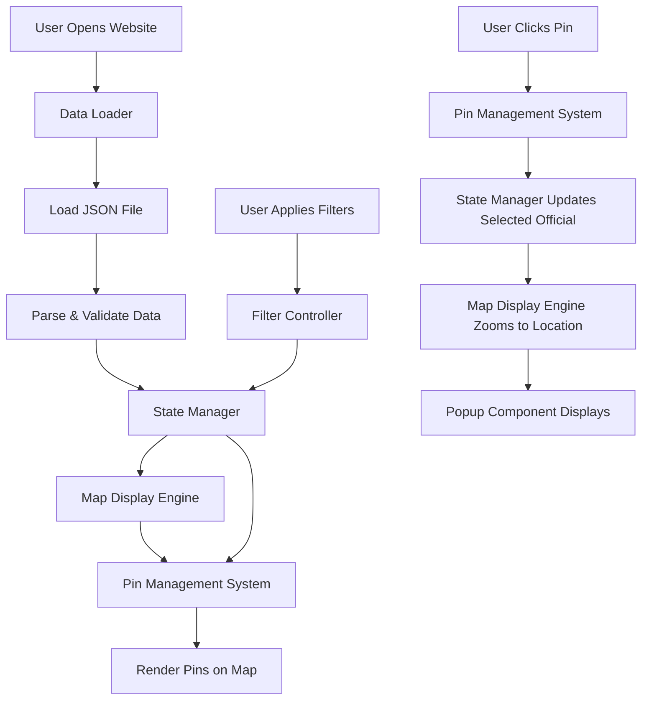
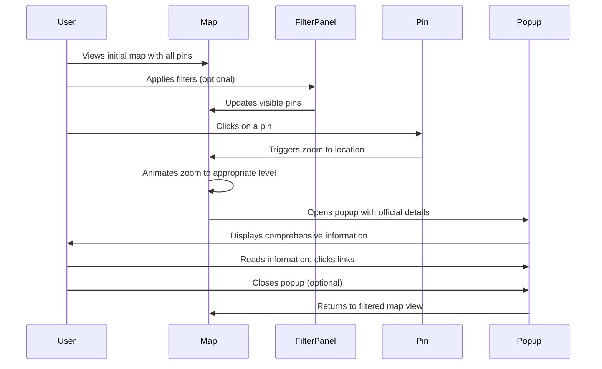

# Democratic Socialist Officials Map - Design Document

## 1. Overview

### 1.1 Purpose
Create an interactive web-based map of the United States that displays the locations of all elected officials who identify as Democratic Socialists or Socialists. The map enables users to discover and learn about these officials through an intuitive, visual interface.

### 1.2 Target Users
- General public interested in Democratic Socialist and Socialist elected officials
- Political organizers and activists
- Researchers and journalists
- Voters seeking information about progressive candidates in their area

### 1.3 Core Objectives
- Provide a centralized, visual directory of Democratic Socialist and Socialist elected officials across all government levels
- Enable users to quickly locate officials by geography and filter by various criteria
- Display comprehensive information about each official in an accessible format
- Support easy discovery of officials at federal, state, county, and local levels

## 2. Data Model

### 2.1 Official Data Structure

The system uses a JSON file to store information about elected officials. Each official record contains the following fields:

| Field Name | Data Type | Required | Description |
|------------|-----------|----------|-------------|
| id | String | Yes | Unique identifier for the official |
| name | String | Yes | Full name of the official |
| position | String | Yes | Official title/office held |
| officeLevel | String | Yes | Government level: "federal", "state", "county", "city", "town" |
| politicalAffiliation | String | Yes | Party or organization: "Democratic Socialist", "Socialist", or specific org name |
| location | Object | Yes | Geographic information |
| location.state | String | Yes | US state (two-letter code) |
| location.county | String | No | County name (if applicable) |
| location.city | String | No | City or town name |
| location.district | String | No | District number or name (if applicable) |
| location.latitude | Number | Yes | Geographic latitude for pin placement |
| location.longitude | Number | Yes | Geographic longitude for pin placement |
| contact | Object | Yes | Contact information |
| contact.email | String | No | Official email address |
| contact.phone | String | No | Official phone number |
| contact.website | String | No | Official website URL |
| contact.socialMedia | Object | No | Social media handles (twitter, facebook, instagram, etc.) |
| photo | String | No | URL to official's photo |
| bio | String | Yes | Biography or description |
| termStart | String | Yes | Term start date (ISO 8601 format) |
| termEnd | String | No | Term end date (ISO 8601 format, null if ongoing) |
| committeeMemberships | Array[String] | No | List of committee names |
| votingRecord | String | No | URL or description of voting record |
| yearElected | Number | Yes | Year first elected to current position |

### 2.2 Data File Structure

The JSON data file is organized as an array of official objects, allowing for efficient loading and filtering operations. The file is structured to enable quick client-side processing without requiring a backend database.

## 3. System Architecture

### 3.1 High-Level Components

The system consists of the following primary components:

| Component | Responsibility |
|-----------|----------------|
| Map Display Engine | Renders the interactive US map and manages viewport, zoom levels, and geographic boundaries |
| Pin Management System | Places and updates map pins based on official locations, handles pin clustering at different zoom levels |
| Filter Controller | Processes user filter selections and updates visible pins accordingly |
| Popup Component | Displays detailed official information when a pin is clicked |
| Data Loader | Loads and parses the JSON data file, validates data integrity |
| State Manager | Maintains application state including active filters, selected official, and map viewport |

### 3.2 Component Interaction Flow

## 4. User Interface Design

### 4.1 Map Display

The map occupies the primary viewport area and displays the entire United States by default. Key characteristics:

- Initial view shows all 50 states with appropriate zoom level to fit continental US
- Interactive map allows panning and zooming via mouse/touch controls
- Pin markers indicate official locations with visual distinction by office level
- Pin clustering groups nearby officials when zoomed out to prevent visual clutter
- Map tiles provide clear geographic context with state and county boundaries

### 4.2 Pin Visual Design

Pins are differentiated by office level to provide immediate visual context:

| Office Level | Visual Treatment | Purpose |
|--------------|------------------|---------|
| Federal | Distinct color and larger size | Highlight national-level officials |
| State | Medium size with state-level color | Indicate statewide positions |
| County | Standard size with county-level color | Show county-level officials |
| City/Town | Standard size with local-level color | Display municipal officials |

When multiple officials exist at the same or very close locations, pins cluster together and display a count badge. Clicking a cluster zooms in to reveal individual pins.

### 4.3 Filter Panel

A collapsible filter panel is positioned on the left side or top of the interface, containing:

| Filter Type | Options | Behavior |
|-------------|---------|----------|
| State Selection | Dropdown or searchable list of all 50 states, plus "All States" option | Shows only officials from selected state(s) |
| Office Level | Checkboxes for Federal, State, County, City, Town | Multiple selections allowed, shows officials matching any selected level |
| Political Affiliation | Checkboxes for specific organizations/parties | Filters by exact affiliation match |
| Year Elected | Range slider or dropdown for year ranges | Shows officials elected within selected range |
| Search | Text input for name or location search | Real-time filtering as user types |

Filters apply cumulatively using AND logic. A "Clear All Filters" button resets to default view.

### 4.4 Official Information Popup

When a user clicks a pin, the popup appears adjacent to the pin location and contains:

**Header Section:**
- Official's photo (if available)
- Full name
- Current position/title
- Office level badge

**Contact Information Section:**
- Email address (clickable mailto link)
- Phone number (clickable tel link)
- Official website (clickable external link)
- Social media links with icons

**Details Section:**
- Biography or description text
- Term information (start date, end date if applicable)
- Political affiliation
- Year first elected

**Additional Information Section:**
- Committee memberships (displayed as a list)
- Voting record (link or summary)

**Footer:**
- Close button
- Location information (state, county, city/district)

The popup is responsive and adjusts position if near map edges to remain fully visible.

## 5. User Interaction Workflows

### 5.1 Primary User Flow - Discovering an Official

### 5.2 Zoom Behavior

When a user clicks a pin, the map zooms to an appropriate level based on the office level:

| Office Level | Zoom Target | Rationale |
|--------------|-------------|-----------|
| Federal | State or district boundaries | Shows geographic scope of federal office |
| State | Entire state view | Displays full jurisdiction |
| County | County boundaries | Focuses on county area |
| City/Town | City/town boundaries with surrounding area | Centers on local jurisdiction |

The zoom animation takes 0.5-1 second to provide smooth visual transition without disorienting the user.

### 5.3 Filter Application Flow

Filters apply instantly as users make selections. The system:

1. Captures filter changes from the filter panel
2. Evaluates all active filters against the complete dataset
3. Identifies officials matching all active filter criteria (AND logic)
4. Updates the map to show only matching pins
5. Hides pins that don't match filter criteria
6. Updates any result count indicators
7. Maintains current map viewport unless no results are visible, in which case it recenters

If filters result in zero matches, the system displays a "No officials found" message and suggests adjusting filters.

## 6. Filtering and Search Logic

### 6.1 Filter Combination Strategy

All filters use AND logic when combined. An official must satisfy all active filter conditions to be displayed.

**Example:**
- State filter: "California"
- Office Level: "City" selected
- Year Elected: "2020-2024"

**Result:** Shows only city-level officials in California elected between 2020-2024.

### 6.2 Search Functionality

The text search feature searches across multiple fields:
- Official name (case-insensitive partial match)
- Position title (case-insensitive partial match)
- City/town name (case-insensitive partial match)
- County name (case-insensitive partial match)

Search results highlight matching text and work in combination with other active filters.

### 6.3 Filter Persistence

Filter selections persist during the user session but reset when the page is refreshed, ensuring users always start with the complete view by default. Future enhancement could add URL parameter support to enable sharing filtered views.

## 7. Map Behavior and Performance

### 7.1 Pin Clustering Strategy

To maintain performance and visual clarity when displaying many officials:

- At low zoom levels (showing multiple states), pins within close proximity cluster together
- Cluster markers display the count of officials in that cluster
- Clicking a cluster zooms in to reveal individual pins or smaller clusters
- At high zoom levels (city/street view), all pins display individually
- Cluster boundaries recalculate dynamically as users zoom and pan

### 7.2 Performance Considerations

| Aspect | Strategy | Rationale |
|--------|----------|-----------|
| Data Loading | Load complete JSON file once on initial page load | Minimizes network requests; enables instant filtering |
| Pin Rendering | Render only visible pins in current viewport | Reduces DOM elements and improves rendering performance |
| Filter Processing | Client-side JavaScript filtering | Provides instant feedback without server round-trips |
| Map Tiles | Use cached tile service with CDN | Ensures fast map rendering globally |
| Image Loading | Lazy-load official photos when popup opens | Reduces initial page load time |

### 7.3 Responsive Design

The interface adapts to different screen sizes:

- **Desktop:** Filter panel on left side, map occupies remaining space
- **Tablet:** Collapsible filter panel overlays map when opened
- **Mobile:** Bottom sheet for filters, full-screen map, simplified popup layout

Touch gestures are supported for mobile users (pinch-to-zoom, tap-to-select).

## 8. Accessibility Considerations

The system must be accessible to all users:

| Requirement | Implementation Approach |
|-------------|-------------------------|
| Keyboard Navigation | All interactive elements (pins, filters, popup links) accessible via keyboard |
| Screen Reader Support | ARIA labels for map elements, pins, and dynamic content updates |
| Color Contrast | Pin colors and text meet WCAG AA standards (4.5:1 ratio minimum) |
| Focus Indicators | Clear visual focus states for all interactive elements |
| Alternative Text | Descriptive alt text for official photos |
| Zoom Compatibility | Interface remains functional at 200% browser zoom |
| Semantic HTML | Proper heading hierarchy and landmark regions |

## 9. Data Management

### 9.1 JSON File Maintenance

The JSON data file is maintained manually by developers. The update process:

1. Developer opens the JSON file in a text editor
2. Adds new official records or updates existing records following the data structure
3. Validates JSON syntax and data integrity
4. Commits changes to version control
5. Deploys updated file to production

### 9.2 Data Validation Rules

Each official record must satisfy:
- All required fields are present and non-empty
- Latitude/longitude values are valid coordinates within US boundaries
- Date fields follow ISO 8601 format
- URLs are properly formatted
- Office level matches one of the five defined values
- State codes are valid two-letter US state abbreviations

Invalid records should be logged during data loading but not prevent the application from functioning.

## 10. Future Enhancement Opportunities

While not part of the initial implementation, these features could enhance the system:

- URL parameter support for shareable filtered views
- Admin panel for non-technical users to manage official data
- Export functionality to download filtered data as CSV
- Official profile pages with dedicated URLs
- Integration with election calendars showing upcoming elections
- Historical view showing officials over time
- Community contribution system for suggesting new officials
- Multi-language support for broader accessibility
- Mobile native applications for iOS and Android
- Email alerts when new officials are added in user's area

## 11. Technical Constraints and Assumptions

### 11.1 Assumptions
- Users have modern web browsers with JavaScript enabled
- JSON data file remains under 5MB for reasonable load times
- Geographic coordinates are accurate and properly geocoded
- Official data is verified before being added to the JSON file
- Website is publicly accessible without authentication

### 11.2 Constraints
- No backend server or database; purely static website
- Data updates require developer intervention and deployment
- No user accounts or personalization features
- Limited to officials within the United States
- Relies on third-party mapping library and tile services

### 11.3 Success Criteria
- Map loads and displays all pins within 3 seconds on standard broadband connection
- Filters apply and update map within 200 milliseconds
- Pin click triggers zoom and popup display within 1 second
- Interface is fully functional on Chrome, Firefox, Safari, and Edge (latest versions)
- Mobile interface is usable on devices with screen width of 320px and above
- At least 95% of official records contain complete required information
