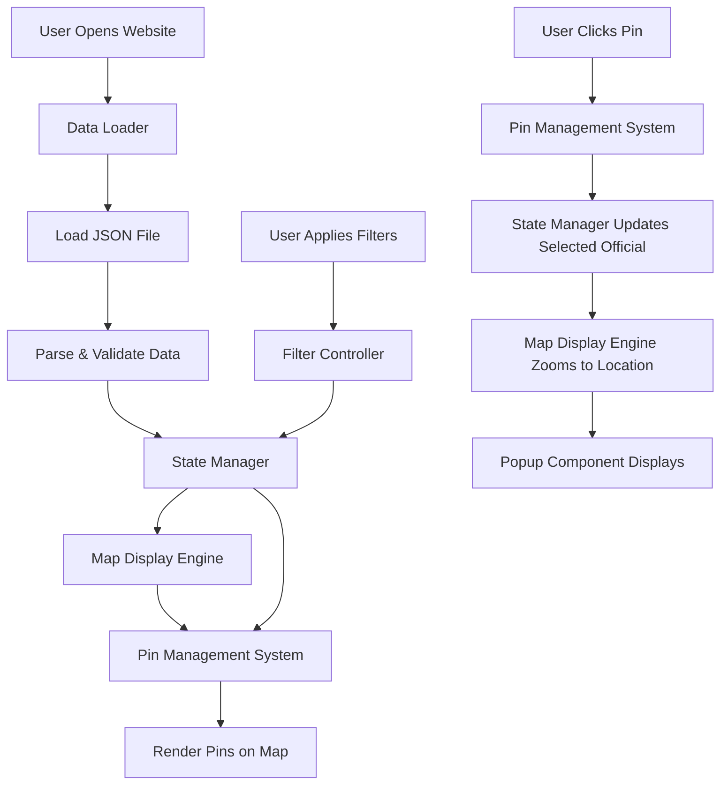

# Democratic Socialist Officials Map - Design Document

## 1. Overview

### 1.1 Purpose
Create an interactive web-based map of the United States that displays the locations of all elected officials who identify as Democratic Socialists or Socialists. The map enables users to discover and learn about these officials through an intuitive, visual interface.

### 1.2 Target Users
- General public interested in Democratic Socialist and Socialist elected officials
- Political organizers and activists
- Researchers and journalists
- Voters seeking information about progressive candidates in their area

### 1.3 Core Objectives
- Provide a centralized, visual directory of Democratic Socialist and Socialist elected officials across all government levels
- Enable users to quickly locate officials by geography and filter by various criteria
- Display comprehensive information about each official in an accessible format
- Support easy discovery of officials at federal, state, county, and local levels

## 2. Data Model

### 2.1 Official Data Structure

The system uses a JSON file to store information about elected officials. Each official record contains the following fields:

| Field Name | Data Type | Required | Description |
|------------|-----------|----------|-------------|
| id | String | Yes | Unique identifier for the official |
| name | String | Yes | Full name of the official |
| position | String | Yes | Official title/office held |
| officeLevel | String | Yes | Government level: "federal", "state", "county", "city", "town" |
| politicalAffiliation | String | Yes | Party or organization: "Democratic Socialist", "Socialist", or specific org name |
| location | Object | Yes | Geographic information |
| location.state | String | Yes | US state (two-letter code) |
| location.county | String | No | County name (if applicable) |
| location.city | String | No | City or town name |
| location.district | String | No | District number or name (if applicable) |
| location.latitude | Number | Yes | Geographic latitude for pin placement |
| location.longitude | Number | Yes | Geographic longitude for pin placement |
| contact | Object | Yes | Contact information |
| contact.email | String | No | Official email address |
| contact.phone | String | No | Official phone number |
| contact.website | String | No | Official website URL |
| contact.socialMedia | Object | No | Social media handles (twitter, facebook, instagram, etc.) |
| photo | String | No | URL to official's photo |
| bio | String | Yes | Biography or description |
| termStart | String | Yes | Term start date (ISO 8601 format) |
| termEnd | String | No | Term end date (ISO 8601 format, null if ongoing) |
| committeeMemberships | Array[String] | No | List of committee names |
| votingRecord | String | No | URL or description of voting record |
| yearElected | Number | Yes | Year first elected to current position |

### 2.2 Data File Structure

The JSON data file is organized as an array of official objects, allowing for efficient loading and filtering operations. The file is structured to enable quick client-side processing without requiring a backend database.

## 3. System Architecture

### 3.1 High-Level Components

The system consists of the following primary components:

| Component | Responsibility |
|-----------|----------------|
| Map Display Engine | Renders the interactive US map and manages viewport, zoom levels, and geographic boundaries |
| Pin Management System | Places and updates map pins based on official locations, handles pin clustering at different zoom levels |
| Filter Controller | Processes user filter selections and updates visible pins accordingly |
| Popup Component | Displays detailed official information when a pin is clicked |
| Data Loader | Loads and parses the JSON data file, validates data integrity |
| State Manager | Maintains application state including active filters, selected official, and map viewport |

### 3.2 Component Interaction Flow

## 4. User Interface Design

### 4.1 Map Display

The map occupies the primary viewport area and displays the entire United States by default. Key characteristics:

- Initial view shows all 50 states with appropriate zoom level to fit continental US
- Interactive map allows panning and zooming via mouse/touch controls
- Pin markers indicate official locations with visual distinction by office level
- Pin clustering groups nearby officials when zoomed out to prevent visual clutter
- Map tiles provide clear geographic context with state and county boundaries

### 4.2 Pin Visual Design

Pins are differentiated by office level to provide immediate visual context:

| Office Level | Visual Treatment | Purpose |
|--------------|------------------|---------|
| Federal | Distinct color and larger size | Highlight national-level officials |
| State | Medium size with state-level color | Indicate statewide positions |
| County | Standard size with county-level color | Show county-level officials |
| City/Town | Standard size with local-level color | Display municipal officials |

When multiple officials exist at the same or very close locations, pins cluster together and display a count badge. Clicking a cluster zooms in to reveal individual pins.

### 4.3 Filter Panel

A collapsible filter panel is positioned on the left side or top of the interface, containing:

| Filter Type | Options | Behavior |
|-------------|---------|----------|
| State Selection | Dropdown or searchable list of all 50 states, plus "All States" option | Shows only officials from selected state(s) |
| Office Level | Checkboxes for Federal, State, County, City, Town | Multiple selections allowed, shows officials matching any selected level |
| Political Affiliation | Checkboxes for specific organizations/parties | Filters by exact affiliation match |
| Year Elected | Range slider or dropdown for year ranges | Shows officials elected within selected range |
| Search | Text input for name or location search | Real-time filtering as user types |

