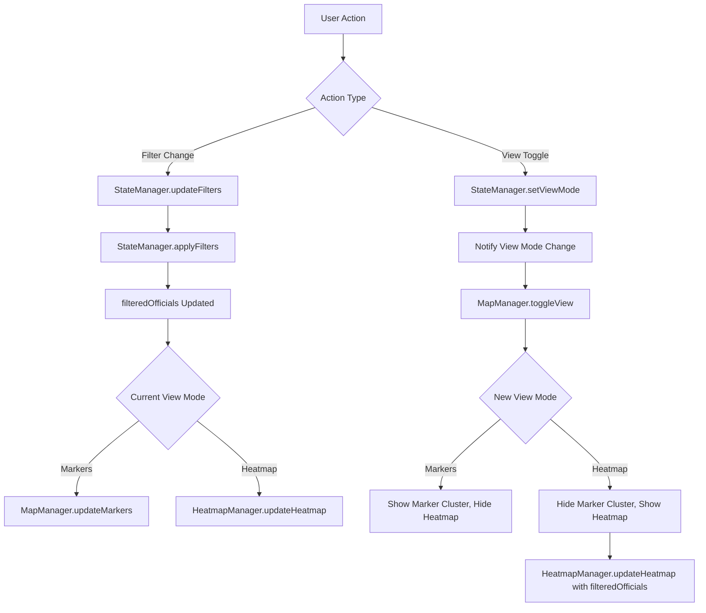

# Heatmap Overlay Implementation Design

## Overview

This design document outlines the implementation of a heatmap overlay mode for the Democratic Socialist Officials Map application. The feature enables users to toggle between the standard pin marker view and a heatmap visualization that displays geographic concentration and density of elected officials across the United States.

## Objectives

1. Provide an alternative visualization mode that reveals concentration patterns of socialist representation
2. Enable seamless toggling between pin marker view and heatmap view
3. Ensure heatmap responds dynamically to all active filters
4. Maintain accessibility and responsive design standards
5. Preserve existing functionality while adding new visualization capability

## Functional Requirements

### View Mode Toggle

The application must provide a view mode toggle control that allows users to switch between two visualization modes:

- **Pin Marker View**: The current default view showing individual officials as clustered markers
- **Heatmap View**: A density visualization showing concentration of officials

The toggle control should:
- Be clearly visible and accessible to all users
- Indicate the currently active view mode
- Provide immediate visual feedback when switching modes
- Be keyboard navigable and screen reader compatible
- Maintain its state during user interaction with filters

### Heatmap Visualization

The heatmap layer must visualize official density based on geographic coordinates from the officials dataset. Key characteristics:

**Data Representation**
- Each official's location contributes to the heat intensity at that coordinate
- Intensity reflects the number of officials within a geographic radius
- Color gradient transitions from low density (cool colors) to high density (warm colors)
- Gradient aligns with application's existing color scheme where appropriate

**Visual Properties**
- Intensity radius: configurable area of influence around each data point
- Blur effect: smooth gradient transitions between density regions
- Maximum intensity threshold: prevents oversaturation in extremely dense areas
- Opacity: allows underlying map features to remain partially visible

**Dynamic Behavior**
- Heatmap regenerates when filters are applied or removed
- Only officials matching current filter criteria contribute to heat intensity
- Smooth transition when switching between views
- Performance optimization for large datasets

### Filter Integration

The heatmap must respect all existing filter mechanisms:

**Supported Filters**
- Search: by name or location
- State selection: specific US state
- Office level: federal, state, county, city, town
- Political affiliation: Democratic Socialist, Socialist Alternative, etc.
- Year elected: date range filtering

**Filter Behavior**
- When filters are applied, heatmap recalculates using only matching officials
- Filter changes trigger immediate heatmap update
- Empty filter results show blank/minimal heatmap
- Results count display updates to reflect filtered dataset

### User Interaction

**View Switching**
- Users can toggle between views at any time
- The selected view mode persists as users interact with filters
- Switching views does not reset filter state
- Map zoom and pan position are preserved when switching views

**Map Controls**
- Standard Leaflet controls (zoom, pan) remain functional in both views
- Heatmap view maintains the same map boundaries and interaction patterns
- Map tiles remain visible beneath the heatmap overlay

**Popup Interaction**
- In pin marker view: clicking markers displays official details in popups
- In heatmap view: popup functionality is disabled (no discrete markers to click)
- View mode toggle is always accessible regardless of popup state

## Technical Architecture

### Component Structure

The implementation introduces a new module while extending existing modules:

**New Module: HeatmapManager**
- Manages Leaflet heatmap layer lifecycle
- Converts filtered officials data to heatmap-compatible format
- Provides methods to show, hide, and update heatmap layer
- Exposes configuration for heatmap visual properties

**Modified Module: StateManager**
- Extends application state to include view mode property
- Tracks current view mode: 'markers' or 'heatmap'
- Notifies subscribers when view mode changes
- Provides methods to get and set view mode

**Modified Module: MapManager**
- Coordinates toggling between marker cluster layer and heatmap layer
- Hides marker cluster group when heatmap is active
- Shows marker cluster group when reverting to pin view
- Maintains reference to both layers

**Modified Module: FilterController**
- Triggers heatmap updates when filters change
- Ensures consistent data flow to both visualization modes
- Updates UI elements based on view mode

**Extended Module: UI Components**
- Adds view mode toggle button to interface
- Provides visual indication of active view mode
- Handles user interaction with toggle control

### Data Flow

### State Management

**New State Properties**

| Property | Type | Default | Description |
|----------|------|---------|-------------|
| viewMode | string | 'markers' | Current visualization mode: 'markers' or 'heatmap' |

**State Transitions**

The view mode can transition between two states based on user interaction with the toggle control. State transitions are independent of filter changes, meaning filters can be modified without affecting the view mode, and vice versa.

**Event Notifications**

A new event type is introduced:
- **viewModeChange**: Fired when view mode is toggled, providing the new view mode value

Existing event types remain:
- **stateChange**: General application state change
- **filterChange**: Filter criteria modified
- **officialsChange**: Official dataset or filtered subset updated

### Heatmap Configuration

**Visual Parameters**

| Parameter | Purpose | Suggested Value | Rationale |
|-----------|---------|-----------------|-----------|
| radius | Area of influence per data point | 25-35 pixels | Balances visibility of individual concentrations while showing regional patterns |
| blur | Smoothness of gradient transitions | 15-20 pixels | Creates natural-looking density clouds without sharp edges |
| maxZoom | Maximum zoom level for heat calculation | Current map maxZoom | Ensures heatmap renders consistently at all zoom levels |
| max | Maximum intensity value | 1.0 | Normalizes intensity across different dataset sizes |
| gradient | Color scale from low to high density | Cool to warm spectrum | Intuitively represents increasing density |

**Gradient Color Scheme**

The gradient should transition through multiple stops to represent density levels:

| Density Level | Color Stop | Visual Representation |
|---------------|------------|----------------------|
| Minimal | 0.0 | Transparent or very light blue |
| Low | 0.2 | Light blue |
| Medium-Low | 0.4 | Yellow |
| Medium-High | 0.6 | Orange |
| High | 0.8 | Red |
| Maximum | 1.0 | Dark red or maroon |

Colors should be selected to maintain sufficient contrast with the map tiles and align with the application's existing design system where appropriate.

### Library Integration

**Leaflet Heatmap Plugin**

The implementation requires integration of a Leaflet-compatible heatmap library. Recommended option:

- **Library**: Leaflet.heat
- **Rationale**: Lightweight, well-maintained, widely adopted, compatible with Leaflet 1.9.x
- **Installation**: Via CDN for consistency with existing Leaflet integration approach
- **API**: Simple interface requiring only coordinates and intensity values

**Integration Points**

The heatmap library will be:
- Loaded via script tag in the HTML document after Leaflet core library
- Initialized within the HeatmapManager module
- Controlled through Leaflet's layer management system

### Performance Considerations

**Data Optimization**

- Transform official objects to lightweight coordinate arrays before passing to heatmap library
- Cache transformed data when filters haven't changed
- Implement debouncing for rapid filter changes

**Rendering Optimization**

- Heatmap layer is only rendered when view mode is active
- Layer is removed from DOM when switching to marker view
- Canvas-based rendering ensures smooth performance with hundreds of data points

**Memory Management**

- Destroy and recreate heatmap layer when switching views to prevent memory leaks
- Clear references to large data structures when not in use

## User Interface Design

### Toggle Control Placement

The view mode toggle control should be positioned where it is:
- Easily discoverable by users
- Does not obstruct the map view
- Accessible on both desktop and mobile layouts
- Visually distinct from filter controls

**Recommended Placement**

Position the toggle control in the map container area, likely in one of the following locations:
- Top-right corner of the map (near zoom controls)
- Bottom-right corner of the map
- As part of the map control cluster managed by Leaflet

### Toggle Control Design

**Visual Structure**

The toggle should consist of:
- Two labeled options: "Markers" and "Heatmap"
- Clear indication of active selection (e.g., filled background, bold text)
- Icons representing each view mode (optional but recommended)
- Hover and focus states for interactivity feedback

**Visual Specifications**

| Element | Property | Value |
|---------|----------|-------|
| Container | Background | White with subtle shadow |
| Container | Border radius | 4-8px matching existing UI |
| Container | Padding | Consistent with spacing variables |
| Active option | Background | Primary color or accent color |
| Active option | Text color | White |
| Inactive option | Background | Transparent or light gray |
| Inactive option | Text color | Text color variable |

**Accessibility Requirements**

- Toggle control uses semantic button or radio button elements
- ARIA attributes indicate current selection state
- Keyboard navigation: Tab to focus, Arrow keys or Space/Enter to toggle
- Screen reader announces current view mode when toggled
- Sufficient color contrast ratios (WCAG 2.1 AA compliance)

### Mobile Considerations

On mobile viewports:
- Toggle control remains accessible despite smaller screen size
- Control may be repositioned to avoid overlap with filter panel
- Touch target size meets minimum accessibility standards (44x44px)
- Labels may be abbreviated or icon-only with aria-label support

## Interaction Scenarios

### Scenario 1: User Toggles to Heatmap View

**Initial State**
- View mode: Markers
- Filters: None applied (all officials visible)
- Map: Showing clustered pin markers

**User Action**
- User clicks "Heatmap" option in view mode toggle

**System Response**
1. StateManager updates viewMode to 'heatmap'
2. MapManager hides marker cluster layer
3. HeatmapManager generates heatmap from all officials
4. HeatmapManager adds heatmap layer to map
5. Toggle control updates to show "Heatmap" as active

**Result State**
- View mode: Heatmap
- Heatmap displays density concentrations
- All officials contribute to heat intensity

### Scenario 2: User Applies Filter in Heatmap View

**Initial State**
- View mode: Heatmap
- Filters: None applied
- Heatmap: Showing all officials

**User Action**
- User selects "New York" from state filter

**System Response**
1. StateManager updates filters with state: 'NY'
2. StateManager applies filters, producing filtered officials list
3. StateManager notifies officialsChange event
4. HeatmapManager receives filtered officials
5. HeatmapManager regenerates heatmap with only NY officials
6. Results count updates to show filtered total

**Result State**
- View mode: Heatmap (unchanged)
- Filters: State = NY
- Heatmap: Shows only New York officials' density

### Scenario 3: User Switches from Heatmap to Markers

**Initial State**
- View mode: Heatmap
- Filters: State = NY, Office Level = State
- Heatmap: Showing filtered subset

**User Action**
- User clicks "Markers" option in view mode toggle

**System Response**
1. StateManager updates viewMode to 'markers'
2. MapManager hides heatmap layer
3. MapManager shows marker cluster layer
4. MapManager updates markers with currently filtered officials
5. Toggle control updates to show "Markers" as active

**Result State**
- View mode: Markers
- Filters: State = NY, Office Level = State (unchanged)
- Map: Showing only markers for filtered officials

### Scenario 4: User Clears All Filters

**Initial State**
- View mode: Heatmap
- Filters: Multiple filters active
- Heatmap: Showing small subset of officials

**User Action**
- User clicks "Clear All Filters" button

**System Response**
1. FilterController resets all filter UI elements
2. StateManager resets filters to default values
3. StateManager applies filters (resulting in all officials)
4. HeatmapManager regenerates heatmap with all officials
5. Results count updates to "Showing all X officials"

**Result State**
- View mode: Heatmap (unchanged)
- Filters: None (all reset)
- Heatmap: Shows full dataset density

## Edge Cases and Constraints

### Empty or Minimal Dataset

**Condition**: No officials match current filter criteria, or only one official matches

**Expected Behavior**
- Heatmap view displays minimal or no heat intensity
- No results message appears as in marker view
- User can still toggle back to marker view
- System does not crash or display errors

### High-Density Clusters

**Condition**: Many officials concentrated in small geographic area (e.g., Brooklyn, NY)

**Expected Behavior**
- Maximum intensity threshold prevents oversaturation
- Gradient remains distinguishable even at peak density
- Performance remains acceptable (no lag or freezing)
- Zoom in reveals finer density gradations

### Low-Density Regions

**Condition**: Officials spread across large geographic areas with minimal overlap

**Expected Behavior**
- Individual heat points remain visible
- Radius configuration ensures some visibility even for isolated points
- User can distinguish individual concentration areas
- Heatmap provides value despite low density

### Browser Compatibility

**Constraint**: Heatmap library must support modern browsers matching project requirements

**Mitigation**
- Select library compatible with Leaflet 1.9.x
- Test across Chrome, Firefox, Safari, Edge
- Provide fallback or graceful degradation if canvas not supported
- Document minimum browser versions if constraints exist

### Mobile Performance

**Constraint**: Mobile devices have limited processing power and smaller screens

**Mitigation**
- Optimize data transformation for efficiency
- Consider reducing heatmap complexity on mobile (smaller radius, less blur)
- Ensure touch interactions work smoothly
- Test on representative mobile devices

## Testing Considerations

### Functional Testing

**View Mode Toggle**
- Verify toggle switches between modes correctly
- Confirm marker layer hides when heatmap active
- Confirm heatmap layer hides when markers active
- Test toggle keyboard accessibility

**Filter Integration**
- Apply each filter type and verify heatmap updates
- Combine multiple filters and verify correct heatmap
- Clear filters and verify heatmap resets
- Test rapid filter changes

**Data Accuracy**
- Verify heatmap reflects correct number of officials
- Confirm filtered heatmap matches filtered marker count
- Test with known data subsets (e.g., single state)

### Visual Testing

**Heatmap Appearance**
- Verify gradient renders smoothly
- Confirm colors are distinguishable
- Check intensity appears reasonable at various zoom levels
- Test on different screen sizes and resolutions

**UI Components**
- Verify toggle control is visible and styled correctly
- Check hover and active states
- Confirm responsive behavior on mobile

### Performance Testing

**Dataset Scalability**
- Measure render time with full dataset
- Test with filtered subsets of various sizes
- Monitor for memory leaks during repeated toggling
- Check frame rate during map panning and zooming

**Interaction Responsiveness**
- Measure time from filter change to heatmap update
- Verify view toggle feels instantaneous
- Check for lag during rapid interactions

### Accessibility Testing

**Keyboard Navigation**
- Tab to toggle control
- Activate toggle with keyboard
- Verify focus indicators are visible

**Screen Reader**
- Confirm view mode is announced
- Verify toggle control is properly labeled
- Test with NVDA, JAWS, or VoiceOver

**Visual Accessibility**
- Check color contrast ratios
- Test with high contrast mode
- Verify reduced motion preferences are respected

## Implementation Phases

### Phase 1: Foundation Setup

**Objectives**
- Integrate heatmap library into project
- Create HeatmapManager module structure
- Extend StateManager with view mode state

**Deliverables**
- Leaflet.heat library loaded via CDN
- HeatmapManager module file created with basic API
- StateManager extended with viewMode property and methods

### Phase 2: Core Heatmap Functionality

**Objectives**
- Implement heatmap layer creation from officials data
- Enable adding/removing heatmap layer to map
- Configure heatmap visual properties

**Deliverables**
- HeatmapManager can generate heatmap from array of officials
- Heatmap renders on map with appropriate visual settings
- Heatmap updates when data changes

### Phase 3: View Mode Toggle

**Objectives**
- Design and implement toggle control UI
- Wire toggle control to StateManager
- Implement layer switching in MapManager

**Deliverables**
- Toggle control visible in UI with proper styling
- Clicking toggle updates view mode state
- Map alternates between marker and heatmap layers correctly

### Phase 4: Filter Integration

**Objectives**
- Connect filter changes to heatmap updates
- Ensure heatmap reflects filtered dataset
- Verify consistency between marker and heatmap views

**Deliverables**
- Filtering updates heatmap in real-time
- Heatmap and marker views show same data subset
- Clear filters resets heatmap appropriately

### Phase 5: Refinement and Optimization

**Objectives**
- Optimize heatmap performance
- Refine visual appearance and gradient
- Improve accessibility and responsive behavior

**Deliverables**
- Heatmap performs smoothly with full dataset
- Gradient and colors provide clear density representation
- Mobile and accessibility requirements met

### Phase 6: Testing and Documentation

**Objectives**
- Conduct comprehensive testing across scenarios
- Document user-facing feature
- Create technical documentation for maintainers

**Deliverables**
- All test cases pass
- User guide or help text added to UI
- Technical documentation updated
