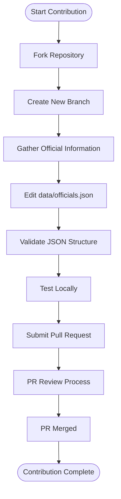
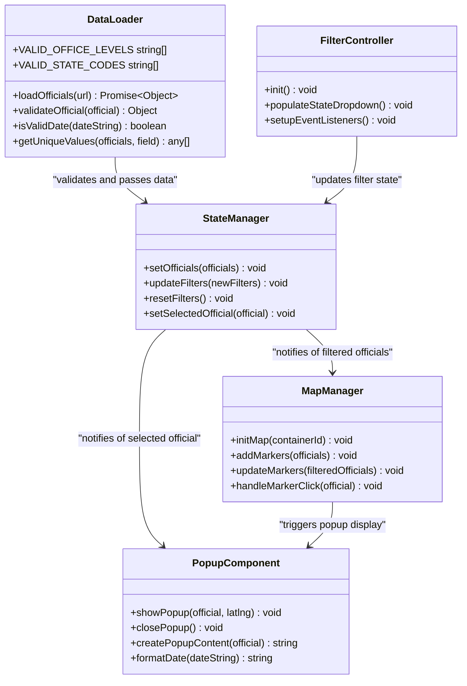
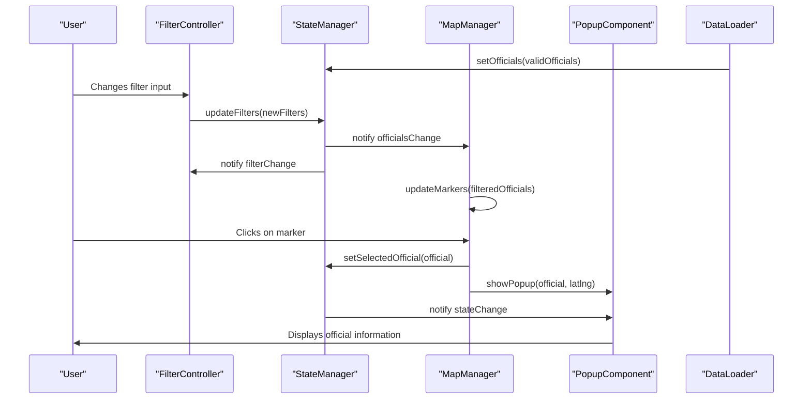
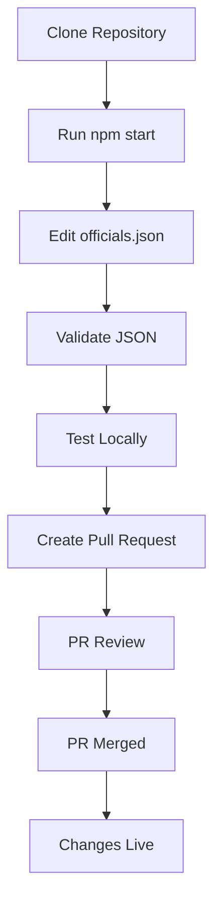

# Contributing

<cite>
**Referenced Files in This Document**   
- [README.md](file://README.md)
- [data/officials.json](file://data/officials.json)
- [js/data-loader.js](file://js/data-loader.js)
- [js/state-manager.js](file://js/state-manager.js)
- [js/map-manager.js](file://js/map-manager.js)
- [js/popup-component.js](file://js/popup-component.js)
- [js/filter-controller.js](file://js/filter-controller.js)
- [css/styles.css](file://css/styles.css)
</cite>

## Table of Contents
1. [Introduction](#introduction)
2. [Adding a New Official](#adding-a-new-official)
3. [Updating Existing Officials](#updating-existing-officials)
4. [Data Structure and Validation](#data-structure-and-validation)
5. [Officials-Elect Policy](#officials-elect-policy)
6. [Contribution Guidelines](#contribution-guidelines)
7. [Code Architecture and Component Relationships](#code-architecture-and-component-relationships)
8. [Development Workflow](#development-workflow)
9. [Troubleshooting Common Issues](#troubleshooting-common-issues)

## Introduction

This document provides comprehensive guidance for contributing to the Democratic Socialist Officials Map project. The application is a web-based interactive map that displays elected Democratic Socialist and Socialist officials across the United States, with detailed information accessible through an intuitive interface.

Contributions are essential to maintaining the accuracy and completeness of the official data. This guide covers both conceptual overviews for new contributors and technical details for experienced developers, ensuring that all contributors can effectively participate in the project.

The contribution process involves modifying the `data/officials.json` file with accurate information about elected officials, following strict data structure requirements and validation rules enforced by the application's architecture.

**Section sources**
- [README.md](file://README.md#L201-L287)

## Adding a New Official

To add a new official to the map, follow these steps:

1. **Fork the repository** and create a new branch for your changes
2. **Use the Pull Request template** which guides you through providing all necessary information
3. **Verify the official** is currently elected and identifies as Democratic Socialist or Socialist
4. **Gather accurate information** from official government sources, including:
   - Official government email, phone, and website
   - Accurate coordinates for their district/office (using [LatLong.net](https://www.latlong.net/))
   - Committee assignments and voting records
   - Biographical information from official sources

The new official should be added to the `data/officials.json` file following the exact JSON structure. Each official record requires specific fields including `id`, `name`, `position`, `officeLevel`, `politicalAffiliation`, `location`, `contact`, `bio`, `termStart`, and `yearElected`.

After adding the official, validate your JSON using a JSON validator, test locally to ensure the new official appears correctly on the map, and submit a pull request with sources for verification.

**Diagram sources**
- [README.md](file://README.md#L205-L253)
- [data/officials.json](file://data/officials.json#L1-L493)

## Updating Existing Officials

When an official's information has changed (such as new committee assignment, updated contact information, or term ending), follow this update process:

1. Edit the relevant entry in `data/officials.json`
2. Include sources for the updated information in your PR description
3. Note what changed and why in the pull request

The application's data loader validates all official records upon loading, ensuring data integrity. When updating an official, ensure all modified fields continue to meet validation requirements, including proper date formats (ISO 8601) and valid state codes.

The StateManager component tracks the application state and will automatically reflect updates when the data is reloaded. The MapManager will update the visual representation of the official on the map, and the PopupComponent will display the updated information when the official's pin is clicked.

**Section sources**
- [README.md](file://README.md#L255-L261)
- [js/data-loader.js](file://js/data-loader.js#L22-L81)

## Data Structure and Validation

The application enforces a strict data structure for official records to ensure consistency and data quality. Each official record in `data/officials.json` must include specific required fields and adhere to validation rules implemented in the DataLoader module.

### Required Fields
- `id`: Unique identifier
- `name`: Full name
- `position`: Official title
- `officeLevel`: "federal", "state", "county", "city", or "town"
- `politicalAffiliation`: Party or organization name
- `location`: Object with `state`, `latitude`, `longitude`
- `contact`: Object (can be empty but must exist)
- `bio`: Biography or description
- `termStart`: ISO 8601 date format (e.g., "2023-01-03")
- `yearElected`: Year first elected to current position

### Validation Rules
The DataLoader module validates each official record against several criteria:

**Diagram sources**
- [js/data-loader.js](file://js/data-loader.js#L8-L184)
- [js/state-manager.js](file://js/state-manager.js#L8-L229)
- [js/map-manager.js](file://js/map-manager.js#L7-L217)
- [js/popup-component.js](file://js/popup-component.js#L7-L263)
- [js/filter-controller.js](file://js/filter-controller.js#L8-L270)

**Section sources**
- [README.md](file://README.md#L76-L95)
- [js/data-loader.js](file://js/data-loader.js#L22-L81)

## Officials-Elect Policy

The project has a specific policy for handling officials who have been elected but have not yet taken office:

**Policy**: Contributors may submit pull requests for newly elected officials immediately after election results are certified. However, PRs will not be merged until the official has taken office and their term has officially begun.

### When to Submit
- After election results are certified - you can submit a PR right away
- Gather all information while it's fresh and available
- Use the official's actual `termStart` date (even if in the future)

### When PRs Get Merged
- After the official's swearing-in ceremony and when the `termStart` date has passed
- When the official has begun exercising their duties
- PRs will remain open until the appropriate date

### How to Submit for Officials-Elect
1. Use the actual term start date in the `termStart` field
2. In the bio field, include their election victory and upcoming term start
3. For contact information, use `null` if official government contact isn't available yet
4. Leave `committeeMemberships` as an empty array `[]`
5. Set `votingRecord` to `null` for newly elected officials

This policy ensures the map only displays currently serving officials while allowing contributors to prepare information in advance.

**Section sources**
- [README.md](file://README.md#L96-L170)

## Contribution Guidelines

The project follows specific guidelines to maintain data quality and consistency:

### DO
- ✅ Verify all information from official government sources
- ✅ Use neutral, factual language in biographies
- ✅ Follow the existing JSON structure exactly
- ✅ Include your sources in the PR
- ✅ Test your changes locally before submitting

### DON'T
- ❌ Include political opinions or endorsements
- ❌ Use unofficial or campaign websites as primary sources
- ❌ Break the JSON structure or syntax
- ❌ Submit without testing

The data-loader.js module enforces many of these guidelines through programmatic validation, checking for required fields, valid office levels, proper state codes, and correct date formats. The application will log validation errors to the console, helping contributors identify and fix issues before submission.

If you're unsure about anything, feel free to open an issue and ask before submitting your PR.

**Section sources**
- [README.md](file://README.md#L271-L286)
- [js/data-loader.js](file://js/data-loader.js#L8-L184)

## Code Architecture and Component Relationships

The application follows a modular architecture with clear separation of concerns between components:

### Component Interaction Flow

### Key Components
- **DataLoader**: Responsible for loading and validating official data from JSON file
- **StateManager**: Maintains application state for filters, selected official, and officials data
- **MapManager**: Handles map initialization, pin rendering, and clustering
- **PopupComponent**: Creates and displays detailed information popups
- **FilterController**: Manages filter UI and interactions

The components communicate through a publish-subscribe pattern, with StateManager acting as the central hub for application state changes.

**Diagram sources**
- [js/app.js](file://js/app.js#L10-L141)
- [js/state-manager.js](file://js/state-manager.js#L24-L50)
- [js/map-manager.js](file://js/map-manager.js#L139-L151)

**Section sources**
- [js/data-loader.js](file://js/data-loader.js#L4-L184)
- [js/state-manager.js](file://js/state-manager.js#L4-L229)
- [js/map-manager.js](file://js/map-manager.js#L4-L217)
- [js/popup-component.js](file://js/popup-component.js#L4-L263)
- [js/filter-controller.js](file://js/filter-controller.js#L4-L270)

## Development Workflow

The development workflow for contributing to this project involves several key steps:

1. **Setup**: Clone the repository and run the application locally using `npm start` or Python's HTTP server
2. **Data Modification**: Edit the `data/officials.json` file to add or update officials
3. **Validation**: Use a JSON validator to ensure your changes have correct syntax
4. **Testing**: Verify that your changes appear correctly on the map and that all functionality works as expected
5. **Submission**: Create a pull request with detailed information about your changes

The application loads data once on page load for instant filtering, with pin clustering maintaining performance even with many officials. The data-loader performs validation on load, logging any issues to the console that need to be addressed before submission.

**Diagram sources**
- [README.md](file://README.md#L31-L51)
- [js/app.js](file://js/app.js#L10-L53)

**Section sources**
- [README.md](file://README.md#L24-L51)
- [js/app.js](file://js/app.js#L10-L53)

## Troubleshooting Common Issues

When contributing to the project, you may encounter various issues. This section addresses common problems and their solutions:

### Data Validation Errors
The DataLoader module validates all official records and logs validation errors to the console. Common validation issues include:

- Missing required fields (id, name, position, etc.)
- Invalid officeLevel values (must be: federal, state, county, city, town)
- Invalid state codes (must be valid two-letter US state abbreviations)
- Invalid latitude/longitude values (must be within US boundaries)
- Invalid date formats (must be ISO 8601 format)

Check the browser console for specific error messages when officials fail validation.

### JSON Syntax Errors
Ensure your JSON is properly formatted with:
- Proper comma placement between fields
- Correct use of quotes around strings
- No trailing commas
- Balanced brackets and braces

Use an online JSON validator to check your syntax before submission.

### Map Display Issues
If officials are not appearing on the map:
- Verify the latitude and longitude values are correct
- Ensure the location object has valid coordinates
- Check that the officeLevel is one of the valid values
- Confirm the official passed validation (check console for errors)

The application's error handling will display a user-friendly error message if the map fails to initialize, with a button to reload the page.

**Section sources**
- [js/data-loader.js](file://js/data-loader.js#L22-L81)
- [js/app.js](file://js/app.js#L48-L52)
- [README.md](file://README.md#L303-L308)