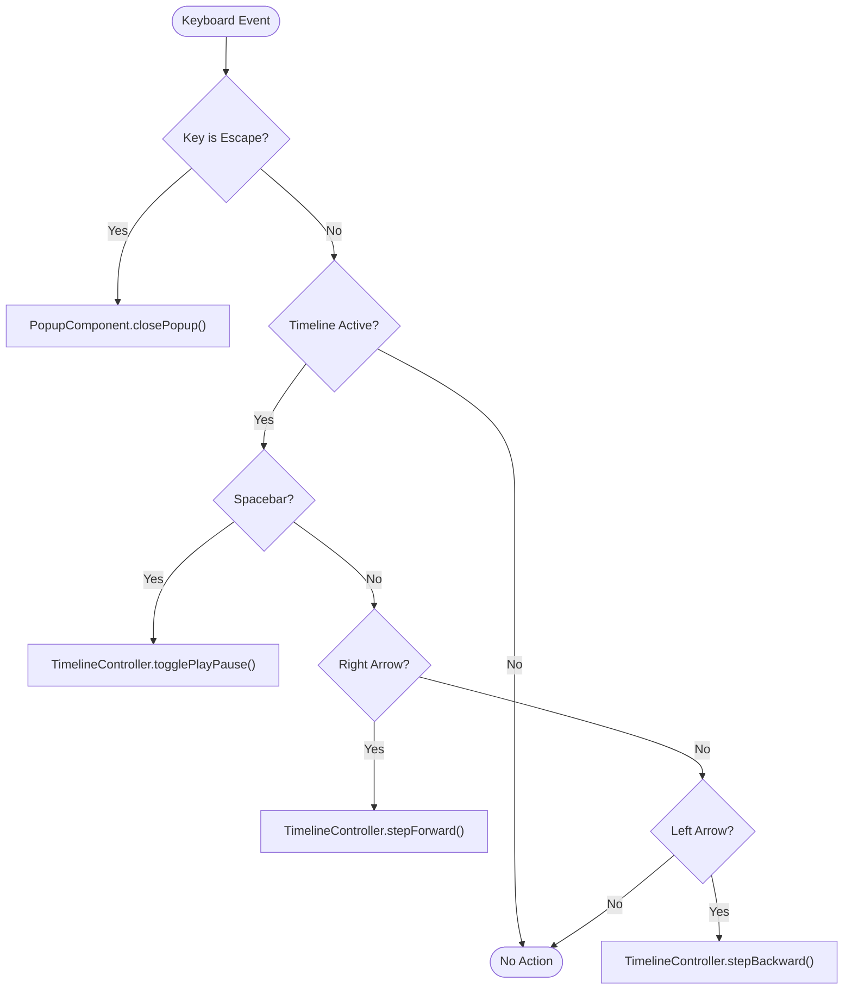
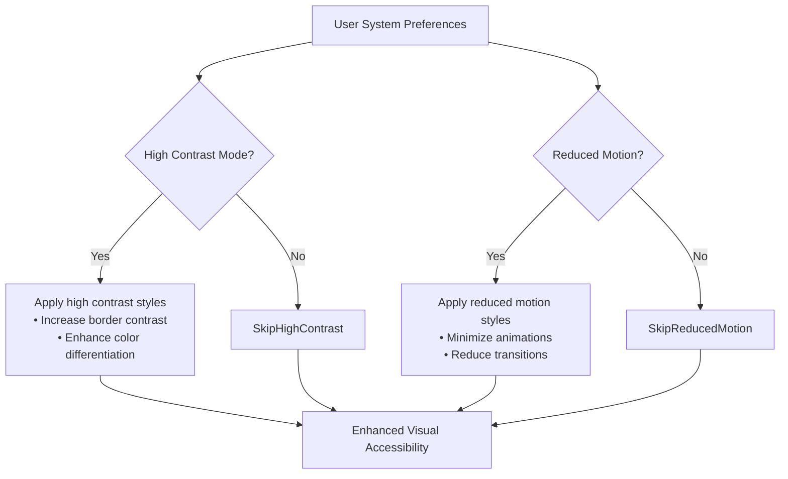
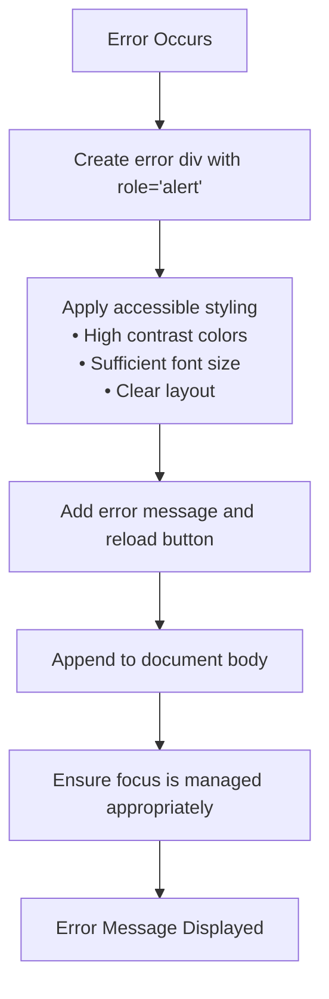

# Accessibility Features

<cite>
**Referenced Files in This Document**   
- [app.js](file://js/app.js)
- [index.html](file://index.html)
- [styles.css](file://css/styles.css)
- [popup-component.js](file://js/popup-component.js)
</cite>

## Table of Contents
1. [Introduction](#introduction)
2. [Keyboard Navigation](#keyboard-navigation)
3. [Screen Reader Support](#screen-reader-support)
4. [Visual Accessibility](#visual-accessibility)
5. [Responsive Design](#responsive-design)
6. [Error Handling](#error-handling)
7. [Common Issues and Solutions](#common-issues-and-solutions)

## Introduction
The Democratic Socialist Officials Map application incorporates comprehensive accessibility features to ensure usability for all users, including those with disabilities. The implementation follows Web Content Accessibility Guidelines (WCAG) 2.1 standards, providing keyboard navigation, screen reader support, visual accessibility options, and responsive design. This documentation details the accessibility implementation across the application's components, explaining how users can interact with the map, filters, timeline, and official information popups using various assistive technologies.

**Section sources**
- [index.html](file://index.html#L1-L263)
- [styles.css](file://css/styles.css#L614-L656)

## Keyboard Navigation
The application provides robust keyboard navigation support, allowing users to interact with all features without requiring a mouse. The keyboard accessibility is initialized in the main application module and handles various keyboard events for different components.

The Escape key is globally configured to close any open official information popup, providing a consistent way to dismiss modal content. When the timeline visualization is active, additional keyboard controls become available: the Spacebar toggles play/pause functionality, the Right Arrow key advances the timeline by one year, and the Left Arrow key moves backward by one year. These keyboard shortcuts are prevented from interfering with form inputs by checking the event target.

**Diagram sources **
- [app.js](file://js/app.js#L271-L297)

**Section sources**
- [app.js](file://js/app.js#L271-L297)
- [popup-component.js](file://js/popup-component.js#L239-L246)

## Screen Reader Support
The application implements comprehensive ARIA (Accessible Rich Internet Applications) attributes to provide context and functionality information to screen readers. Semantic HTML5 elements and ARIA roles are used throughout the interface to define the document structure and interactive components.

Key ARIA implementations include:
- Landmark roles (banner, main, complementary, region) to identify major page sections
- Form elements with descriptive labels and aria-label attributes for screen reader context
- Status regions with aria-live="polite" to announce dynamic content changes without interrupting the user
- Interactive controls with appropriate aria-expanded, aria-pressed, and aria-checked states
- Popup windows with role="application" and proper focus management

Interactive elements such as buttons, checkboxes, and form inputs include descriptive aria-label attributes that provide clear instructions for screen reader users. For example, the filter toggle button includes "Toggle filter panel" as its aria-label, while timeline controls have labels like "Play timeline animation" and "Step backward one year."

**Section sources**
- [index.html](file://index.html#L22-L242)
- [popup-component.js](file://js/popup-component.js#L201-L227)

## Visual Accessibility
The application incorporates several visual accessibility features to support users with various visual impairments. The CSS implementation includes specific rules for high contrast mode and reduced motion preferences, automatically adapting to the user's system settings.

For users who have enabled high contrast mode in their operating system, the application increases border contrast and ensures sufficient color differentiation between interface elements. The prefers-contrast: high media query adjusts the border-color variable to black, enhancing the visibility of borders and separating content sections more clearly.

Users who have indicated a preference for reduced motion through their system settings will experience a modified animation experience. The prefers-reduced-motion: reduce media query effectively eliminates most animations and transitions by setting animation and transition durations to near-zero values. This prevents potentially distracting or problematic motion effects for users with vestibular disorders or motion sensitivity.

**Diagram sources **
- [styles.css](file://css/styles.css#L635-L656)

**Section sources**
- [styles.css](file://css/styles.css#L635-L656)

## Responsive Design
The application implements responsive design principles to ensure accessibility across various screen sizes and devices. The layout adapts to different viewport dimensions, with specific considerations for mobile users who may have different accessibility needs.

On smaller screens (max-width: 768px), the filter panel transforms from a side panel to a bottom sheet that can be expanded or collapsed. This mobile-specific design includes a tap-to-toggle behavior on the filter header, making it easier to access with touch inputs. The filter panel's expanded state is controlled by the "expanded" CSS class, which changes the transform property to reveal the panel content.

The application also includes focus indicators that are visible and sufficiently large to be easily seen. The :focus-visible pseudo-class ensures that focus outlines are displayed for keyboard navigation while avoiding unnecessary visual clutter for mouse users. These focus indicators use the application's accent color with a 2px solid outline and 2px offset for optimal visibility.

**Section sources**
- [styles.css](file://css/styles.css#L551-L594)

## Error Handling
The application implements accessible error handling to ensure that users are properly informed when issues occur. When the application fails to initialize or encounters a critical error during data loading, an accessible error message is displayed.

The error message component is implemented as a modal dialog with role="alert" to immediately notify screen readers of the error condition. It includes a descriptive error message and a reload button with appropriate styling and functionality. The error dialog is positioned fixed in the center of the screen with sufficient padding and contrast to ensure visibility.

**Diagram sources **
- [app.js](file://js/app.js#L73-L91)

**Section sources**
- [app.js](file://js/app.js#L73-L91)

## Common Issues and Solutions
Several common accessibility issues have been addressed in the implementation:

1. **Keyboard Trap Prevention**: The application ensures that keyboard users can navigate to and from all interactive elements without becoming trapped. The Escape key provides a universal way to close the official information popup.

2. **Focus Management**: When an official marker is clicked, focus is appropriately managed between the map and the popup content. The popup implementation includes proper focus handling to maintain keyboard operability.

3. **Color Contrast**: The application maintains sufficient color contrast between text and background elements, meeting WCAG AA standards for readability.

4. **Alternative Text**: All meaningful images, including official photos in popups, include appropriate alt attributes that describe the content for screen reader users.

5. **Semantic Structure**: The HTML structure uses appropriate heading levels and semantic elements to create a logical document outline that can be navigated effectively by assistive technologies.

**Section sources**
- [popup-component.js](file://js/popup-component.js#L30-L182)
- [styles.css](file://css/styles.css#L618-L628)