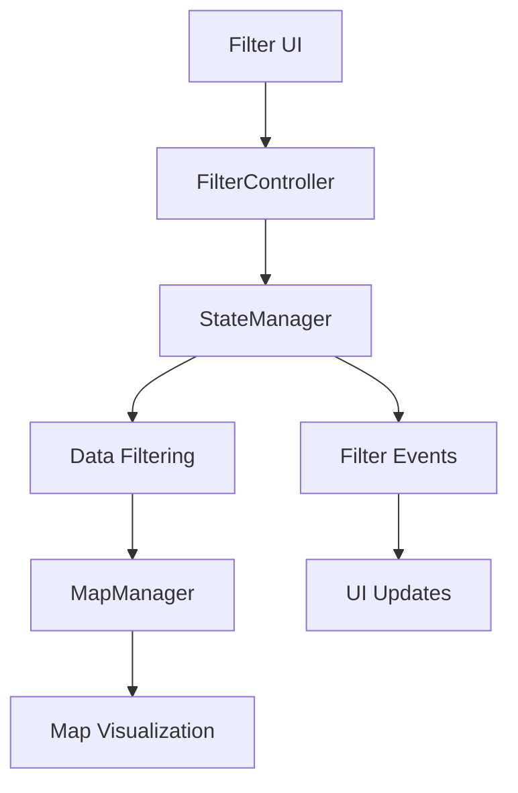
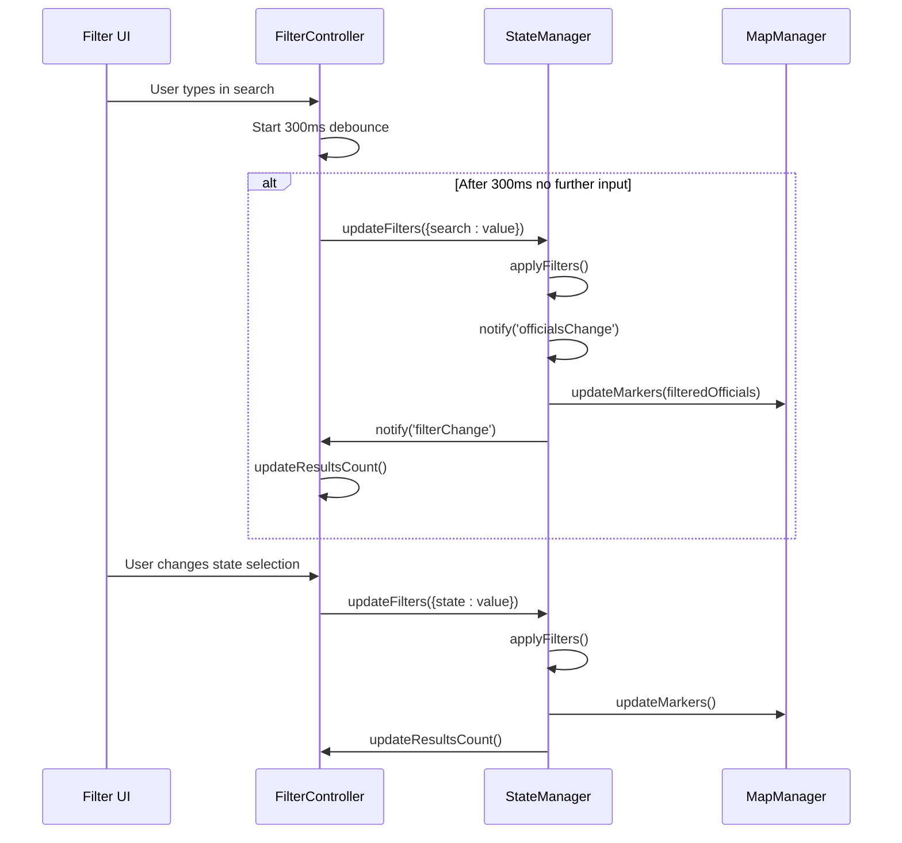
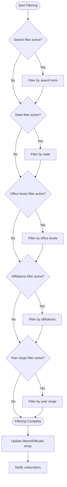

# Comprehensive Filtering

<cite>
**Referenced Files in This Document**   
- [filter-controller.js](file://js/filter-controller.js)
- [state-manager.js](file://js/state-manager.js)
- [data-loader.js](file://js/data-loader.js)
- [map-manager.js](file://js/map-manager.js)
- [index.html](file://index.html)
- [styles.css](file://css/styles.css)
</cite>

## Table of Contents
1. [Introduction](#introduction)
2. [Filtering Architecture](#filtering-architecture)
3. [Domain Model](#domain-model)
4. [Filter Controller Implementation](#filter-controller-implementation)
5. [State Management](#state-management)
6. [Filter Application Logic](#filter-application-logic)
7. [User Interface Integration](#user-interface-integration)
8. [Usage Patterns](#usage-patterns)
9. [Common Issues and Solutions](#common-issues-and-solutions)

## Introduction
The Comprehensive Filtering system enables users to search and filter elected officials based on multiple criteria including name, location, office level, political affiliation, and year elected. This documentation details the implementation of the filtering functionality, its integration with the application state, and the user interface components that make up this feature.

**Section sources**
- [filter-controller.js](file://js/filter-controller.js#L1-L271)
- [state-manager.js](file://js/state-manager.js#L1-L230)

## Filtering Architecture
The filtering system follows a modular architecture with clear separation of concerns between UI handling, state management, and data processing. The FilterController manages all user interface interactions, while the StateManager maintains the application state and applies filtering logic to the data.



**Diagram sources**
- [filter-controller.js](file://js/filter-controller.js#L1-L271)
- [state-manager.js](file://js/state-manager.js#L1-L230)
- [map-manager.js](file://js/map-manager.js#L1-L218)

## Domain Model
The filtering system operates on a well-defined domain model that includes various filter types and their relationships to official data. The system supports multiple filtering dimensions that can be combined to create complex queries.

### Filter Types
| Filter Type | Description | Data Type | Default Value |
|-----------|-------------|-----------|---------------|
| Search | Text search across name, position, city, and county | String | Empty string |
| State | Filter by state code (e.g., CA, NY) | String | Empty string (all states) |
| Office Levels | Filter by office level (federal, state, county, city, town) | Array of strings | All levels selected |
| Affiliations | Filter by political affiliation | Array of strings | All affiliations selected |
| Year Range | Filter by year elected (start and end) | Integer or null | No range applied |

**Section sources**
- [state-manager.js](file://js/state-manager.js#L11-L18)
- [filter-controller.js](file://js/filter-controller.js#L16-L22)

## Filter Controller Implementation
The FilterController module handles all user interactions with the filtering interface. It initializes DOM elements, sets up event listeners, and responds to state changes from the StateManager.

### Event Handling
The controller implements event listeners for various filter inputs with appropriate debouncing for performance optimization:

- **Search input**: Debounced by 300ms to prevent excessive filtering during typing
- **State selection**: Immediate update on change
- **Office level checkboxes**: Updates when any checkbox state changes
- **Year inputs**: Updates when value changes
- **Clear filters button**: Resets all filters and UI state



**Diagram sources**
- [filter-controller.js](file://js/filter-controller.js#L39-L46)
- [filter-controller.js](file://js/filter-controller.js#L49-L51)
- [state-manager.js](file://js/state-manager.js#L75-L79)

**Section sources**
- [filter-controller.js](file://js/filter-controller.js#L38-L97)

## State Management
The StateManager maintains the application state including all filters and filtered results. It implements an event-driven architecture that notifies subscribers when state changes occur.

### State Structure
```javascript
state = {
    allOfficials: [],           // All loaded officials
    filteredOfficials: [],      // Currently filtered officials
    filters: {
        search: '',             // Search term
        state: '',              // State code filter
        officeLevels: ['federal', 'state', 'county', 'city', 'town'], // Selected office levels
        affiliations: [],       // Selected political affiliations
        yearStart: null,        // Start year filter
        yearEnd: null           // End year filter
    },
    selectedOfficial: null,     // Currently selected official
    isLoading: true             // Loading state
}
```

### Event System
The state manager implements a publish-subscribe pattern with three main event types:
- **stateChange**: Notified when any state property changes
- **filterChange**: Notified when filters are updated
- **officialsChange**: Notified when officials data or filtering results change

**Section sources**
- [state-manager.js](file://js/state-manager.js#L8-L21)
- [state-manager.js](file://js/state-manager.js#L23-L50)

## Filter Application Logic
The filtering logic is implemented in the StateManager's applyFilters method, which processes all active filters and returns the resulting officials collection.

### Filter Processing Order
1. **Search filter**: Text search across multiple fields
2. **State filter**: Exact match on state code
3. **Office level filter**: Inclusion check against selected levels
4. **Affiliation filter**: Inclusion check against selected affiliations
5. **Year elected filter**: Range check between start and end years



**Diagram sources**
- [state-manager.js](file://js/state-manager.js#L84-L136)

**Section sources**
- [state-manager.js](file://js/state-manager.js#L84-L136)

## User Interface Integration
The filtering system is tightly integrated with the user interface, providing real-time feedback and visual updates as filters are applied.

### UI Components
- **Search input**: Text field with placeholder "Name or location..."
- **State dropdown**: Select element with all US state options
- **Office level checkboxes**: Multiple checkboxes for different office levels
- **Affiliation checkboxes**: Dynamically generated checkboxes based on data
- **Year range inputs**: Two number inputs for start and end years
- **Results counter**: Displays current count of filtered officials
- **Clear filters button**: Resets all filters to default values

### Responsive Design
The filter panel adapts to different screen sizes:
- **Desktop**: Sidebar panel that can be collapsed
- **Mobile**: Bottom sheet that can be expanded/collapsed by tapping the header

**Section sources**
- [index.html](file://index.html#L28-L140)
- [styles.css](file://css/styles.css#L88-L800)
- [filter-controller.js](file://js/filter-controller.js#L86-L91)

## Usage Patterns
The filtering system supports various usage patterns for different user needs.

### Common Filter Combinations
1. **Location-based search**: Combine state filter with search term
2. **Office level filtering**: Select specific office levels to focus on certain government tiers
3. **Affiliation analysis**: Filter by political affiliation to study distribution
4. **Historical trends**: Use year range to examine officials elected in specific periods
5. **Comprehensive search**: Use search field to find officials by name or location

### API Usage
The filtering system exposes a clean API for programmatic access:

```javascript
// Update specific filters
StateManager.updateFilters({ 
    search: 'Smith',
    state: 'CA',
    officeLevels: ['city', 'county']
});

// Reset all filters
StateManager.resetFilters();

// Subscribe to filter changes
StateManager.subscribe('filterChange', (filters) => {
    console.log('Filters updated:', filters);
});
```

**Section sources**
- [state-manager.js](file://js/state-manager.js#L75-L80)
- [state-manager.js](file://js/state-manager.js#L142-L156)
- [state-manager.js](file://js/state-manager.js#L35-L39)

## Common Issues and Solutions
This section addresses common issues encountered when using or extending the filtering system.

### Performance Optimization
**Issue**: Large datasets may cause performance issues when filtering.
**Solution**: The system implements debouncing (300ms) on search input to prevent excessive filtering operations during typing.

### Mobile Usability
**Issue**: Filter panel may be difficult to access on small screens.
**Solution**: The mobile design uses a bottom sheet pattern with tap-to-expand functionality on the filter header.

### Dynamic Affiliation Loading
**Issue**: Affiliation checkboxes need to be populated based on actual data.
**Solution**: The system automatically populates affiliation checkboxes when officials data is first loaded, ensuring all available affiliations are represented.

### Filter State Synchronization
**Issue**: UI and application state may become out of sync.
**Solution**: The system uses a single source of truth (StateManager) and updates the UI through event notifications, ensuring consistency.

### Accessibility Considerations
- All filter controls have appropriate ARIA labels
- Keyboard navigation is supported
- Color contrast meets accessibility standards
- Screen reader support for dynamic content updates

**Section sources**
- [filter-controller.js](file://js/filter-controller.js#L132-L159)
- [filter-controller.js](file://js/filter-controller.js#L86-L91)
- [state-manager.js](file://js/state-manager.js#L182-L189)
- [index.html](file://index.html#L47-L127)