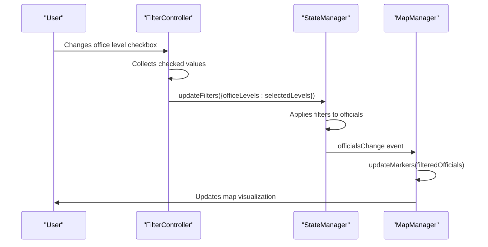

# Office Level Filter

<cite>
**Referenced Files in This Document**   
- [filter-controller.js](file://js/filter-controller.js)
- [state-manager.js](file://js/state-manager.js)
- [map-manager.js](file://js/map-manager.js)
- [index.html](file://index.html)
- [heatmap-manager.js](file://js/heatmap-manager.js)
</cite>

## Table of Contents
1. [Office Level Filter](#office-level-filter)
2. [Implementation Details](#implementation-details)
3. [Invocation Relationship](#invocation-relationship)
4. [Domain Model](#domain-model)
5. [Usage Patterns](#usage-patterns)
6. [Integration with StateManager and MapManager](#integration-with-statemanager-and-mapmanager)
7. [Performance Considerations](#performance-considerations)
8. [Troubleshooting Guide](#troubleshooting-guide)

## Implementation Details

The office level filter functionality is implemented through a combination of HTML markup, JavaScript event handling, and state management. The filter UI consists of checkboxes for different office levels (federal, state, county, city, town) that allow users to filter officials based on their governmental level.

The implementation begins with the HTML structure in index.html, where five checkboxes are defined with the common attribute `name="office-level"` and individual `value` attributes corresponding to each office level. All checkboxes are initially checked by default, ensuring that officials from all levels are displayed when the application loads.

In filter-controller.js, the filter controller module queries these checkboxes using the DOM selector `document.querySelectorAll('input[name="office-level"]')`. This NodeList is cached in the `elements` object during initialization for efficient access throughout the component's lifecycle.

When a user interacts with any of the office level checkboxes, a change event listener is triggered. The event handler collects the currently checked values into an array using a three-step process: converting the NodeList to an array with `Array.from()`, filtering for only checked checkboxes, and mapping to extract the value property of each checked checkbox.

The collected array of selected office levels is then passed to the StateManager via the `updateFilters` method, which triggers the filtering process across the application. The StateManager maintains the office level filter state as an array in its internal state object, with all office levels included by default.

**Section sources**
- [index.html](file://index.html#L69-L88)
- [filter-controller.js](file://js/filter-controller.js#L18-L63)
- [state-manager.js](file://js/state-manager.js#L14-L15)

## Invocation Relationship

The office level filter operates within a well-defined invocation chain that connects the UI interaction to the data filtering and visualization layers. When a user changes the state of an office level checkbox, the following sequence of invocations occurs:

1. The DOM change event triggers the event listener attached to each office level checkbox
2. The event handler in filter-controller.js collects the currently checked office levels into an array
3. The handler calls `StateManager.updateFilters({ officeLevels: selectedLevels })` with the array of selected levels
4. StateManager processes the filter update and applies the new filtering criteria to the officials data
5. StateManager notifies subscribers of the filter change through its event system
6. MapManager receives the notification and updates the map markers to reflect the filtered data
7. The UI is updated to show the new results count and potentially show or hide the "no results" message

This invocation chain demonstrates a clean separation of concerns, with the filter controller handling UI events, the state manager managing application state and filtering logic, and the map manager handling visualization updates.

The relationship between components is established during initialization, with the filter controller setting up event listeners and subscribing to state changes from the StateManager. This creates a bidirectional communication flow where UI events trigger state changes, and state changes trigger UI updates.

**Section sources**
- [filter-controller.js](file://js/filter-controller.js#L57-L62)
- [state-manager.js](file://js/state-manager.js#L78-L82)
- [filter-controller.js](file://js/filter-controller.js#L97-L98)

## Domain Model

The office level filter operates within a domain model that represents elected officials and their attributes. Each official has an `officeLevel` property that can take one of five values: "federal", "state", "county", "city", or "town". These values correspond directly to the checkbox values in the filter UI.

The StateManager maintains the filter state in its internal state object, where the `officeLevels` filter is represented as an array of strings. When all checkboxes are checked, this array contains all five office level values. When a user unchecks a checkbox, that value is removed from the array.

The filtering logic in StateManager applies the office level filter by checking whether an official's `officeLevel` property is included in the current filter array. This is implemented using JavaScript's `Array.includes()` method, which provides an efficient way to test membership.

The visual representation of different office levels is handled by MapManager, which uses distinct colors for markers based on office level. This creates a visual hierarchy that helps users distinguish between different levels of government at a glance.

The domain model also includes metadata about the filtering system itself, such as the default state (all office levels selected) and the relationship between UI controls and data attributes.

**Section sources**
- [state-manager.js](file://js/state-manager.js#L14-L15)
- [state-manager.js](file://js/state-manager.js#L110-L115)
- [map-manager.js](file://js/map-manager.js#L20-L26)

## Usage Patterns

The office level filter follows several key usage patterns that ensure a consistent and intuitive user experience:

1. **Initialization Pattern**: During application startup, the filter controller initializes by caching references to all office level checkboxes and setting up change event listeners on each one. This ensures that all checkboxes are properly wired up to respond to user interactions.

2. **Event Handling Pattern**: The filter uses a consistent event handling pattern where each checkbox has an identical change event listener. This listener collects the current state of all checkboxes rather than relying on the event target, which prevents issues that could arise from processing individual checkbox changes in isolation.

3. **State Update Pattern**: When the selection changes, the filter controller creates a new array of selected office levels and passes it to StateManager.updateFilters() as part of a filter update object. This pattern ensures that filter updates are batched and processed atomically.

4. **Default State Pattern**: The application establishes a default state where all office levels are selected, ensuring that users see the complete dataset when first loading the application. This default is defined in the StateManager's initial state configuration.

5. **UI Synchronization Pattern**: The filter UI automatically synchronizes with the application state. When filters are reset programmatically (such as through the "Clear All Filters" button), the checkbox states are updated to reflect the new filter state.

These patterns work together to create a robust filtering system that is both user-friendly and technically sound.

**Section sources**
- [filter-controller.js](file://js/filter-controller.js#L14-L28)
- [filter-controller.js](file://js/filter-controller.js#L56-L62)
- [state-manager.js](file://js/state-manager.js#L148-L154)
- [filter-controller.js](file://js/filter-controller.js#L260-L263)

## Integration with StateManager and MapManager

The office level filter is tightly integrated with both the StateManager and MapManager components through a well-defined event-driven architecture.

The primary integration point with StateManager occurs when the filter controller calls `StateManager.updateFilters({ officeLevels: selectedLevels })`. This method call updates the application state and triggers the filtering process. The StateManager maintains the office level filter as part of its comprehensive filter object, which also includes search terms, state selection, political affiliation, and year elected filters.

StateManager uses an event subscription system to notify other components of state changes. The filter controller subscribes to the 'officialsChange' event, which is triggered whenever the filtered officials list changes. This allows the filter controller to update the results count display and show or hide the "no results" message as appropriate.

The integration with MapManager occurs indirectly through StateManager. When the office level filter changes, StateManager updates the filtered officials list and notifies subscribers. MapManager, which is also subscribed to state changes, receives the updated list of filtered officials and calls its `updateMarkers()` method to refresh the map visualization.

This integration pattern follows the observer pattern, where StateManager acts as the subject and both the filter controller and map manager act as observers. This decouples the components while ensuring they remain synchronized with the application state.

**Diagram sources**
- [filter-controller.js](file://js/filter-controller.js#L61)
- [state-manager.js](file://js/state-manager.js#L80)
- [filter-controller.js](file://js/filter-controller.js#L189)
- [map-manager.js](file://js/map-manager.js#L172)

**Section sources**
- [filter-controller.js](file://js/filter-controller.js#L61)
- [state-manager.js](file://js/state-manager.js#L80)
- [filter-controller.js](file://js/filter-controller.js#L189)
- [map-manager.js](file://js/map-manager.js#L172)

## Performance Considerations

The office level filter implementation includes several performance optimizations to ensure a responsive user experience:

1. **DOM Query Optimization**: The filter controller caches references to all office level checkboxes during initialization using `document.querySelectorAll()`. This prevents repeated DOM queries when handling change events, reducing the performance overhead of event handling.

2. **Batched State Updates**: Rather than updating the application state for each individual checkbox change, the filter collects all selected office levels and updates the state in a single operation. This reduces the number of state change notifications and subsequent re-renders.

3. **Efficient Array Operations**: The implementation uses `Array.from()` to convert the NodeList to an array, followed by `filter()` and `map()` operations to extract the selected values. These native array methods are highly optimized in modern JavaScript engines.

4. **Minimal Re-renders**: The filtering logic in StateManager only updates the map visualization when the filtered officials list actually changes, preventing unnecessary re-renders when the filter change doesn't affect the results.

5. **Memory Efficiency**: The filter state is stored as a simple array of strings, minimizing memory usage. The StateManager uses object spreading to update the filter state, which creates a new object without modifying the original, supporting a predictable state management pattern.

For applications with a larger number of filter options, additional optimizations such as debouncing rapid successive changes or using more efficient data structures for filter state could be considered. However, for the current implementation with five office level options, the performance is excellent and responsive.

**Section sources**
- [filter-controller.js](file://js/filter-controller.js#L18)
- [filter-controller.js](file://js/filter-controller.js#L58-L61)
- [state-manager.js](file://js/state-manager.js#L79)

## Troubleshooting Guide

When troubleshooting issues with the office level filter, consider the following common problems and their solutions:

### Issue: Unchecked selections not reflected in results
**Symptoms**: After unchecking one or more office level checkboxes, the map still displays officials from the unchecked levels.

**Potential Causes and Solutions**:
1. **Event listener not properly attached**: Verify that the change event listeners are correctly set up in the `setupEventListeners()` function. Check that `elements.officeLevelCheckboxes` contains the expected NodeList of checkbox elements.

2. **State update not propagating**: Ensure that `StateManager.updateFilters()` is being called with the correct array of selected office levels. Add temporary console.log statements to verify the selectedLevels array contains only the checked values.

3. **Filter application issue**: Check the `applyFilters()` method in StateManager to ensure the office level filtering logic is correctly implemented. Verify that the condition `state.filters.officeLevels.includes(official.officeLevel)` is properly filtering officials.

4. **Map update not triggered**: Confirm that MapManager is properly subscribed to the 'officialsChange' event and that its `updateMarkers()` method is being called with the filtered officials list.

### Issue: All checkboxes become unchecked after filter reset
**Solution**: This occurs if the reset functionality doesn't properly restore the default state. Ensure that `resetFilterUI()` in filter-controller.js sets `checkbox.checked = true` for all office level checkboxes, and that `resetFilters()` in StateManager restores the default array of all office levels.

### Issue: Performance lag when toggling checkboxes
**Solution**: While unlikely with only five checkboxes, if performance becomes an issue, consider implementing debouncing for rapid successive changes or optimizing the filtering algorithm for large datasets.

### Debugging Steps:
1. Use browser developer tools to verify the DOM structure matches the expected HTML
2. Add console.log statements to trace the flow from checkbox change to state update to map refresh
3. Check for JavaScript errors in the console that might prevent event handlers from executing
4. Verify that all required JavaScript files are properly loaded and there are no 404 errors

**Section sources**
- [filter-controller.js](file://js/filter-controller.js#L57-L62)
- [state-manager.js](file://js/state-manager.js#L110-L115)
- [filter-controller.js](file://js/filter-controller.js#L260-L263)
- [state-manager.js](file://js/state-manager.js#L144-L158)