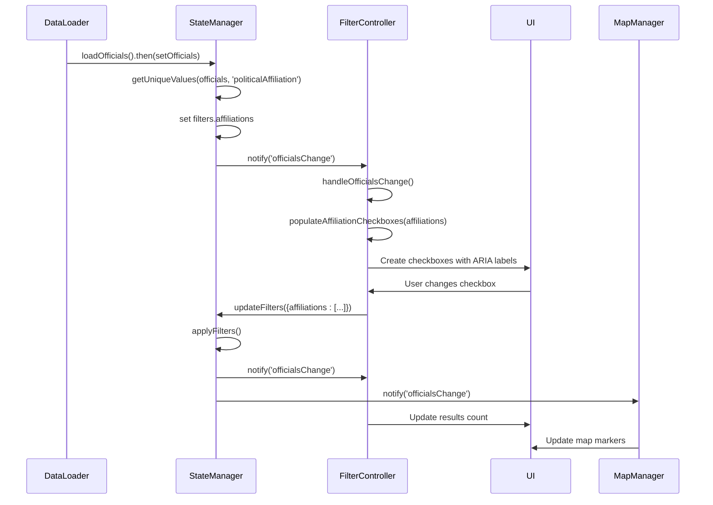
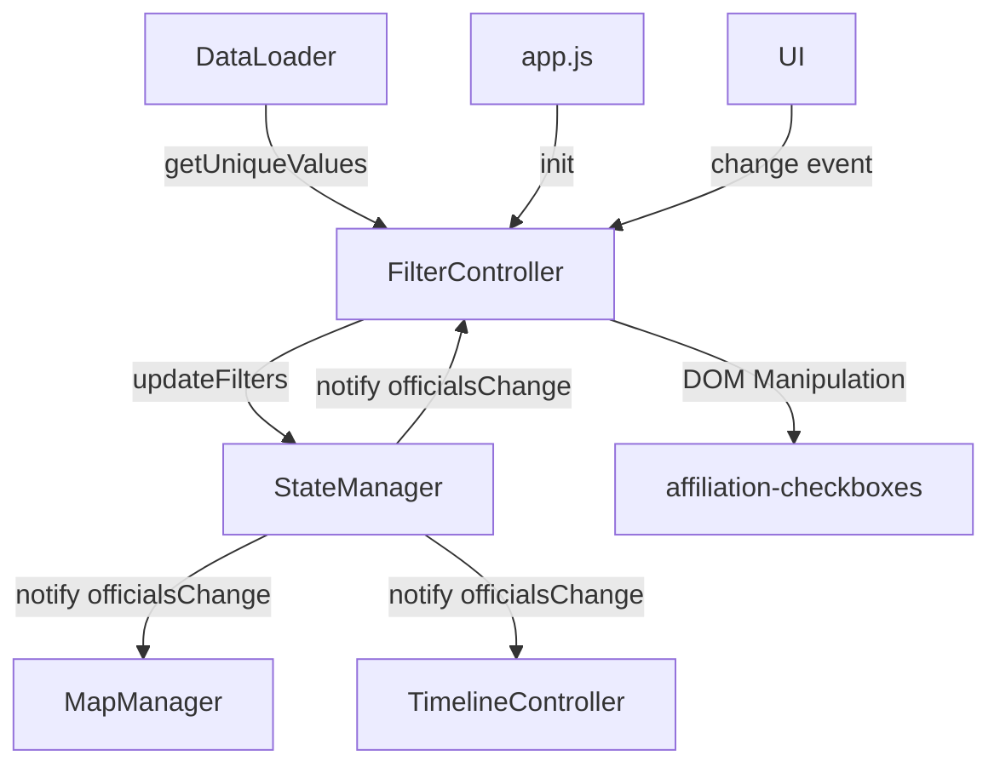

# Political Affiliation Filter

<cite>
**Referenced Files in This Document**   
- [data-loader.js](file://js/data-loader.js)
- [filter-controller.js](file://js/filter-controller.js)
- [state-manager.js](file://js/state-manager.js)
- [index.html](file://index.html)
</cite>

## Table of Contents
1. [Introduction](#introduction)
2. [Implementation Details](#implementation-details)
3. [Invocation Relationships](#invocation-relationships)
4. [Domain Model](#domain-model)
5. [Usage Patterns](#usage-patterns)
6. [Configuration Options and Parameters](#configuration-options-and-parameters)
7. [Component Relationships](#component-relationships)
8. [Common Issues and Solutions](#common-issues-and-solutions)
9. [Extending the Filter](#extending-the-filter)

## Introduction
The Political Affiliation Filter is a core component of the Democratic Socialist Officials Map application, enabling users to filter elected officials by their political affiliations. This filter dynamically populates checkbox options based on unique values found in the official data, provides accessibility-compliant UI elements, and integrates with the application's state management system to update the displayed results. The filter is designed to be both user-friendly and technically robust, handling initialization timing, dynamic DOM updates, and accessibility requirements.

## Implementation Details
The Political Affiliation Filter is implemented through a coordinated effort between multiple JavaScript modules. The filter UI is defined in the HTML structure with a container element for dynamically populated checkboxes. The `FilterController` module handles the population of these checkboxes by retrieving unique political affiliation values from the official data via the `DataLoader.getUniqueValues()` method. When the application loads officials data, the `StateManager` initializes the available affiliations and notifies the `FilterController` to populate the UI.

Each checkbox is generated with proper ARIA labels for accessibility, using the affiliation name as both the visual label and the `aria-label` attribute. The checkboxes are contained within a fieldset with a legend for semantic HTML structure. Event listeners are attached to each checkbox to detect changes, which trigger filter updates through the `StateManager`. The filter maintains its state in the application's central state object, ensuring consistency across different views and components.

The dynamic population of checkboxes occurs when the officials data is first loaded and whenever the filter needs to be reset. This ensures that the filter options always reflect the current dataset, even if the data changes during the application's lifecycle. The implementation uses efficient DOM manipulation techniques, clearing the container and rebuilding all checkboxes at once to minimize reflows and repaints.

**Section sources**
- [filter-controller.js](file://js/filter-controller.js#L140-L172)
- [state-manager.js](file://js/state-manager.js#L64-L66)
- [data-loader.js](file://js/data-loader.js#L151-L174)
- [index.html](file://index.html#L93-L101)

## Invocation Relationships
The Political Affiliation Filter operates within a well-defined invocation chain that begins with data loading and ends with UI updates. When the application initializes, `app.js` loads the officials data through `DataLoader.loadOfficials()`, which returns validated official records. This data is then passed to `StateManager.setOfficials()`, which extracts unique political affiliations using `DataLoader.getUniqueValues()` and stores them in the application state.

The `FilterController` subscribes to the `officialsChange` event from `StateManager`, which triggers the `handleOfficialsChange()` function. This function checks if the affiliation checkboxes have been populated, and if not, calls `populateAffiliationCheckboxes()` with the list of unique affiliations retrieved from `DataLoader.getUniqueValues()`. The `populateAffiliationCheckboxes()` function creates input elements for each affiliation, sets their properties, and attaches change event listeners.

When a user interacts with a checkbox, the change event listener collects all currently checked affiliations and calls `StateManager.updateFilters()` with the updated affiliations array. This triggers the `updateFilters()` method, which merges the new filter values with existing filters and calls `applyFilters()` to recompute the filtered officials list. The filtering process checks if each official's political affiliation is included in the selected affiliations array, producing a new filtered dataset.

Finally, `StateManager` notifies all subscribers of the `officialsChange` event, including `FilterController` and `MapManager`, which update their respective UI components to reflect the new filtered results. This event-driven architecture ensures that all components remain synchronized without direct dependencies on each other.

**Diagram sources**
- [data-loader.js](file://js/data-loader.js#L151-L174)
- [state-manager.js](file://js/state-manager.js#L58-L82)
- [filter-controller.js](file://js/filter-controller.js#L178-L203)
- [filter-controller.js](file://js/filter-controller.js#L158-L163)

**Section sources**
- [app.js](file://js/app.js#L25-L32)
- [state-manager.js](file://js/state-manager.js#L58-L82)
- [filter-controller.js](file://js/filter-controller.js#L178-L203)
- [filter-controller.js](file://js/filter-controller.js#L158-L163)

## Domain Model
The Political Affiliation Filter operates on a domain model centered around officials data and filter state. The core data structure is the official record, which contains a `politicalAffiliation` field that serves as the basis for filtering. This field is a string value representing the political affiliation of an elected official, such as "Democratic Socialist" or "Socialist Alternative". The filter treats these values as categorical data, using them to create discrete filtering options.

The filter state is maintained within the `StateManager` as part of the broader application state. The relevant portion of the state object includes the `affiliations` property within the `filters` object, which stores an array of selected affiliation strings. Initially, this array contains all unique affiliations found in the dataset, effectively showing all officials. When users modify the checkbox selections, this array is updated to contain only the selected affiliations.

The domain model also includes the concept of "unique values" extraction, implemented by the `DataLoader.getUniqueValues()` method. This function traverses the array of officials and collects distinct values for a specified field path, returning them as a sorted array. For the political affiliation filter, it extracts the `politicalAffiliation` field from each official, creating the list of options presented to the user.

The filter operates on the principle of inclusion: officials are included in the results if their political affiliation matches any of the selected affiliations in the filter state. This creates a disjunctive filter where selecting multiple affiliations shows officials from any of the selected groups. The domain model supports both positive filtering (showing specific affiliations) and negative filtering (hiding specific affiliations by deselecting them).

**Section sources**
- [state-manager.js](file://js/state-manager.js#L11-L17)
- [data-loader.js](file://js/data-loader.js#L151-L174)
- [state-manager.js](file://js/state-manager.js#L117-L122)

## Usage Patterns
The Political Affiliation Filter follows several key usage patterns that ensure consistent and predictable behavior. The primary usage pattern is initialization, which occurs when the application loads data. During initialization, the filter automatically detects all unique political affiliations in the dataset and creates corresponding checkboxes, all of which are initially checked. This default state shows all officials, providing a comprehensive view before any filtering occurs.

The interaction pattern follows a standard form control workflow: users can click on any affiliation checkbox to toggle its selection state. Checking a checkbox adds that affiliation to the filter criteria, while unchecking removes it. The interface provides immediate visual feedback, with checked checkboxes displaying a selected state. The results count updates automatically to show how many officials match the current filter criteria.

A common usage pattern is progressive refinement, where users start with all affiliations selected and gradually deselect affiliations they want to exclude. Alternatively, users can clear all selections and then selectively check specific affiliations to create a custom view. The filter supports both approaches equally well, as the underlying logic is based on inclusion rather than exclusion.

The filter also supports programmatic usage through the `StateManager` API. Other components can update the affiliation filter by calling `StateManager.updateFilters()` with a new affiliations array. This enables features like URL-based state sharing, where filter settings can be encoded in the URL and restored when the page loads.

Another usage pattern is filter reset, which restores all affiliations to their checked state. This can be accomplished through the "Clear All Filters" button, which calls `StateManager.resetFilters()`, or programmatically by any component with access to the state manager. The reset operation returns the filter to its initial state, showing all officials regardless of affiliation.

**Section sources**
- [filter-controller.js](file://js/filter-controller.js#L144-L172)
- [state-manager.js](file://js/state-manager.js#L144-L157)
- [filter-controller.js](file://js/filter-controller.js#L77-L81)

## Configuration Options and Parameters
The Political Affiliation Filter has several configuration options and parameters that control its behavior and appearance. The primary configuration is determined by the data itself, as the filter options are dynamically generated from the unique values in the officials dataset. The `DataLoader.getUniqueValues()` method accepts two parameters: an array of officials and a field path string (e.g., 'politicalAffiliation'), which determines which field to extract unique values from.

The filter's behavior is controlled through the state object maintained by `StateManager`. The relevant configuration options include:
- `filters.affiliations`: An array of strings representing the currently selected political affiliations
- The initial state of this array is populated with all unique affiliations from the dataset

The `populateAffiliationCheckboxes()` function in `FilterController` accepts one parameter:
- `affiliations`: An array of strings representing the unique political affiliations to display as checkboxes

This function creates one checkbox for each affiliation in the array, using the affiliation name as both the checkbox value and the displayed label. The function has no additional configuration options, as its behavior is standardized to ensure consistency.

The filter's appearance is primarily controlled by CSS classes applied to the generated elements. Each checkbox is wrapped in a label element with the class `checkbox-label`, and the input element has no specific classes. The container element for the checkboxes has the ID `affiliation-checkboxes` and the class `checkbox-group`, allowing for targeted styling.

The filter does not expose direct configuration options for things like checkbox layout, sorting order, or display format, as these are handled automatically. The sorting of affiliations is alphabetical by default, as the `getUniqueValues()` method returns a sorted array. The layout is a vertical list of checkboxes, which wraps to multiple columns on wider screens through CSS media queries.

**Section sources**
- [data-loader.js](file://js/data-loader.js#L151-L174)
- [filter-controller.js](file://js/filter-controller.js#L144-L172)
- [state-manager.js](file://js/state-manager.js#L11-L17)

## Component Relationships
The Political Affiliation Filter maintains relationships with several key components in the application architecture. Its primary relationship is with the `StateManager`, which serves as the central hub for application state and event distribution. The filter depends on `StateManager` to provide the current filter state, receive notifications about data changes, and propagate filter updates to other components.

The filter also has a direct dependency on `DataLoader` for retrieving unique affiliation values from the officials data. It calls `DataLoader.getUniqueValues()` during initialization and reset operations to determine which checkboxes to create. This relationship is unidirectional, with the filter consuming data from the loader but not providing any feedback.

The filter interacts with the DOM through cached references to specific elements, particularly the `affiliation-checkboxes` container. It dynamically modifies this container's content by adding checkbox elements, making it responsible for a specific portion of the UI. The filter also updates the results count display based on the current filter state.

Other components that interact with the Political Affiliation Filter include `MapManager` and `TimelineController`, though these interactions are indirect. When the affiliation filter changes, `StateManager` notifies these components of the updated officials list, prompting them to refresh their displays. The filter itself does not communicate directly with these components.

The filter is initialized and coordinated by `app.js`, which calls `FilterController.init()` during application startup. This establishes a relationship where the main application module controls the filter's lifecycle while the filter maintains its own internal state and event handling.

**Diagram sources**
- [data-loader.js](file://js/data-loader.js#L151-L174)
- [state-manager.js](file://js/state-manager.js#L37-L52)
- [filter-controller.js](file://js/filter-controller.js#L97-L98)
- [filter-controller.js](file://js/filter-controller.js#L158-L163)

**Section sources**
- [filter-controller.js](file://js/filter-controller.js#L97-L98)
- [state-manager.js](file://js/state-manager.js#L37-L52)
- [app.js](file://js/app.js#L21-L22)

## Common Issues and Solutions
The Political Affiliation Filter may encounter several common issues, most of which relate to initialization timing, dynamic updates, and accessibility compliance. One frequent issue is race conditions during initialization, where the filter attempts to populate checkboxes before the officials data has been loaded. This is solved by the event-driven architecture: `FilterController` listens for the `officialsChange` event from `StateManager`, ensuring that checkbox population only occurs after data is available.

Another issue is stale UI state, where the checkboxes don't reflect the current filter state. This can occur if the state is updated programmatically without corresponding UI updates. The solution is the event subscription model, where `FilterController` receives notifications whenever the state changes, allowing it to keep the UI synchronized with the underlying data.

Accessibility issues may arise if ARIA attributes are not properly maintained. The implementation addresses this by setting the `aria-label` attribute on each checkbox to match the affiliation name, ensuring screen readers can properly announce the options. The container uses proper semantic HTML with a fieldset and legend, providing structural context for assistive technologies.

Performance issues could occur with large datasets, as the filter must process all officials to extract unique affiliations. The `getUniqueValues()` method uses a Set to efficiently collect unique values, with O(n) time complexity where n is the number of officials. For very large datasets, this operation is performed only once during initialization and reset, not on every filter change.

A potential issue is inconsistent state after data updates, such as when new officials with previously unseen affiliations are added. The current implementation doesn't handle dynamic data updates, as the officials data is loaded once at startup. To address this, the application would need to reinitialize the filter whenever the dataset changes, repopulating the checkboxes with the complete set of unique affiliations.

Browser compatibility issues are minimized by using standard DOM methods and event handling. The implementation avoids modern JavaScript features that might not be supported in older browsers, sticking to widely supported APIs for element creation and event attachment.

**Section sources**
- [filter-controller.js](file://js/filter-controller.js#L199-L203)
- [filter-controller.js](file://js/filter-controller.js#L97-L98)
- [filter-controller.js](file://js/filter-controller.js#L155-L157)
- [data-loader.js](file://js/data-loader.js#L158-L174)

## Extending the Filter
The Political Affiliation Filter can be extended in several ways to support custom political categories or enhanced functionality. One extension approach is to implement client-side category grouping, where multiple specific affiliations are grouped into broader categories. For example, "Democratic Socialist" and "Socialist Alternative" could be grouped under a "Socialist" category. This could be achieved by adding a mapping object that defines category groupings and modifying the `populateAffiliationCheckboxes()` function to create checkboxes for categories instead of individual affiliations.

Another extension is to add search functionality within the affiliation filter, allowing users to search for specific affiliations when there are many options. This would involve adding a search input above the checkboxes and implementing filtering of the checkbox list based on the search term. The search would need to be debounced to prevent excessive DOM updates during typing.

The filter could also be extended to support hierarchical affiliations, where political affiliations have parent-child relationships. This would require modifying the data model to include hierarchical information and updating the UI to support collapsible sections or tree structures. Users could then filter by parent categories or specific sub-affiliations.

For performance optimization with large datasets, the filter could implement virtual scrolling for the affiliation list, only rendering visible checkboxes and recycling elements as the user scrolls. This would prevent performance degradation when there are hundreds of affiliation options.

The filter could be extended to support saved filter presets, allowing users to save and recall common affiliation combinations. This would involve adding UI controls for saving and loading presets, and storing preset configurations in localStorage or through a backend service.

Accessibility could be enhanced by adding keyboard navigation support for the checkboxes, allowing users to navigate and select options using arrow keys and spacebar. This would complement the existing screen reader support and improve usability for keyboard-only users.

All extensions should maintain the existing event-driven architecture and avoid direct manipulation of the `StateManager` state, instead using the provided API methods to ensure consistency and predictability.

**Section sources**
- [filter-controller.js](file://js/filter-controller.js#L144-L172)
- [state-manager.js](file://js/state-manager.js#L78-L82)
- [data-loader.js](file://js/data-loader.js#L151-L174)