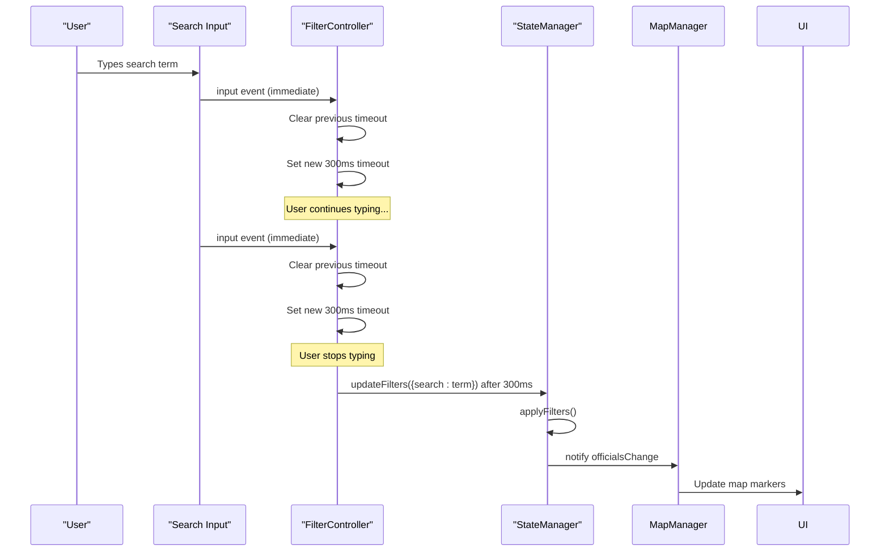
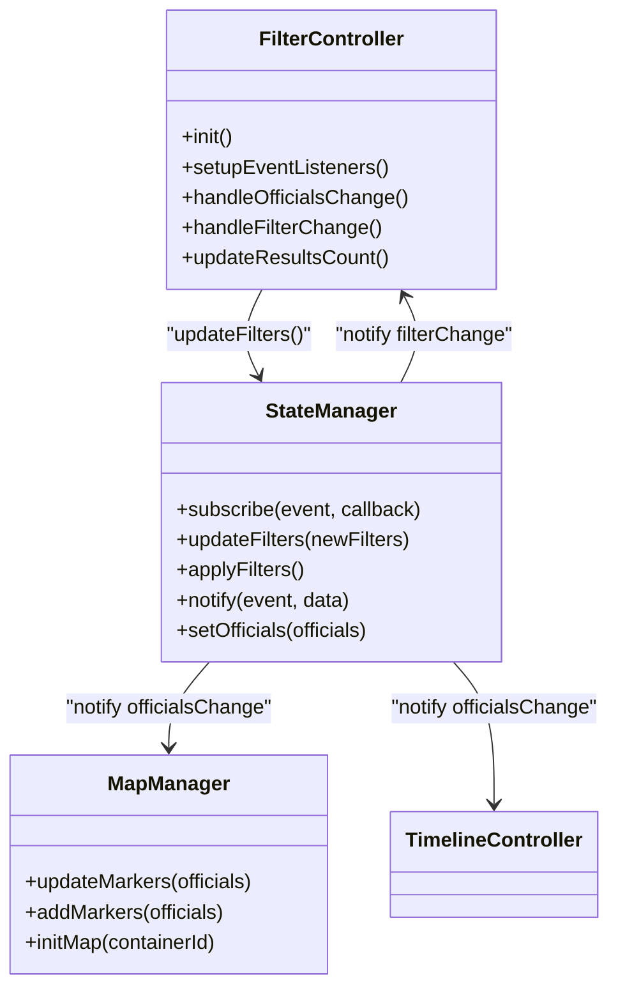
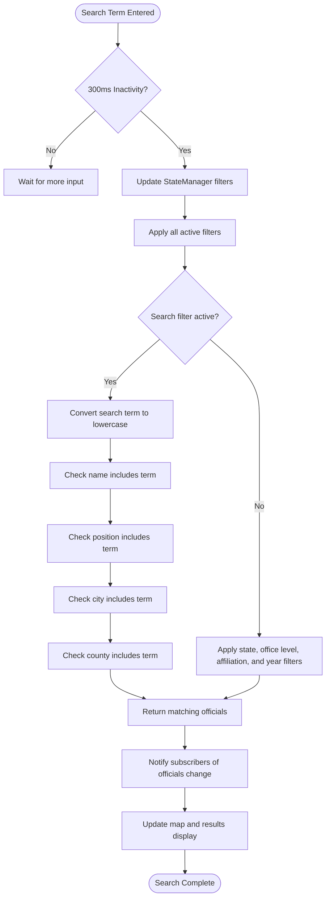

# Search Functionality

<cite>
**Referenced Files in This Document**   
- [filter-controller.js](file://js/filter-controller.js)
- [state-manager.js](file://js/state-manager.js)
- [app.js](file://js/app.js)
</cite>

## Table of Contents
1. [Introduction](#introduction)
2. [Debounced Search Implementation](#debounced-search-implementation)
3. [State Management Integration](#state-management-integration)
4. [Filtering Logic](#filtering-logic)
5. [Performance Considerations](#performance-considerations)
6. [Customization Options](#customization-options)
7. [Common Issues and Solutions](#common-issues-and-solutions)

## Introduction
The search functionality in the Democratic Socialist Officials Map application provides a responsive and efficient way for users to filter officials data based on various criteria. This document details the implementation of the debounced search feature, its integration with the state management system, and the filtering logic that enables partial matching across official properties. The system is designed to balance responsiveness with performance, ensuring a smooth user experience while minimizing unnecessary processing.

## Debounced Search Implementation

The search functionality implements a 300ms debounce mechanism to optimize performance and reduce unnecessary filtering operations. When a user types in the search input field, the system waits for 300 milliseconds of inactivity before processing the search term. This prevents the application from performing filtering operations on every keystroke, which would be computationally expensive and could lead to a sluggish user interface.



**Diagram sources**
- [filter-controller.js](file://js/filter-controller.js#L42-L48)
- [state-manager.js](file://js/state-manager.js#L77-L81)

**Section sources**
- [filter-controller.js](file://js/filter-controller.js#L42-L48)

## State Management Integration

The search functionality is tightly integrated with the StateManager module, which serves as the central hub for application state. When the debounced search timer completes, the FilterController invokes `StateManager.updateFilters({ search: term })` to update the application's filter state. This pattern follows the observer pattern, where the StateManager notifies all subscribed components of state changes.



**Diagram sources**
- [filter-controller.js](file://js/filter-controller.js#L97-L98)
- [state-manager.js](file://js/state-manager.js#L24-L30)
- [app.js](file://js/app.js#L187-L189)

**Section sources**
- [filter-controller.js](file://js/filter-controller.js#L97-L98)
- [state-manager.js](file://js/state-manager.js#L24-L30)

## Filtering Logic

The search functionality applies partial matching across multiple official properties, including name, position, city, and county. The filtering is case-insensitive and occurs only when a search term is present. The system uses JavaScript's `filter()` method with multiple `includes()` checks to identify officials that match the search criteria.



**Diagram sources**
- [state-manager.js](file://js/state-manager.js#L91-L99)
- [state-manager.js](file://js/state-manager.js#L86-L138)

**Section sources**
- [state-manager.js](file://js/state-manager.js#L86-L138)

## Performance Considerations

The debounced search implementation provides significant performance benefits by reducing the frequency of filtering operations. Without debouncing, each keystroke would trigger a filtering operation, potentially causing the UI to become unresponsive with large datasets. The 300ms timeout strikes a balance between responsiveness and performance, allowing users to type naturally while minimizing processing overhead.

However, there is a potential memory leak risk from the timeout mechanism. If the component is destroyed while a timeout is pending, the timeout callback may still execute, potentially causing errors or memory leaks. This risk is mitigated by the fact that the timeout is cleared on each subsequent input event, but a more robust solution would involve cleaning up timeouts when the component is destroyed.

The filtering operation itself has O(n) time complexity, where n is the number of officials, as it must check each official against the search criteria. For large datasets, this could become a performance bottleneck. Potential optimizations include:
- Implementing a search index for faster lookups
- Using web workers to perform filtering off the main thread
- Implementing pagination or virtual scrolling for results

## Customization Options

The search functionality can be customized in several ways to meet different requirements:

### Customizing Search Fields
The search can be extended to include additional official properties by modifying the `applyFilters` method in StateManager. For example, to include party affiliation in search results:

```javascript
// Add this condition to the search filter block
official.politicalAffiliation.toLowerCase().includes(searchLower)
```

### Adjusting Debounce Duration
The debounce duration can be adjusted by changing the timeout value in the FilterController. A shorter duration (e.g., 150ms) makes the search more responsive but increases processing load, while a longer duration (e.g., 500ms) reduces processing but may feel less responsive.

```javascript
// In filter-controller.js, line 47
searchTimeout = setTimeout(() => {
    StateManager.updateFilters({ search: e.target.value });
}, 500); // Changed from 300 to 500
```

### Adding Search Type Options
The system could be enhanced to support different search modes, such as:
- Exact match
- Fuzzy search
- Regular expression search

These could be implemented as additional filter options that modify how the search term is applied during filtering.

## Common Issues and Solutions

### Issue: Search Not Responding
**Symptoms**: The search field appears unresponsive or results don't update.
**Solutions**:
1. Verify that the StateManager is properly initialized
2. Check that the FilterController's event listeners are set up correctly
3. Ensure the DOM element with ID 'search-input' exists

### Issue: Memory Leaks from Timeouts
**Symptoms**: Application memory usage increases over time with repeated search operations.
**Solutions**:
1. Implement cleanup of timeouts when the component is destroyed
2. Use a class-based approach with proper lifecycle methods
3. Consider using libraries like Lodash's debounce function which handle cleanup automatically

### Issue: Slow Performance with Large Datasets
**Symptoms**: Search delays or UI freezing with large numbers of officials.
**Solutions**:
1. Implement a search index for O(1) lookups
2. Use web workers to move filtering to a background thread
3. Implement pagination to limit the number of officials processed at once

### Issue: Case-Sensitive Search
**Symptoms**: Search results are inconsistent due to case sensitivity.
**Solution**: Ensure all comparisons use lowercase conversion, as implemented in the current system:

```javascript
const searchLower = state.filters.search.toLowerCase();
official.name.toLowerCase().includes(searchLower)
```

**Section sources**
- [state-manager.js](file://js/state-manager.js#L92-L93)
- [filter-controller.js](file://js/filter-controller.js#L42-L48)