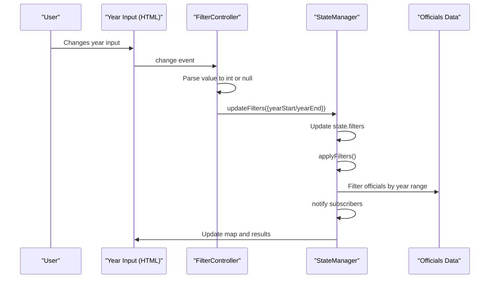
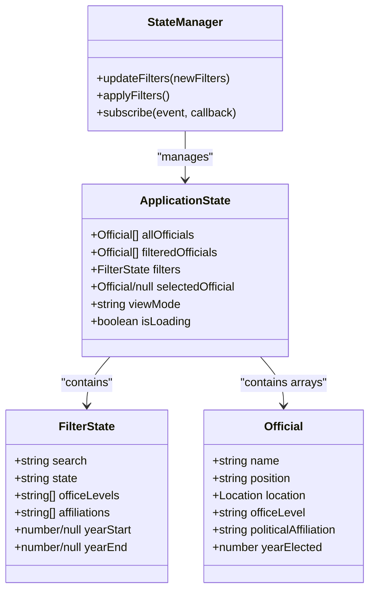
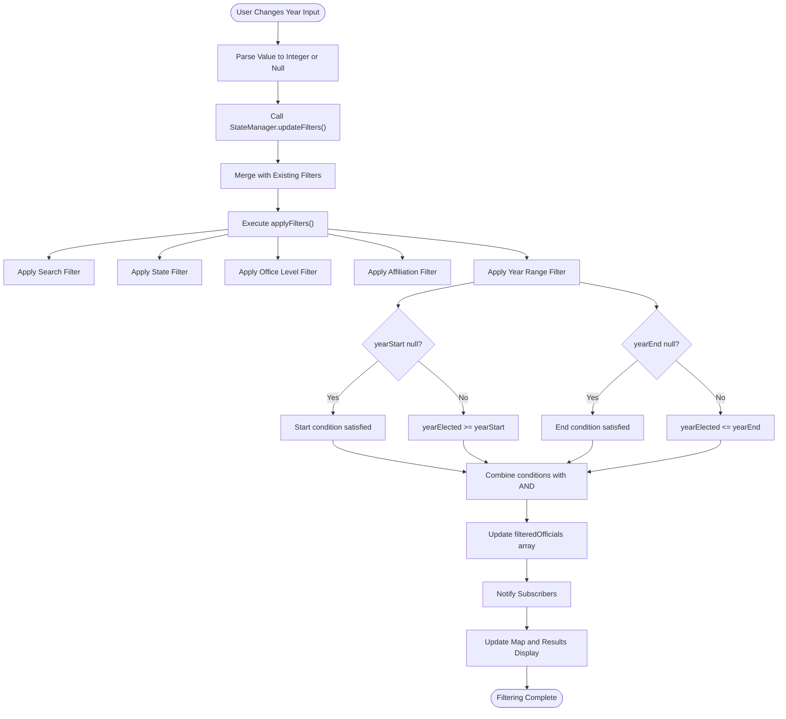

# Year Elected Filter

<cite>
**Referenced Files in This Document**   
- [filter-controller.js](file://js/filter-controller.js)
- [state-manager.js](file://js/state-manager.js)
- [index.html](file://index.html)
</cite>

## Table of Contents
1. [Introduction](#introduction)
2. [Implementation Details](#implementation-details)
3. [Invocation Relationship](#invocation-relationship)
4. [Domain Model](#domain-model)
5. [Usage Patterns](#usage-patterns)
6. [Configuration Options](#configuration-options)
7. [Validation Edge Cases](#validation-edge-cases)
8. [Performance Implications](#performance-implications)

## Introduction
The Year Elected Filter component enables users to filter elected officials based on their year of election. This feature provides a range-based filtering mechanism through two input fields: "From" and "To" years. The implementation follows a reactive pattern where changes in the UI trigger state updates that propagate through the application, resulting in filtered data display. This document details the implementation, integration, and behavior of this filtering functionality.

## Implementation Details

The Year Elected Filter is implemented as part of the filter UI system, with specific handling for year-based filtering of elected officials. The implementation consists of HTML input elements, JavaScript event handlers, and state management logic.

The filter UI contains two number input fields for specifying the election year range, with HTML5 validation attributes (min="1900", max="2030") to constrain valid input values. These inputs are connected to the application's state management system through event listeners that process user input and update the filtering criteria.

When a user modifies either the start or end year input, the change event triggers a handler that performs null-safe parsing of the input value. The implementation uses a ternary operator to check if the input value exists, parsing it as an integer if present, or setting it to null if empty. This null value represents the absence of a filter constraint for that boundary.

The parsed year value (either an integer or null) is then passed to the StateManager.updateFilters() method as part of a filter update object. This method call initiates the filtering process by updating the application state and triggering a re-evaluation of all filters.

**Section sources**
- [filter-controller.js](file://js/filter-controller.js#L66-L74)
- [state-manager.js](file://js/state-manager.js#L16-L17)
- [index.html](file://index.html#L109-L127)

## Invocation Relationship

The Year Elected Filter operates within a well-defined invocation chain that connects the UI layer to the data filtering logic. The relationship follows a unidirectional data flow pattern from user interaction to visual update.

When a user changes the year input value, the DOM change event triggers the corresponding event handler in the FilterController module. For the yearStart input, this is the handler at line 66, and for yearEnd, it's at line 71. These handlers extract the input value and perform null-safe conversion to an integer.

The converted year value is then passed to StateManager.updateFilters() with a partial filter object containing either yearStart or yearEnd. This method updates the central application state with the new filter value and calls applyFilters() to recompute the filtered dataset.

The applyFilters() method evaluates all active filters, including the year range filter. When either yearStart or yearEnd has a non-null value, the year filtering logic is applied. Officials are included in the results only if their yearElected property satisfies both the start and end conditions (when specified).

After filtering completes, the StateManager notifies subscribers of the filter change, which triggers UI updates in components like the map visualization and results counter.

**Diagram sources**
- [filter-controller.js](file://js/filter-controller.js#L66-L74)
- [state-manager.js](file://js/state-manager.js#L78-L81)

**Section sources**
- [filter-controller.js](file://js/filter-controller.js#L66-L74)
- [state-manager.js](file://js/state-manager.js#L78-L82)

## Domain Model

The Year Elected Filter operates within the application's domain model, which represents elected officials and their attributes. The key domain entities involved in this filtering functionality are:

- **Official**: Represents an elected official with properties including yearElected (integer), name, position, location, officeLevel, and politicalAffiliation
- **FilterState**: Contains the current filtering criteria, including yearStart and yearEnd properties that can be integers or null
- **ApplicationState**: The complete state object that includes filters, officials data, and UI state

The year-based filtering logic is implemented in the StateManager's applyFilters method. The filtering condition evaluates whether an official's yearElected value falls within the specified range. The implementation uses short-circuit evaluation to handle null values: if yearStart is null, the start condition is automatically satisfied; if yearEnd is null, the end condition is automatically satisfied.

This design allows for flexible range queries: users can specify only a minimum year, only a maximum year, or both to create a closed range. The null values serve as wildcards that disable their respective boundary conditions.

**Diagram sources**
- [state-manager.js](file://js/state-manager.js#L8-L22)
- [state-manager.js](file://js/state-manager.js#L124-L132)

**Section sources**
- [state-manager.js](file://js/state-manager.js#L8-L22)
- [state-manager.js](file://js/state-manager.js#L124-L132)

## Usage Patterns

The Year Elected Filter supports several common usage patterns that accommodate different user needs for exploring the officials data:

1. **Minimum Year Filter**: Users can specify only a "From" year to find officials elected in that year or later. This is useful for finding recently elected officials.

2. **Maximum Year Filter**: Users can specify only a "To" year to find officials elected in that year or earlier. This helps identify long-serving officials.

3. **Range Filter**: Users can specify both "From" and "To" years to find officials elected within a specific time period. This is ideal for historical analysis.

4. **Open-Ended Filter**: Users can leave both fields empty to disable year-based filtering entirely, showing all officials regardless of election year.

The implementation handles these patterns through null values in the filter state. When a year input is empty, it sets the corresponding filter property to null, which the filtering logic interprets as "no constraint" for that boundary.

The filter state is initialized with both yearStart and yearEnd set to null, meaning no year-based filtering is applied by default. Users can then add constraints by entering values in one or both fields.

**Section sources**
- [state-manager.js](file://js/state-manager.js#L16-L17)
- [filter-controller.js](file://js/filter-controller.js#L272-L273)

## Configuration Options

The Year Elected Filter has several configuration options that define its behavior and constraints:

- **Input Type**: Number inputs provide built-in validation and keyboard optimization for numeric entry
- **Minimum Value**: Set to 1900 through the min attribute, preventing entry of unreasonably early years
- **Maximum Value**: Set to 2030 through the max attribute, preventing entry of unreasonably distant future years
- **Placeholder Text**: "From" and "To" provide user guidance on the purpose of each field
- **Aria Labels**: Accessibility attributes ensure the inputs are usable with screen readers
- **Event Trigger**: Change events ensure filtering only occurs when input is complete, not during typing

These configuration options are defined in the HTML markup and provide both functional constraints and user experience guidance. The min and max attributes prevent invalid year values while still allowing a broad historical range. The change event (rather than input event) prevents excessive filtering during typing, improving performance.

The JavaScript implementation respects these configuration options and builds upon them with additional logic for null-safe value parsing and state management integration.

**Section sources**
- [index.html](file://index.html#L114-L115)
- [index.html](file://index.html#L124-L125)
- [index.html](file://index.html#L110-L127)

## Validation Edge Cases

The Year Elected Filter implementation handles several validation edge cases to ensure robust behavior:

1. **Empty Input**: When a year input is empty, the value is set to null rather than NaN or undefined. This null value is properly handled in the filtering logic, where it acts as a wildcard that doesn't constrain the results.

2. **Invalid Format**: While the number input type prevents most invalid formats, if a non-numeric value is somehow entered, the parseInt() function returns NaN. However, the ternary condition (e.target.value ? ...) ensures that only truthy values are parsed, so empty strings result in null rather than NaN.

3. **Range Conflicts**: The implementation does not validate that yearStart ≤ yearEnd. This intentional design allows users to experiment with different ranges. If yearStart > yearEnd, the filtering logic will still execute, but the result will be an empty set since no year can be both ≥ a larger number and ≤ a smaller number.

4. **Extreme Values**: The HTML min and max attributes constrain values to 1900-2030, preventing performance issues from extremely large or small year values that might not exist in the dataset.

5. **Simultaneous Updates**: The implementation handles cases where both year inputs are changed rapidly by processing each change independently. Since each update triggers a complete re-filtering of the dataset, the final state always reflects the most recent values.

The filtering logic itself contains additional safeguards. The condition !state.filters.yearStart || yearElected >= state.filters.yearStart uses short-circuit evaluation, ensuring that when yearStart is null, the second part of the condition is not evaluated, preventing potential errors.

**Section sources**
- [filter-controller.js](file://js/filter-controller.js#L67-L68)
- [filter-controller.js](file://js/filter-controller.js#L72-L73)
- [state-manager.js](file://js/state-manager.js#L128-L129)

## Performance Implications

The Year Elected Filter implementation has several performance characteristics that affect the user experience:

1. **Event Frequency**: Using the change event instead of input event prevents filtering during typing, reducing the frequency of filter operations. This is particularly important for year inputs, as users typically enter complete year values rather than incremental changes.

2. **Filter Execution**: Each change to yearStart or yearEnd triggers a complete re-evaluation of all filters through the applyFilters() method. This ensures consistency but means that changing the year filter also re-applies search, state, office level, and affiliation filters.

3. **Array Operations**: The filtering uses Array.filter() methods which have O(n) complexity, where n is the number of officials. With potentially hundreds of officials, this operation occurs on the main thread and could cause brief UI jank.

4. **State Updates**: The updateFilters() method creates a new filters object using the spread operator, which is a relatively inexpensive operation. However, it triggers notification to all subscribers, which could lead to multiple UI updates.

5. **Debouncing**: Unlike the search input which uses 300ms debouncing, the year inputs do not have debouncing. This means that immediately after changing focus from the input (e.g., by tabbing or clicking elsewhere), the filter is applied.

For large datasets, frequent changes to the year filters could impact performance. A potential optimization would be to implement debouncing for year inputs similar to the search input, or to cache filtered results when possible. However, given that year changes are typically infrequent compared to text search, the current implementation strikes a reasonable balance between responsiveness and performance.

**Diagram sources**
- [filter-controller.js](file://js/filter-controller.js#L66-L74)
- [state-manager.js](file://js/state-manager.js#L86-L138)

**Section sources**
- [filter-controller.js](file://js/filter-controller.js#L42-L48)
- [state-manager.js](file://js/state-manager.js#L86-L138)