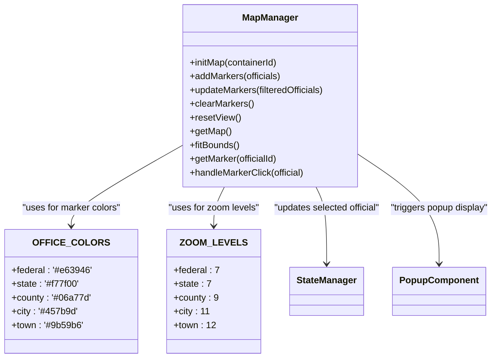
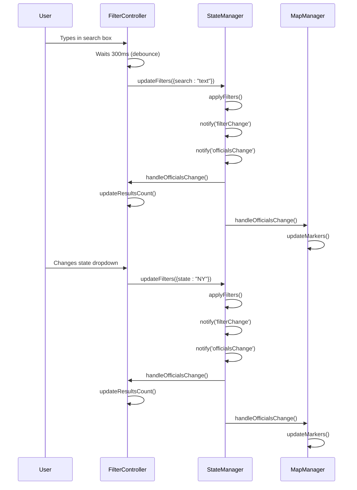
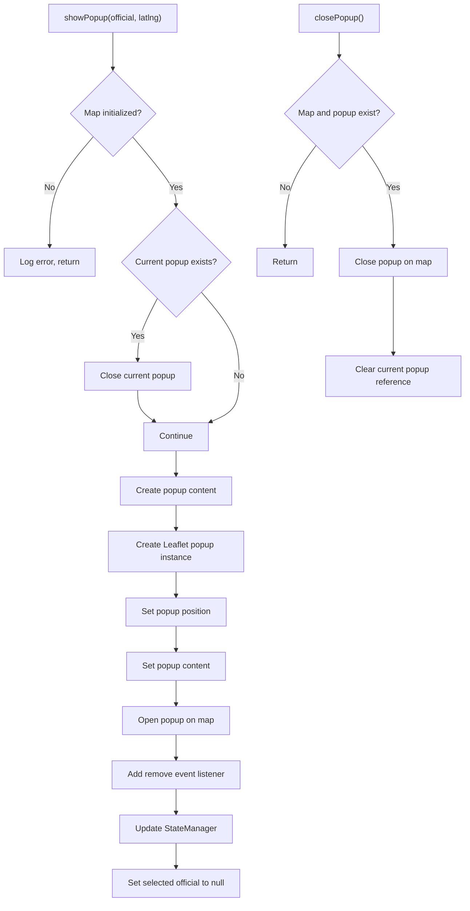

# Core Features

<cite>
**Referenced Files in This Document**   
- [app.js](file://js/app.js)
- [state-manager.js](file://js/state-manager.js)
- [map-manager.js](file://js/map-manager.js)
- [filter-controller.js](file://js/filter-controller.js)
- [popup-component.js](file://js/popup-component.js)
- [data-loader.js](file://js/data-loader.js)
- [officials.json](file://data/officials.json)
</cite>

## Table of Contents
1. [Introduction](#introduction)
2. [State Management System](#state-management-system)
3. [Map Management and Visualization](#map-management-and-visualization)
4. [Filtering and User Interaction](#filtering-and-user-interaction)
5. [Popup Component and Information Display](#popup-component-and-information-display)
6. [Data Loading and Validation](#data-loading-and-validation)
7. [Component Relationships and Invocation Flow](#component-relationships-and-invocation-flow)
8. [Common Issues and Solutions](#common-issues-and-solutions)

## Introduction
The Democratic Socialist Officials Map is an interactive web application that displays elected Democratic Socialist and Socialist officials across the United States. This document provides a detailed analysis of the core features, implementation details, component relationships, and usage patterns of the application. The system is built with vanilla JavaScript and leverages Leaflet.js for interactive mapping capabilities. The application features a modular architecture with distinct components handling state management, map rendering, filtering, popup display, and data loading.

## State Management System

The StateManager module serves as the central data store and state management system for the application. It maintains the complete application state including all officials data, current filters, selected official, and loading status. The state object contains several key properties: allOfficials stores the complete dataset of officials, filteredOfficials contains the subset matching current filter criteria, filters maintains the current filtering parameters, selectedOfficial tracks the currently selected official for detailed view, and isLoading indicates whether data is being loaded.

The StateManager provides a comprehensive API for state manipulation and observation. Key methods include setOfficials() for initializing the officials data, updateFilters() for modifying filter parameters, resetFilters() for restoring default filter values, and setSelectedOfficial() for managing the currently selected official. The module implements an event-driven architecture through its subscribe() method, allowing other components to register callbacks for state changes, filter updates, and officials data changes. When state changes occur, the notify() method broadcasts these changes to all registered listeners, enabling reactive updates across the application.

The state management system also handles filter application logic through the applyFilters() method, which processes the current filter state against the officials dataset to produce the filtered results. This includes search filtering (by name, position, city, or county), state filtering, office level filtering, political affiliation filtering, and year elected filtering. The system automatically initializes the available political affiliations based on the loaded data, ensuring the filter UI reflects the actual data content.

**Section sources**
- [state-manager.js](file://js/state-manager.js#L3-L228)

## Map Management and Visualization

The MapManager module handles all aspects of map initialization, rendering, and interaction. It uses Leaflet.js to create an interactive map centered on the continental United States with OpenStreetMap tiles. The module implements several key features to enhance the user experience, including pin clustering to group nearby officials when zoomed out, custom marker icons with color-coding by office level, and smooth zoom animations.

The map initialization process begins with creating a Leaflet map instance centered at the geographic center of the continental US (39.8283, -98.5795) with an initial zoom level of 4. The module configures appropriate zoom constraints (minimum zoom 3, maximum zoom 18) and adds OpenStreetMap tile layers with proper attribution. A marker cluster group is initialized with configurable parameters including maximum cluster radius (60 pixels), spiderfication behavior on maximum zoom, and custom cluster icon styling that varies by cluster size (small, medium, large).

Each official is represented by a custom marker with several distinctive features. The createMarkerIcon() function generates div icons with color-coding based on office level (federal: red, state: orange, county: green, city: blue, town: purple) and displays the official's first initial. Markers include accessibility features with appropriate title and alt attributes, and store the complete official data object for reference. The module maintains a Map data structure (markers) to track markers by official ID, enabling efficient marker retrieval and management.

When a marker is clicked, the handleMarkerClick() function updates the application state to select the official, animates the map view to the official's location with a zoom level appropriate to their office level (federal/state: 7, county: 9, city: 11, town: 12), and triggers the display of a detailed popup. The module also provides utility functions for updating markers based on filtered results, clearing all markers, resetting the map view to its initial position, and fitting the map bounds to show all current markers.



**Diagram sources**
- [map-manager.js](file://js/map-manager.js#L3-L216)

**Section sources**
- [map-manager.js](file://js/map-manager.js#L3-L216)

## Filtering and User Interaction

The FilterController module manages the filter UI and user interactions for refining the displayed officials. It provides a comprehensive filtering system with multiple criteria including text search, state selection, office level checkboxes, political affiliation checkboxes, and year elected range inputs. The controller caches references to all filter UI elements during initialization and sets up event listeners for user interactions.

The filtering system implements several user experience enhancements. The search input includes debounce functionality (300ms) to prevent excessive filter updates during typing. The controller subscribes to state changes from the StateManager, allowing it to automatically update the results count display and repopulate the political affiliation checkboxes based on the loaded data. When officials data changes, the controller updates the results text (showing counts like "Showing 15 of 42 officials") and refreshes the map markers through the MapManager.

The UI includes several interactive features designed for different device types. On mobile devices (screen width ≤ 768px), the filter panel can be toggled by tapping the filter header, providing a space-efficient interface. The controller also handles the clear filters button, which resets all filter inputs to their default values and triggers a complete filter reset through the StateManager. For accessibility, the controller manages ARIA attributes like aria-expanded for the toggle button.

The political affiliation filtering is dynamically generated based on the actual data content. When the application loads, the controller extracts unique political affiliations from the officials dataset and creates checkbox inputs for each one. This ensures the filter options reflect the actual data rather than requiring manual configuration. The controller also manages the state dropdown, which is populated with all valid US state codes from the DataLoader module.



**Diagram sources**
- [filter-controller.js](file://js/filter-controller.js#L3-L269)

**Section sources**
- [filter-controller.js](file://js/filter-controller.js#L3-L269)

## Popup Component and Information Display

The PopupComponent module handles the creation and display of detailed information popups when users click on official markers. The component creates rich, accessible popup content that displays comprehensive information about each official in a structured format. The popup includes the official's photo (if available), name, position, office level badge, biography, contact information, political affiliation, term dates, year elected, committee memberships, voting record, and location details.

The createPopupContent() function generates HTML content with careful attention to accessibility and security. It implements HTML escaping through the escapeHtml() function to prevent XSS attacks by converting text content to HTML entities. The popup uses semantic HTML structure with appropriate classes for styling and includes ARIA labels for screen readers. Contact information is presented as actionable links (mailto:, tel:, website) with appropriate target attributes for external links. Social media links are constructed with proper URLs and include screen reader-friendly labels.

The popup styling includes several responsive design features. The popup has a minimum width of 300px and maximum width of 400px to ensure readability on different devices. It enables auto-panning to ensure the popup is fully visible when opened near map edges, with a padding buffer of 50px. The component manages popup lifecycle by closing any existing popup before opening a new one, preventing multiple popups from appearing simultaneously. When a popup is closed (either by user action or programmatically), it triggers a state update to deselect the official and cleans up the current popup reference.

The component also handles keyboard accessibility by listening for the Escape key press event (managed by the main app module) to close the current popup. This ensures the application is fully navigable via keyboard. The popup includes a close button and can be dismissed by clicking outside the popup area, following standard user interface conventions.



**Diagram sources**
- [popup-component.js](file://js/popup-component.js#L3-L262)

**Section sources**
- [popup-component.js](file://js/popup-component.js#L3-L262)

## Data Loading and Validation

The DataLoader module is responsible for loading officials data from the JSON file and validating its structure and content. The module implements a robust data loading process with comprehensive error handling and validation. It fetches the officials.json file via HTTP request and parses the JSON response, validating that the data structure is an array of official objects.

The validation system checks each official record against a comprehensive set of requirements. Required fields include id, name, position, officeLevel, politicalAffiliation, bio, termStart, and yearElected. The officeLevel must be one of the valid values: federal, state, county, city, or town. The location object must contain valid latitude and longitude coordinates. The termStart and termEnd dates must be in valid ISO 8601 format. The validation process collects all errors for each official and returns detailed error reports including the index, ID, name, and specific validation failures.

The module provides utility functions beyond data loading. The getUniqueValues() function extracts unique values for a specified field across all officials, which is used to dynamically populate filter options (particularly political affiliations). This function supports nested field paths using dot notation (e.g., 'location.state') and returns sorted arrays of unique values. The module also defines constants for valid office levels and US state codes, which are used throughout the application for validation and UI population.

The data loading process returns a comprehensive result object containing the validated officials array, any validation errors encountered, the total count of records processed, and the count of valid records. This allows the application to provide feedback about data quality while still loading valid records. Failed records are logged as warnings but do not prevent the application from initializing with the valid data.

**Section sources**
- [data-loader.js](file://js/data-loader.js#L1-L184)

## Component Relationships and Invocation Flow

The application follows a modular architecture with clear separation of concerns and well-defined component relationships. The main application flow begins with the app.js module initializing the system components in a specific sequence: first initializing the map, then the filter controller, and finally loading the officials data. This initialization order ensures dependencies are ready before they are needed.

The component interaction follows a unidirectional data flow pattern centered around the StateManager. User interactions with the filter UI (FilterController) result in calls to StateManager.updateFilters(), which triggers filter application and notifies subscribers of the changes. The MapManager and FilterController both subscribe to officialsChange events, allowing them to update their displays when the filtered officials list changes. When a user clicks on a map marker, MapManager.handleMarkerClick() calls StateManager.setSelectedOfficial(), which in turn triggers the PopupComponent to display the detailed information.

The data loading process integrates with the state management system by calling StateManager.setOfficials() with the validated data, which then triggers the initial display of all markers through MapManager.addMarkers(). The FilterController uses DataLoader.getUniqueValues() to populate the political affiliation checkboxes based on the actual data content, creating a dependency from the filter UI to the data loader module.

The application startup sequence demonstrates the component dependencies: app.js depends on MapManager for map initialization, FilterController for filter setup, DataLoader for data loading, and StateManager for state management. The error handling system in app.js shows another important relationship, where initialization failures result in calls to showError() which displays user-friendly error messages with reload options.

```mermaid
graph TD
A[app.js] --> B[MapManager.initMap]
A --> C[FilterController.init]
A --> D[DataLoader.loadOfficials]
D --> E[StateManager.setOfficials]
E --> F[MapManager.addMarkers]
E --> G[FilterController.handleOfficialsChange]
C --> H[StateManager.updateFilters]
H --> I[StateManager.applyFilters]
I --> J[StateManager.notify]
J --> K[MapManager.updateMarkers]
J --> L[FilterController.handleOfficialsChange]
M[Map click] --> N[MapManager.handleMarkerClick]
N --> O[StateManager.setSelectedOfficial]
O --> P[PopupComponent.showPopup]
Q[Escape key] --> R[PopupComponent.closePopup]
R --> S[StateManager.setSelectedOfficial(null)]
```

**Diagram sources**
- [app.js](file://js/app.js#L1-L142)
- [state-manager.js](file://js/state-manager.js#L3-L228)
- [map-manager.js](file://js/map-manager.js#L3-L216)
- [filter-controller.js](file://js/filter-controller.js#L3-L269)
- [popup-component.js](file://js/popup-component.js#L3-L262)

**Section sources**
- [app.js](file://js/app.js#L1-L142)

## Common Issues and Solutions

Several common issues may arise when using or maintaining the Democratic Socialist Officials Map application, along with their corresponding solutions:

**Data Loading Failures**: If the application fails to load the officials.json file, users will see an error message. This can occur due to incorrect file paths, server configuration issues, or network problems. Solution: Verify that the data/officials.json file exists in the correct location, check server permissions, and ensure the application is served via HTTP rather than opened directly as a file. The data path can be modified in the DataLoader.loadOfficials() call if needed.

**Invalid JSON Data**: If the officials.json file contains invalid JSON or data that doesn't meet the schema requirements, some officials may fail to load. The application logs validation errors to the console but continues with valid records. Solution: Check the browser console for validation error messages, correct the JSON syntax, and ensure all required fields are present and properly formatted. Use JSON validation tools to verify the file structure.

**Map Display Issues**: Problems with map rendering can occur if Leaflet.js dependencies are missing or if the map container element doesn't exist. Solution: Ensure the index.html file includes the Leaflet CSS and JS files, and that there is a div element with id="map" in the HTML. Verify that the map container has defined dimensions (height and width) in the CSS.

**Filtering Not Working**: If filters don't update the displayed officials, it may indicate a broken event chain between components. Solution: Check that the FilterController is properly subscribing to StateManager events and that the MapManager is responding to officialsChange events. Verify that event listeners are correctly attached and that there are no JavaScript errors preventing execution.

**Popup Display Problems**: Issues with popup display can occur if the map is not properly initialized or if there are conflicts with CSS styles. Solution: Ensure the MapManager has successfully initialized the map instance before attempting to show popups. Check for CSS rules that might interfere with popup positioning or visibility.

**Mobile Responsiveness Issues**: On small screens, the filter panel toggle may not work as expected. Solution: Verify that the mobile detection in FilterController is functioning correctly (checking window.innerWidth ≤ 768) and that the click event listener is properly attached to the filter header element.

**Accessibility Concerns**: To ensure the application remains accessible, regularly test keyboard navigation (using Tab, Enter, and Escape keys) and screen reader compatibility. The application includes ARIA labels and keyboard event handlers, but custom styling should preserve these accessibility features.

**Performance Optimization**: For very large datasets, consider implementing additional performance optimizations such as lazy loading of official photos, virtual scrolling for long lists, or pagination for search results. The current pin clustering already helps maintain performance with multiple officials.

**Section sources**
- [app.js](file://js/app.js#L48-L88)
- [state-manager.js](file://js/state-manager.js#L3-L228)
- [map-manager.js](file://js/map-manager.js#L3-L216)
- [filter-controller.js](file://js/filter-controller.js#L3-L269)
- [popup-component.js](file://js/popup-component.js#L3-L262)
- [data-loader.js](file://js/data-loader.js#L1-L184)