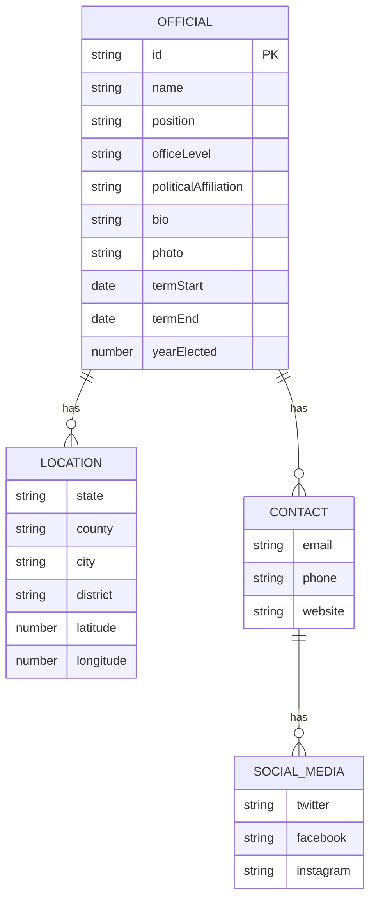
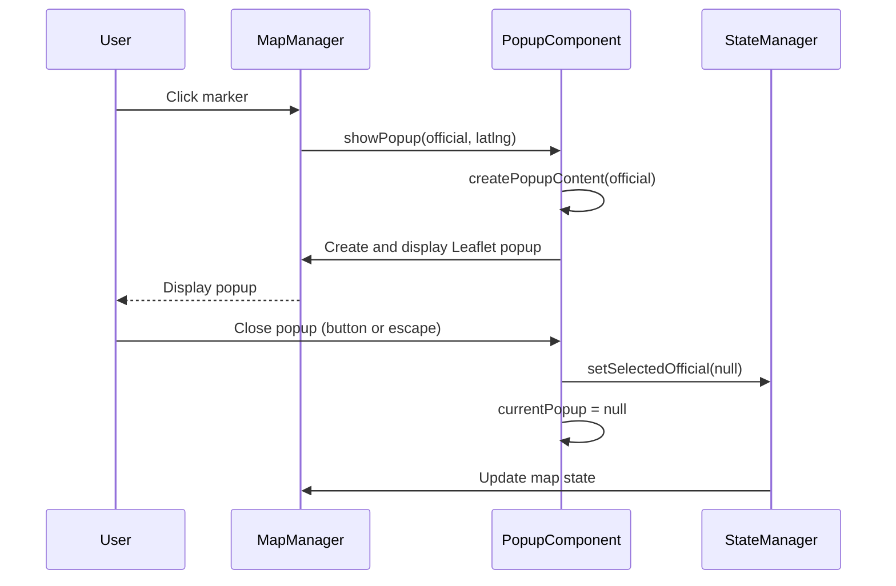

# Detailed Information Popups

<cite>
**Referenced Files in This Document**   
- [popup-component.js](file://js/popup-component.js)
- [map-manager.js](file://js/map-manager.js)
- [state-manager.js](file://js/state-manager.js)
- [app.js](file://js/app.js)
- [data/officials.json](file://data/officials.json)
</cite>

## Table of Contents
1. [Introduction](#introduction)
2. [Domain Model and Data Structure](#domain-model-and-data-structure)
3. [Implementation Details](#implementation-details)
4. [Invocation Relationships](#invocation-relationships)
5. [Interfaces and API](#interfaces-and-api)
6. [Usage Patterns](#usage-patterns)
7. [Configuration Options and Parameters](#configuration-options-and-parameters)
8. [Common Issues and Solutions](#common-issues-and-solutions)
9. [Accessibility Features](#accessibility-features)

## Introduction
The Detailed Information Popups feature provides an interactive way to display comprehensive information about democratic socialist officials on a map-based interface. When users click on a marker representing an official, a detailed popup appears showing biographical information, contact details, political affiliations, and other relevant data. This documentation provides a comprehensive analysis of the popup component's implementation, its integration with other system components, and its usage patterns.

**Section sources**
- [popup-component.js](file://js/popup-component.js#L1-L264)

## Domain Model and Data Structure
The popup system displays information from the official data model, which contains comprehensive details about each elected official. The domain model includes personal information, position details, contact information, political affiliations, and location data.

The official object structure includes:
- **Identification**: id, name
- **Position**: position title, officeLevel (federal, state, county, city, town)
- **Affiliation**: politicalAffiliation
- **Location**: state, county, city, district, latitude, longitude
- **Contact**: email, phone, website, socialMedia (twitter, facebook, instagram)
- **Tenure**: termStart, termEnd, yearElected
- **Additional Information**: bio, photo, committeeMemberships, votingRecord

The popup component renders this structured data into a user-friendly format, organizing information into logical sections with appropriate styling and formatting.

**Diagram sources**
- [data/officials.json](file://data/officials.json#L1-L493)
- [popup-component.js](file://js/popup-component.js#L29-L182)

## Implementation Details
The popup functionality is implemented as a self-contained module using the module pattern, providing encapsulation and a clean public API. The implementation handles HTML content creation, popup display management, and lifecycle events.

The core implementation consists of several key functions:
- `createPopupContent()`: Generates the HTML structure for the popup with all official details
- `showPopup()`: Displays the popup on the map at the specified coordinates
- `closePopup()`: Closes the currently displayed popup
- `getCurrentPopup()`: Returns a reference to the current popup instance
- `formatDate()`: Formats ISO date strings for user-friendly display
- `escapeHtml()`: Prevents XSS attacks by escaping HTML content

The popup uses Leaflet's popup functionality with custom styling and configuration, including automatic panning to ensure the popup is fully visible and proper handling of concurrent popup instances.

**Section sources**
- [popup-component.js](file://js/popup-component.js#L1-L264)

## Invocation Relationships
The popup component interacts with several other system components through well-defined interfaces. The primary invocation relationships are:

1. **Map Manager**: The map manager invokes `PopupComponent.showPopup()` when a marker is clicked, passing the official data and coordinates.
2. **State Manager**: The popup component updates the application state via `StateManager.setSelectedOfficial()` when a popup is closed.
3. **Main Application**: The escape key handler in the main application calls `PopupComponent.closePopup()` to close popups.

The invocation flow begins when a user clicks on a map marker, triggering the map manager's click handler, which then calls the popup component to display the information. When the popup is closed (either by clicking the close button or pressing escape), the popup component notifies the state manager to update the selected official state.

**Diagram sources**
- [map-manager.js](file://js/map-manager.js#L139-L151)
- [popup-component.js](file://js/popup-component.js#L196-L234)
- [state-manager.js](file://js/state-manager.js#L170-L174)
- [app.js](file://js/app.js#L275-L277)

## Interfaces and API
The popup component exposes a clean public API through its module return object, providing methods for controlling popup display and retrieval.

### Public Methods
- `showPopup(official, latlng)`: Displays a popup for the specified official at the given coordinates
  - Parameters: 
    - `official` (Object): Official data object
    - `latlng` (Array): Latitude and longitude coordinates
- `closePopup()`: Closes the currently displayed popup
- `getCurrentPopup()`: Returns the current popup instance or null
- `createPopupContent(official)`: Generates HTML content for an official (used internally and available for testing)

### Event Handling
The popup component handles its own lifecycle events, particularly the 'remove' event when a popup is closed. This event triggers state updates in the state manager to clear the selected official.

The component also responds to keyboard events through the main application, specifically the Escape key which closes the current popup.

**Section sources**
- [popup-component.js](file://js/popup-component.js#L257-L262)

## Usage Patterns
The popup component is used in several contexts throughout the application:

1. **Marker Click Events**: The primary usage is in response to marker clicks on the map, where clicking a marker displays the corresponding official's information.
2. **Programmatic Display**: The popup can be displayed programmatically when navigating to a specific official through search or filtering.
3. **Keyboard Interaction**: Users can close popups using the Escape key for improved accessibility.
4. **Mobile Interaction**: On touch devices, tapping a marker cluster or individual marker triggers the popup display.

The component follows the principle of single responsibility, focusing solely on popup display and interaction, while delegating data management to the state manager and map operations to the map manager.

Common usage patterns include:
- Displaying detailed information when users explore officials on the map
- Providing contact information and social media links for engagement
- Showing tenure information and committee memberships for context
- Displaying location details to understand geographical representation

**Section sources**
- [map-manager.js](file://js/map-manager.js#L139-L151)
- [app.js](file://js/app.js#L275-L277)

## Configuration Options and Parameters
The popup component has several configuration options that control its appearance and behavior:

### Popup Options
- `maxWidth`: Maximum width of the popup (400px)
- `minWidth`: Minimum width of the popup (300px)
- `autoPan`: Enables automatic panning to fit the popup on screen
- `autoPanPadding`: Padding around the popup when auto-panning (50,50)
- `closeButton`: Displays a close button on the popup
- `className`: CSS class for styling ('official-popup')

### Content Parameters
The popup content is generated based on the official object passed to it, with conditional rendering of sections based on data availability:
- Photo: Displayed if the official has a photo URL
- Contact Information: Displayed if contact details exist
- Social Media: Displayed if social media accounts are provided
- Term End: Displayed only if the official has a term end date
- Committee Memberships: Displayed as a list if memberships exist
- Voting Record: Displayed as a link if it starts with 'http', otherwise as text

The component also handles special cases such as ongoing terms (where termEnd is null) by displaying 'Present' as the end date.

**Section sources**
- [popup-component.js](file://js/popup-component.js#L217-L224)
- [popup-component.js](file://js/popup-component.js#L29-L182)

## Common Issues and Solutions
Several common issues may arise when using the popup component, along with their solutions:

### Map Not Initialized
**Issue**: Calling `showPopup()` before the map is initialized results in an error.
**Solution**: The component checks for map existence and logs an error if the map is not available, preventing application crashes.

### Multiple Popups
**Issue**: Multiple popups could potentially be displayed simultaneously.
**Solution**: The component automatically closes any existing popup before showing a new one, ensuring only one popup is visible at a time.

### Memory Leaks
**Issue**: References to popup instances could cause memory leaks.
**Solution**: The component properly cleans up references by setting `currentPopup` to null when a popup is closed.

### XSS Vulnerabilities
**Issue**: User-provided content could contain malicious scripts.
**Solution**: The `escapeHtml()` function sanitizes all text content before insertion into the DOM.

### Mobile Responsiveness
**Issue**: Popups may not display properly on small screens.
**Solution**: CSS media queries adjust popup dimensions for mobile devices, and the map automatically adjusts its size on window resize.

**Section sources**
- [popup-component.js](file://js/popup-component.js#L201-L212)
- [popup-component.js](file://js/popup-component.js#L190-L194)
- [app.js](file://js/app.js#L305-L314)

## Accessibility Features
The popup component includes several accessibility features to ensure usability for all users:

- **Keyboard Navigation**: Users can close popups using the Escape key
- **ARIA Labels**: Interactive elements have appropriate ARIA labels for screen readers
- **Semantic HTML**: The popup uses proper HTML structure with headings and sections
- **Focus Management**: The popup receives focus when opened, allowing keyboard navigation
- **Color Contrast**: Text and background colors provide sufficient contrast
- **Responsive Design**: Popups adjust size and layout for different screen sizes

These accessibility features ensure that users with various assistive technologies can effectively interact with the popup content.

**Section sources**
- [popup-component.js](file://js/popup-component.js#L61-L75)
- [app.js](file://js/app.js#L275-L277)
- [css/styles.css](file://css/styles.css#L538-L613)