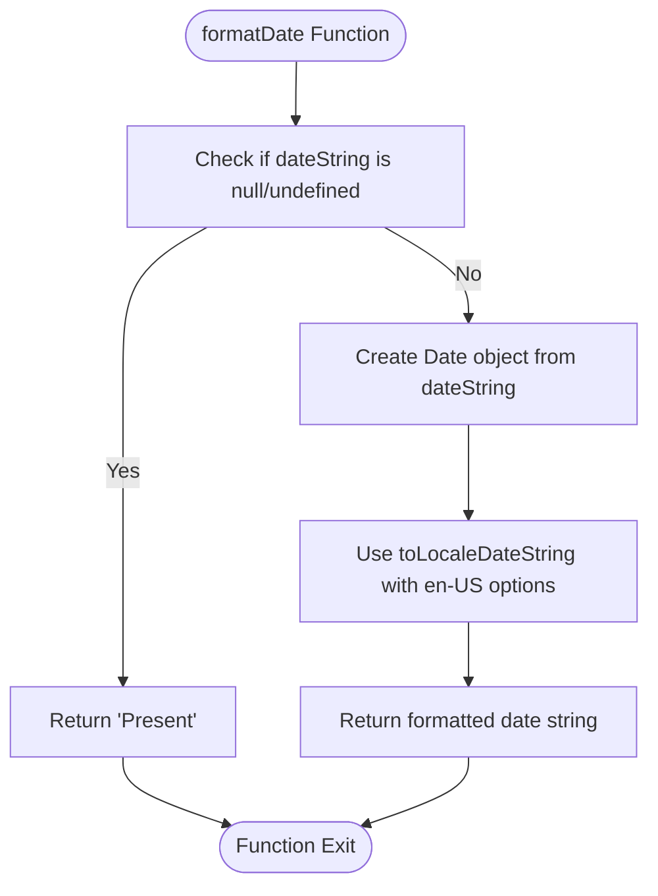
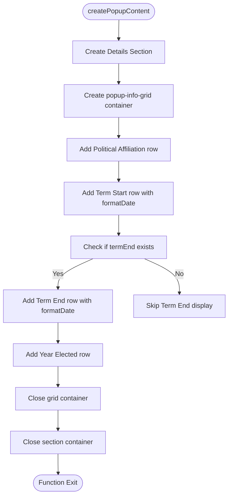
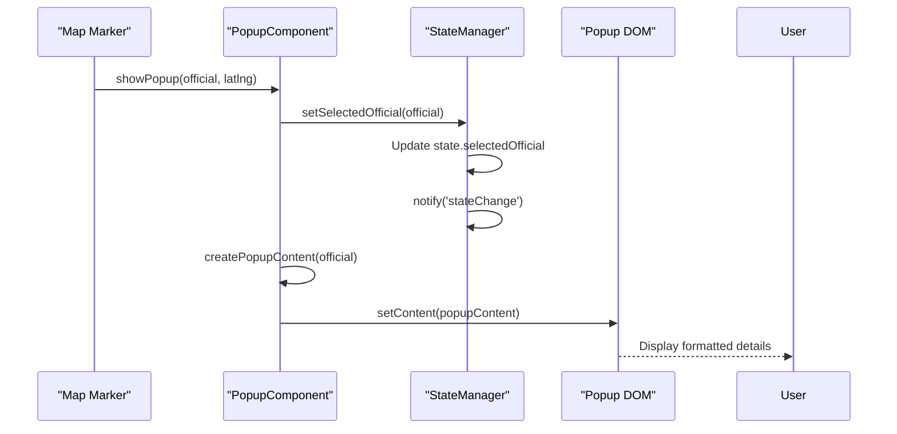
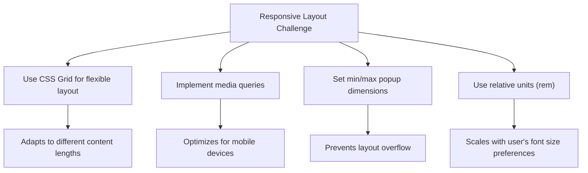

# Term Dates and Official Details

<cite>
**Referenced Files in This Document**   
- [popup-component.js](file://js/popup-component.js)
- [state-manager.js](file://js/state-manager.js)
- [styles.css](file://css/styles.css)
</cite>

## Table of Contents
1. [Introduction](#introduction)
2. [Date Formatting Implementation](#date-formatting-implementation)
3. [Official Details Display](#official-details-display)
4. [Data Flow and State Management](#data-flow-and-state-management)
5. [Common Issues and Solutions](#common-issues-and-solutions)
6. [Performance Considerations](#performance-considerations)

## Introduction
This document details the implementation of term date formatting and official details display in the popup component of the Democratic Socialist Officials Map application. The system handles the presentation of key information including term dates, political affiliation, office level, and year elected in a structured, accessible format. The implementation focuses on proper date formatting, data sanitization, and responsive design to ensure a consistent user experience across different devices and data scenarios.

## Date Formatting Implementation

The `formatDate` function is responsible for converting ISO date strings into human-readable formats for display in the popup. The function handles both regular dates and the special case of ongoing terms where the end date is null.

**Diagram sources**
- [popup-component.js](file://js/popup-component.js#L13-L21)

The function implements the following logic:
- When no date string is provided (null or undefined), it returns 'Present' to indicate an ongoing term
- For valid ISO date strings, it creates a Date object and uses the `toLocaleDateString` method with specific formatting options
- The formatting options specify 'en-US' locale with numeric year, long month name, and numeric day

This implementation ensures consistent date formatting across different browsers and user locales while properly handling the special case of officials currently in office with no end date specified.

**Section sources**
- [popup-component.js](file://js/popup-component.js#L13-L21)

## Official Details Display

The official details are displayed in a structured grid layout using the `popup-info-grid` CSS class. This grid presents key information in a clear, organized manner with label-value pairs.

**Diagram sources**
- [popup-component.js](file://js/popup-component.js#L110-L130)
- [styles.css](file://css/styles.css#L456-L471)

The grid layout displays the following information:
- Political Affiliation: Extracted from the official object and properly escaped
- Term Start: Formatted using the formatDate function
- Term End: Conditionally displayed only if the end date exists, formatted with formatDate
- Year Elected: Displayed as a numeric value

The CSS implementation uses a grid layout with two columns:
- First column (auto width) for labels with bold font weight and secondary color
- Second column (flexible width) for values with standard text color

This creates a clean, aligned presentation that is easy to scan and read.

**Section sources**
- [popup-component.js](file://js/popup-component.js#L110-L130)
- [styles.css](file://css/styles.css#L456-L471)

## Data Flow and State Management

The popup component is tightly integrated with the StateManager, which maintains the application's state including the selected official. When a user interacts with the map, the selected official's data flows through this system to populate the popup.

**Diagram sources**
- [popup-component.js](file://js/popup-component.js#L200-L233)
- [state-manager.js](file://js/state-manager.js#L164-L167)

The data flow works as follows:
1. When a user clicks on a map marker, the `showPopup` function is called with the official object and coordinates
2. The popup component calls `StateManager.setSelectedOfficial(official)` to update the application state
3. The StateManager notifies all subscribers of the state change
4. The popup component calls `createPopupContent(official)` to generate the HTML content
5. The content is set on the Leaflet popup and displayed to the user

All data is extracted directly from the official object passed to the popup component. The implementation includes proper escaping of HTML content using the `escapeHtml` utility function to prevent XSS vulnerabilities.

**Section sources**
- [popup-component.js](file://js/popup-component.js#L28-L182)
- [state-manager.js](file://js/state-manager.js#L164-L175)

## Common Issues and Solutions

### Date Formatting Inconsistencies
The application ensures consistent date formatting by:
- Using `toLocaleDateString` with explicit formatting options
- Validating date strings in the DataLoader module before they reach the popup
- Providing a fallback 'Present' value for null end dates

### Missing Data Handling
The implementation gracefully handles missing data:
- Conditional rendering of the Term End field only when `termEnd` exists
- Using the `escapeHtml` function to handle potentially null or undefined string values
- Validating required fields in the DataLoader module

### Responsive Layout Challenges
The CSS implementation addresses responsive design:
- Using CSS Grid with flexible column sizing
- Implementing media queries to adjust popup dimensions on smaller screens
- Setting minimum and maximum widths on the Leaflet popup configuration
- Using relative units (rem) for spacing and typography

**Diagram sources**
- [styles.css](file://css/styles.css#L610-L680)
- [popup-component.js](file://js/popup-component.js#L217-L220)

**Section sources**
- [styles.css](file://css/styles.css#L610-L680)
- [popup-component.js](file://js/popup-component.js#L217-L220)

## Performance Considerations

When formatting dates at scale, several performance considerations are addressed:

### Date Formatting Efficiency
- The `formatDate` function is simple and fast, with minimal operations
- Date formatting is only performed when a popup is created, not during data loading
- The function is called at most twice per popup (for start and end dates)

### Memory Usage
- Date objects are created and garbage collected within the function scope
- No caching of formatted dates is needed due to the relatively small number of officials
- The implementation avoids memory leaks by properly managing popup references

### Rendering Performance
- The popup content is generated synchronously when needed
- HTML escaping is performed efficiently using the DOM's textContent property
- The grid layout is optimized for fast rendering by modern browsers

The current implementation is optimized for the expected use case where users view one popup at a time. For scenarios with many simultaneous popups, additional optimizations such as date formatting caching could be considered, but this is not necessary given the application's usage patterns.

**Section sources**
- [popup-component.js](file://js/popup-component.js#L13-L21)
- [popup-component.js](file://js/popup-component.js#L190-L194)