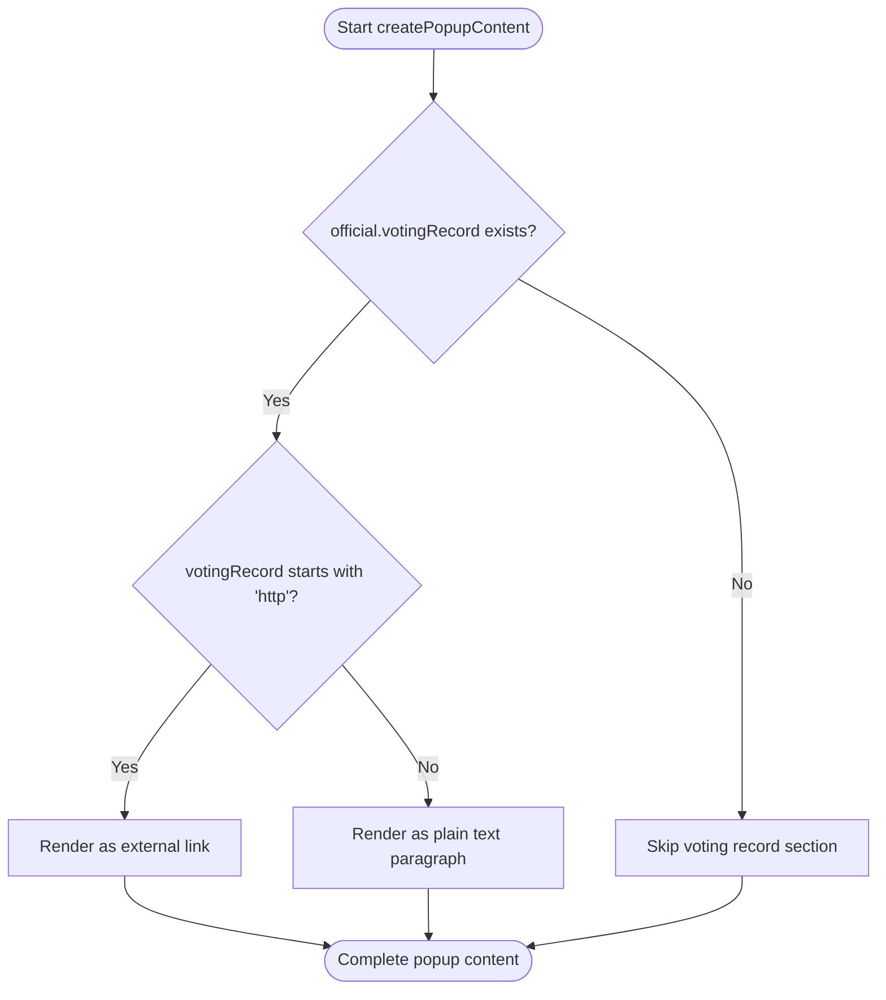
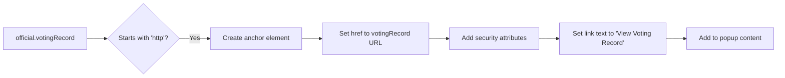
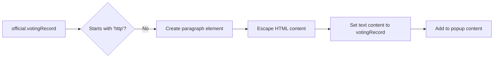
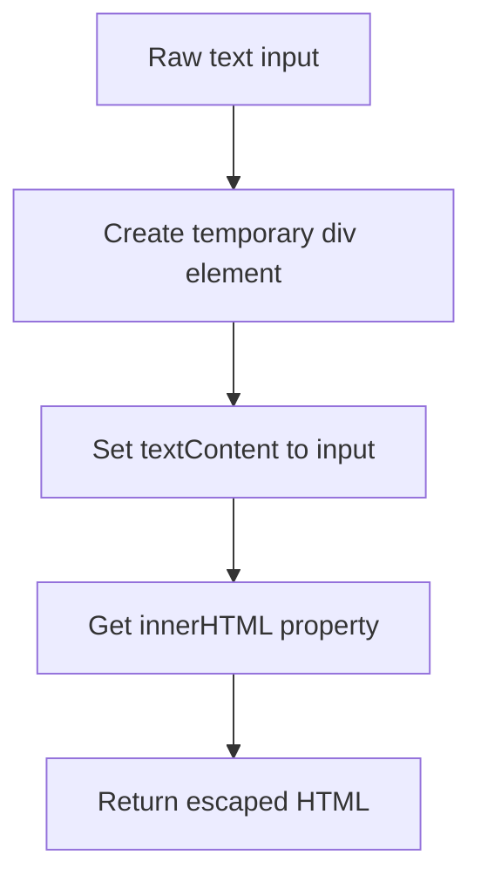

# Voting Record Presentation

<cite>
**Referenced Files in This Document**   
- [popup-component.js](file://js/popup-component.js)
- [officials.json](file://data/officials.json)
</cite>

## Table of Contents
1. [Introduction](#introduction)
2. [Core Implementation Logic](#core-implementation-logic)
3. [Conditional Rendering Strategy](#conditional-rendering-strategy)
4. [Security and Accessibility Considerations](#security-and-accessibility-considerations)
5. [Data Source Examples](#data-source-examples)
6. [Common Issues and Solutions](#common-issues-and-solutions)
7. [Best Practices](#best-practices)
8. [Performance Considerations](#performance-considerations)

## Introduction

The voting record presentation feature in the official popup provides users with access to elected officials' voting histories through a dual implementation approach. This documentation details how the system conditionally renders voting record information based on whether the data source contains a URL or plain text content. The implementation prioritizes security, accessibility, and user experience while maintaining flexibility for different data formats in the source JSON.

## Core Implementation Logic

The voting record presentation is handled within the `createPopupContent` function in the popup component, which processes official data and generates HTML content for display. The core logic evaluates the `votingRecord` field from the official object and applies different rendering strategies based on its content type.

**Diagram sources**
- [popup-component.js](file://js/popup-component.js#L147-L160)

**Section sources**
- [popup-component.js](file://js/popup-component.js#L28-L182)

## Conditional Rendering Strategy

The system implements a conditional rendering strategy that automatically detects the content type of the voting record field and presents it appropriately:

### URL Detection and External Link Rendering
When the `votingRecord` field contains a URL (detected by checking if the string starts with "http"), the system renders it as an external link. This approach is used for officials whose voting records are hosted on external websites such as congressional databases.

### Plain Text Rendering
When the `votingRecord` field contains plain text rather than a URL, the system displays it within a paragraph element. This approach is suitable for presenting summarized voting information or when external links are not available.

**Diagram sources**
- [popup-component.js](file://js/popup-component.js#L151-L157)

## Security and Accessibility Considerations

### Security Attributes for External Links
When rendering external links, the system applies critical security attributes to protect users:

- `target="_blank"`: Opens the link in a new tab/window
- `rel="noopener noreferrer"`: Prevents the new page from accessing the window.opener property and ensures it runs in a separate process, mitigating security risks and performance issues

These attributes are essential for preventing potential security vulnerabilities such as tabnabbing attacks and ensuring that the main application remains performant when external sites are opened.

### Content Sanitization
All content, including voting record text, is processed through the `escapeHtml` function before being inserted into the DOM. This function creates a temporary DOM element, sets its textContent to the input string, and returns the escaped HTML, effectively preventing XSS (Cross-Site Scripting) attacks.

**Diagram sources**
- [popup-component.js](file://js/popup-component.js#L189-L193)

### Accessibility Features
The implementation includes accessibility considerations for screen reader users:

- External links include appropriate context in their presentation
- The "View Voting Record" link text provides clear purpose
- All interactive elements maintain proper focus states
- The popup structure follows semantic HTML principles

**Section sources**
- [popup-component.js](file://js/popup-component.js#L189-L193)

## Data Source Examples

The system accommodates different data source patterns as demonstrated in the officials.json file:

### External URL Examples
Several federal officials have voting records linked to external congressional databases:

- Alexandria Ocasio-Cortez: `https://www.congress.gov/member/alexandria-ocasio-cortez/O000172`
- Bernie Sanders: `https://www.congress.gov/member/bernard-sanders/S000033`
- Summer Lee: `https://www.congress.gov/member/summer-lee/L000605`

These entries trigger the external link rendering pathway.

### Null or Absent Values
Many state and local officials have null voting record values, which results in the voting record section being omitted entirely from their popup display.

**Section sources**
- [officials.json](file://data/officials.json#L32-L488)

## Common Issues and Solutions

### Broken URLs
When external voting record links become outdated or broken:

**Solution**: Implement periodic validation of external URLs through automated checks or establish a process for community reporting of broken links. Consider implementing HTTP status checking when the popup is rendered to detect broken links.

### Mixed Content Security Warnings
If HTTP (non-secure) URLs are used in an HTTPS application:

**Solution**: Ensure all external voting record URLs use HTTPS protocol. Implement a preprocessing step that upgrades HTTP URLs to HTTPS when possible, or flag HTTP URLs for review.

### Large Text Content Display
When voting records contain extensive text that could overwhelm the popup:

**Solution**: Implement text truncation with a "Read more" expandable section, or provide a summary with a link to full details. Consider character limits in the data source or implement responsive design that adjusts based on content length.

## Best Practices

### Data Source Formatting
For optimal presentation, follow these guidelines when formatting voting records in the data source:

- Use external URLs when comprehensive voting records are available online
- Provide meaningful, concise text summaries when external links are not available
- Ensure all URLs use HTTPS protocol for security
- Keep plain text voting records focused and relevant (under 500 characters recommended)
- Use null values rather than empty strings when no voting record information is available

### Implementation Consistency
Maintain consistency across the application by:

- Following the same pattern for other external resources
- Using consistent link styling and behavior
- Applying the same HTML escaping to all user-visible content
- Maintaining uniform accessibility attributes across all interactive elements

## Performance Considerations

The voting record presentation implementation is designed with performance in mind:

- The conditional check for URL detection is a simple string operation with minimal overhead
- HTML escaping is performed efficiently using the browser's built-in textContent mechanism
- No additional network requests are made when rendering the popup (external links are only followed when clicked)
- The implementation avoids complex DOM operations or JavaScript frameworks for this specific feature

For large datasets, consider lazy-loading voting record details only when the popup is opened, rather than including all content in the initial data load. This approach would reduce initial payload size while maintaining quick popup rendering.

**Section sources**
- [popup-component.js](file://js/popup-component.js#L28-L182)
- [popup-component.js](file://js/popup-component.js#L189-L193)