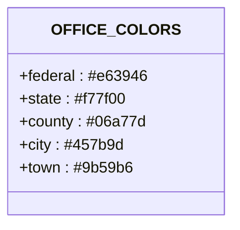
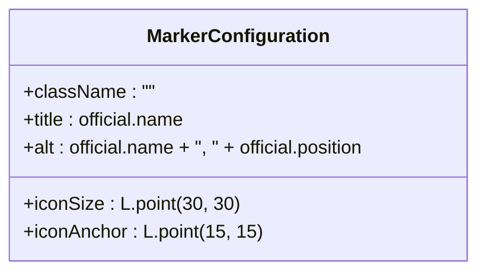
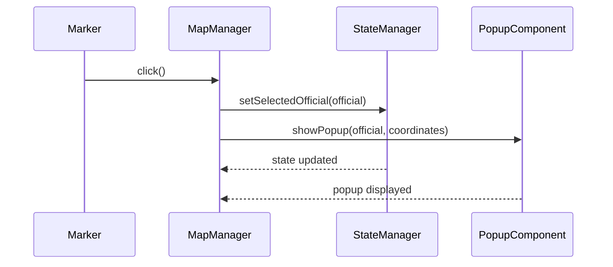

# Custom Marker Styling

<cite>
**Referenced Files in This Document**   
- [map-manager.js](file://js/map-manager.js)
- [state-manager.js](file://js/state-manager.js)
- [popup-component.js](file://js/popup-component.js)
- [styles.css](file://css/styles.css)
- [officials.json](file://data/officials.json)
</cite>

## Table of Contents
1. [Introduction](#introduction)
2. [Core Components](#core-components)
3. [Marker Styling Implementation](#marker-styling-implementation)
4. [OFFICE_COLORS Constant](#office_colors-constant)
5. [Marker HTML Structure](#marker-html-structure)
6. [Marker Configuration](#marker-configuration)
7. [Component Relationships](#component-relationships)
8. [Common Issues and Troubleshooting](#common-issues-and-troubleshooting)
9. [Performance Considerations](#performance-considerations)
10. [Best Practices for Extending Styling](#best-practices-for-extending-styling)

## Introduction

This document provides a comprehensive analysis of the custom marker styling implementation in the MapManager module of the Democratic Socialist Officials Map application. The system creates personalized markers for elected officials based on their office level, using a combination of JavaScript and CSS to generate visually distinct markers that help users quickly identify the jurisdictional level of each official. The implementation leverages the Leaflet mapping library to create custom L.DivIcon instances that display the official's first initial within a colored circle, with colors determined by the official's office level (federal, state, county, city, or town).

The marker styling system is tightly integrated with the application's state management and popup components, creating a cohesive user experience where clicking on a marker updates the application state and displays detailed information about the official. This documentation will explore the technical implementation of the marker styling, including the createMarkerIcon function, the OFFICE_COLORS constant, the dynamic HTML structure of markers, and the relationships between this feature and other components in the application.

**Section sources**
- [map-manager.js](file://js/map-manager.js#L89-L101)
- [styles.css](file://css/styles.css#L532-L574)

## Core Components

The custom marker styling functionality is implemented across several core components in the application, with the MapManager module serving as the central coordinator. The MapManager is responsible for initializing the Leaflet map, creating and managing markers, and handling user interactions with the map. It works in conjunction with the StateManager, which maintains the application state including the currently selected official and filtered officials, and the PopupComponent, which displays detailed information about officials when their markers are clicked.

The createMarkerIcon function in the MapManager module is the heart of the custom marker styling system. This function takes an official object as input and returns a Leaflet L.DivIcon instance with custom styling based on the official's office level. The styling is determined by the OFFICE_COLORS constant, which maps each office level to a specific color value. The function generates HTML for the marker that includes the official's first initial within a colored circle, with CSS classes that allow for additional styling through the application's stylesheet.

The integration between these components enables a seamless user experience where selecting an official on the map automatically updates the application state and displays a popup with detailed information about the official. This coordinated behavior is achieved through event subscriptions and function calls between the components, with the MapManager handling marker clicks by updating the StateManager and triggering the PopupComponent to display information.

**Section sources**
- [map-manager.js](file://js/map-manager.js#L4-L264)
- [state-manager.js](file://js/state-manager.js#L4-L257)
- [popup-component.js](file://js/popup-component.js#L4-L263)

## Marker Styling Implementation

The custom marker styling implementation is centered around the createMarkerIcon function in the MapManager module. This function generates personalized L.DivIcon instances for each official based on their officeLevel property. When called, the function first retrieves the appropriate color from the OFFICE_COLORS constant using the official's officeLevel as a key. If no matching color is found, it defaults to a standard blue color (#457b9d).

The function then extracts the first initial of the official's name and converts it to uppercase. Using these values, it creates a Leaflet L.DivIcon with custom HTML that displays the initial within a colored circle. The HTML structure includes a div element with CSS classes 'custom-marker' and 'marker-{officeLevel}' where {officeLevel} is replaced with the actual office level (e.g., 'marker-federal', 'marker-state'). This class structure allows for both general marker styling and office-level-specific styling through CSS.

The function returns the configured L.DivIcon instance, which is then used when creating the actual Leaflet marker. This approach allows for highly customizable markers while maintaining a clean separation between the JavaScript logic and CSS styling. The use of inline styles for border-color and background-color ensures that the marker's appearance is consistent regardless of the current CSS theme, while the CSS classes provide additional styling capabilities for hover effects, animations, and responsive design.

```mermaid
flowchart TD
A[Official Object] --> B{createMarkerIcon}
B --> C[Get OFFICE_COLORS[officeLevel]]
C --> D[Get First Initial]
D --> E[Create L.DivIcon]
E --> F[Set HTML with colored circle]
F --> G[Set iconSize and iconAnchor]
G --> H[Return L.DivIcon]
```

**Diagram sources**
- [map-manager.js](file://js/map-manager.js#L89-L101)

**Section sources**
- [map-manager.js](file://js/map-manager.js#L89-L101)

## OFFICE_COLORS Constant

The OFFICE_COLORS constant is a JavaScript object that maps office levels to specific color values used in marker styling. Defined in the MapManager module, this constant serves as the central color palette for the application's marker system. It contains five key-value pairs corresponding to the different office levels supported by the application: federal, state, county, city, and town.

Each office level is assigned a distinct color that provides visual differentiation while maintaining a cohesive color scheme. The federal level is assigned a bold red (#e63946), state level uses an orange (#f77f00), county level uses a green (#06a77d), city level uses a blue (#457b9d), and town level uses a purple (#9b59b6). These colors were selected to provide good contrast against the map background while ensuring accessibility for users with color vision deficiencies.

The OFFICE_COLORS constant is used exclusively by the createMarkerIcon function to determine the border and background colors of each marker. This centralized approach to color management makes it easy to modify the color scheme by updating a single object rather than searching through multiple files. The constant is also mirrored in the CSS stylesheet through CSS variables (--federal-color, --state-color, etc.), ensuring consistency between the JavaScript-generated inline styles and the CSS class-based styles.



**Diagram sources**
- [map-manager.js](file://js/map-manager.js#L21-L26)

**Section sources**
- [map-manager.js](file://js/map-manager.js#L21-L26)
- [styles.css](file://css/styles.css#L14-L18)

## Marker HTML Structure

The dynamic HTML structure of the markers is generated by the createMarkerIcon function and consists of a div element with specific classes and inline styles. The HTML template uses string interpolation to dynamically insert the office level and color values based on the official's data. The structure follows a consistent pattern: a div with class 'custom-marker' and a dynamically generated class 'marker-{officeLevel}', with inline styles for border-color and background-color.

The 'custom-marker' class provides the base styling for all markers, including the circular shape (border-radius: 50%), fixed dimensions (30x30 pixels), and center-aligned text. The 'marker-{officeLevel}' class applies office-level-specific styling, primarily by setting the text color to white for better contrast against the colored background. This two-class approach allows for both shared styling across all markers and specific styling for each office level.

The HTML structure also includes the official's first initial as the content of the div, centered both vertically and horizontally using flexbox properties. This creates a clean, minimalist design that clearly displays the most important identifying information about the official. The use of inline styles for colors ensures that the marker's appearance is immediately visible even before the CSS stylesheet is fully loaded, while the CSS classes provide additional styling capabilities for interactive states like hover and focus.

```mermaid
flowchart TD
A[div] --> B[Class: custom-marker]
A --> C[Class: marker-{officeLevel}]
A --> D[Style: border-color: {color}]
A --> E[Style: background-color: {color}]
A --> F[Content: {firstInitial}]
```

**Diagram sources**
- [map-manager.js](file://js/map-manager.js#L94-L97)
- [styles.css](file://css/styles.css#L532-L574)

**Section sources**
- [map-manager.js](file://js/map-manager.js#L94-L97)
- [styles.css](file://css/styles.css#L532-L574)

## Marker Configuration

The marker properties such as iconSize and iconAnchor are configured within the createMarkerIcon function to ensure proper positioning and display on the map. The iconSize is set to 30x30 pixels using Leaflet's L.point(30, 30) method, which creates a fixed-size icon that maintains its dimensions regardless of the map's zoom level. This size was chosen as a balance between visibility and map clutter, allowing multiple markers to be displayed in close proximity without overlapping excessively.

The iconAnchor is set to L.point(15, 15), which positions the marker's anchor point at the center of the 30x30 pixel icon. This configuration ensures that the marker is positioned precisely at the official's geographic coordinates, with the center of the marker circle aligning with the latitude and longitude. The anchor point is critical for accurate placement, especially when users zoom in to view markers in densely populated areas.

Additional configuration options include setting the className to an empty string to avoid Leaflet's default styling, which could interfere with the custom CSS. The function also sets the title attribute to the official's name and the alt attribute to include both the name and position, improving accessibility for screen readers and providing tooltip text when users hover over the marker. These configuration settings work together to create markers that are visually appealing, accurately positioned, and accessible to all users.



**Diagram sources**
- [map-manager.js](file://js/map-manager.js#L99-L100)

**Section sources**
- [map-manager.js](file://js/map-manager.js#L99-L100)

## Component Relationships

The custom marker styling feature is closely integrated with the StateManager and PopupComponent, creating a cohesive user experience. When a user clicks on a marker, the MapManager's handleMarkerClick function is triggered, which updates the StateManager by calling setSelectedOfficial with the clicked official's data. This state update triggers any components subscribed to state changes, ensuring that the application's UI remains synchronized.

The handleMarkerClick function also calls the PopupComponent's showPopup method, passing the official's data and coordinates. This displays a detailed popup with information about the official, including their biography, contact information, and committee memberships. The PopupComponent uses the same official data that was stored in the StateManager, ensuring consistency across the application.

This relationship between components follows a clear pattern of responsibility: the MapManager handles map-related functionality and user interactions with markers, the StateManager maintains the application state, and the PopupComponent handles the display of detailed information. This separation of concerns makes the codebase more maintainable and allows each component to be modified or replaced independently. The components communicate through well-defined interfaces (function calls and event subscriptions), reducing coupling and making the system more robust.



**Diagram sources**
- [map-manager.js](file://js/map-manager.js#L145-L156)
- [state-manager.js](file://js/state-manager.js#L164-L166)
- [popup-component.js](file://js/popup-component.js#L201-L227)

**Section sources**
- [map-manager.js](file://js/map-manager.js#L145-L156)
- [state-manager.js](file://js/state-manager.js#L164-L166)
- [popup-component.js](file://js/popup-component.js#L201-L227)

## Common Issues and Troubleshooting

One common issue with the marker system is missing markers due to invalid or missing coordinates in the official data. This occurs when an official's location object lacks valid latitude and longitude values, causing the addMarkers function to skip creating a marker for that official. To troubleshoot this issue, developers should verify that the official data in officials.json contains valid coordinates for each entry.

Another potential issue is incorrect marker colors when an official has an invalid officeLevel value. Since the createMarkerIcon function uses the officeLevel as a key to look up colors in the OFFICE_COLORS constant, any officeLevel that doesn't match the expected values (federal, state, county, city, town) will result in the default color being used. This can be diagnosed by checking the console for any warnings about invalid office levels and validating the data against the VALID_OFFICE_LEVELS array in the DataLoader module.

Performance issues may arise when displaying a large number of markers, particularly on lower-powered devices. The current implementation uses Leaflet's marker clustering to mitigate this, but in extreme cases, the application may become sluggish. Monitoring the number of markers and considering alternative visualization methods (like the heatmap view) for large datasets can help maintain performance. Additionally, ensuring that markers are properly removed from the map when not needed (through the clearMarkers function) prevents memory leaks and maintains optimal performance.

**Section sources**
- [map-manager.js](file://js/map-manager.js#L115-L116)
- [data-loader.js](file://js/data-loader.js#L1-L23)
- [map-manager.js](file://js/map-manager.js#L162-L164)

## Performance Considerations

The marker rendering system includes several performance optimizations to ensure smooth operation even with large datasets. The primary optimization is the use of Leaflet.markerClusterGroup, which automatically groups nearby markers into clusters when the map is zoomed out. This significantly reduces the number of DOM elements on the page, improving rendering performance and preventing browser slowdowns.

The clustering configuration is optimized with a maxClusterRadius of 60 pixels and different cluster sizes based on the number of markers (small, medium, large). This provides a good balance between information density and visual clarity. When users zoom in, the clusters "spiderfy" to reveal individual markers, providing a smooth transition between overview and detailed views.

Additional performance considerations include the use of efficient data structures like the Map object to store marker references by official ID, allowing for O(1) lookup times when retrieving markers. The addMarkers function clears existing markers before adding new ones, preventing duplicate markers from accumulating in the DOM. The implementation also uses event delegation through Leaflet's built-in event system rather than attaching individual event listeners to each marker, reducing memory usage and improving event handling performance.

For very large datasets, the application provides a heatmap view alternative that visualizes official density rather than individual markers. This view is more performant for large datasets and provides different insights into the geographic distribution of officials. The ability to switch between markers and heatmap views allows users to choose the most appropriate visualization based on their needs and the current dataset size.

**Section sources**
- [map-manager.js](file://js/map-manager.js#L49-L70)
- [map-manager.js](file://js/map-manager.js#L108-L110)
- [map-manager.js](file://js/map-manager.js#L162-L164)

## Best Practices for Extending Styling

When extending the marker styling system with new office levels or visual variants, several best practices should be followed to maintain code quality and consistency. First, any new office levels should be added to both the OFFICE_COLORS constant in map-manager.js and the corresponding CSS variables and classes in styles.css. This ensures that the new office level has a consistent color across both JavaScript-generated inline styles and CSS-based styles.

For new visual variants, such as different marker shapes or additional visual indicators, it's recommended to create new CSS classes rather than modifying the existing ones. This approach maintains backward compatibility and allows for multiple visual styles to coexist. For example, a new "priority" variant could be implemented by adding a marker-priority class that changes the marker border to a dashed line or adds a star icon.

When adding new office levels, developers should also update the VALID_OFFICE_LEVELS array in the DataLoader module to include the new level. This ensures that officials with the new office level are properly validated when loaded from the data source. Additionally, any new colors should be tested for accessibility, ensuring sufficient contrast against both the marker background and the map tiles.

Finally, when making changes to the marker styling, it's important to test the markers at various zoom levels and in different geographic densities to ensure they remain readable and don't cause performance issues. The marker clustering behavior should also be tested to ensure that new marker styles are properly represented in cluster icons. Following these best practices will help maintain a high-quality, accessible, and performant marker system as the application evolves.

**Section sources**
- [map-manager.js](file://js/map-manager.js#L21-L26)
- [styles.css](file://css/styles.css#L14-L18)
- [data-loader.js](file://js/data-loader.js#L1-L23)