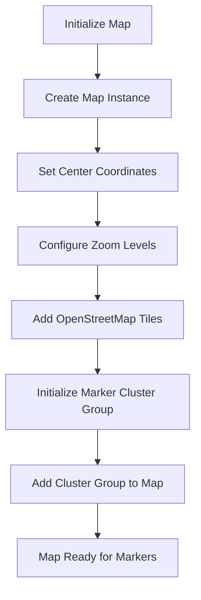
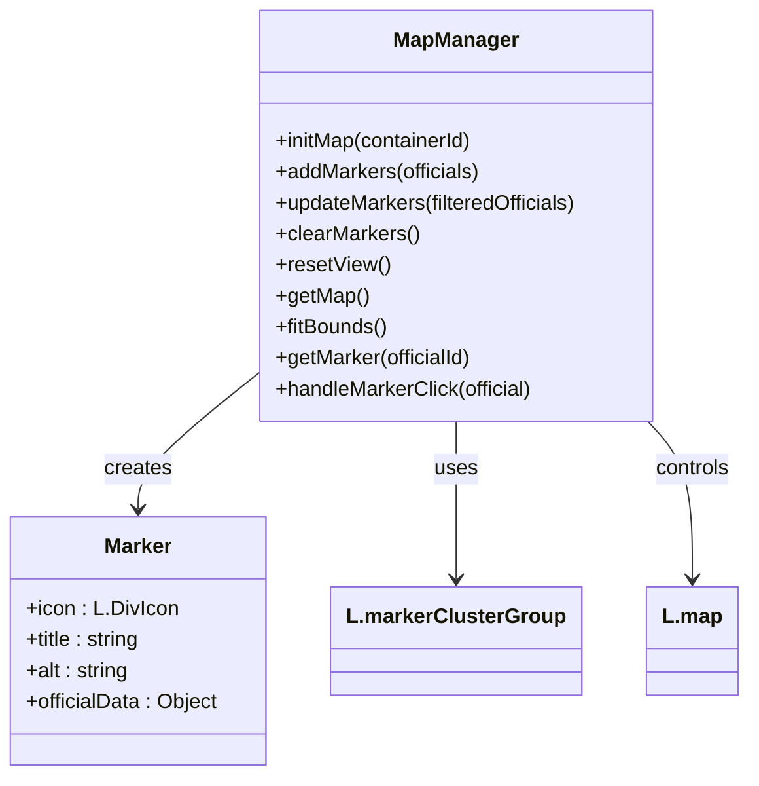
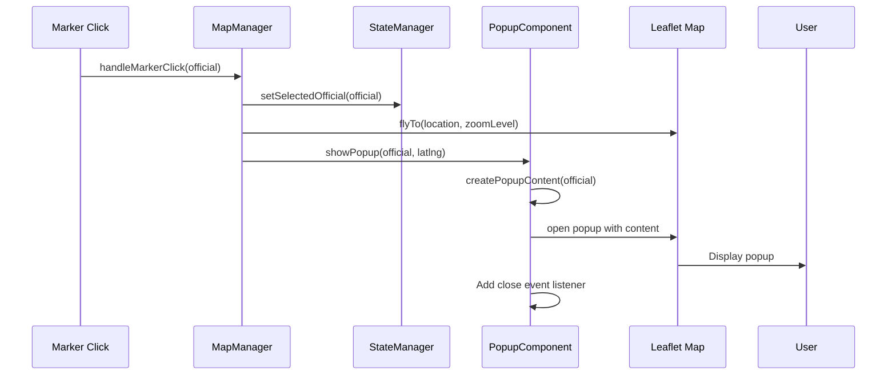
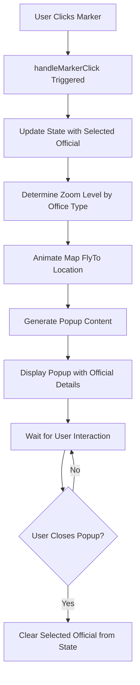
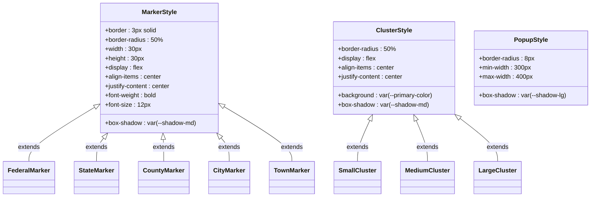

# Interactive Map Display

<cite>
**Referenced Files in This Document**   
- [map-manager.js](file://js/map-manager.js)
- [popup-component.js](file://js/popup-component.js)
- [app.js](file://js/app.js)
- [index.html](file://index.html)
- [styles.css](file://css/styles.css)
</cite>

## Table of Contents
1. [Introduction](#introduction)
2. [Core Components](#core-components)
3. [Map Initialization and Configuration](#map-initialization-and-configuration)
4. [Marker Management](#marker-management)
5. [Popup System](#popup-system)
6. [Interaction Flow](#interaction-flow)
7. [Styling and Visual Design](#styling-and-visual-design)
8. [Common Issues and Solutions](#common-issues-and-solutions)

## Introduction
The Interactive Map Display feature provides a visual representation of democratic socialist officials across the United States. Built on Leaflet.js, this component enables users to explore elected officials through an intuitive map interface with clustering, filtering, and detailed information popups. The system integrates seamlessly with the application's state management and data loading components to provide a responsive and accessible user experience.

## Core Components
The interactive map functionality is implemented through two primary components: MapManager and PopupComponent. MapManager handles all map-related operations including initialization, marker rendering, and clustering, while PopupComponent manages the display of detailed information about officials when their markers are clicked. These components work in conjunction with the application's state management system to ensure synchronized behavior across the UI.

**Section sources**
- [map-manager.js](file://js/map-manager.js#L1-L216)
- [popup-component.js](file://js/popup-component.js#L1-L262)

## Map Initialization and Configuration
The map is initialized through the `initMap` method of the MapManager module, which creates a Leaflet map instance centered on the geographic center of the continental United States. The map is configured with specific parameters including minimum and maximum zoom levels (3 and 18 respectively), an initial zoom level of 4, and OpenStreetMap tile layers for the base map imagery. The map container is identified by the ID 'map', which corresponds to the HTML element in the page structure.

**Diagram sources**
- [map-manager.js](file://js/map-manager.js#L30-L75)

## Marker Management
The MapManager module handles the creation, display, and interaction of markers representing officials on the map. Each marker is customized based on the official's office level, with distinct colors and styling defined in the OFFICE_COLORS constant. The system uses Leaflet's MarkerClusterGroup to group nearby markers, improving usability when multiple officials are located in close proximity. The clustering configuration includes a maximum cluster radius of 60 pixels and different visual sizes for clusters based on the number of contained markers.

**Diagram sources**
- [map-manager.js](file://js/map-manager.js#L77-L216)

## Popup System
The PopupComponent module manages the display of detailed information about officials when their markers are clicked. When a marker is clicked, the system creates a popup containing comprehensive information including the official's name, position, political affiliation, contact information, biography, and other relevant details. The popup content is generated dynamically from the official's data object, with proper HTML escaping to prevent XSS vulnerabilities. The popup includes interactive elements such as email links, phone links, and website links for easy communication.

**Diagram sources**
- [popup-component.js](file://js/popup-component.js#L196-L262)
- [map-manager.js](file://js/map-manager.js#L135-L150)

## Interaction Flow
The interaction flow begins when a user clicks on a marker on the map. This triggers the handleMarkerClick function in MapManager, which updates the application state to reflect the selected official, animates the map to zoom to the official's location with an appropriate zoom level based on their office type, and calls the PopupComponent to display detailed information. The zoom levels are predefined based on office type, with federal and state officials showing at zoom level 7, county officials at level 9, city officials at level 11, and town officials at level 12.

**Diagram sources**
- [map-manager.js](file://js/map-manager.js#L135-L150)
- [popup-component.js](file://js/popup-component.js#L201-L234)

## Styling and Visual Design
The visual design of the map components is implemented through CSS variables and custom styling. Marker icons are styled as circular elements with a border and background color corresponding to the official's office level, with the first initial of the official's name displayed inside. Cluster markers display the count of officials within the cluster and are sized according to the number of contained markers. The popup design features a gradient header, organized content sections, and responsive layout that adapts to different screen sizes.

**Diagram sources**
- [styles.css](file://css/styles.css#L473-L516)
- [map-manager.js](file://js/map-manager.js#L83-L95)

## Common Issues and Solutions
Several common issues may arise with the interactive map display and can be addressed through specific solutions:

1. **Map not initializing**: Ensure the DOM is fully loaded before calling initMap, as the map container element must exist in the document. The application handles this by calling initialization within the DOMContentLoaded event.

2. **Markers not appearing**: Verify that official data contains valid latitude and longitude values, as markers are only created for officials with location coordinates. The system includes validation to check for these values before creating markers.

3. **Popup not displaying**: Confirm that the map instance is available by calling getMap() before attempting to show a popup. The PopupComponent includes error handling to log when the map is not initialized.

4. **Performance issues with many markers**: The marker clustering system automatically groups nearby markers to improve performance and usability. The cluster radius is set to 60 pixels to balance detail and performance.

5. **Responsive design issues**: The CSS includes media queries to adjust the layout for mobile devices, where the filter panel becomes a collapsible element that slides up from the bottom of the screen.

**Section sources**
- [map-manager.js](file://js/map-manager.js#L106-L130)
- [popup-component.js](file://js/popup-component.js#L202-L206)
- [styles.css](file://css/styles.css#L552-L613)