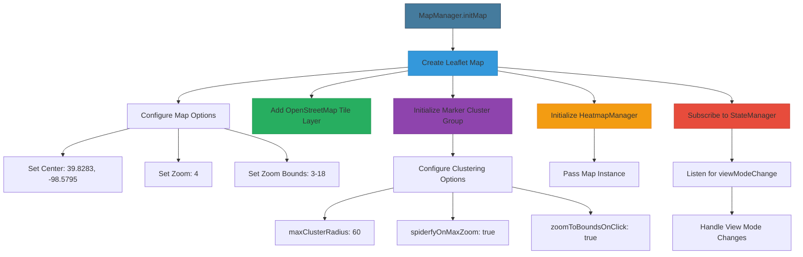
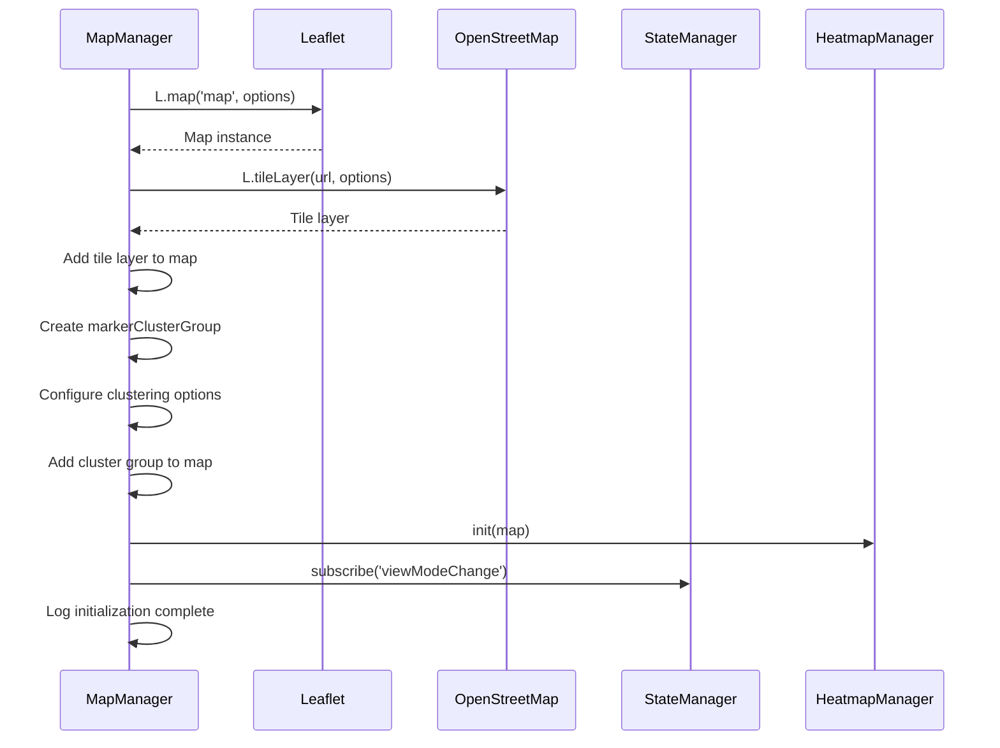
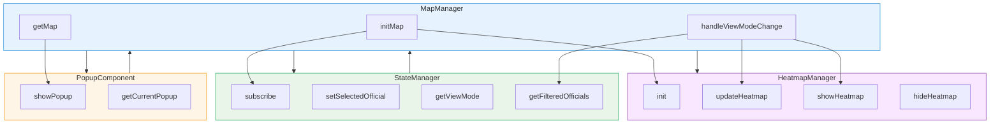

# Map Initialization

<cite>
**Referenced Files in This Document**   
- [map-manager.js](file://js/map-manager.js)
- [state-manager.js](file://js/state-manager.js)
- [popup-component.js](file://js/popup-component.js)
- [heatmap-manager.js](file://js/heatmap-manager.js)
- [index.html](file://index.html)
</cite>

## Table of Contents
1. [Map Initialization](#map-initialization)
2. [Core Components](#core-components)
3. [Architecture Overview](#architecture-overview)
4. [Detailed Component Analysis](#detailed-component-analysis)
5. [Dependency Analysis](#dependency-analysis)
6. [Performance Considerations](#performance-considerations)
7. [Troubleshooting Guide](#troubleshooting-guide)

## Core Components

The map initialization process is centered around the `initMap` function within the `MapManager` module, which creates and configures a Leaflet map instance with specific settings for the application's needs. The function accepts an optional `containerId` parameter that defaults to 'map', corresponding to the HTML element where the map will be rendered. The map is initialized with center coordinates [39.8283, -98.5795], representing the geographic center of the continental United States, providing an optimal initial view for the application's focus on U.S. officials. The initial zoom level is set to 4, with boundaries constrained between a minimum zoom of 3 (showing the entire country) and a maximum zoom of 18 (allowing detailed street-level views), balancing usability with performance.

The initialization process integrates OpenStreetMap tile layers using the standard URL template 'https://{s}.tile.openstreetmap.org/{z}/{x}/{y}.png' with proper attribution to comply with OpenStreetMap's requirements. This provides a reliable, free basemap for the application. The function also initializes a marker clustering system through Leaflet's MarkerCluster plugin, configured with a maximum cluster radius of 60 pixels and spiderfication behavior at maximum zoom to handle overlapping markers effectively. The clustering system includes a custom icon creation function that dynamically sizes cluster markers based on the number of contained points, enhancing visual clarity.

**Section sources**
- [map-manager.js](file://js/map-manager.js#L33-L81)

## Architecture Overview

The map initialization process is a critical component in the application's architecture, serving as the foundation for all map-related functionality. The `MapManager` module coordinates with other key components through a well-defined interface, creating a cohesive system for displaying and interacting with official data.

**Diagram sources **
- [map-manager.js](file://js/map-manager.js#L33-L81)
- [heatmap-manager.js](file://js/heatmap-manager.js#L30-L33)
- [state-manager.js](file://js/state-manager.js#L37-L52)

## Detailed Component Analysis

### Map Initialization Process
The `initMap` function in the `MapManager` module follows a structured initialization sequence that ensures the map is properly configured before use. The process begins with creating a Leaflet map instance using `L.map(containerId, options)`, where the options object contains the initial view settings. The center coordinates [39.8283, -98.5795] are specifically chosen as they represent the geographic center of the contiguous United States, providing a balanced starting view that encompasses all states. This central location allows users to easily navigate to any region of interest without requiring excessive panning from an edge location.

**Diagram sources **
- [map-manager.js](file://js/map-manager.js#L33-L81)
- [heatmap-manager.js](file://js/heatmap-manager.js#L30-L33)
- [state-manager.js](file://js/state-manager.js#L37-L52)

#### Map Configuration Options
The map configuration includes several key parameters that define the user experience:
- **Center**: [39.8283, -98.5795] - Geographic center of the continental US
- **Initial Zoom**: 4 - Provides a national overview while maintaining readability
- **Minimum Zoom**: 3 - Prevents excessive zooming out that would reduce usability
- **Maximum Zoom**: 18 - Allows detailed street-level views when needed
- **Zoom Control**: Enabled - Provides standard zoom controls for user interaction

These settings create a balanced user experience that accommodates both broad overviews and detailed exploration. The zoom boundaries prevent users from zooming to levels where the map becomes either too abstract (zoomed out) or too granular (zoomed in) for the application's purpose of displaying elected officials.

**Section sources**
- [map-manager.js](file://js/map-manager.js#L35-L40)

#### OpenStreetMap Integration
The integration with OpenStreetMap is implemented through Leaflet's `L.tileLayer` method, which loads map tiles from the OpenStreetMap servers. The configuration includes the standard URL template with subdomain rotation ({s}) to distribute requests across multiple servers, improving performance and reliability. The attribution requirement is properly implemented with a link to OpenStreetMap's copyright page, complying with their terms of use. The tile layer is configured with a maximum zoom level of 18, matching the map's zoom constraints to ensure consistency.

**Section sources**
- [map-manager.js](file://js/map-manager.js#L43-L47)
- [index.html](file://index.html#L10-L12)

#### Marker Clustering Configuration
The marker clustering system is initialized with specific behavior settings to optimize the display of official locations:
- **maxClusterRadius**: 60 pixels - Controls the distance within which markers are grouped
- **spiderfyOnMaxZoom**: true - Enables the spiderfication effect when zoomed in fully, revealing overlapping markers
- **showCoverageOnHover**: false - Disables the coverage area visualization when hovering over clusters
- **zoomToBoundsOnClick**: true - Automatically zooms to show all markers in a cluster when clicked

The clustering system also includes a custom `iconCreateFunction` that dynamically styles cluster markers based on the number of contained points, using small, medium, and large size classes to provide visual feedback about cluster density.

**Section sources**
- [map-manager.js](file://js/map-manager.js#L50-L71)

## Dependency Analysis

The map initialization process has well-defined dependencies on several other components in the system, creating a cohesive architecture for data visualization.

**Diagram sources **
- [map-manager.js](file://js/map-manager.js#L78-L80)
- [popup-component.js](file://js/popup-component.js#L202-L207)
- [state-manager.js](file://js/state-manager.js#L243-L256)
- [heatmap-manager.js](file://js/heatmap-manager.js#L30-L33)

The `MapManager` depends on `StateManager` to receive notifications about view mode changes, allowing it to switch between marker and heatmap visualizations. It also calls `StateManager.setSelectedOfficial` when markers are clicked, updating the application state. The `PopupComponent` depends on the `MapManager` to access the map instance when displaying popups, creating a bidirectional dependency that enables coordinated user interactions.

## Performance Considerations

The map initialization process incorporates several performance optimizations to ensure a responsive user experience. The clustering system reduces the number of DOM elements rendered at higher zoom levels, preventing browser performance issues when displaying large numbers of officials. The use of OpenStreetMap's tile-based system leverages browser caching and efficient rendering of map imagery. The initialization sequence is designed to be synchronous and complete before the map becomes interactive, preventing race conditions and ensuring a consistent state.

For different use cases, the map configuration can be optimized:
- For applications with sparse data, the `maxClusterRadius` could be reduced to show more individual markers
- For applications with very dense data, the `maxClusterRadius` could be increased to create larger clusters
- The zoom boundaries can be adjusted based on the geographic scope of the data
- Alternative tile providers could be used for specialized map styles or improved performance in specific regions

## Troubleshooting Guide

Common issues during map initialization and their solutions include:

**Map Container Not Found**: This error occurs when the specified containerId does not correspond to an existing HTML element. Ensure that the element with the specified ID exists in the DOM before calling `initMap`. In this application, the default container 'map' is defined in index.html.

**Tile Loading Problems**: These can manifest as missing map tiles or slow loading. Check the browser's developer tools for network errors. Ensure that the application has internet connectivity and that the OpenStreetMap tile servers are accessible. Consider implementing a fallback tile provider for improved reliability.

**Marker Clustering Issues**: If markers are not clustering properly, verify that the Leaflet MarkerCluster plugin is correctly loaded in the HTML. Check that the clustering options are properly configured and that markers are being added to the cluster group rather than directly to the map.

**Performance Problems**: If the map is slow to respond, consider reducing the number of displayed officials through filtering, adjusting the clustering radius, or implementing lazy loading of marker data.

**Section sources**
- [map-manager.js](file://js/map-manager.js#L33-L81)
- [index.html](file://index.html#L167)
- [heatmap-manager.js](file://js/heatmap-manager.js#L55-L57)