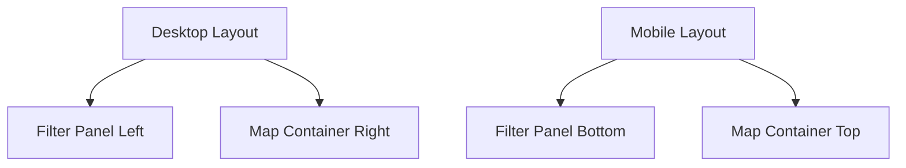
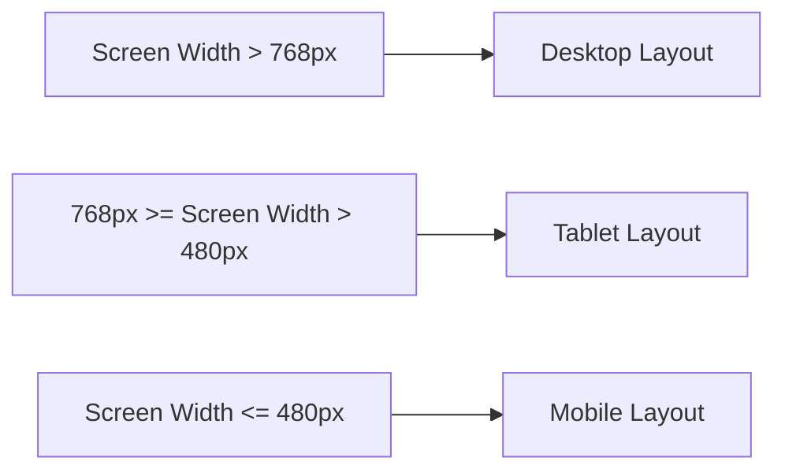
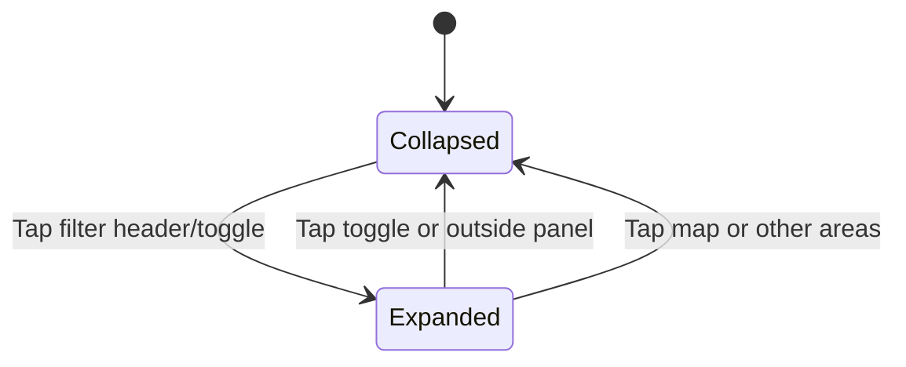
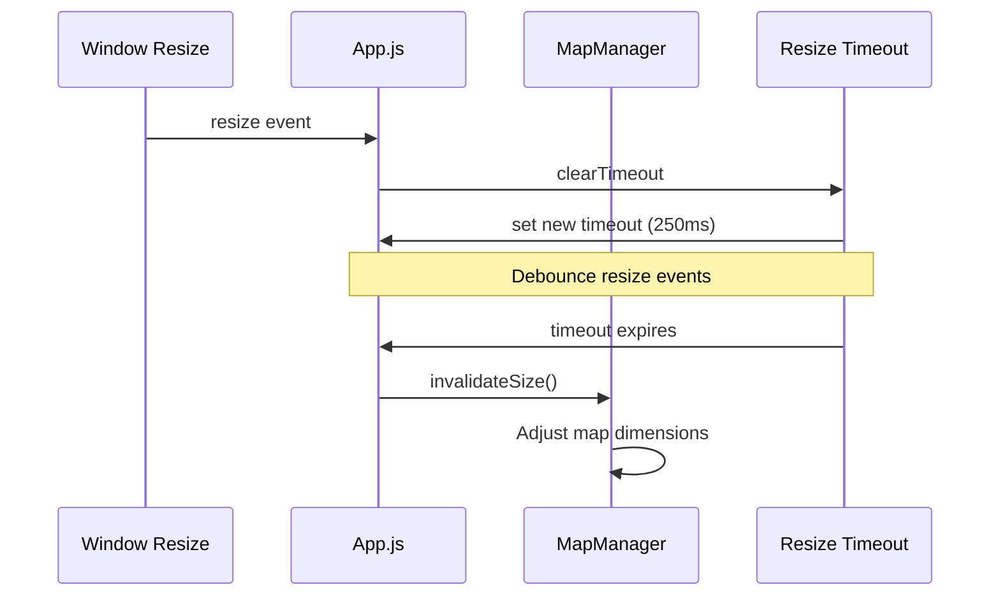
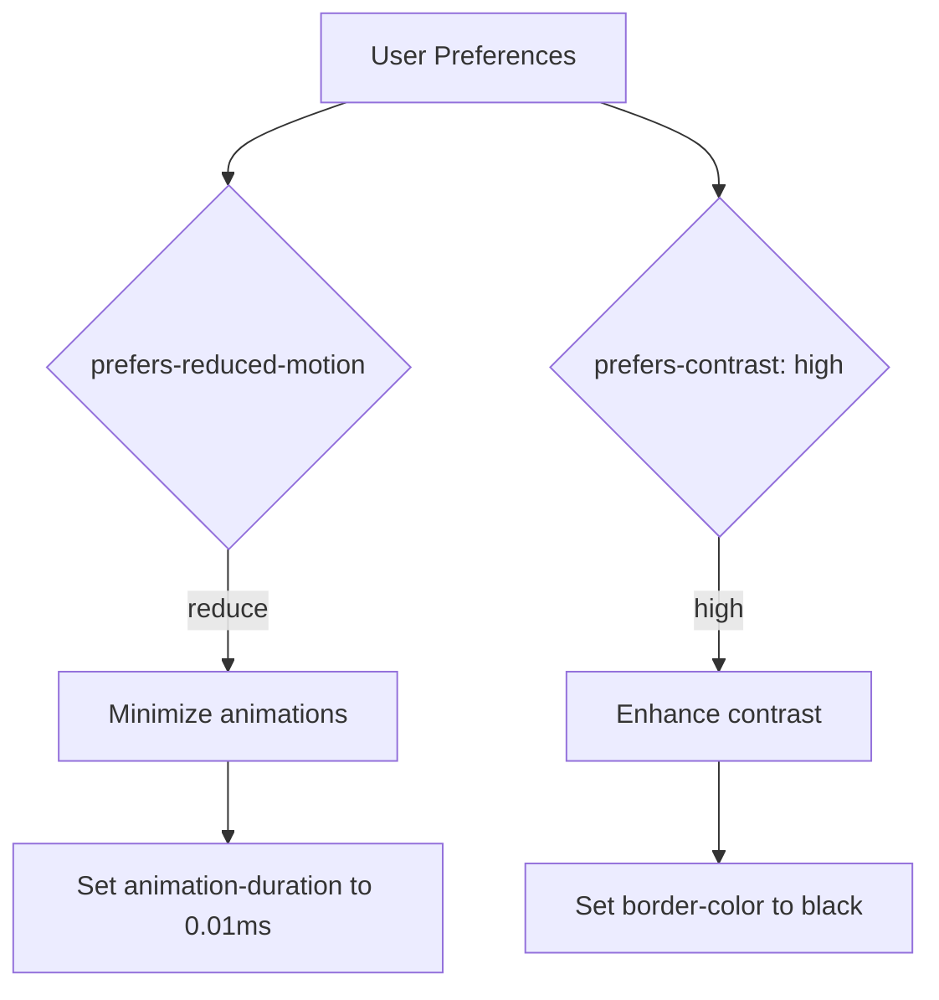

# Responsive Design

<cite>
**Referenced Files in This Document**   
- [styles.css](file://css/styles.css)
- [app.js](file://js/app.js)
- [index.html](file://index.html)
</cite>

## Table of Contents
1. [Introduction](#introduction)
2. [Responsive Layout Structure](#responsive-layout-structure)
3. [Breakpoint Implementation](#breakpoint-implementation)
4. [Mobile-Specific Features](#mobile-specific-features)
5. [Dynamic Responsive Behavior](#dynamic-responsive-behavior)
6. [Accessibility Considerations](#accessibility-considerations)
7. [Common Issues and Solutions](#common-issues-and-solutions)

## Introduction
The application implements a comprehensive responsive design system that adapts to various screen sizes and device capabilities. The responsive behavior ensures optimal user experience across desktop, tablet, and mobile devices by adjusting layout, component positioning, and interaction patterns based on viewport dimensions. This documentation details the implementation of responsive design patterns, including CSS media queries, dynamic JavaScript behavior, and accessibility features that work together to create a seamless cross-device experience.

## Responsive Layout Structure
The application's responsive design is built on a flexible layout system that reorganizes components based on screen width. On desktop devices, the interface displays a side-by-side layout with the filter panel positioned to the left of the map container. When viewed on smaller screens, this layout transforms into a stacked arrangement where the filter panel appears below the map.

**Diagram sources**
- [styles.css](file://css/styles.css#L552-L588)
- [index.html](file://index.html#L29-L141)

**Section sources**
- [styles.css](file://css/styles.css#L552-L588)
- [index.html](file://index.html#L29-L141)

## Breakpoint Implementation
The responsive design utilizes two primary breakpoints to adapt the interface for different device categories. The first breakpoint at 768px targets tablet devices, while the second at 480px addresses smaller mobile screens. These breakpoints trigger comprehensive layout changes, including font sizing, component dimensions, and positioning.

**Diagram sources**
- [styles.css](file://css/styles.css#L552-L613)

**Section sources**
- [styles.css](file://css/styles.css#L552-L613)

## Mobile-Specific Features
On mobile devices, the filter panel transforms into a collapsible drawer that slides up from the bottom of the screen. This design preserves valuable screen real estate for the map while maintaining access to filtering controls. The filter panel can be expanded by tapping the filter header or the toggle button, and collapsed by tapping anywhere outside the panel or using the toggle button.

**Diagram sources**
- [styles.css](file://css/styles.css#L577-L580)
- [filter-controller.js](file://js/filter-controller.js#L87-L92)

**Section sources**
- [styles.css](file://css/styles.css#L566-L580)
- [filter-controller.js](file://js/filter-controller.js#L87-L92)

## Dynamic Responsive Behavior
The application includes JavaScript functionality to handle dynamic responsive behavior, particularly for the map component. When the window is resized, the application debounces resize events and invalidates the map size to ensure proper rendering. This prevents layout issues that could occur from rapid successive resize operations.

**Diagram sources**
- [app.js](file://js/app.js#L303-L314)

**Section sources**
- [app.js](file://js/app.js#L303-L314)

## Accessibility Considerations
The responsive design incorporates several accessibility features to support users with different needs and device capabilities. The application respects user preferences for reduced motion and high contrast mode through CSS media queries. When reduced motion is preferred, all animations and transitions are minimized to prevent discomfort. For high contrast mode, border colors are adjusted to ensure sufficient contrast between elements.

**Diagram sources**
- [styles.css](file://css/styles.css#L647-L656)
- [styles.css](file://css/styles.css#L636-L645)

**Section sources**
- [styles.css](file://css/styles.css#L636-L656)

## Common Issues and Solutions
### Map Rendering Issues on Resize
When the application window is resized rapidly, the Leaflet map may not properly adjust its dimensions, leading to rendering artifacts or incorrect positioning. This occurs because the map component needs to be explicitly notified of size changes.

**Solution**: The application implements a debounced resize handler that waits for resize events to settle before calling the map's invalidateSize method. This ensures the map is only updated once when resizing completes, preventing excessive re-renders and ensuring proper layout.

### Filter Panel Visibility on Mobile
On mobile devices, the collapsible filter panel may remain expanded when navigating between different views or after certain interactions, obscuring the map content.

**Solution**: The application listens for interactions outside the filter panel and automatically collapses it when users interact with other interface elements. Additionally, the timeline panel and other components trigger filter panel collapse when activated to maintain a clean interface.

### Touch Target Sizing
On mobile devices, small interactive elements can be difficult to tap accurately, leading to user frustration.

**Solution**: The application ensures all interactive elements have sufficient touch target size (minimum 44px) and includes appropriate spacing between controls. The filter panel's toggle button and form elements are designed with mobile touch in mind, providing ample tap targets for users.

**Section sources**
- [app.js](file://js/app.js#L303-L314)
- [styles.css](file://css/styles.css#L566-L580)