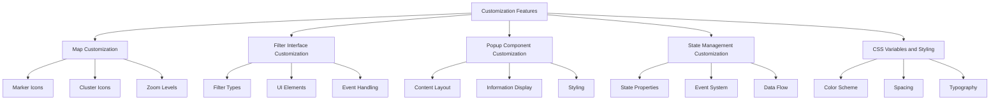
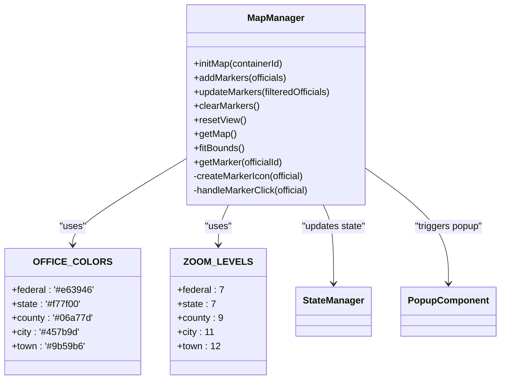
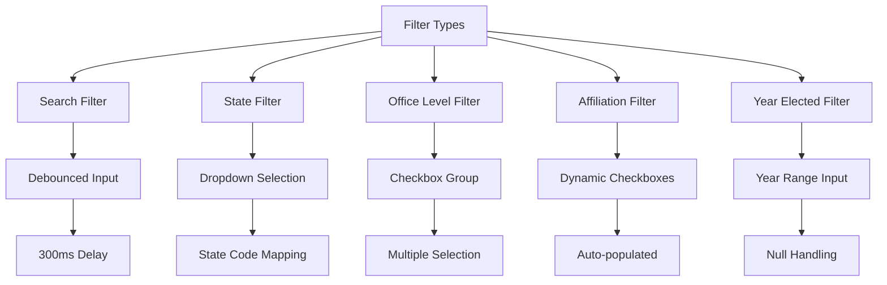
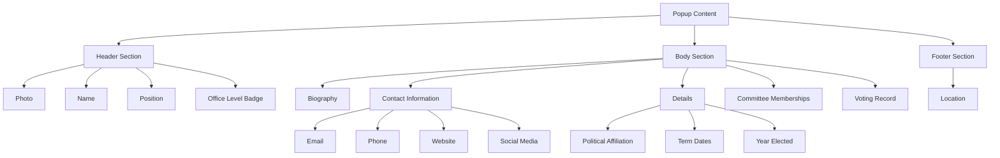
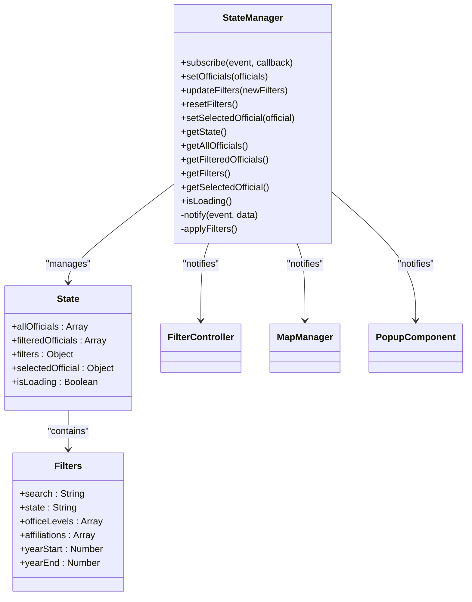
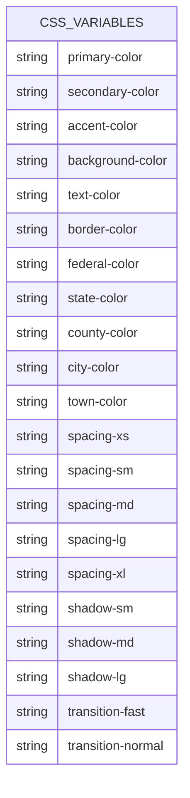

# Customization

<cite>
**Referenced Files in This Document**   
- [map-manager.js](file://js/map-manager.js)
- [filter-controller.js](file://js/filter-controller.js)
- [state-manager.js](file://js/state-manager.js)
- [popup-component.js](file://js/popup-component.js)
- [styles.css](file://css/styles.css)
</cite>

## Table of Contents
1. [Introduction](#introduction)
2. [Customization Overview](#customization-overview)
3. [Map Customization](#map-customization)
4. [Filter Interface Customization](#filter-interface-customization)
5. [Popup Component Customization](#popup-component-customization)
6. [State Management Customization](#state-management-customization)
7. [CSS Variables and Styling](#css-variables-and-styling)
8. [Common Customization Issues and Solutions](#common-customization-issues-and-solutions)

## Introduction
This document provides comprehensive documentation for the customization capabilities of the Democratic Socialist Officials Map application. The system is designed to be highly customizable through various components that handle map rendering, filtering, popup displays, state management, and visual styling. This guide details the implementation, interfaces, domain models, and usage patterns for each customizable component.

## Customization Overview
The application's customization capabilities are distributed across multiple components that work together to provide a flexible and user-friendly experience. The core customization features include map styling and behavior, filter interface configuration, popup content presentation, state management for user interactions, and CSS-based visual customization. These components are interconnected through a well-defined architecture that allows for independent customization while maintaining system coherence.

**Diagram sources**
- [map-manager.js](file://js/map-manager.js#L1-L216)
- [filter-controller.js](file://js/filter-controller.js#L1-L269)
- [popup-component.js](file://js/popup-component.js#L1-L262)
- [state-manager.js](file://js/state-manager.js#L1-L228)
- [styles.css](file://css/styles.css#L1-L1313)

## Map Customization
The MapManager component provides extensive customization options for the map display, including marker styling, clustering behavior, and zoom level configuration. These customizations enhance the user experience by providing visual differentiation between different types of officials and improving map performance through clustering.

### Marker and Cluster Customization
The map customization system uses distinct visual elements to represent different office levels and cluster groups. The implementation includes configurable colors, sizes, and behaviors that can be easily modified.

**Diagram sources**
- [map-manager.js](file://js/map-manager.js#L1-L216)

**Section sources**
- [map-manager.js](file://js/map-manager.js#L1-L216)
- [styles.css](file://css/styles.css#L473-L547)

### Marker Icon Implementation
The marker icons are customized based on the office level of each official, providing immediate visual feedback about the type of position. The implementation uses CSS classes and inline styles to create distinctive markers for federal, state, county, city, and town officials.

The marker customization includes:
- **Color coding**: Each office level has a distinct color defined in both JavaScript and CSS
- **Initial display**: Markers show the first initial of the official's name
- **Size consistency**: All markers are 30x30 pixels for uniform appearance
- **Visual hierarchy**: The color scheme creates a clear visual hierarchy across office levels

The marker creation process follows this flow:
1. Retrieve the official's office level
2. Determine the appropriate color from the OFFICE_COLORS constant
3. Extract the first initial from the official's name
4. Create a Leaflet div icon with the custom HTML and styling
5. Attach the official's data to the marker for later reference

### Cluster Configuration
The clustering system is customized to handle groups of officials in close proximity, preventing visual clutter on the map. The cluster customization includes three size tiers (small, medium, large) based on the number of officials in each cluster.

Cluster customization features:
- **Size scaling**: Cluster size increases with the number of contained officials
- **Count display**: Each cluster shows the total number of officials it contains
- **Color consistency**: All clusters use the primary application color
- **Interactive behavior**: Clicking a cluster zooms to reveal individual markers

The cluster configuration is defined in the `iconCreateFunction` parameter of the marker cluster group, which determines the appropriate size and styling based on the cluster's child count.

## Filter Interface Customization
The FilterController component manages the customization of the filter interface, allowing users to refine their search for officials based on various criteria. The system is designed to be flexible and extensible, supporting multiple filter types and dynamic UI updates.

### Filter Types and Configuration
The application supports several filter types, each with its own customization options and behavior:

**Diagram sources**
- [filter-controller.js](file://js/filter-controller.js#L1-L269)

**Section sources**
- [filter-controller.js](file://js/filter-controller.js#L1-L269)
- [index.html](file://index.html#L28-L140)

### Filter Event Handling
The filter customization system uses a sophisticated event handling mechanism to ensure responsive and efficient updates. Each filter type has specific event listeners that trigger state updates through the StateManager.

Key aspects of filter event handling:
- **Debounced search**: The search input uses a 300ms debounce to prevent excessive state updates
- **Immediate updates**: Other filters update the state immediately upon change
- **Event subscription**: The FilterController subscribes to state changes to update the UI accordingly
- **Mobile optimization**: Special handling for mobile devices with tap-to-toggle functionality

The event flow for filter changes is:
1. User interacts with a filter element (types, selects, checks)
2. Event listener captures the interaction
3. FilterController processes the input and extracts the new value
4. StateManager.updateFilters() is called with the new filter value
5. StateManager applies the filters and notifies subscribers
6. FilterController.handleOfficialsChange() updates the UI based on the new state

### Dynamic Affiliation Filtering
One of the most sophisticated customization features is the dynamic population of political affiliation checkboxes. Unlike other filters with predefined options, affiliations are automatically detected from the loaded data and used to generate the filter UI.

The dynamic affiliation process:
1. On first data load, the system extracts all unique political affiliations
2. Checkbox elements are created for each affiliation
3. The checkboxes are added to the filter panel
4. Change event listeners are attached to update filters when checked/unchecked
5. The filter state is updated to include only selected affiliations

This approach ensures that the filter interface automatically adapts to the data, requiring no manual configuration when new affiliations are added to the dataset.

## Popup Component Customization
The PopupComponent provides extensive customization options for the information displayed when a user clicks on an official's marker. The popup is designed to present comprehensive information in an organized and accessible format.

### Popup Content Structure
The popup customization includes a well-structured layout that organizes information into logical sections:

**Diagram sources**
- [popup-component.js](file://js/popup-component.js#L1-L262)

**Section sources**
- [popup-component.js](file://js/popup-component.js#L1-L262)
- [styles.css](file://css/styles.css#L332-L472)

### Information Display Customization
The popup component offers several customization options for how information is presented:

- **Conditional rendering**: Fields are only displayed if they have values
- **Formatted dates**: Date strings are converted to human-readable format
- **HTML escaping**: Prevents XSS attacks by escaping HTML in text content
- **Responsive layout**: Adapts to different screen sizes
- **Accessibility features**: Includes ARIA labels and semantic HTML

The content creation process follows these steps:
1. Receive the official object and position coordinates
2. Close any existing popup to prevent duplicates
3. Generate HTML content using the createPopupContent function
4. Create a Leaflet popup with the generated content
5. Set the popup position and open it on the map
6. Attach event listeners to handle popup closure

### Contact Information Customization
The contact information section is highly customizable, supporting multiple contact methods with appropriate formatting and linking:

- **Email**: Rendered as a mailto: link
- **Phone**: Rendered as a tel: link
- **Website**: Opens in a new tab with security attributes
- **Social media**: Platform-specific formatting and linking
- **Fallback text**: Descriptive text when handles are provided without full URLs

The social media handling is particularly customized, with special processing for Twitter and Instagram handles that may include or exclude the @ symbol.

## State Management Customization
The StateManager component provides the foundation for application state customization, managing the data flow between components and ensuring consistency across the user interface.

### State Structure and Properties
The state management system is customized with a comprehensive state object that tracks multiple aspects of the application:

**Diagram sources**
- [state-manager.js](file://js/state-manager.js#L1-L228)

**Section sources**
- [state-manager.js](file://js/state-manager.js#L1-L228)
- [app.js](file://js/app.js#L1-L142)

### Event-Driven Architecture
The state management customization is built around an event-driven architecture that enables loose coupling between components:

- **Event types**: Three main event types (stateChange, filterChange, officialsChange)
- **Subscription system**: Components can subscribe to specific events
- **Notification mechanism**: State changes trigger notifications to all subscribers
- **Data flow**: Unidirectional data flow from state changes to UI updates

The event flow works as follows:
1. A component calls a StateManager method to update the state
2. The StateManager modifies the internal state
3. The StateManager notifies all subscribers to the relevant event
4. Subscribed components receive the updated data and update their UI

This architecture allows for high customization flexibility, as new components can be added that respond to state changes without modifying existing code.

### Filter Application Logic
The filter customization includes sophisticated logic for applying multiple filters simultaneously:

1. Start with all officials as the base set
2. Apply search filter (name, position, location)
3. Apply state filter (exact match)
4. Apply office level filter (inclusion in selected levels)
5. Apply affiliation filter (inclusion in selected affiliations)
6. Apply year elected filter (range check)
7. Update the filtered officials array and notify subscribers

The filtering is performed in a specific order to optimize performance, with the most selective filters applied first when possible.

## CSS Variables and Styling
The application's visual customization is primarily controlled through CSS variables, allowing for easy theming and styling changes without modifying JavaScript code.

### CSS Custom Properties
The styling system uses a comprehensive set of CSS variables defined in the :root selector:

**Diagram sources**
- [styles.css](file://css/styles.css#L4-L35)

**Section sources**
- [styles.css](file://css/styles.css#L4-L35)
- [styles.css](file://css/styles.css#L473-L547)

### Visual Theme Customization
The CSS-based customization system allows for comprehensive theme changes by modifying the variables in the :root selector. Key aspects include:

- **Color scheme**: Primary, secondary, and accent colors for the overall theme
- **Office level colors**: Distinct colors for each office level that match the JavaScript constants
- **Spacing system**: Consistent spacing values used throughout the interface
- **Shadow effects**: Multiple shadow levels for depth and emphasis
- **Transitions**: Animation durations for smooth interactions

To customize the theme, developers can modify the CSS variables in the :root selector, and the changes will automatically propagate to all elements that use these variables.

### Responsive Design Customization
The application includes responsive design customization through media queries that adapt the interface to different screen sizes:

- **Mobile layout**: Filter panel becomes a sliding drawer from the bottom
- **Touch targets**: Increased size for mobile touch interactions
- **Font scaling**: Adjusted font sizes for better readability on small screens
- **Popup sizing**: Reduced minimum width for mobile devices

The responsive customization ensures that the application remains usable and visually appealing across all device types, from desktop monitors to mobile phones.

## Common Customization Issues and Solutions
This section addresses common issues that may arise when customizing the application and provides solutions for each.

### Issue: Custom Marker Colors Not Displaying
**Problem**: When changing the OFFICE_COLORS constants in map-manager.js, the new colors don't appear on the map.

**Solution**: Ensure that corresponding CSS classes are updated in styles.css. The JavaScript constants and CSS classes must be synchronized:
- Update the OFFICE_COLORS object in map-manager.js
- Update the marker CSS classes in styles.css (.marker-federal, .marker-state, etc.)
- Verify that the color values match exactly

### Issue: Filter UI Not Updating After Data Load
**Problem**: The affiliation checkboxes don't appear when the page loads.

**Solution**: Ensure that the FilterController is properly initialized and subscribed to state changes:
- Verify that FilterController.init() is called in app.js
- Check that the subscription to officialsChange is established
- Confirm that the officials data is successfully loaded

### Issue: Popup Content Not Rendering Correctly
**Problem**: Some fields in the popup are not displaying or appear malformed.

**Solution**: Check the data structure of the official object:
- Verify that required fields (name, position, bio, etc.) are present
- Ensure that nested objects (location, contact) have the expected structure
- Confirm that date strings are in ISO 8601 format

### Issue: Mobile Filter Panel Not Toggling
**Problem**: The filter panel doesn't expand/collapse when tapped on mobile devices.

**Solution**: Verify the mobile event listener setup:
- Check that the window.innerWidth check is correct
- Ensure the click event is properly attached to the filter header
- Confirm that the toggleFilterPanel function is working correctly

### Issue: CSS Theme Changes Not Applying
**Problem**: Modified CSS variables are not affecting the visual appearance.

**Solution**: Ensure proper CSS variable usage:
- Verify that variables are used with the var() function (e.g., var(--primary-color))
- Check for typos in variable names
- Confirm that the CSS file is properly linked and loading
- Clear browser cache if changes are not appearing

**Section sources**
- [map-manager.js](file://js/map-manager.js#L1-L216)
- [filter-controller.js](file://js/filter-controller.js#L1-L269)
- [popup-component.js](file://js/popup-component.js#L1-L262)
- [state-manager.js](file://js/state-manager.js#L1-L228)
- [styles.css](file://css/styles.css#L1-L1313)