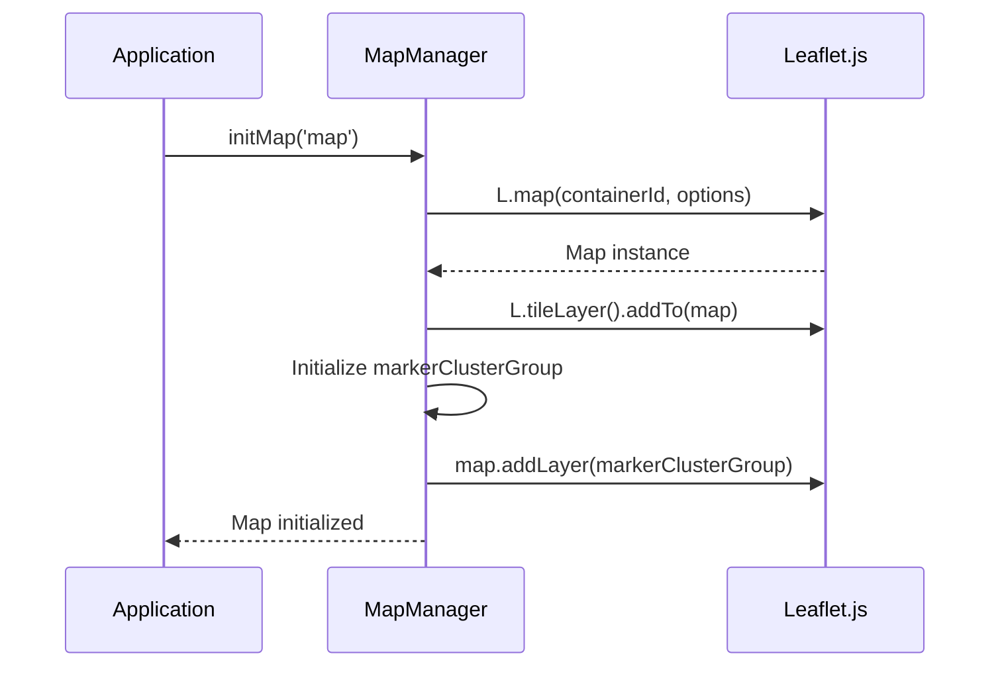
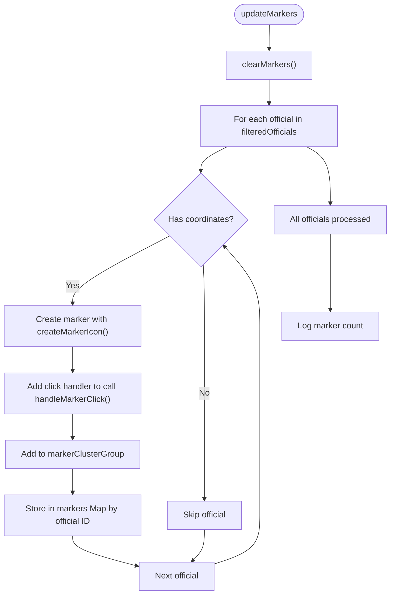
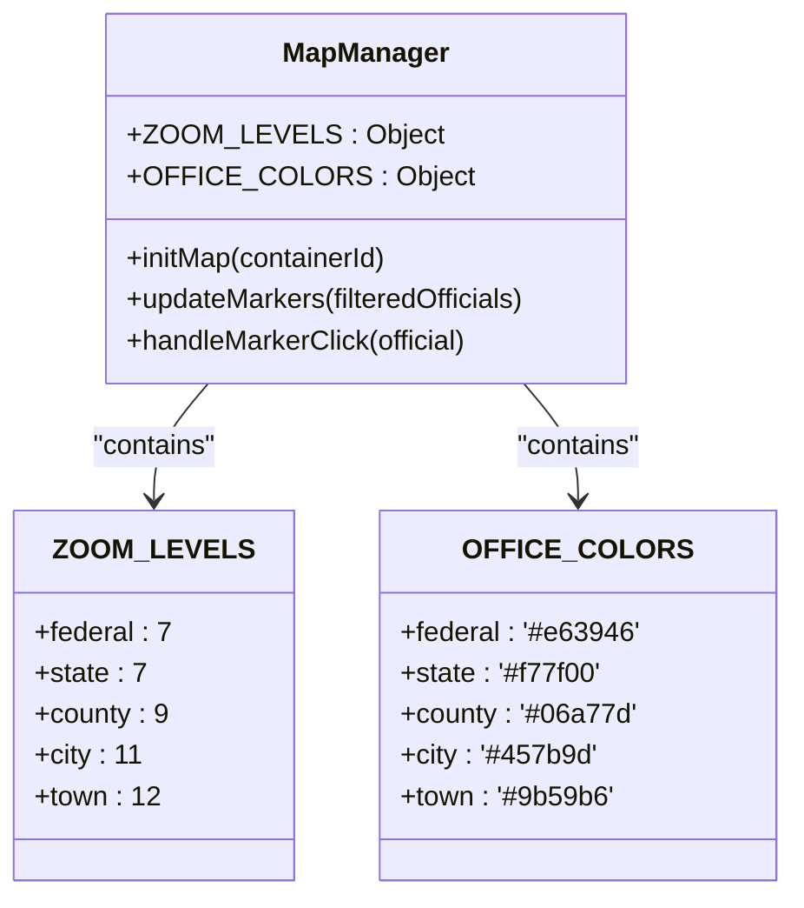
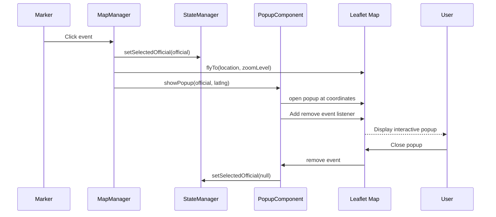

# Map Behavior Customization

<cite>
**Referenced Files in This Document**   
- [map-manager.js](file://js/map-manager.js)
- [state-manager.js](file://js/state-manager.js)
- [popup-component.js](file://js/popup-component.js)
- [styles.css](file://css/styles.css)
- [officials.json](file://data/officials.json)
</cite>

## Table of Contents
1. [Introduction](#introduction)
2. [Map Initialization](#map-initialization)
3. [Marker Management](#marker-management)
4. [Configuration Options](#configuration-options)
5. [Component Interactions](#component-interactions)
6. [Performance Considerations](#performance-considerations)
7. [Troubleshooting Guide](#troubleshooting-guide)

## Introduction
This document provides comprehensive guidance on customizing map behavior through the MapManager module in the Democratic Socialist Officials Map application. The MapManager module serves as the central component for handling map initialization, marker rendering, clustering, and user interactions. It integrates with Leaflet.js to provide an interactive map experience that displays elected democratic socialists across the United States. The module works in conjunction with StateManager for data state management and PopupComponent for displaying detailed information about officials. This documentation covers the implementation details of key functions, configuration options, component relationships, and troubleshooting strategies to ensure optimal map performance and user experience.

## Map Initialization

The map initialization process begins with the `initMap` function, which creates and configures the Leaflet map instance. This function accepts an optional container ID parameter (defaulting to 'map') that specifies the DOM element where the map will be rendered. The map is centered on the geographic center of the continental United States at coordinates [39.8283, -98.5795] with an initial zoom level of 4, allowing users to see the entire country upon loading. The map configuration includes a minimum zoom level of 3 and a maximum of 18, providing flexibility for users to explore from a national overview to street-level detail.

During initialization, the OpenStreetMap tile layer is added to provide the base map imagery, with proper attribution to OpenStreetMap contributors. A critical aspect of the initialization process is the creation of the marker cluster group, which manages the display of multiple markers in close proximity. This clustering functionality prevents visual clutter when viewing densely populated areas with many officials. The cluster group is configured with specific settings that can be customized to meet different performance and usability requirements.

**Diagram sources**
- [map-manager.js](file://js/map-manager.js#L33-L76)

**Section sources**
- [map-manager.js](file://js/map-manager.js#L33-L76)

## Marker Management

### Marker Creation and Styling
The MapManager module handles marker creation and styling through the `createMarkerIcon` function, which generates custom Leaflet div icons for each official. The styling is dynamically determined by the official's office level, using the `OFFICE_COLORS` configuration object to assign specific colors to federal, state, county, city, and town officials. Each marker displays the first initial of the official's name and is styled with CSS classes that correspond to the office level, ensuring visual consistency with the application's design system.

Markers are created with accessibility features including title attributes containing the official's name and alt attributes with both name and position information. When a marker is clicked, the `handleMarkerClick` function is triggered, which coordinates with other components to update the application state and display relevant information. The markers are stored in a Map data structure using the official's ID as the key, allowing for efficient retrieval and management of marker instances throughout the application lifecycle.

### Marker Update Workflow
The `updateMarkers` function serves as the primary interface for refreshing the map display with filtered or updated official data. This function acts as a wrapper around the `addMarkers` function, first clearing any existing markers before adding the new set of filtered officials. The process begins by validating that latitude and longitude coordinates exist for each official before creating a marker instance. Each marker is enhanced with the official's data as a property, enabling access to the complete official object when the marker is interacted with.

The marker update workflow follows a specific sequence: clear existing markers, iterate through the filtered officials array, create markers with custom icons, attach click event handlers, add markers to the cluster group, and store marker references. This systematic approach ensures that the map display remains synchronized with the current application state and that memory is efficiently managed by removing references to markers that are no longer visible.

**Diagram sources**
- [map-manager.js](file://js/map-manager.js#L102-L133)
- [map-manager.js](file://js/map-manager.js#L165-L167)

**Section sources**
- [map-manager.js](file://js/map-manager.js#L78-L133)
- [map-manager.js](file://js/map-manager.js#L165-L167)

## Configuration Options

### Zoom Level Configuration
The MapManager module includes a configurable `ZOOM_LEVELS` object that defines the appropriate zoom level for different office types. This configuration ensures that when a user clicks on an official's marker, the map automatically zooms to a level appropriate for the scope of that official's jurisdiction. Federal officials trigger a zoom level of 7, providing a regional view that encompasses multiple states. State officials also use zoom level 7, maintaining consistency in the viewing experience. County officials trigger zoom level 9, offering a more focused view of a specific region within a state. City officials use zoom level 11, showing a metropolitan area in detail, while town officials use the most detailed zoom level of 12, focusing on a specific community.

This hierarchical zoom system enhances the user experience by automatically providing the most relevant geographical context for each official. The zoom levels are implemented through the `handleMarkerClick` function, which looks up the appropriate zoom level based on the official's office level and uses Leaflet's `flyTo` method to animate the transition. If an office level is not defined in the configuration, a default zoom level of 10 is used, ensuring that the map always responds appropriately even with unexpected data.

### Marker Clustering Settings
The marker clustering functionality is configured with several key parameters that balance performance and usability. The `maxClusterRadius` is set to 60 pixels, determining the maximum distance between markers that will be grouped into a cluster. This value represents a careful balance between preventing excessive clustering in sparsely populated areas and avoiding visual clutter in densely populated regions. The `spiderfyOnMaxZoom` option is enabled (set to true), which means that when users zoom to the maximum level, clustered markers that are close together will "spiderfy" - spreading out in a radial pattern to make individual markers accessible.

Additional clustering options include `showCoverageOnHover` (set to false) which would normally display the cluster's bounds when hovering, and `zoomToBoundsOnClick` (set to true) which allows users to click on a cluster to zoom to the bounds containing all markers in that cluster. The cluster styling is dynamically adjusted based on the number of markers in each cluster, with small clusters (5 or fewer markers) using a 40x40 pixel icon, medium clusters (6-10 markers) using a 50x50 pixel icon, and large clusters (more than 10 markers) using a 60x60 pixel icon. This visual differentiation helps users quickly assess the density of officials in different regions.

**Diagram sources**
- [map-manager.js](file://js/map-manager.js#L12-L27)
- [map-manager.js](file://js/map-manager.js#L49-L71)

**Section sources**
- [map-manager.js](file://js/map-manager.js#L12-L27)
- [map-manager.js](file://js/map-manager.js#L49-L71)

## Component Interactions

### Integration with StateManager
The MapManager module maintains a tight integration with the StateManager module to ensure that the map display remains synchronized with the application's data state. When a marker is clicked, the `handleMarkerClick` function calls `StateManager.setSelectedOfficial(official)` to update the application state with the currently selected official. This state change triggers event listeners in other components, creating a coordinated response across the application. The StateManager acts as the single source of truth for the selected official, allowing multiple components to react to selection changes without direct dependencies on each other.

The relationship between MapManager and StateManager follows a unidirectional data flow pattern. MapManager responds to user interactions by updating the state through StateManager's public API, rather than directly manipulating state. This approach promotes predictability and makes the application easier to debug and test. When filters are applied through the user interface, StateManager notifies MapManager (indirectly through the application's event system) that filtered officials have changed, prompting MapManager to update the displayed markers accordingly.

### Interaction with PopupComponent
The MapManager module works closely with the PopupComponent to display detailed information about officials when their markers are clicked. After updating the state and initiating the zoom animation, `handleMarkerClick` calls `PopupComponent.showPopup(official, [latitude, longitude])` to display an information popup at the official's location. This function first checks whether the map has been properly initialized, preventing errors when attempting to show popups before the map is ready.

The PopupComponent creates a rich HTML content display that includes the official's photo (if available), name, position, office level badge, biography, contact information, political affiliation, term dates, committee memberships, and voting record. The popup is configured with appropriate dimensions, auto-pan behavior to ensure visibility, and a close button. When the popup is closed (either by user action or programmatically), it triggers `StateManager.setSelectedOfficial(null)` to clear the selection state, maintaining consistency between the visual interface and the application state.

**Diagram sources**
- [map-manager.js](file://js/map-manager.js#L139-L151)
- [popup-component.js](file://js/popup-component.js#L201-L233)
- [state-manager.js](file://js/state-manager.js#L162-L165)

**Section sources**
- [map-manager.js](file://js/map-manager.js#L139-L151)
- [popup-component.js](file://js/popup-component.js#L201-L233)

## Performance Considerations

### Marker Clustering Efficiency
The marker clustering implementation in MapManager is designed to optimize performance when displaying large numbers of officials across the country. By grouping nearby markers into clusters, the system significantly reduces the number of DOM elements that need to be rendered, especially at higher zoom levels where many officials might be concentrated in urban areas. The clustering algorithm operates efficiently by only processing markers that are within the current view bounds, minimizing computational overhead as users navigate the map.

The cluster styling system uses CSS classes to differentiate between cluster sizes, leveraging the browser's optimized rendering engine rather than creating complex SVG elements. The dynamic sizing of cluster icons (small, medium, large) based on the number of contained markers provides immediate visual feedback about population density without requiring additional processing. The `iconCreateFunction` is optimized to minimize DOM manipulation by using simple div elements with text content rather than complex nested structures.

### Animation Optimization
The `flyTo` animation used when navigating to an official's location is configured with a duration of 0.8 seconds, striking a balance between providing a smooth user experience and avoiding excessive wait times. This duration allows users to track the map's movement while maintaining a responsive feel. The animation is implemented using Leaflet's built-in animation capabilities, which leverage CSS3 transitions for optimal performance across different devices and browsers.

For applications with a larger number of markers or more complex overlays, additional performance optimizations could include implementing marker fading during zoom transitions, using canvas rendering for extremely dense marker sets, or implementing level-of-detail strategies that show simplified representations at lower zoom levels. The current implementation provides a solid foundation that can be extended based on specific performance requirements and user experience goals.

**Section sources**
- [map-manager.js](file://js/map-manager.js#L145-L147)
- [map-manager.js](file://js/map-manager.js#L49-L71)

## Troubleshooting Guide

### Common Initialization Issues
Map initialization failures can occur due to several common issues. The most frequent cause is attempting to initialize the map before the DOM element with the specified container ID exists. This typically happens when the `initMap` function is called before the page has fully loaded. To prevent this, ensure that map initialization occurs after the DOM is ready, either by placing script tags at the end of the body or using appropriate DOM ready events.

Another common issue is the container element having zero dimensions, which prevents Leaflet from properly initializing the map. This can occur when the container is hidden or has CSS styles that result in no visible area. Verify that the map container has explicit dimensions (either through CSS width/height properties or by being contained within a properly sized parent element). If the container size changes dynamically, call the map's `invalidateSize` method to ensure proper rendering.

### Marker Rendering Problems
Marker rendering failures often stem from missing or invalid geographic coordinates in the officials data. The application checks for the presence of latitude and longitude values before creating markers, silently skipping any officials without valid location data. To troubleshoot missing markers, verify that the officials.json file contains complete location information for all entries and that the data structure matches the expected format.

Cluster display issues may occur if the CSS styles for cluster icons are not properly loaded or if there are conflicts with other styles in the application. Ensure that styles.css is correctly linked and that the CSS classes for cluster styling (.custom-cluster-icon, .cluster-small, etc.) are present and properly defined. If markers appear but do not cluster, verify that the markerClusterGroup is properly initialized and added to the map during the initialization process.

**Section sources**
- [map-manager.js](file://js/map-manager.js#L109-L110)
- [map-manager.js](file://js/map-manager.js#L33-L76)
- [popup-component.js](file://js/popup-component.js#L204-L207)
- [css/styles.css](file://css/styles.css#L473-L547)