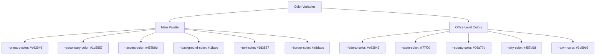
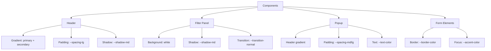
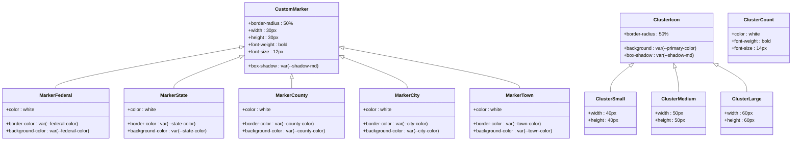
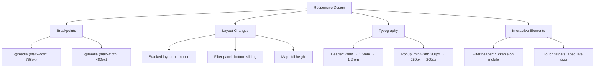

# Styling Customization

<cite>
**Referenced Files in This Document**   
- [styles.css](file://css/styles.css)
- [map-manager.js](file://js/map-manager.js)
- [popup-component.js](file://js/popup-component.js)
- [filter-controller.js](file://js/filter-controller.js)
- [index.html](file://index.html)
</cite>

## Table of Contents
1. [Introduction](#introduction)
2. [CSS Variables Structure](#css-variables-structure)
3. [Color Schemes](#color-schemes)
4. [Spacing and Layout](#spacing-and-layout)
5. [Shadows and Depth](#shadows-and-depth)
6. [Transitions and Animations](#transitions-and-animations)
7. [Component Styling](#component-styling)
8. [Map Markers and Clusters](#map-markers-and-clusters)
9. [Responsive Design](#responsive-design)
10. [Accessibility Features](#accessibility-features)
11. [Common Issues and Solutions](#common-issues-and-solutions)

## Introduction
This document provides comprehensive guidance on styling customization for the Democratic Socialist Officials Map application. It details how to modify the visual appearance using CSS custom properties defined in styles.css, covering color schemes, spacing, shadows, transitions, and component-specific styling. The documentation explains how these variables are applied to various UI components and map elements, with special attention to office-level markers and cluster icons. It also addresses responsive design considerations and accessibility features to ensure the application is usable across different devices and for users with varying needs.

## CSS Variables Structure
The application uses CSS custom properties (variables) defined in the :root selector to maintain a consistent design system throughout the application. These variables are organized into logical groups for colors, spacing, shadows, and transitions, making it easy to customize the visual appearance of the entire application by modifying a few key values.

The CSS variables are defined at the root level, making them accessible to all elements in the document. This approach allows for easy theme customization and ensures consistency across components. The variables follow a naming convention that indicates their purpose and category, such as --primary-color for the main brand color or --spacing-md for medium spacing.

**Section sources**
- [styles.css](file://css/styles.css#L4-L35)

## Color Schemes
The application's color scheme is built around a set of CSS variables that define the primary palette and specific colors for different office levels. The main color variables include --primary-color, --secondary-color, --accent-color, --background-color, --text-color, and --border-color, which establish the overall visual tone of the application.

A specialized set of variables is used for office-level markers: --federal-color, --state-color, --county-color, --city-color, and --town-color. These colors are used to visually distinguish officials based on their level of government, providing immediate visual feedback about the type of office they hold. The color scheme uses a vibrant palette with red for federal officials, orange for state, green for county, blue for city, and purple for town officials.

These color variables are applied throughout the application, from the header's gradient background to form elements and interactive components. The consistent use of these variables ensures visual harmony across all interface elements.

**Diagram sources**
- [styles.css](file://css/styles.css#L6-L19)

## Spacing and Layout
The application uses a systematic spacing scale defined by CSS variables to maintain consistent layout and whitespace throughout the interface. The spacing variables follow a sequential naming pattern: --spacing-xs, --spacing-sm, --spacing-md, --spacing-lg, and --spacing-xl, representing increasingly larger spacing values from 0.25rem to 2rem.

These spacing variables are applied to various layout properties including padding, margins, and gaps between elements. For example, the header uses --spacing-lg for its padding, while form elements use --spacing-sm and --spacing-md for internal spacing. The filter panel's content area uses --spacing-lg for padding, creating a comfortable reading space.

The spacing system enables responsive and consistent layout adjustments. By using these variables instead of hardcoded values, designers can easily modify the overall density of the interface by adjusting the base spacing values. This approach also ensures visual consistency across different components and screen sizes.

**Section sources**
- [styles.css](file://css/styles.css#L20-L26)

## Shadows and Depth
The application employs a subtle shadow system to create visual hierarchy and depth. Three levels of shadows are defined as CSS variables: --shadow-sm, --shadow-md, and --shadow-lg, each with increasing blur radius and spread to indicate different levels of elevation.

These shadow variables are strategically applied to create a sense of layering in the interface. The filter panel and map markers use --shadow-md to appear elevated above the background, while loading indicators and popup elements use --shadow-lg for greater prominence. The header also uses --shadow-md to separate it visually from the content below.

The shadow implementation uses rgba color values with low opacity to create soft, realistic shadows that don't distract from the content. This subtle use of shadows enhances the user experience by providing visual cues about the spatial relationships between interface elements without overwhelming the design.

**Section sources**
- [styles.css](file://css/styles.css#L27-L30)

## Transitions and Animations
The application includes a transition system defined by CSS variables --transition-fast (0.2s ease) and --transition-normal (0.3s ease). These variables control the duration and timing function of animated properties, ensuring consistent animation behavior across interactive elements.

Transitions are applied to various interactive states, such as button hover effects, filter panel sliding animations, and marker interactions. For example, the filter panel uses --transition-normal for its transform animation when collapsing or expanding, providing a smooth user experience. The toggle button uses --transition-fast for its scale transformation on hover, creating a responsive feel.

The application also includes a spinner animation for loading states, implemented with CSS keyframes that rotate an element 360 degrees. This animation provides visual feedback during data loading operations, improving perceived performance and user experience.

**Section sources**
- [styles.css](file://css/styles.css#L32-L35)
- [styles.css](file://css/styles.css#L285-L287)

## Component Styling
Various UI components in the application leverage the CSS variables for consistent styling. The header uses a gradient background combining --primary-color and --secondary-color, with text in white for high contrast. Its padding is set using --spacing-lg, and it features --shadow-md to create separation from the content below.

The filter panel uses white as its background with --shadow-md for elevation. Form elements like search inputs and select boxes use --border-color for their borders, which change to --accent-color on focus, providing clear visual feedback. The clear filters button uses --primary-color as its background, creating a prominent call-to-action.

Popup components extensively use CSS variables for styling. The popup header uses the same gradient as the main header, while content sections use --spacing-md and --spacing-lg for padding. Text colors are set using --text-color and --secondary-color for headings, ensuring readability against the white background.

**Diagram sources**
- [styles.css](file://css/styles.css#L57-L80)
- [styles.css](file://css/styles.css#L90-L246)
- [styles.css](file://css/styles.css#L332-L472)

## Map Markers and Clusters
The application's map functionality uses CSS variables to style custom markers and cluster icons, creating a cohesive visual system that integrates with the overall design. Custom markers are styled using the office-level color variables, with each marker type (federal, state, county, city, town) using its corresponding color variable for both border and background.

The marker styling system uses a combination of CSS variables and fixed styles. While colors are derived from variables, properties like size (30px), border width (3px), and border radius (50% for circular shape) are hardcoded. The markers use --shadow-md to provide subtle elevation, making them stand out against the map background.

Cluster icons, which group multiple markers when zoomed out, use --primary-color as their background with white text for the count. Three size classes (small, medium, large) correspond to different cluster sizes, with dimensions of 40px, 50px, and 60px respectively. The cluster count text uses bold styling with a 14px font size for readability.

The JavaScript implementation in map-manager.js dynamically creates these markers, using both the CSS variables and hardcoded styles to generate the final appearance. This hybrid approach allows for theme customization through CSS while maintaining consistent marker proportions.

**Diagram sources**
- [styles.css](file://css/styles.css#L474-L547)
- [map-manager.js](file://js/map-manager.js#L83-L95)

## Responsive Design
The application implements responsive design through CSS media queries that adjust the layout and styling based on screen width. Two breakpoints are defined: 768px for tablets and 480px for mobile devices, allowing the interface to adapt to different screen sizes.

On smaller screens, the layout changes from a side-by-side arrangement to a stacked layout. The filter panel becomes a sliding panel that can be toggled, positioned at the bottom of the screen with a fixed height of 60%. This mobile-friendly design prioritizes the map content while keeping filters accessible.

Typography and spacing are also adjusted for smaller screens. Header text sizes are reduced from 2rem to 1.5rem and then to 1.2rem as screens get smaller. Popup content widths are reduced to ensure they fit within the viewport, with minimum widths decreasing from 300px to 250px and then to 200px.

The responsive design also includes adjustments to interactive elements. On mobile devices, the filter header becomes tappable to toggle the panel, providing a touch-friendly interface. These adaptations ensure the application remains usable and visually appealing across all device sizes.

**Diagram sources**
- [styles.css](file://css/styles.css#L552-L613)

## Accessibility Features
The application includes several accessibility features implemented through CSS to support users with different needs. A high contrast mode is supported through the prefers-contrast media query, which overrides the --border-color variable to black and adds explicit borders to key elements like the filter panel and popup header.

For users who prefer reduced motion, the application respects the prefers-reduced-motion media query by minimizing animations and transitions. When this preference is detected, all animations and transitions are set to a very short duration (0.01ms), effectively disabling them while maintaining functionality.

The application also includes focus styles for keyboard navigation. The :focus-visible pseudo-class applies a 2px solid outline in --accent-color with a 2px offset, making focused elements clearly visible without interfering with mouse users' experience. This selective focus indication improves the experience for keyboard users while maintaining a clean appearance for mouse users.

Additional accessibility features include the sr-only class, which visually hides content while keeping it available to screen readers. This is useful for providing additional context to assistive technologies without cluttering the visual interface.

**Section sources**
- [styles.css](file://css/styles.css#L618-L656)

## Common Issues and Solutions
When customizing the styling of this application, several common issues may arise. One frequent issue is variable scope problems, where CSS variables are not properly inherited by child elements. This can occur when variables are redefined in nested selectors or when using shadow DOM components. The solution is to define all variables in the :root selector and avoid redefining them elsewhere.

Naming conflicts can occur when adding custom styles that use similar class names to the existing system. To avoid this, use a consistent naming convention and consider prefixing custom classes. For example, using a "ds-" prefix for custom Democratic Socialist styles can prevent conflicts with third-party libraries or future framework updates.

Theme consistency issues may arise when modifying variables without considering their impact across multiple components. Before changing a variable like --primary-color, review all elements that use it to understand the full impact. Using the search function to find all instances of a variable can help anticipate these effects.

For responsive design issues, ensure that media queries are properly ordered, with smaller breakpoints after larger ones to prevent cascade issues. Test changes on actual devices when possible, as emulators may not perfectly replicate touch interactions or viewport calculations.

When modifying map marker styles, remember that both CSS and JavaScript contribute to their appearance. Changes to marker colors should be reflected in both the CSS variables and the OFFICE_COLORS constant in map-manager.js to maintain consistency between the visual style and programmatic behavior.

**Section sources**
- [styles.css](file://css/styles.css#L1-L1313)
- [map-manager.js](file://js/map-manager.js#L1-L218)