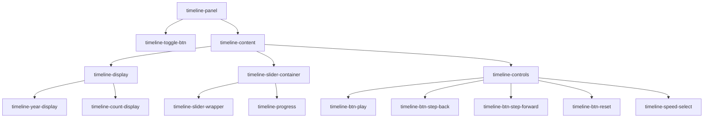
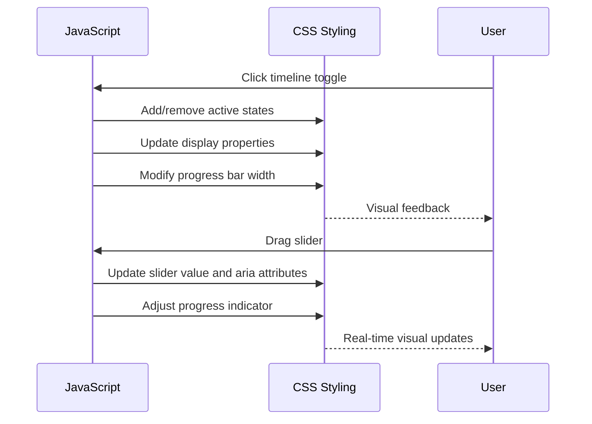

# Timeline Panel Styling

<cite>
**Referenced Files in This Document**   
- [styles.css](file://css/styles.css#L724-L961)
- [timeline-controller.js](file://js/timeline-controller.js#L4-L287)
- [app.js](file://js/app.js#L96-L189)
</cite>

## Table of Contents
1. [Introduction](#introduction)
2. [Timeline Panel Structure](#timeline-panel-structure)
3. [Visual Design and Styling](#visual-design-and-styling)
4. [Interactive Elements](#interactive-elements)
5. [Responsive Behavior](#responsive-behavior)
6. [Accessibility Features](#accessibility-features)
7. [Integration with JavaScript](#integration-with-javascript)

## Introduction
The timeline panel provides a temporal navigation interface for exploring historical data of elected officials. This documentation details the CSS styling implementation that defines the panel's appearance, layout, and interactive behavior. The styling works in conjunction with JavaScript functionality to create an intuitive timeline visualization that allows users to explore officials' data across different time periods.

## Timeline Panel Structure
The timeline panel is implemented as a fixed-position container at the bottom of the viewport, ensuring it remains accessible during map interaction. The panel consists of multiple nested components that organize the timeline controls and display elements in a logical hierarchy.



**Diagram sources**
- [styles.css](file://css/styles.css#L728-L737)

**Section sources**
- [styles.css](file://css/styles.css#L728-L737)

## Visual Design and Styling
The timeline panel employs a clean, modern aesthetic that aligns with the application's overall design language. The styling leverages CSS variables for consistent theming and easy customization.

### Layout and Positioning
The panel uses fixed positioning to remain visible at the bottom of the screen regardless of scrolling. It spans the full width of the viewport with a subtle shadow to create visual separation from the map content.

```css
.timeline-panel {
    position: fixed;
    bottom: 0;
    left: 0;
    right: 0;
    background: white;
    box-shadow: 0 -4px 10px rgba(0,0,0,0.1);
    z-index: 1000;
    transition: all var(--transition-normal);
}
```

### Typography and Color Scheme
The panel uses a hierarchical typographic system with distinct styling for labels and values. The primary color (red) is used for emphasis on key data points, while secondary colors maintain visual consistency with the application's theme.

```css
.timeline-label {
    font-size: 0.85rem;
    color: #666;
    margin-right: var(--spacing-xs);
}

.timeline-year,
.timeline-count {
    font-size: 1.5rem;
    font-weight: 700;
    color: var(--primary-color);
}
```

**Section sources**
- [styles.css](file://css/styles.css#L738-L792)

## Interactive Elements
The timeline panel incorporates several interactive components that respond to user input with visual feedback and smooth transitions.

### Slider Component
The timeline slider allows users to navigate through years with precision. The styling includes custom track and thumb elements that enhance usability and visual appeal.

```css
.timeline-slider {
    width: 100%;
    height: 8px;
    border-radius: 4px;
    background: var(--border-color);
    outline: none;
    -webkit-appearance: none;
    appearance: none;
}

.timeline-slider::-webkit-slider-thumb {
    -webkit-appearance: none;
    width: 20px;
    height: 20px;
    border-radius: 50%;
    background: var(--primary-color);
    cursor: pointer;
    box-shadow: 0 2px 4px rgba(0,0,0,0.2);
    transition: transform var(--transition-fast);
}

.timeline-slider::-webkit-slider-thumb:hover {
    transform: scale(1.2);
}
```

### Progress Indicator
A visual progress bar complements the slider, providing immediate feedback on the current position within the timeline range.

```css
.timeline-progress {
    position: absolute;
    left: 0;
    top: 50%;
    transform: translateY(-50%);
    height: 8px;
    background: var(--primary-color);
    border-radius: 4px;
    pointer-events: none;
    z-index: 1;
    transition: width 0.3s ease;
}
```

**Section sources**
- [styles.css](file://css/styles.css#L794-L881)

## Responsive Behavior
The timeline panel adapts its layout and styling based on screen size to ensure optimal usability across different devices.

### Mobile Layout
On smaller screens, the panel reorganizes its components to accommodate touch interaction and limited screen real estate.

```css
@media (max-width: 768px) {
    .timeline-display {
        flex-direction: column;
        gap: var(--spacing-sm);
    }
    
    .timeline-controls {
        flex-wrap: wrap;
    }
    
    .timeline-btn {
        min-width: 40px;
        height: 40px;
        font-size: 1rem;
    }
}
```

### Component Adjustments
Specific elements are modified for mobile use, including button sizes and layout orientation, to improve touch target size and overall usability.

**Section sources**
- [styles.css](file://css/styles.css#L945-L960)

## Accessibility Features
The timeline panel incorporates several accessibility features to ensure it can be used by all users, including those with disabilities.

### Keyboard Navigation
The panel supports keyboard interaction through properly configured focus states and semantic HTML attributes.

```css
.timeline-toggle-btn:focus {
    outline: 2px solid var(--primary-color);
    outline-offset: -2px;
}

.timeline-slider:focus::-webkit-slider-thumb {
    outline: 2px solid var(--accent-color);
    outline-offset: 2px;
}
```

### Visual Feedback
Interactive elements provide clear visual feedback on hover and focus states, enhancing usability for users with varying abilities.

**Section sources**
- [styles.css](file://css/styles.css#L754-L762)

## Integration with JavaScript
The CSS styling works in conjunction with JavaScript functionality to create a dynamic timeline interface. The styling defines the visual presentation while JavaScript handles the behavioral aspects.

### State Management
The panel's appearance changes based on the timeline state, with CSS classes and inline styles updated by JavaScript event listeners.



**Diagram sources**
- [timeline-controller.js](file://js/timeline-controller.js#L4-L287)
- [app.js](file://js/app.js#L96-L189)

**Section sources**
- [timeline-controller.js](file://js/timeline-controller.js#L4-L287)
- [app.js](file://js/app.js#L96-L189)