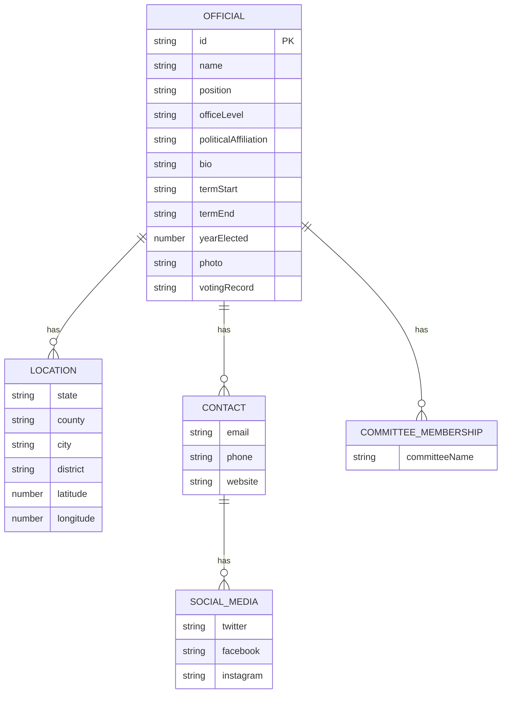
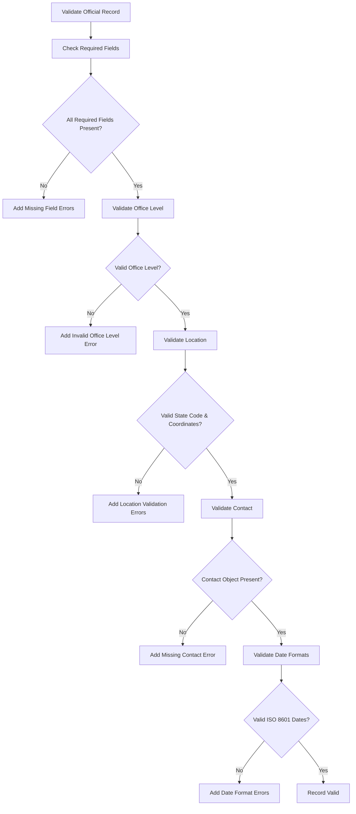
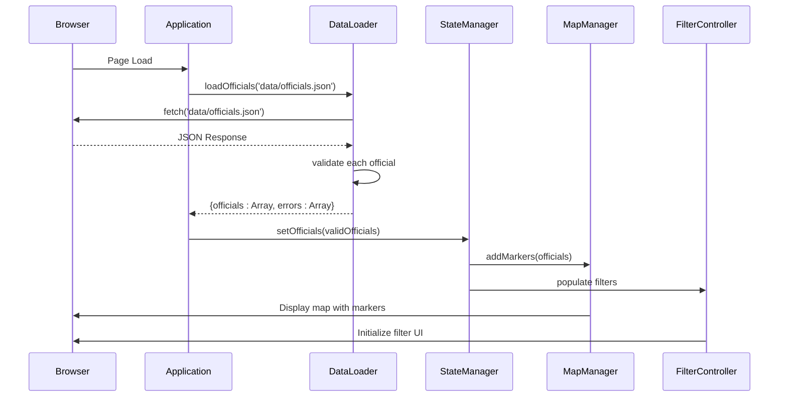
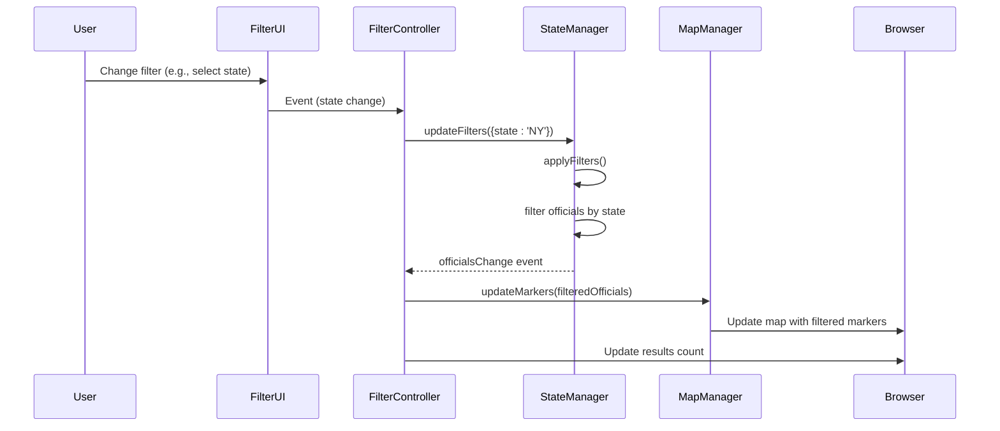
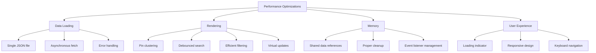
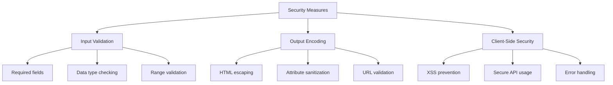

# Data Model

<cite>
**Referenced Files in This Document**   
- [officials.json](file://data/officials.json)
- [data-loader.js](file://js/data-loader.js)
- [state-manager.js](file://js/state-manager.js)
- [filter-controller.js](file://js/filter-controller.js)
- [map-manager.js](file://js/map-manager.js)
- [popup-component.js](file://js/popup-component.js)
</cite>

## Table of Contents
1. [Introduction](#introduction)
2. [Entity Relationships](#entity-relationships)
3. [Field Definitions](#field-definitions)
4. [Data Validation Rules](#data-validation-rules)
5. [Business Rules](#business-rules)
6. [Sample Data](#sample-data)
7. [Data Access Patterns](#data-access-patterns)
8. [Caching Strategies](#caching-strategies)
9. [Performance Considerations](#performance-considerations)
10. [Data Lifecycle and Retention](#data-lifecycle-and-retention)
11. [Data Migration and Version Management](#data-migration-and-version-management)
12. [Data Security and Access Control](#data-security-and-access-control)

## Introduction
The Democratic Socialist Officials Map application maintains a data model representing elected officials who identify as democratic socialists or socialists across the United States. The data model is centered around a single primary entity - the Official - which contains comprehensive information about each elected official, their position, contact details, and biographical information. The data is stored in a JSON format and loaded client-side, enabling interactive filtering, mapping, and visualization capabilities. This documentation provides a comprehensive overview of the data model, including entity relationships, field definitions, validation rules, and access patterns.

**Section sources**
- [officials.json](file://data/officials.json)
- [README.md](file://README.md)

## Entity Relationships
The application features a single primary entity, the Official, which contains nested sub-entities for location and contact information. These nested entities are not separate collections but rather structured components within each official record, creating a denormalized data model optimized for client-side rendering and filtering.



**Diagram sources**
- [officials.json](file://data/officials.json)
- [data-loader.js](file://js/data-loader.js)

## Field Definitions
The Official entity contains numerous fields that capture comprehensive information about each elected official. The data model includes both required and optional fields, with specific data types and constraints.

### Official Entity Fields
| Field | Type | Required | Description | Example |
|-------|------|----------|-------------|---------|
| id | string | Yes | Unique identifier for the official | "aoc-001" |
| name | string | Yes | Full name of the official | "Alexandria Ocasio-Cortez" |
| position | string | Yes | Official title and district | "U.S. Representative, NY-14" |
| officeLevel | string | Yes | Level of government office | "federal", "state", "city" |
| politicalAffiliation | string | Yes | Political party or organization | "Democratic Socialist" |
| bio | string | Yes | Biographical description | "Alexandria Ocasio-Cortez is the U.S. Representative..." |
| termStart | string (ISO 8601) | Yes | Start date of current term | "2019-01-03" |
| termEnd | string (ISO 8601) | No | End date of current term (null if ongoing) | null |
| yearElected | number | Yes | Year first elected to current position | 2018 |
| photo | string (URL) | No | URL to official's photograph | "https://ocasio-cortez.house.gov/..." |
| votingRecord | string (URL) | No | URL to voting record or description | "https://www.congress.gov/member/alexandria-ocasio-cortez/O000172" |

### Location Sub-entity Fields
| Field | Type | Required | Description | Example |
|-------|------|----------|-------------|---------|
| state | string | Yes | Two-letter state code | "NY" |
| county | string | No | County name | "Bronx" |
| city | string | No | City name | "Bronx" |
| district | string | No | District number | "14" |
| latitude | number | Yes | Geographic latitude | 40.8448 |
| longitude | number | Yes | Geographic longitude | -73.8648 |

### Contact Sub-entity Fields
| Field | Type | Required | Description | Example |
|-------|------|----------|-------------|---------|
| email | string | No | Official email address | "ocasiocortez@mail.house.gov" |
| phone | string | No | Official phone number | "(202) 225-3965" |
| website | string | No | Official website URL | "https://ocasio-cortez.house.gov" |
| socialMedia | object | No | Social media handles | {"twitter": "@AOC"} |

### Committee Memberships
The committeeMemberships field is an array of strings, each representing a committee on which the official serves.

**Section sources**
- [officials.json](file://data/officials.json)
- [data-loader.js](file://js/data-loader.js)

## Data Validation Rules
The application implements comprehensive validation rules to ensure data integrity and consistency. These rules are enforced through the DataLoader module, which validates each official record upon loading.

### Required Fields Validation
The following fields are required for each official record:
- id
- name
- position
- officeLevel
- politicalAffiliation
- bio
- termStart
- yearElected
- location (with required sub-fields: state, latitude, longitude)
- contact

### Office Level Validation
The officeLevel field must be one of the following predefined values:
- federal
- state
- county
- city
- town



**Diagram sources**
- [data-loader.js](file://js/data-loader.js#L21-L80)

### Location Validation
The location object must contain:
- A valid two-letter US state code (validated against a predefined list of 50 states)
- Latitude between 24 and 50 (continental US boundaries)
- Longitude between -125 and -66 (continental US boundaries)
- Numeric values for latitude and longitude

### Date Validation
Date fields (termStart and termEnd) must be in ISO 8601 format (YYYY-MM-DD). The validation checks if the string can be parsed as a valid JavaScript Date object.

**Section sources**
- [data-loader.js](file://js/data-loader.js#L7-L80)

## Business Rules
The application implements several business rules that govern how data is processed, displayed, and interacted with by users.

### Filtering Rules
The application supports multiple filtering dimensions that can be combined:
- **Search**: Full-text search across name, position, city, and county fields
- **State**: Filter by specific state using two-letter state code
- **Office Level**: Filter by one or more office levels (federal, state, county, city, town)
- **Political Affiliation**: Filter by one or more political affiliations
- **Year Elected**: Filter by year range (start and end years)

When multiple filters are applied, they are combined with AND logic - an official must satisfy all filter conditions to be displayed.

### Display Rules
- Officials are displayed on an interactive map with custom markers color-coded by office level
- Pin clustering is used to group nearby officials when zoomed out
- Clicking a pin displays a detailed popup with comprehensive information
- The filter panel is collapsible on mobile devices for better usability
- Keyboard navigation is supported (Escape key closes popups)

### Data Loading Rules
- All official data is loaded once when the application initializes
- Data is fetched from the officials.json file via HTTP request
- The application shows a loading indicator during data loading
- If data loading fails, an error message with reload option is displayed

**Section sources**
- [state-manager.js](file://js/state-manager.js)
- [filter-controller.js](file://js/filter-controller.js)
- [map-manager.js](file://js/map-manager.js)

## Sample Data
The following is a representative sample of an official record from the data model:

```json
{
  "id": "aoc-001",
  "name": "Alexandria Ocasio-Cortez",
  "position": "U.S. Representative, NY-14",
  "officeLevel": "federal",
  "politicalAffiliation": "Democratic Socialist",
  "location": {
    "state": "NY",
    "county": "Bronx",
    "city": "Bronx",
    "district": "14",
    "latitude": 40.8448,
    "longitude": -73.8648
  },
  "contact": {
    "email": "ocasiocortez@mail.house.gov",
    "phone": "(202) 225-3965",
    "website": "https://ocasio-cortez.house.gov",
    "socialMedia": {
      "twitter": "@AOC",
      "instagram": "@aoc"
    }
  },
  "photo": "https://ocasio-cortez.house.gov/sites/evo-subsites/ocasio-cortez.house.gov/files/styles/large/public/evo-media-image/aoc-headshot.jpg",
  "bio": "Alexandria Ocasio-Cortez is the U.S. Representative for New York's 14th congressional district. A member of the Democratic Socialists of America, she advocates for progressive policies including the Green New Deal, Medicare for All, and tuition-free public college.",
  "termStart": "2019-01-03",
  "termEnd": null,
  "committeeMemberships": [
    "Committee on Financial Services",
    "Committee on Oversight and Reform"
  ],
  "votingRecord": "https://www.congress.gov/member/alexandria-ocasio-cortez/O000172",
  "yearElected": 2018
}
```

**Section sources**
- [officials.json](file://data/officials.json)

## Data Access Patterns
The application implements a client-side data access pattern where all data is loaded into the browser memory upon initialization, enabling fast filtering and interaction without additional server requests.

### Primary Data Access Flow


### Filtering Access Pattern
When users apply filters, the application accesses the already-loaded data and applies client-side filtering:



**Diagram sources**
- [app.js](file://js/app.js)
- [data-loader.js](file://js/data-loader.js)
- [state-manager.js](file://js/state-manager.js)
- [filter-controller.js](file://js/filter-controller.js)
- [map-manager.js](file://js/map-manager.js)

## Caching Strategies
The application employs several caching strategies to optimize performance and user experience.

### Client-Side Data Caching
All official data is cached in the browser's memory after the initial load, eliminating the need for subsequent server requests when filtering or interacting with the data.

### State Management Caching
The StateManager module maintains multiple cached representations of the data:
- allOfficials: Complete dataset as loaded
- filteredOfficials: Current filtered subset
- filters: Current filter state

This caching approach enables instant filtering and rapid state restoration.

### DOM Element Caching
The application caches DOM elements in module-level variables to avoid repeated DOM queries:

```javascript
// In filter-controller.js
let elements = {};
// ...
elements = {
  searchInput: document.getElementById('search-input'),
  stateSelect: document.getElementById('state-select'),
  // ... other elements
};
```

### Marker Caching
The MapManager module maintains a Map object that caches marker references by official ID, allowing for efficient marker updates and access:

```javascript
const markers = new Map(); // officialId -> marker
```

**Section sources**
- [state-manager.js](file://js/state-manager.js)
- [filter-controller.js](file://js/filter-controller.js)
- [map-manager.js](file://js/map-manager.js)

## Performance Considerations
The application is designed with several performance optimizations to ensure smooth user experience, particularly when handling larger datasets.

### Data Loading Performance
- Single HTTP request for all data (reduces network overhead)
- JSON format for efficient parsing
- Asynchronous loading with loading indicator
- Error handling for failed requests

### Rendering Performance
- Pin clustering to reduce visual clutter and improve rendering speed
- Virtual DOM-like updates (only changing what's necessary)
- Debounced search input (300ms delay) to prevent excessive filtering
- Efficient filtering algorithms with early termination

### Memory Performance
- Data is stored once and referenced throughout the application
- Event listeners are properly managed to prevent memory leaks
- Unused markers are properly cleaned up when filtering

### Optimization Techniques
The application implements several specific optimization techniques:



**Diagram sources**
- [README.md](file://README.md)
- [app.js](file://js/app.js)
- [map-manager.js](file://js/map-manager.js)
- [filter-controller.js](file://js/filter-controller.js)

## Data Lifecycle and Retention
The application follows a straightforward data lifecycle model with client-side data retention.

### Data Lifecycle Stages
1. **Initialization**: Application loads and displays loading indicator
2. **Loading**: Fetch official data from JSON file
3. **Validation**: Validate each official record
4. **Caching**: Store validated data in memory
5. **Display**: Render map and initialize UI components
6. **Interaction**: Users filter and interact with data
7. **Cleanup**: Data remains in memory until page navigation

### Data Retention Policy
- Data is retained in browser memory for the duration of the page session
- No persistent storage (localStorage, sessionStorage) is used
- Data is reloaded on each page visit
- No automatic data refresh mechanism (static data)

### Data Archival Rules
The application does not implement data archival rules as it serves as a read-only visualization of current officials. Historical data is not maintained within the application, though previous versions of the data file may be archived in the source control system.

**Section sources**
- [app.js](file://js/app.js)
- [data-loader.js](file://js/data-loader.js)

## Data Migration and Version Management
The application's data migration and version management strategy is designed for simplicity and ease of maintenance.

### Data Migration Paths
When adding or updating officials, the process involves:
1. Editing the `data/officials.json` file
2. Ensuring all required fields are present
3. Validating data against the schema
4. Testing the application with the updated data
5. Deploying the updated files

### Version Management
The application uses semantic versioning through the package.json file. Data changes are tracked alongside code changes in the Git repository, allowing for:
- Version history of data changes
- Rollback to previous data states
- Comparison of data across versions
- Collaboration on data updates

### Schema Evolution
If the data schema needs to evolve, the following approach is used:
1. Update the validation rules in data-loader.js
2. Modify the popup-component.js to display new fields
3. Update the README.md documentation
4. Test backward compatibility with existing data
5. Deploy changes with updated sample data

The application is designed to be resilient to schema changes, with optional fields that can be added without breaking existing functionality.

**Section sources**
- [README.md](file://README.md)
- [data-loader.js](file://js/data-loader.js)
- [popup-component.js](file://js/popup-component.js)
- [package.json](file://package.json)

## Data Security and Access Control
The application implements several security measures to protect data and ensure appropriate access.

### Data Security Requirements
- Data is served over HTTPS in production
- Input validation to prevent XSS attacks
- Proper encoding of HTML content
- No sensitive personal information stored
- Public data only (elected officials' information)

### Access Control
The application is publicly accessible with no authentication or authorization requirements, as all data represents publicly available information about elected officials.

### Privacy Considerations
The application respects privacy by:
- Only including information that is publicly available
- Providing opt-out mechanism for officials who wish to be removed
- Following data minimization principles (only collecting necessary data)
- Not tracking user behavior or collecting personal data

### Security Implementation
The code includes specific security measures:



**Diagram sources**
- [data-loader.js](file://js/data-loader.js)
- [popup-component.js](file://js/popup-component.js)