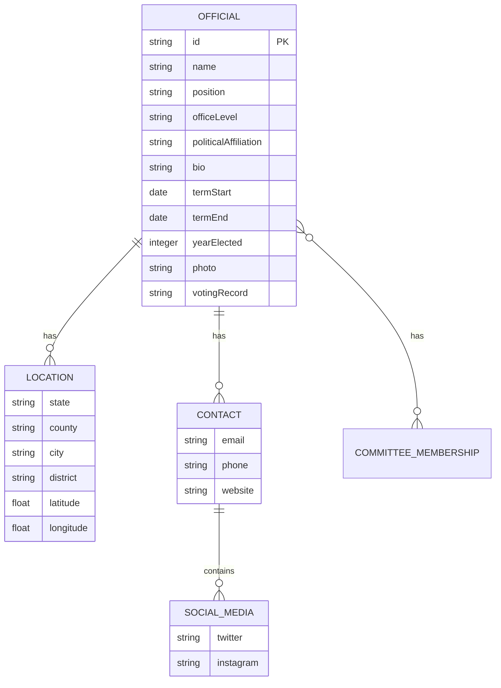

# Official Schema

<cite>
**Referenced Files in This Document**   
- [officials.json](file://data/officials.json)
- [state-manager.js](file://js/state-manager.js)
- [data-loader.js](file://js/data-loader.js)
</cite>

## Table of Contents
1. [Introduction](#introduction)
2. [Data Model Overview](#data-model-overview)
3. [Entity Relationships](#entity-relationships)
4. [Field Definitions and Data Types](#field-definitions-and-data-types)
5. [Primary Keys and Constraints](#primary-keys-and-constraints)
6. [Validation Rules](#validation-rules)
7. [Business Rules](#business-rules)
8. [Sample Data](#sample-data)
9. [Data Access Patterns](#data-access-patterns)
10. [Error Handling Strategies](#error-handling-strategies)

## Introduction

The Official Schema defines the data structure for storing information about democratic socialist officials in the United States. This documentation provides a comprehensive overview of the schema, including entity relationships, field definitions, constraints, and validation rules. The schema is implemented as a JSON data file (`officials.json`) that is loaded and managed by the application's data layer components. The data model supports a web application that displays information about socialist officials at various levels of government, from federal to local positions.

The schema is designed to be both comprehensive and flexible, capturing essential information about officials while allowing for optional fields where data may not be available. The data is validated upon loading to ensure data integrity and consistency across the application. This documentation will detail all aspects of the schema, including the structure, relationships, constraints, and access patterns that define how the data is stored, validated, and retrieved.

**Section sources**
- [officials.json](file://data/officials.json#L1-L493)

## Data Model Overview

The Official Schema represents a hierarchical data model with a single root entity (Official) that contains nested objects for location and contact information. Each official record is a self-contained JSON object that includes all relevant information about a particular official. The data model follows a denormalized approach, where related information is embedded within each official record rather than being stored in separate tables or collections.

The primary entity in the schema is the Official, which serves as the container for all information about a specific elected official. Each official has a unique identifier and contains various attributes that describe their position, affiliation, location, contact information, biographical details, and term information. The schema includes nested objects for location and contact details, which group related fields together for better organization and data integrity.

The data model supports officials at multiple levels of government, including federal, state, county, city, and town positions. This allows the application to display a comprehensive view of socialist representation across different governmental jurisdictions. The schema is designed to be extensible, allowing for additional fields to be added in the future without breaking existing functionality.

**Diagram sources**
- [officials.json](file://data/officials.json#L1-L493)

**Section sources**
- [officials.json](file://data/officials.json#L1-L493)

## Entity Relationships

The Official Schema features a hierarchical relationship structure with the Official entity at the center. The schema implements a composition pattern where the Official entity contains nested objects for location and contact information. This design choice reflects the fact that location and contact details are intrinsic properties of an official and cannot exist independently of the official record.

The primary relationship in the schema is between the Official and its Location. Each official has exactly one location object that contains geographical information including state, county, city, district, and geographic coordinates. The location data is critical for mapping functionality in the application, allowing officials to be displayed on a map based on their latitude and longitude coordinates. The state field in the location object serves as a foreign key to U.S. state codes, ensuring that all officials are associated with valid states.

The Official also has a one-to-one relationship with its Contact information. The contact object contains communication details such as email, phone, website, and social media links. Within the contact object, there is a further composition relationship with the SocialMedia entity, which contains specific social media handles. This nested structure allows for extensibility, as additional social media platforms could be added in the future without modifying the main contact structure.

Additionally, the Official entity has a one-to-many relationship with committee memberships, represented as an array of strings. This allows each official to be associated with multiple congressional or legislative committees. The array structure provides flexibility to accommodate officials with varying numbers of committee assignments, from none to several.

**Diagram sources**
- [officials.json](file://data/officials.json#L1-L493)

**Section sources**
- [officials.json](file://data/officials.json#L1-L493)

## Field Definitions and Data Types

The Official Schema consists of multiple fields with specific data types and purposes. Each field serves a distinct role in representing information about socialist officials. The schema uses a combination of primitive data types (strings, numbers, booleans) and complex types (objects, arrays) to capture the necessary information.

The core identification fields include `id`, `name`, and `position`. The `id` field is a string that serves as the primary key for each official record, following a consistent naming convention of initials followed by a sequential number (e.g., "aoc-001"). The `name` field stores the full name of the official as a string, while the `position` field describes their specific role and jurisdiction.

The `officeLevel` field is an enumeration that specifies the governmental level of the official's position, with valid values including "federal", "state", "county", "city", and "town". This field is critical for filtering and categorizing officials within the application. The `politicalAffiliation` field captures the official's political alignment as a string, with values like "Democratic Socialist" or "Socialist Alternative".

The location object contains geographical information with the `state` field using standard two-letter U.S. state codes, `county` and `city` fields for more specific location details, `district` for electoral district information, and `latitude`/`longitude` fields as floating-point numbers for precise geographic positioning.

The contact object includes `email`, `phone`, and `website` fields for official communication channels, along with a nested `socialMedia` object containing `twitter` and `instagram` handles. Additional fields include `bio` for a biographical description, `termStart` and `termEnd` for term dates (with `termEnd` being nullable for current officials), `yearElected` as an integer, `photo` URL, `votingRecord` URL, and `committeeMemberships` as an array of strings.

**Section sources**
- [officials.json](file://data/officials.json#L1-L493)

## Primary Keys and Constraints

The Official Schema implements several constraints to ensure data integrity and consistency. The primary key for each official record is the `id` field, which must be unique across all records in the dataset. This unique identifier allows for reliable referencing and retrieval of specific officials within the application.

The schema enforces several required fields that must be present for a valid official record. These required fields include: `id`, `name`, `position`, `officeLevel`, `politicalAffiliation`, `bio`, `termStart`, and `yearElected`. The presence of these fields is validated during data loading, and records missing any of these required fields will be rejected.

Additional constraints are applied to specific fields to ensure data quality. The `state` field within the location object must contain a valid two-letter U.S. state code from a predefined list of 50 states. The `officeLevel` field is constrained to one of five valid values: "federal", "state", "county", "city", or "town". The `latitude` and `longitude` fields must contain numeric values that fall within the geographical boundaries of the United States (latitude between 24 and 50, longitude between -125 and -66).

The schema also includes structural constraints. The `location` and `contact` fields are required objects that must be present, though individual properties within these objects may be optional or nullable. The `committeeMemberships` field is an array that can contain zero or more string values, with no upper limit on the number of committees an official can belong to.

These constraints work together to maintain data consistency and prevent invalid or malformed records from being processed by the application. The validation occurs at the data loading stage, ensuring that only properly formatted and complete records are made available to the rest of the application.

**Section sources**
- [data-loader.js](file://js/data-loader.js#L8-L15)
- [data-loader.js](file://js/data-loader.js#L22-L80)

## Validation Rules

The Official Schema implements comprehensive validation rules through the DataLoader module to ensure data integrity when loading official records. These validation rules are applied to each official record in the JSON data file before the data is made available to the application.

The validation process begins with checking for required fields. The following fields are mandatory and must be present in each official record: `id`, `name`, `position`, `officeLevel`, `politicalAffiliation`, `bio`, `termStart`, and `yearElected`. If any of these fields are missing, the validation fails and an appropriate error message is generated.

For the `officeLevel` field, the validation checks that the value is one of the predefined valid levels: "federal", "state", "county", "city", or "town". Any other value is considered invalid and will cause the record to fail validation. This ensures consistency in how officials are categorized by their level of government.

The location data undergoes several validation checks. The `state` field must contain a valid two-letter U.S. state code from the predefined list of 50 states. The `latitude` and `longitude` fields must be numeric values. Additionally, the geographic coordinates are validated to ensure they fall within the continental United States boundaries (latitude between 24 and 50, longitude between -125 and -66).

Date fields are validated for proper ISO 8601 format. The `termStart` and `termEnd` fields must be valid date strings that can be parsed by JavaScript's Date constructor. The validation function checks that the date string creates a valid Date object without returning NaN.

The contact information is validated to ensure the `contact` object exists, though individual contact methods (email, phone, website) are not required to be present. This allows for officials who may not have all communication channels available.

All validation errors are collected and reported, allowing administrators to identify and correct issues in the data file. The validation process is designed to be informative, providing specific error messages that help pinpoint the exact nature and location of data problems.

**Section sources**
- [data-loader.js](file://js/data-loader.js#L22-L80)

## Business Rules

The Official Schema implements several business rules that govern the requirements and behavior of the data. These rules reflect the operational requirements of the application and the nature of the information being represented.

Required fields follow the principle that certain information is essential for every official record. The business rule requires that all officials have a unique identifier (`id`), full name (`name`), specific position title (`position`), level of government (`officeLevel`), political affiliation (`politicalAffiliation`), biographical description (`bio`), start date of their current term (`termStart`), and the year they were first elected to their current position (`yearElected`). These fields are considered fundamental to understanding who the official is and what they represent.

Optional fields are those where information may not be available or applicable for all officials. The `photo` field is optional, as not all officials may have a publicly available photograph. The `termEnd` field is typically null for current officials who are still serving their term. The `votingRecord` URL may not be available for state or local officials who do not have centralized voting records. Various contact methods (email, phone, specific social media) are optional, recognizing that officials may not maintain all communication channels.

The schema also implements business rules around data consistency. Officials must be associated with a valid U.S. state, ensuring geographical accuracy. The office level must be one of the predefined categories, maintaining consistency in how officials are classified. Geographic coordinates must fall within U.S. boundaries, preventing errors in mapping functionality.

Another business rule is that committee memberships are represented as an array of strings, allowing for multiple committee assignments but not requiring any specific number. This accommodates the reality that officials may serve on zero, one, or multiple committees depending on their position and seniority.

These business rules ensure that the data remains useful, accurate, and consistent across all officials in the system, while allowing for the natural variations that exist in real-world political data.

**Section sources**
- [data-loader.js](file://js/data-loader.js#L22-L80)
- [officials.json](file://data/officials.json#L1-L493)

## Sample Data

The Official Schema contains sample data representing actual democratic socialist officials in the United States. The data file includes records for prominent figures at various levels of government, from federal representatives to city council members.

A representative sample record from the dataset is Alexandria Ocasio-Cortez, who serves as a U.S. Representative for New York's 14th congressional district. Her record includes the ID "aoc-001", her full name, position title, "federal" office level, "Democratic Socialist" political affiliation, and detailed location information for the Bronx, NY. Her contact information includes an official House email, phone number, website, and social media handles. The record also contains her biographical description, term start date (2019-01-03), year elected (2018), and committee memberships in the Financial Services and Oversight committees.

Another example is Kshama Sawant, a Seattle City Council member with "city" office level. Her record demonstrates how local officials are represented, including her district (3), city (Seattle), and state (WA). The record shows that some fields like photo and voting record may be null when information is not available.

The dataset also includes state-level officials like Julia Salazar, a New York State Senator, and federal senators like Bernie Sanders. This variety demonstrates the schema's ability to represent officials across different governmental levels with consistent structure.

The sample data shows that required fields are consistently populated across all records, while optional fields vary based on the availability of information. The geographic coordinates are precise, allowing for accurate mapping of officials across the country. The data represents a mix of long-serving officials and those recently elected, with term start dates ranging from 2014 to the present.

**Section sources**
- [officials.json](file://data/officials.json#L1-L493)

## Data Access Patterns

The Official Schema implements specific data access patterns through the StateManager module, which provides controlled access to the official data. The primary methods for data retrieval are `getAllOfficials()` and `getFilteredOfficials()`, which expose different views of the data based on application needs.

The `getAllOfficials()` method returns the complete dataset of valid officials that have passed validation. This method provides direct access to the full collection of official records without any filtering or modification. It is typically used when initializing components that need to process all available data or when resetting filters to show all officials.

The `getFilteredOfficials()` method returns a subset of officials based on the current filter state. This method applies multiple filtering criteria including text search, state selection, office level, political affiliation, and year elected range. The filtering is performed client-side, allowing for responsive user interactions without additional server requests.

The StateManager maintains the data in memory after initial loading, implementing a caching pattern that improves performance by avoiding repeated data loading. The state object contains both `allOfficials` (the complete validated dataset) and `filteredOfficials` (the current filtered subset), allowing for efficient switching between views.

When filters are updated through the `updateFilters()` method, the StateManager automatically reapplies all filtering criteria and updates the `filteredOfficials` array. This triggers notifications to subscribed components, enabling a reactive user interface that updates in response to filter changes.

The data access pattern follows a publish-subscribe model, where components can subscribe to state changes and be notified when the official data or filters are updated. This decouples data management from UI components, allowing multiple parts of the application to respond to data changes independently.

**Section sources**
- [state-manager.js](file://js/state-manager.js#L179-L188)
- [state-manager.js](file://js/state-manager.js#L76-L137)

## Error Handling Strategies

The Official Schema implements comprehensive error handling strategies to manage data validation issues and loading failures. These strategies ensure that the application can gracefully handle imperfect data while maintaining data integrity.

During data loading, the DataLoader module implements a robust error handling process. When fetching the JSON data file, network errors or HTTP status errors are caught and rethrown with descriptive messages. If the response is not successful, an error is thrown with the HTTP status information, allowing higher-level code to handle connection issues appropriately.

For data format validation, the system checks that the response is a valid JSON array. If the data is not an array, an error is thrown indicating the invalid format. This prevents the application from attempting to process malformed data structures.

The most sophisticated error handling occurs during individual record validation. Rather than failing on the first error, the validation process collects all errors for each record and continues processing subsequent records. This allows multiple issues to be identified and reported simultaneously, rather than requiring iterative fixes. Invalid records are excluded from the final dataset, but detailed error information is preserved and logged to the console.

Validation errors are categorized by type, including missing required fields, invalid office levels, invalid state codes, missing location data, invalid geographic coordinates, and invalid date formats. Each error type has a specific message that clearly identifies the problem, making it easier to correct the source data.

When validation errors are encountered, the system logs a warning to the console with details about the affected record (index, ID, name) and the specific validation errors. This provides developers and data maintainers with actionable information to fix data issues. The system also logs a summary of how many valid officials were loaded versus the total count, giving a quick overview of data quality.

The error handling strategy prioritizes application stability by ensuring that invalid data does not crash the application. Instead, problematic records are isolated and excluded from the active dataset, while valid records are still made available for use. This fault-tolerant approach allows the application to function even when some data issues exist, while providing clear feedback about those issues.

**Section sources**
- [data-loader.js](file://js/data-loader.js#L98-L148)
- [data-loader.js](file://js/data-loader.js#L116-L130)