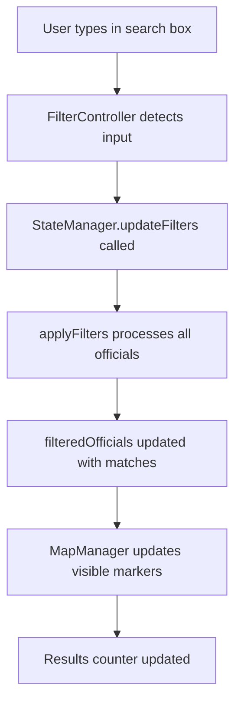

# State Structure

<cite>
**Referenced Files in This Document**   
- [state-manager.js](file://js/state-manager.js)
- [data-loader.js](file://js/data-loader.js)
- [filter-controller.js](file://js/filter-controller.js)
</cite>

## Table of Contents
1. [Introduction](#introduction)
2. [State Properties](#state-properties)
3. [Filter Object Structure](#filter-object-structure)
4. [State Management Methods](#state-management-methods)
5. [State Transitions](#state-transitions)
6. [Event Notification System](#event-notification-system)
7. [Filter Affiliations Initialization](#filter-affiliations-initialization)

## Introduction
The StateManager module maintains the application's state for filters, selected officials, and officials data. It provides a centralized state management system that coordinates between different components of the application, including the filter controller, map manager, and popup component. The state structure is designed to support filtering, searching, and selection operations on a collection of elected officials.

**Section sources**
- [state-manager.js](file://js/state-manager.js#L8-L21)

## State Properties
The application state consists of five main properties that track the current data and user interactions:

- **allOfficials**: Array containing all loaded official records from the JSON data file
- **filteredOfficials**: Array containing officials that match the current filter criteria
- **filters**: Object containing the current filter settings across multiple dimensions
- **selectedOfficial**: Reference to the currently selected official, or null if none selected
- **isLoading**: Boolean flag indicating whether data is still being loaded

These properties are maintained in a private state object within the StateManager module, ensuring encapsulation and controlled access through public methods.

**Section sources**
- [state-manager.js](file://js/state-manager.js#L8-L21)

## Filter Object Structure
The filters object contains six properties that define the current filtering criteria:

- **search**: String value for text-based searching across name, position, city, and county fields
- **state**: String value representing the selected state code (e.g., "CA" for California)
- **officeLevels**: Array of strings representing selected office levels (federal, state, county, city, town)
- **affiliations**: Array of strings representing selected political affiliations
- **yearStart**: Numeric value representing the earliest year elected (inclusive)
- **yearEnd**: Numeric value representing the latest year elected (inclusive)

The filter object is initialized with default values, including all office levels pre-selected and affiliations populated dynamically from the data.

**Section sources**
- [state-manager.js](file://js/state-manager.js#L11-L18)

## State Management Methods
The StateManager provides several methods to update and retrieve state:

### setOfficials
Initializes the state with official data, setting both allOfficials and filteredOfficials arrays to the provided data. This method also sets isLoading to false and initializes the affiliations filter based on unique values from the data.

### updateFilters
Updates the current filters with new filter values and automatically reapplies filtering to update filteredOfficials. This method uses object spreading to merge new filter values with existing ones.

### setSelectedOfficial
Updates the selectedOfficial property and notifies listeners of the state change. Passing null deselects any currently selected official.

### resetFilters
Resets all filters to their default values, including repopulating affiliations based on current official data.

**Section sources**
- [state-manager.js](file://js/state-manager.js#L56-L79)
- [state-manager.js](file://js/state-manager.js#L162-L164)
- [state-manager.js](file://js/state-manager.js#L142-L155)

## State Transitions
State changes occur in response to user interactions and data loading operations:

### Filtering Operations
When filters are updated through the FilterController, the following sequence occurs:
1. updateFilters is called with new filter values
2. The filters object is updated with the new values
3. applyFilters processes all officials against the current filter criteria
4. filteredOfficials is updated with the matching officials
5. 'filterChange' and 'officialsChange' events are notified

### Official Selection
When an official is selected (e.g., by clicking a map marker):
1. setSelectedOfficial is called with the official object
2. selectedOfficial property is updated
3. 'stateChange' event is notified to all subscribers

### Example State Transition During Filtering


**Diagram sources**
- [state-manager.js](file://js/state-manager.js#L76-L78)
- [filter-controller.js](file://js/filter-controller.js#L44)
- [map-manager.js](file://js/map-manager.js#L173)

**Section sources**
- [state-manager.js](file://js/state-manager.js#L75-L79)
- [filter-controller.js](file://js/filter-controller.js#L40-L46)

## Event Notification System
The StateManager implements an event subscription system that allows components to react to state changes:

- **stateChange**: Notified when any state property changes, including selectedOfficial
- **filterChange**: Notified when filter values are updated
- **officialsChange**: Notified when allOfficials or filteredOfficials changes

Components subscribe to these events to update their UI or behavior accordingly. For example, the FilterController subscribes to officialsChange to update the results counter and map markers.

**Section sources**
- [state-manager.js](file://js/state-manager.js#L24-L28)
- [state-manager.js](file://js/state-manager.js#L46-L49)
- [filter-controller.js](file://js/filter-controller.js#L95-L96)

## Filter Affiliations Initialization
The affiliations filter is initialized dynamically based on the data using DataLoader.getUniqueValues:

1. When setOfficials is called with official data, it calls DataLoader.getUniqueValues with the officials array and 'politicalAffiliation' field
2. getUniqueValues iterates through all officials, extracts the politicalAffiliation value, and collects unique values in a Set
3. The Set is converted to a sorted array and assigned to state.filters.affiliations
4. This ensures the filter options reflect the actual data rather than hard-coded values

The same initialization process occurs when resetFilters is called, ensuring affiliations are always up-to-date with the current dataset.

```mermaid
flowchart TD
A[setOfficials called] --> B[getUniqueValues(officials, 'politicalAffiliation')]
B --> C[Iterate through all officials]
C --> D[Extract politicalAffiliation field]
D --> E[Add to Set to ensure uniqueness]
E --> F[Convert Set to sorted array]
F --> G[Assign to filters.affiliations]
G --> H[Update UI with new affiliation options]
```

**Diagram sources**
- [state-manager.js](file://js/state-manager.js#L62-L63)
- [data-loader.js](file://js/data-loader.js#L157-L173)
- [filter-controller.js](file://js/filter-controller.js#L184-L185)

**Section sources**
- [state-manager.js](file://js/state-manager.js#L61-L64)
- [data-loader.js](file://js/data-loader.js#L156-L173)
- [filter-controller.js](file://js/filter-controller.js#L183-L186)