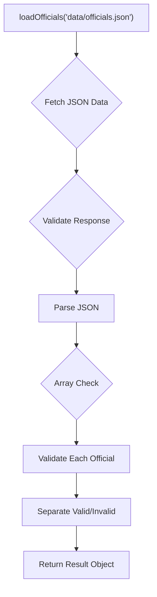
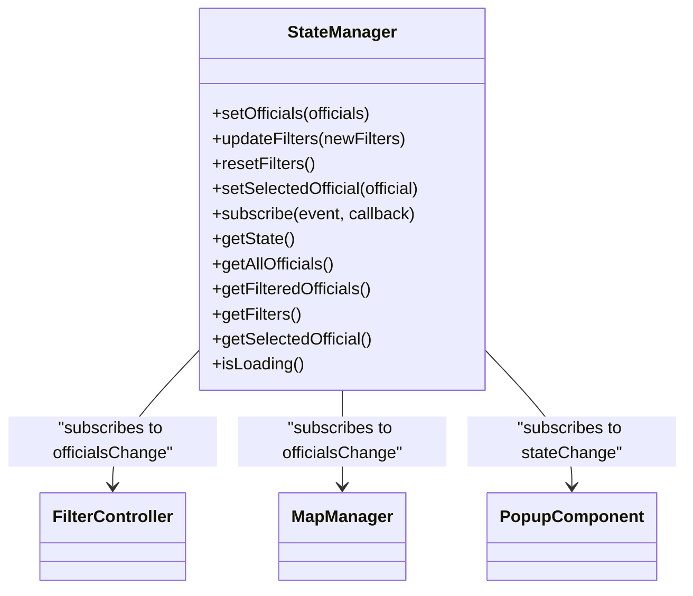
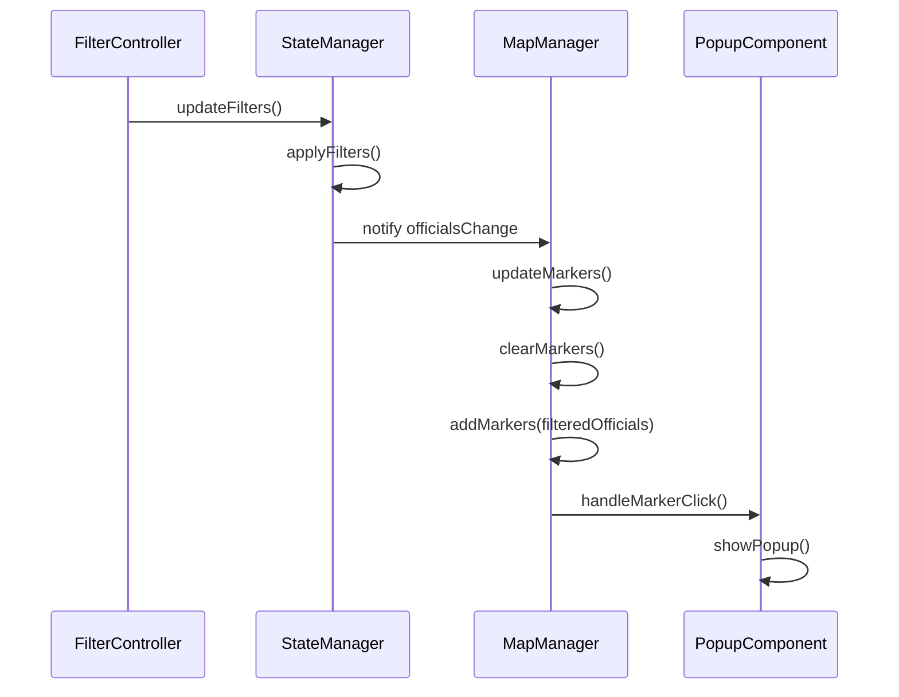
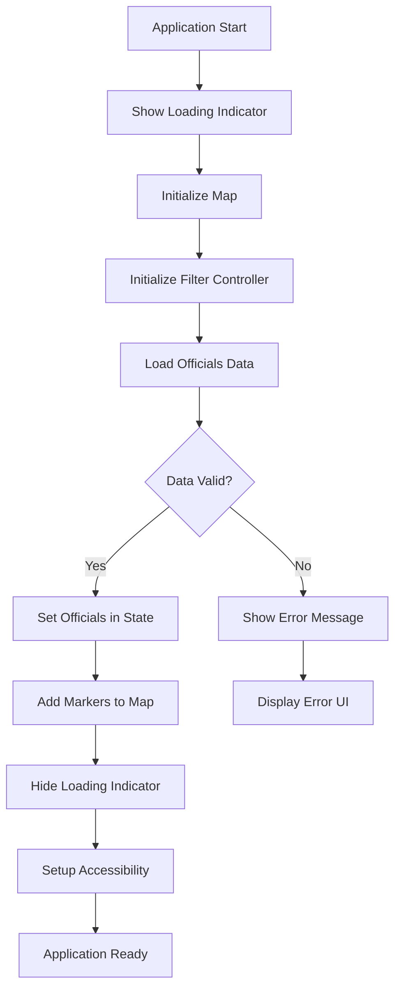

# Module Documentation

<cite>
**Referenced Files in This Document**   
- [app.js](file://js/app.js)
- [data-loader.js](file://js/data-loader.js)
- [filter-controller.js](file://js/filter-controller.js)
- [map-manager.js](file://js/map-manager.js)
- [popup-component.js](file://js/popup-component.js)
- [state-manager.js](file://js/state-manager.js)
- [officials.json](file://data/officials.json)
</cite>

## Table of Contents
1. [Introduction](#introduction)
2. [Core Components](#core-components)
3. [Data Loader Module](#data-loader-module)
4. [State Manager Module](#state-manager-module)
5. [Map Manager Module](#map-manager-module)
6. [Filter Controller Module](#filter-controller-module)
7. [Popup Component Module](#popup-component-module)
8. [Application Initialization](#application-initialization)
9. [Component Relationships](#component-relationships)
10. [Configuration and Parameters](#configuration-and-parameters)
11. [Common Issues and Solutions](#common-issues-and-solutions)

## Introduction
The Democratic Socialist Officials Map is an interactive web application that displays elected Democratic Socialist and Socialist officials across the United States. The application features an interactive map with pin clustering, advanced filtering capabilities, and detailed information popups for each official. Built with vanilla JavaScript and Leaflet.js, the application follows a modular architecture with clear separation of concerns between data loading, state management, map rendering, and user interface components.

## Core Components
The application consists of five main JavaScript modules that work together to provide the complete functionality:
- **DataLoader**: Handles loading and validation of official data from JSON
- **StateManager**: Maintains application state including filters and selected officials
- **MapManager**: Manages the Leaflet map, markers, and clustering
- **FilterController**: Handles filter UI interactions and state updates
- **PopupComponent**: Displays detailed information about officials in popups

These modules follow the module pattern and communicate through well-defined interfaces and event subscriptions.

**Section sources**
- [app.js](file://js/app.js#L1-L142)
- [README.md](file://README.md#L1-L153)

## Data Loader Module
The DataLoader module is responsible for loading and validating official data from the JSON file. It provides a clean API for data operations and ensures data integrity through comprehensive validation.

### Implementation Details
The module exports several key functions:
- `loadOfficials(url)`: Asynchronously loads officials data from the specified URL
- `validateOfficial(official)`: Validates a single official record against required fields
- `getUniqueValues(officials, field)`: Extracts unique values for a specific field across all officials

The module includes validation rules for office levels and state codes, ensuring data consistency.

### Domain Model
The data model follows a strict schema with required and optional fields as defined in the README. Each official record contains comprehensive information including personal details, contact information, term dates, and committee memberships.

### Usage Patterns
The DataLoader is typically used during application initialization to load data and validate it before processing. It returns a structured result containing valid officials and any validation errors encountered.



**Diagram sources**
- [data-loader.js](file://js/data-loader.js#L3-L183)

**Section sources**
- [data-loader.js](file://js/data-loader.js#L3-L183)
- [README.md](file://README.md#L72-L95)

## State Manager Module
The StateManager module maintains the application's state, including officials data, filters, and the currently selected official. It implements an event-driven architecture to notify other components of state changes.

### Implementation Details
The module uses a central state object that contains:
- `allOfficials`: Complete list of loaded officials
- `filteredOfficials`: Current filtered subset
- `filters`: Current filter criteria
- `selectedOfficial`: Currently selected official
- `isLoading`: Loading state flag

The module provides methods to update state and subscribe to state changes, enabling reactive updates across the application.

### Interfaces
Key public methods include:
- `setOfficials(officials)`: Sets the officials data and triggers notifications
- `updateFilters(newFilters)`: Updates filter criteria and reapplies filtering
- `resetFilters()`: Resets all filters to default values
- `setSelectedOfficial(official)`: Updates the selected official
- `subscribe(event, callback)`: Subscribes to state change events

### Invocation Relationship
Other modules subscribe to state changes to update their UI accordingly:
- FilterController listens for `officialsChange` to update results count
- MapManager listens for `officialsChange` to update markers
- PopupComponent uses `getSelectedOfficial()` to determine popup state



**Diagram sources**
- [state-manager.js](file://js/state-manager.js#L3-L228)

**Section sources**
- [state-manager.js](file://js/state-manager.js#L3-L228)
- [app.js](file://js/app.js#L30-L35)

## Map Manager Module
The MapManager module handles all aspects of the Leaflet map, including initialization, marker rendering, clustering, and user interactions.

### Implementation Details
The module initializes a Leaflet map centered on the continental United States and adds OpenStreetMap tiles. It uses Leaflet.markercluster for pin clustering, which automatically groups nearby officials when zoomed out.

Key features include:
- Custom marker icons with color coding by office level
- Zoom level configuration based on office type
- Marker clustering with custom cluster icons
- Smooth zoom animations to official locations

### Domain Model
The module maintains references to:
- `map`: Leaflet map instance
- `markerClusterGroup`: Marker cluster group for pin clustering
- `markers`: Map of officialId to marker objects

### Usage Patterns
The module is initialized early in the application lifecycle and provides methods to add, update, and clear markers based on the current state. It responds to marker clicks by updating the application state and showing popups.



**Diagram sources**
- [map-manager.js](file://js/map-manager.js#L3-L216)

**Section sources**
- [map-manager.js](file://js/map-manager.js#L3-L216)
- [app.js](file://js/app.js#L18-L19)

## Filter Controller Module
The FilterController module manages the filter UI and interactions, providing advanced filtering capabilities for officials.

### Implementation Details
The module caches DOM elements for performance and sets up event listeners for various filter controls:
- Search input with debounce (300ms)
- State dropdown selection
- Office level checkboxes
- Year range inputs
- Clear filters button

It uses event delegation and proper event handling to ensure responsive interactions.

### Configuration Options
The filter UI supports multiple filtering dimensions:
- **Text search**: Name, position, city, or county
- **State**: Filter by specific state
- **Office Level**: Federal, state, county, city, or town
- **Political Affiliation**: Dynamic checkboxes based on data
- **Year Elected**: Range filter for election year

### Parameters and Return Values
The module's public API includes:
- `init()`: Initializes the filter controller and event listeners
- `populateStateDropdown()`: Populates the state dropdown with valid states
- `populateAffiliationCheckboxes(affiliations)`: Creates checkboxes for political affiliations
- `resetFilterUI()`: Resets all filter controls to default values

**Section sources**
- [filter-controller.js](file://js/filter-controller.js#L3-L269)
- [README.md](file://README.md#L9-L13)

## Popup Component Module
The PopupComponent module handles the creation and display of information popups when users click on official markers.

### Implementation Details
The module creates rich HTML content for popups, including:
- Official's name, position, and office level badge
- Biography and contact information
- Political affiliation and term dates
- Committee memberships and voting record
- Location details

It formats dates appropriately and escapes HTML to prevent XSS vulnerabilities.

### Usage Patterns
When a marker is clicked, the MapManager calls `handleMarkerClick()`, which in turn calls `PopupComponent.showPopup()` with the official data and coordinates. The popup automatically closes when clicking elsewhere or pressing Escape.

### Return Values
The module provides:
- `showPopup(official, latlng)`: Displays popup at specified coordinates
- `closePopup()`: Closes the current popup
- `getCurrentPopup()`: Returns the current popup instance
- `createPopupContent(official)`: Generates HTML content for an official

**Section sources**
- [popup-component.js](file://js/popup-component.js#L3-L262)
- [map-manager.js](file://js/map-manager.js#L139-L151)

## Application Initialization
The application initialization process coordinates all modules to create a functional application.

### Startup Sequence
1. Show loading indicator
2. Initialize map with MapManager
3. Initialize filter UI with FilterController
4. Load and validate officials data with DataLoader
5. Set officials in StateManager
6. Add markers to map with MapManager
7. Hide loading indicator
8. Setup responsive behavior and keyboard accessibility

### Error Handling
The initialization process includes comprehensive error handling. If any step fails, an error message is displayed to the user with a reload option.



**Diagram sources**
- [app.js](file://js/app.js#L10-L53)

**Section sources**
- [app.js](file://js/app.js#L10-L53)
- [README.md](file://README.md#L31-L51)

## Component Relationships
The modules are interconnected through a well-defined architecture that promotes loose coupling and high cohesion.

### Dependency Graph
```mermaid
graph TD
A[App] --> B[DataLoader]
A --> C[StateManager]
A --> D[MapManager]
A --> E[FilterController]
A --> F[PopupComponent]
C --> B : "getUniqueValues"
D --> C : "setSelectedOfficial"
D --> F : "showPopup"
E --> C : "updateFilters"
C --> D : "updateMarkers"
C --> E : "updateResultsCount"
F --> C : "setSelectedOfficial"
```

### Event Flow
The application follows an event-driven architecture where state changes trigger updates across components:
- Data loading completes → StateManager updates officials → MapManager updates markers, FilterController updates UI
- Filters change → StateManager updates filters → MapManager updates markers, FilterController updates results count
- Marker clicked → MapManager updates selected official → PopupComponent shows popup, StateManager updates state

**Diagram sources**
- [app.js](file://js/app.js#L1-L142)
- [state-manager.js](file://js/state-manager.js#L3-L228)

**Section sources**
- [app.js](file://js/app.js#L1-L142)
- [state-manager.js](file://js/state-manager.js#L3-L228)

## Configuration and Parameters
The application includes several configuration options and parameters that can be customized.

### Module Configuration
**MapManager Configuration:**
- `ZOOM_LEVELS`: Zoom levels for different office types
- `OFFICE_COLORS`: Color coding for marker icons by office level
- Map center coordinates and zoom levels

**DataLoader Configuration:**
- `VALID_OFFICE_LEVELS`: Allowed office level values
- `VALID_STATE_CODES`: Valid US state codes for validation

### Function Parameters
Key functions and their parameters:
- `loadOfficials(url)`: URL to JSON data file
- `initMap(containerId)`: ID of map container element
- `updateFilters(newFilters)`: Object with filter properties to update
- `showPopup(official, latlng)`: Official data and coordinates for popup

### Default Values
The application sets sensible defaults:
- All office levels selected initially
- No state filter applied
- Empty search term
- No year range filter
- Map centered on continental US at zoom level 4

**Section sources**
- [map-manager.js](file://js/map-manager.js#L11-L27)
- [data-loader.js](file://js/data-loader.js#L8-L15)
- [state-manager.js](file://js/state-manager.js#L11-L18)

## Common Issues and Solutions
This section addresses common issues that may occur and their solutions.

### Data Loading Issues
**Issue:** JSON data fails to load or is invalid
**Solution:** Verify the JSON file is accessible and properly formatted. Check browser developer tools for network errors.

**Issue:** Officials fail validation
**Solution:** Ensure all required fields are present and valid according to the schema. Check console for specific validation errors.

### Map Display Issues
**Issue:** Map doesn't display properly
**Solution:** Ensure the map container element exists with the correct ID. Check that Leaflet CSS and JS are properly loaded.

**Issue:** Markers not appearing
**Solution:** Verify officials have valid latitude and longitude values within US boundaries.

### Filter Issues
**Issue:** Filters not updating results
**Solution:** Check that StateManager is properly notifying subscribers of filter changes. Verify event listeners are correctly set up.

**Issue:** Affiliation checkboxes not populating
**Solution:** Ensure officials data is loaded before FilterController attempts to populate affiliations.

### Performance Issues
**Issue:** Slow performance with many officials
**Solution:** The application uses pin clustering to maintain performance. Ensure markerClusterGroup is properly configured with appropriate cluster radius.

**Issue:** Slow filtering
**Solution:** The application loads data once and filters client-side for instant results. For very large datasets, consider implementing server-side filtering.

**Section sources**
- [README.md](file://README.md#L147-L152)
- [data-loader.js](file://js/data-loader.js#L98-L148)
- [state-manager.js](file://js/state-manager.js#L85-L137)