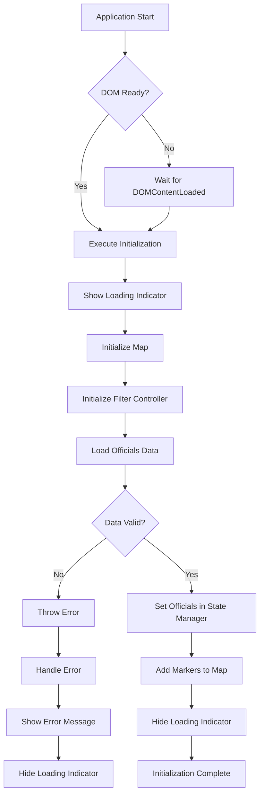
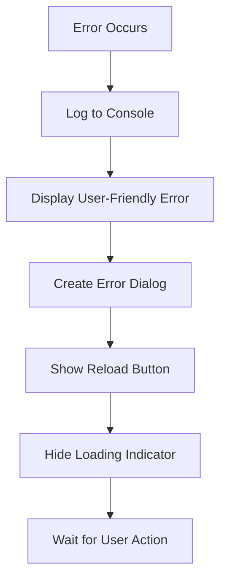
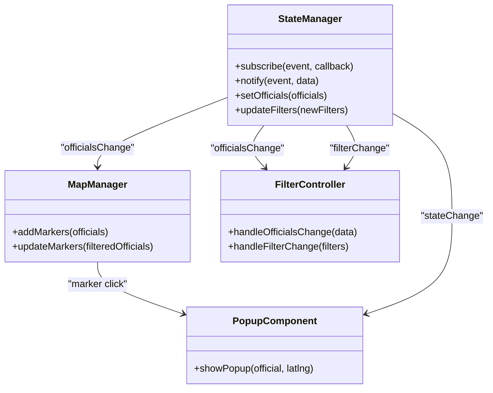

# app.js

<cite>
**Referenced Files in This Document**   
- [app.js](file://js/app.js)
- [data-loader.js](file://js/data-loader.js)
- [state-manager.js](file://js/state-manager.js)
- [map-manager.js](file://js/map-manager.js)
- [filter-controller.js](file://js/filter-controller.js)
- [popup-component.js](file://js/popup-component.js)
</cite>

## Table of Contents
1. [Introduction](#introduction)
2. [Initialization Sequence](#initialization-sequence)
3. [DOM Readiness Handling](#dom-readiness-handling)
4. [Error State Management](#error-state-management)
5. [Component Coordination](#component-coordination)
6. [Observer Pattern Integration](#observer-pattern-integration)
7. [Common Issues and Solutions](#common-issues-and-solutions)

## Introduction

The `app.js` module serves as the main entry point for the Democratic Socialist Officials Map application. It orchestrates the initialization of all core modules, manages the startup sequence, handles error states, and ensures proper DOM readiness before executing initialization routines. This module acts as the central coordinator that wires together the various components of the application, including the DataLoader, StateManager, MapManager, FilterController, and PopupComponent.

The application follows a modular architecture where each component has a specific responsibility, and `app.js` is responsible for initializing these components in the correct order and establishing their interconnections. It implements robust error handling to provide a graceful failure experience when initialization problems occur.

**Section sources**
- [app.js](file://js/app.js#L3-L140)

## Initialization Sequence

The initialization process begins with the `main()` function, which checks the current document readiness state and either waits for the `DOMContentLoaded` event or proceeds immediately if the DOM is already loaded. Once the DOM is ready, the `initApp()` function is called to begin the application initialization sequence.

The initialization sequence follows a specific order to ensure proper dependencies are met:

1. **Map Initialization**: The MapManager is initialized first to create the Leaflet map instance in the designated container element with ID 'map'.

2. **Filter Controller Initialization**: The FilterController is initialized to set up the filter UI components and event listeners. This includes populating the state dropdown with valid state codes.

3. **Data Loading**: The DataLoader module loads officials data from the JSON file at 'data/officials.json'. This is an asynchronous operation that validates each official record according to predefined rules.

4. **State Management Setup**: Once data is successfully loaded, it is passed to the StateManager via the `setOfficials()` method, which updates the application state and notifies subscribers.

5. **Map Marker Population**: Valid officials data is used to add markers to the map through the MapManager's `addMarkers()` method.

6. **UI Finalization**: The loading indicator is hidden, and success messages are logged to the console.

This sequential initialization ensures that each component is properly set up before dependent components attempt to use it. The entire process is wrapped in a try-catch block to handle any errors that might occur during initialization.

**Diagram sources**
- [app.js](file://js/app.js#L9-L52)
- [app.js](file://js/app.js#L122-L135)

**Section sources**
- [app.js](file://js/app.js#L9-L52)
- [app.js](file://js/app.js#L122-L135)

## DOM Readiness Handling

The `app.js` module implements a robust mechanism to ensure the DOM is fully loaded before attempting to initialize any components that interact with DOM elements. This is critical because several modules, including MapManager and FilterController, need to access specific DOM elements to function properly.

The `main()` function checks the `document.readyState` property to determine the current state of the document:

- If the state is 'loading', it means the document is still being parsed, so an event listener is added for the `DOMContentLoaded` event.
- If the state is anything other than 'loading' (typically 'interactive' or 'complete'), it means the DOM is already available, and initialization can proceed immediately.

This approach ensures that the application will work correctly regardless of when the script is loaded or executed. The initialization functions are only called once the DOM is guaranteed to be ready, preventing errors that would occur from attempting to access DOM elements that don't yet exist.

The module also sets up additional event listeners for keyboard accessibility and responsive behavior, which are also dependent on the DOM being fully loaded and available.

**Section sources**
- [app.js](file://js/app.js#L122-L135)

## Error State Management

The `app.js` module implements comprehensive error handling to provide a resilient user experience when initialization problems occur. Errors are handled at multiple levels, with appropriate user feedback and recovery options.

The primary error handling occurs within the `initApp()` function's try-catch block, which catches any exceptions that occur during the initialization sequence. When an error is caught:

1. The error is logged to the console with detailed information using `console.error()`.

2. A user-friendly error message is displayed using the `showError()` function, which creates a modal dialog with an error message and a "Reload Page" button.

3. The loading indicator is hidden to prevent a permanent loading state.

The `showError()` function dynamically creates a styled error dialog that includes:
- A clear error message
- A reload button that refreshes the page
- Appropriate styling for visibility and accessibility
- A fixed position to ensure it's visible regardless of scroll position

Additionally, the module handles specific validation errors from the data loading process. If some officials fail validation but valid data is still available, the application continues initialization while logging warnings about the invalid records. Only if no valid officials are loaded does the application treat it as a critical failure.

**Diagram sources**
- [app.js](file://js/app.js#L48-L52)
- [app.js](file://js/app.js#L69-L87)

**Section sources**
- [app.js](file://js/app.js#L48-L52)
- [app.js](file://js/app.js#L69-L87)

## Component Coordination

The `app.js` module serves as the central coordinator that initializes and connects all major components of the application. It establishes the proper invocation relationships between modules and ensures they are configured correctly.

Key coordination responsibilities include:

**DataLoader Integration**: The module calls `DataLoader.loadOfficials()` with the path to the JSON data file. It handles the Promise returned by this asynchronous function and processes the result, checking for valid data before proceeding.

**StateManager Configuration**: After successfully loading data, the module calls `StateManager.setOfficials()` to populate the application state with the loaded officials. This triggers notifications to all subscribers about the state change.

**MapManager Initialization**: The module initializes the map by calling `MapManager.initMap()` with the container ID. It then adds markers to the map using `MapManager.addMarkers()` with the validated officials data.

**FilterController Setup**: The module initializes the filter UI by calling `FilterController.init()` and populates the state dropdown with `FilterController.populateStateDropdown()`.

**PopupComponent Readiness**: While not directly initialized in `app.js`, the PopupComponent is made ready through the initialization of other components that use it, such as MapManager which calls `PopupComponent.showPopup()` when markers are clicked.

The module also sets up global functionality like keyboard accessibility (Escape key closes popups) and responsive behavior (map size is invalidated on window resize).

**Section sources**
- [app.js](file://js/app.js#L17-L35)
- [app.js](file://js/app.js#L92-L116)

## Observer Pattern Integration

The `app.js` module facilitates the observer pattern implementation by establishing the connections between the StateManager (the subject) and various components that subscribe to state changes (the observers).

While the actual subscription mechanism is implemented in the StateManager module, `app.js` ensures that the ecosystem is properly set up by initializing all components that need to observe state changes. The StateManager exposes a `subscribe()` method that allows other modules to register callback functions for specific events:

- **stateChange**: Notified when any state changes occur
- **filterChange**: Notified when filters are updated
- **officialsChange**: Notified when officials data changes

When `StateManager.setOfficials()` is called during initialization, it automatically notifies all subscribers to the 'officialsChange' and 'stateChange' events. This triggers updates in components like FilterController, which updates the UI and marker display based on the new officials data.

The observer pattern enables loose coupling between components, as they don't need direct references to each other. Instead, they communicate through the StateManager, which acts as a central hub for state changes. This architecture makes the application more maintainable and scalable, as new components can be added without modifying existing code.

**Diagram sources**
- [state-manager.js](file://js/state-manager.js#L35-L50)
- [filter-controller.js](file://js/filter-controller.js#L95-L96)
- [map-manager.js](file://js/map-manager.js#L141-L142)

**Section sources**
- [state-manager.js](file://js/state-manager.js#L35-L50)
- [filter-controller.js](file://js/filter-controller.js#L95-L96)

## Common Issues and Solutions

### Data Loading Failures
**Issue**: The application fails to load the officials.json file, resulting in initialization failure.
**Solution**: Ensure the data/officials.json file exists and is accessible. Check the browser's developer tools for network errors. Verify the file path is correct and the server has proper permissions to serve the file.

### Invalid Data Format
**Issue**: The JSON data format is incorrect or contains invalid official records.
**Solution**: Validate that the data file contains an array of official objects with all required fields (id, name, position, officeLevel, politicalAffiliation, bio, termStart, yearElected). Check the console for specific validation error messages.

### DOM Element Not Found
**Issue**: The application cannot find required DOM elements like the map container or loading indicator.
**Solution**: Verify that the HTML file contains elements with the expected IDs ('map', 'loading-indicator', etc.). Ensure the script is loaded after the DOM elements are created.

### Map Initialization Problems
**Issue**: The map does not display or appears broken.
**Solution**: Check that the Leaflet CSS and JS files are properly loaded. Verify that the map container has defined dimensions in the CSS. Ensure the MapManager.initMap() function is called with the correct container ID.

### Filter UI Not Responding
**Issue**: Filter controls do not respond to user input.
**Solution**: Verify that FilterController.init() is called during initialization. Check that all required DOM elements for filters exist and have the correct IDs and classes.

### Performance Issues with Large Datasets
**Issue**: The application becomes slow or unresponsive with a large number of officials.
**Solution**: Implement pagination or virtual scrolling for the officials list. Optimize the filtering algorithm or consider using web workers for heavy computations.

**Section sources**
- [app.js](file://js/app.js#L48-L52)
- [data-loader.js](file://js/data-loader.js#L98-L148)
- [state-manager.js](file://js/state-manager.js#L56-L70)