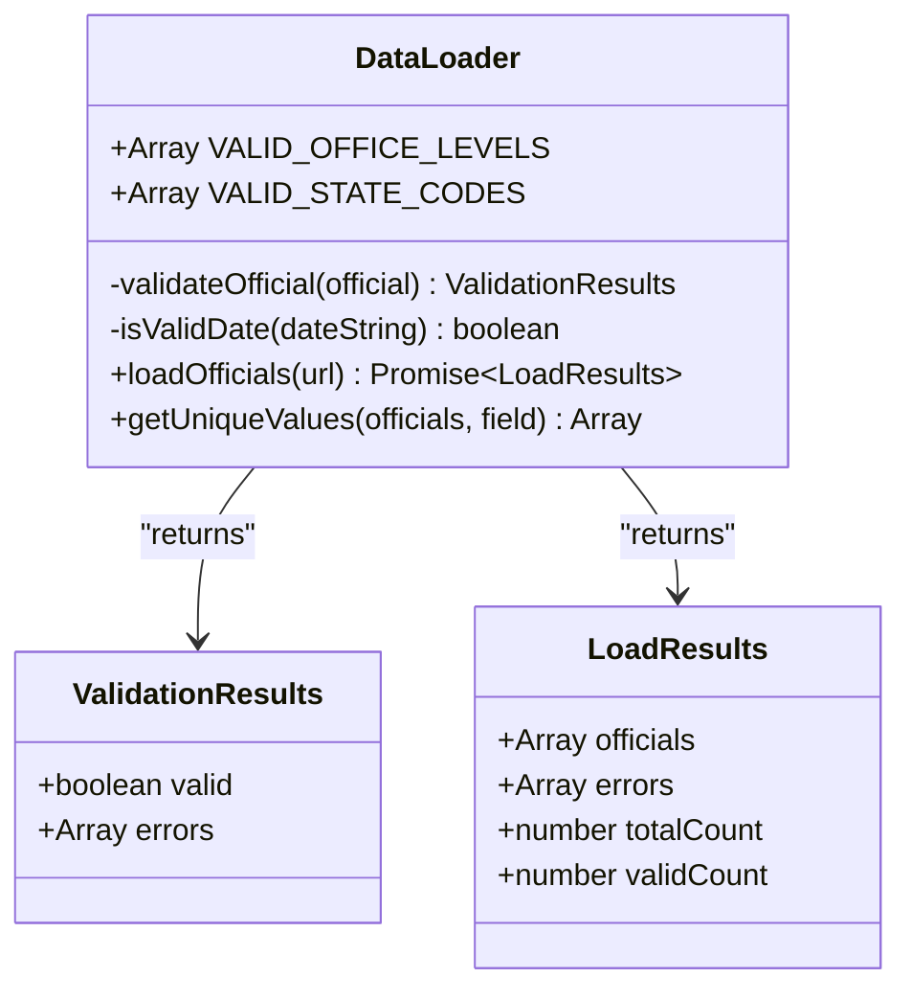
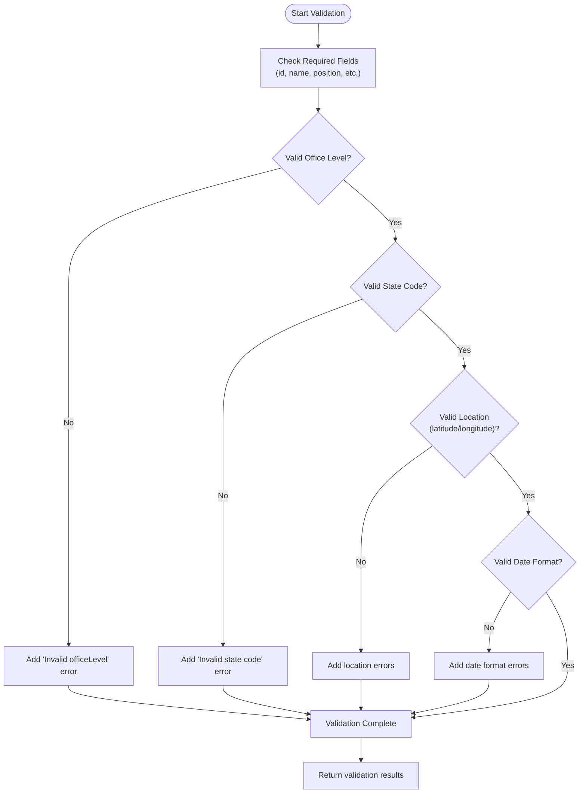
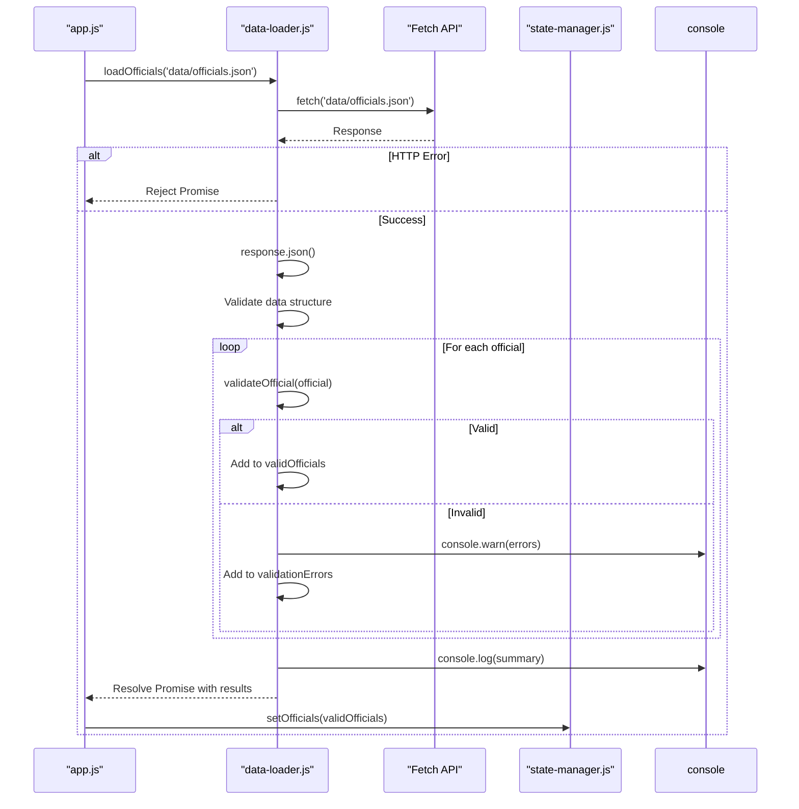
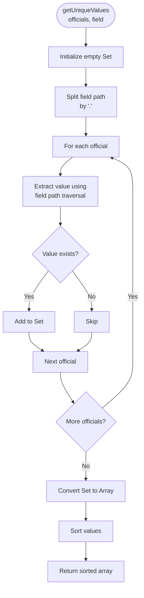
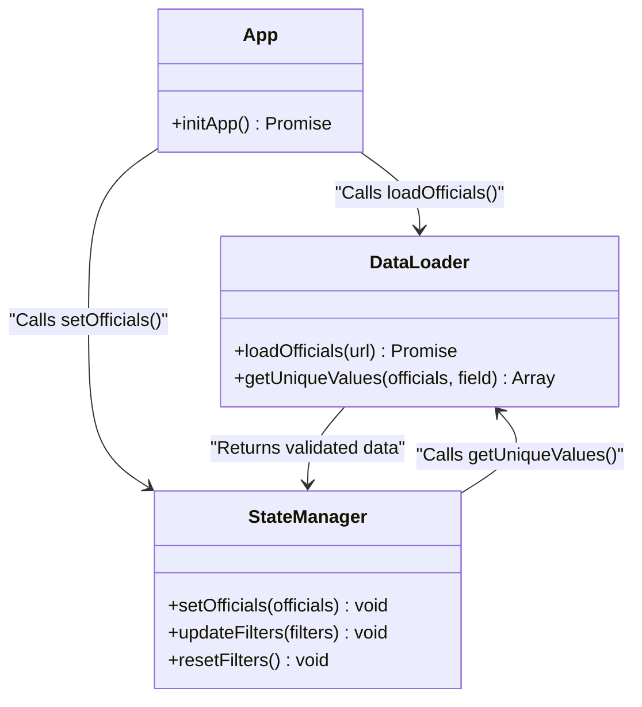

# data-loader.js

<cite>
**Referenced Files in This Document**   
- [data-loader.js](file://js/data-loader.js)
- [officials.json](file://data/officials.json)
- [state-manager.js](file://js/state-manager.js)
- [app.js](file://js/app.js)
- [filter-controller.js](file://js/filter-controller.js)
</cite>

## Table of Contents
1. [Introduction](#introduction)
2. [Core Components](#core-components)
3. [Data Validation Rules](#data-validation-rules)
4. [Data Loading Process](#data-loading-process)
5. [Utility Functions](#utility-functions)
6. [Integration with StateManager](#integration-with-statemanager)
7. [Error Handling and Reporting](#error-handling-and-reporting)
8. [Usage Patterns](#usage-patterns)

## Introduction

The `data-loader.js` module is a critical component of the Democratic Socialist Officials Map application, responsible for loading, validating, and processing official data from the `officials.json` file. This module ensures data integrity by enforcing strict validation rules on required fields, office levels, state codes, and geographic boundaries. It provides a promise-based API through the `loadOfficials` function that integrates seamlessly with the application's state management system. The module also includes utility functions like `getUniqueValues` that support dynamic filter population in the user interface. This documentation provides a comprehensive analysis of the implementation details, validation rules, and integration patterns of this essential data loading component.

**Section sources**
- [data-loader.js](file://js/data-loader.js#L1-L185)

## Core Components

The `data-loader.js` module implements a self-invoking function expression (IIFE) pattern to create a private scope for its functionality. The core components include the `loadOfficials` function for data retrieval, the `validateOfficial` function for data validation, and the `getUniqueValues` utility for data analysis. The module also defines validation constants `VALID_OFFICE_LEVELS` and `VALID_STATE_CODES` that are exposed as part of the public API. These components work together to ensure that only valid, properly formatted data is processed by the application. The module follows a modular design pattern with clear separation of concerns between data loading, validation, and utility functions.

**Diagram sources**
- [data-loader.js](file://js/data-loader.js#L4-L184)

**Section sources**
- [data-loader.js](file://js/data-loader.js#L4-L184)

## Data Validation Rules

The data validation system in `data-loader.js` enforces comprehensive rules to ensure data quality and consistency. The validation process checks for required fields including `id`, `name`, `position`, `officeLevel`, `politicalAffiliation`, `bio`, `termStart`, and `yearElected`. Office levels are validated against a predefined list of acceptable values: federal, state, county, city, and town. State codes are validated against all 50 US state abbreviations. Geographic coordinates are validated to ensure they fall within US boundaries (latitude between 24-50 and longitude between -125 to -66). Date fields are validated for proper ISO 8601 format using the `isValidDate` helper function. The validation system is designed to be comprehensive yet flexible, allowing the application to load partial data while reporting validation issues for correction.

**Diagram sources**
- [data-loader.js](file://js/data-loader.js#L21-L80)

**Section sources**
- [data-loader.js](file://js/data-loader.js#L8-L15)
- [data-loader.js](file://js/data-loader.js#L21-L80)
- [data-loader.js](file://js/data-loader.js#L87-L91)

## Data Loading Process

The data loading process is implemented through the `loadOfficials` function, which provides a promise-based API for asynchronous data retrieval. The function uses the Fetch API to load data from the specified JSON file (defaulting to 'data/officials.json'). It first checks for HTTP response success, then parses the JSON data, and validates that the data structure is an array. The function then iterates through each official record, applying validation rules and separating valid records from those with errors. Successfully validated officials are collected in the `validOfficials` array, while validation errors are recorded with contextual information including the record index, ID, and name. The function returns a comprehensive result object containing the valid officials, error details, and summary statistics.

**Diagram sources**
- [data-loader.js](file://js/data-loader.js#L97-L148)
- [app.js](file://js/app.js#L25-L32)

**Section sources**
- [data-loader.js](file://js/data-loader.js#L97-L148)

## Utility Functions

The `data-loader.js` module includes the `getUniqueValues` utility function that plays a crucial role in supporting dynamic filter population in the user interface. This function takes an array of official objects and a field path string (e.g., 'location.state' or 'politicalAffiliation') and returns a sorted array of unique values for that field across all officials. The function uses a Set to efficiently collect unique values and handles nested object properties through dot notation parsing. This utility enables the application to automatically generate filter options based on the actual data content, ensuring that filters are always relevant and up-to-date with the current dataset. The function is particularly important for populating the affiliation checkboxes and state dropdown in the filter interface.

**Diagram sources**
- [data-loader.js](file://js/data-loader.js#L156-L173)
- [filter-controller.js](file://js/filter-controller.js#L184)

**Section sources**
- [data-loader.js](file://js/data-loader.js#L156-L173)

## Integration with StateManager

The `data-loader.js` module integrates closely with the `state-manager.js` module to establish the application's initial state. The `loadOfficials` function is called from `app.js` during application initialization, and upon successful data loading, the valid officials are passed to `StateManager.setOfficials()`. This integration enables the state manager to initialize filter options based on the loaded data, particularly for political affiliations which are dynamically determined using `DataLoader.getUniqueValues()`. The state manager also uses this data to populate the initial set of map markers through `MapManager.addMarkers()`. This integration pattern follows a clean separation of concerns where `data-loader.js` handles data retrieval and validation, while `state-manager.js` manages application state and notifies UI components of data changes.

**Diagram sources**
- [data-loader.js](file://js/data-loader.js#L177-L182)
- [state-manager.js](file://js/state-manager.js#L56-L70)
- [app.js](file://js/app.js#L25-L32)

**Section sources**
- [data-loader.js](file://js/data-loader.js#L177-L182)
- [state-manager.js](file://js/state-manager.js#L56-L70)
- [app.js](file://js/app.js#L25-L32)

## Error Handling and Reporting

The error handling strategy in `data-loader.js` is designed to be robust and informative while maintaining application functionality. The module implements a two-tiered approach to error handling: validation errors and critical errors. Validation errors occur when individual official records fail to meet the defined validation rules. These errors are collected in the `validationErrors` array with detailed information about the nature and location of each issue, and are reported to the console using `console.warn()`. Critical errors, such as network failures or invalid JSON format, are handled by the try-catch block in `loadOfficials` and reported using `console.error()` before being re-thrown to the calling code. This approach allows the application to continue functioning with partial data while alerting developers to data quality issues that need attention.

**Section sources**
- [data-loader.js](file://js/data-loader.js#L122-L128)
- [data-loader.js](file://js/data-loader.js#L134-L136)
- [data-loader.js](file://js/data-loader.js#L146-L147)

## Usage Patterns

The `data-loader.js` module is designed to be used in specific patterns that support the application's architecture and user experience requirements. The primary usage pattern is during application initialization in `app.js`, where `loadOfficials` is called to load the initial dataset. The promise-based API allows for clean async/await syntax and proper error handling. The `getUniqueValues` function is used by both `state-manager.js` and `filter-controller.js` to dynamically populate filter options based on the actual data content. The validation constants `VALID_OFFICE_LEVELS` and `VALID_STATE_CODES` are available for reference by other modules when needed. This design enables a clean separation between data loading/validation and UI presentation, allowing each component to focus on its specific responsibilities.

**Section sources**
- [data-loader.js](file://js/data-loader.js#L177-L182)
- [app.js](file://js/app.js#L25-L32)
- [state-manager.js](file://js/state-manager.js#L62-L63)
- [filter-controller.js](file://js/filter-controller.js#L103)