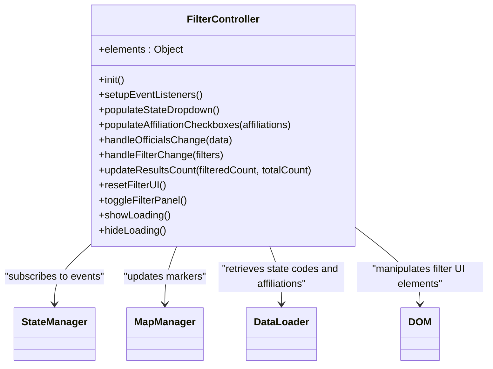
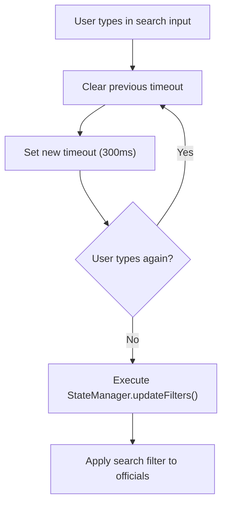
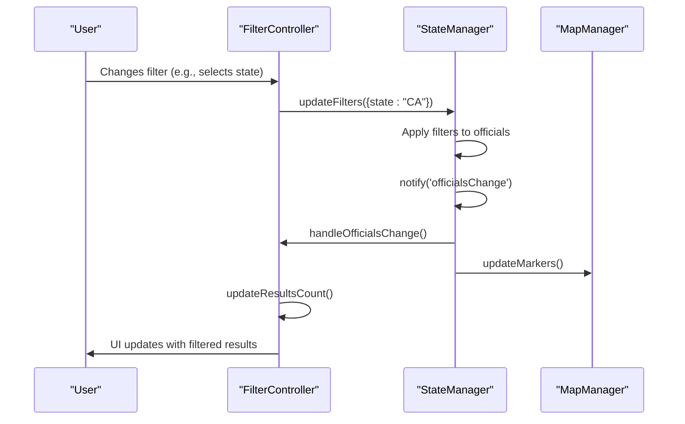
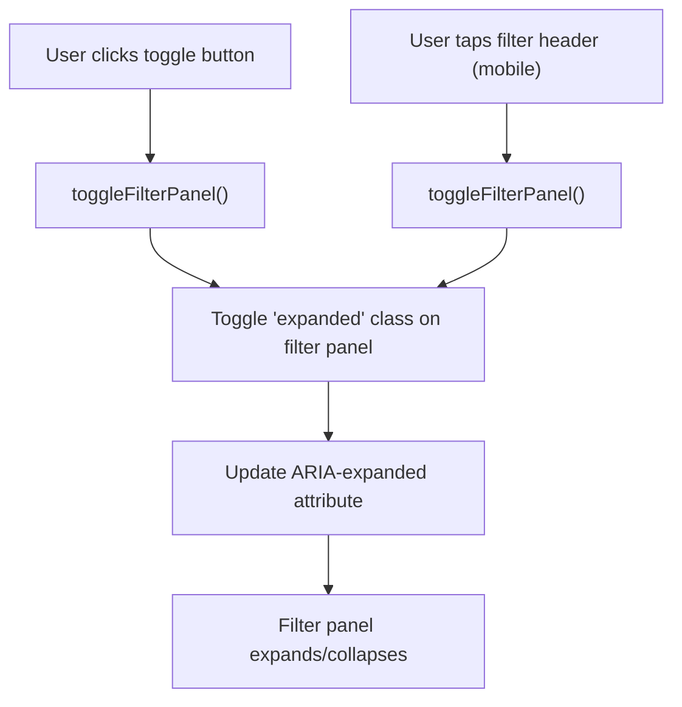

# filter-controller.js

<cite>
**Referenced Files in This Document**   
- [filter-controller.js](file://js/filter-controller.js)
- [state-manager.js](file://js/state-manager.js)
- [data-loader.js](file://js/data-loader.js)
- [map-manager.js](file://js/map-manager.js)
</cite>

## Table of Contents
1. [Introduction](#introduction)
2. [Core Components](#core-components)
3. [Event Listeners and UI Interactions](#event-listeners-and-ui-interactions)
4. [State Management Integration](#state-management-integration)
5. [Mobile Responsiveness](#mobile-responsiveness)
6. [Common Issues and Solutions](#common-issues-and-solutions)

## Introduction

The `filter-controller.js` module is a central component of the Democratic Socialist Officials Map application, responsible for managing the filter UI and handling user interactions. This module acts as the bridge between the user interface and the application's state management system, ensuring that filter changes are properly processed and reflected in the displayed data. The module handles various filter types including search input, state selection, office level checkboxes, and affiliation checkboxes, while also providing mobile-responsive functionality through the filter panel toggle.

**Section sources**
- [filter-controller.js](file://js/filter-controller.js#L1-L271)

## Core Components

The `filter-controller.js` module is implemented as an Immediately Invoked Function Expression (IIFE) that encapsulates its functionality and exposes a public API through a return object. The core components include:

- **DOM Element Caching**: The module caches references to key DOM elements in the `elements` object during initialization, improving performance by avoiding repeated DOM queries.
- **Event Listener Management**: The `setupEventListeners()` function centralizes the registration of event handlers for all filter-related UI elements.
- **Filter State Management**: The module interacts with the `StateManager` to update and retrieve filter values, maintaining consistency across the application.
- **UI State Functions**: Key functions like `resetFilterUI()` and `toggleFilterPanel()` manage the visual state of the filter interface.

The module's public API exposes essential functions including `init()`, `populateStateDropdown()`, `populateAffiliationCheckboxes()`, `showLoading()`, `hideLoading()`, and `resetFilterUI()`, allowing other components to interact with the filter system programmatically.

**Diagram sources**
- [filter-controller.js](file://js/filter-controller.js#L4-L271)
- [state-manager.js](file://js/state-manager.js#L4-L239)
- [data-loader.js](file://js/data-loader.js#L4-L185)
- [map-manager.js](file://js/map-manager.js#L4-L218)

**Section sources**
- [filter-controller.js](file://js/filter-controller.js#L1-L271)

## Event Listeners and UI Interactions

The `filter-controller.js` module implements a comprehensive event handling system that responds to user interactions with various filter controls. The `setupEventListeners()` function registers handlers for multiple UI elements, ensuring that filter changes are properly processed and communicated to the application state.

### Search Input with Debounce

The search input field implements a debounce mechanism to optimize performance and reduce unnecessary processing. When a user types in the search field, a timeout is set to delay the filter update. If the user continues typing within the 300ms window, the previous timeout is cleared and a new one is set. This ensures that filter updates only occur after the user has paused typing, preventing excessive API calls or computations during active input.

**Diagram sources**
- [filter-controller.js](file://js/filter-controller.js#L39-L46)

### State Select Handler

The state select dropdown triggers an immediate filter update when the user changes their selection. The event listener captures the selected state value and passes it to `StateManager.updateFilters()` with the `state` property. This enables filtering officials by their state of representation, with the UI automatically updating to reflect the current selection.

### Office Level Checkboxes

The office level checkboxes (federal, state, county, city, town) are handled as a group, with each checkbox having its own change event listener. When any checkbox state changes, the module collects all currently checked values and updates the filter with the complete array of selected office levels. This allows users to filter officials by one or multiple levels of government simultaneously.

### Affiliation Checkboxes

Similar to office level checkboxes, the political affiliation checkboxes are dynamically generated based on the available affiliations in the dataset. Each checkbox has an event listener that updates the filter with the current selection of affiliations. The dynamic population ensures that the filter options reflect the actual data, providing a relevant and accurate filtering experience.

**Section sources**
- [filter-controller.js](file://js/filter-controller.js#L38-L85)

## State Management Integration

The `filter-controller.js` module integrates closely with the `StateManager` to maintain a consistent application state across components. This integration occurs through two primary mechanisms: updating filters and subscribing to state changes.

### Filter Updates

When a user interacts with any filter control, the module calls `StateManager.updateFilters()` with an object containing the updated filter values. This function merges the new values with the existing filter state and triggers the filtering process. The key filter properties managed by this module include:

- **search**: Text string for searching official names, positions, cities, or counties
- **state**: Two-letter state code for filtering by location
- **officeLevels**: Array of office level strings (federal, state, county, city, town)
- **affiliations**: Array of political affiliation strings
- **yearStart** and **yearEnd**: Numeric values for filtering by year elected

**Diagram sources**
- [filter-controller.js](file://js/filter-controller.js#L44-L72)
- [state-manager.js](file://js/state-manager.js#L75-L79)

### Event Subscription

The filter controller subscribes to two key events from the `StateManager`:

- **officialsChange**: Triggered when the filtered officials list changes, allowing the filter controller to update the results count display and show/hide the "no results" message.
- **filterChange**: Triggered when filters are updated, enabling the filter controller to log filter changes and potentially update its UI to reflect the current filter state.

When the `officialsChange` event is received, the `handleOfficialsChange()` function processes the data to:
1. Update the results count text based on the number of filtered vs. total officials
2. Update the map markers through `MapManager.updateMarkers()`
3. Show or hide the "no results" message based on whether any officials match the current filters
4. Populate the affiliation checkboxes with unique affiliations from the dataset on first load

**Section sources**
- [filter-controller.js](file://js/filter-controller.js#L94-L97)
- [filter-controller.js](file://js/filter-controller.js#L165-L186)
- [state-manager.js](file://js/state-manager.js#L35-L39)

## Mobile Responsiveness

The `filter-controller.js` module includes specific functionality to enhance the user experience on mobile devices through responsive design patterns.

### resetFilterUI Function

The `resetFilterUI()` function restores all filter controls to their default state, providing a clean way to clear all filters. This function:
- Clears the search input field
- Resets the state select dropdown to no selection
- Checks all office level checkboxes (restoring the default "all levels" selection)
- Checks all affiliation checkboxes
- Clears the year input fields

This function is called when the user clicks the "Clear Filters" button, ensuring that both the UI and the application state are reset consistently.

### toggleFilterPanel Function

The `toggleFilterPanel()` function manages the visibility of the filter panel on mobile devices. It toggles the 'expanded' CSS class on the filter panel element and updates the ARIA attribute on the toggle button for accessibility. This allows users to show or hide the filter panel to maximize map viewing space on smaller screens.

Additionally, the module implements a mobile-specific interaction where tapping the filter header (on screens 768px or smaller) also toggles the filter panel, providing an intuitive touch interface for mobile users.

**Diagram sources**
- [filter-controller.js](file://js/filter-controller.js#L215-L236)
- [filter-controller.js](file://js/filter-controller.js#L241-L244)

**Section sources**
- [filter-controller.js](file://js/filter-controller.js#L75-L84)
- [filter-controller.js](file://js/filter-controller.js#L86-L92)
- [filter-controller.js](file://js/filter-controller.js#L215-L236)
- [filter-controller.js](file://js/filter-controller.js#L241-L244)

## Common Issues and Solutions

### Dynamic Affiliation Population

One potential issue is that affiliation checkboxes are populated dynamically after the initial data load, which could create a brief delay in UI availability. The current implementation handles this by checking if the affiliation checkboxes container is empty before populating it, ensuring that the operation only occurs once.

### Debounce Timing

The 300ms debounce interval represents a balance between responsiveness and performance. If users find the search feels sluggish, this value could be reduced. Conversely, if performance issues arise with large datasets, it could be increased.

### Mobile Touch Targets

The filter header tap-to-toggle feature enhances mobile usability, but developers should ensure adequate touch target sizes and consider adding visual feedback to confirm the toggle action.

### Accessibility Considerations

The module maintains accessibility through ARIA attributes like `aria-expanded` on the toggle button and `aria-label` on checkboxes. However, additional accessibility features like keyboard navigation support could be considered for improved accessibility compliance.

**Section sources**
- [filter-controller.js](file://js/filter-controller.js#L183-L186)
- [filter-controller.js](file://js/filter-controller.js#L39-L46)
- [filter-controller.js](file://js/filter-controller.js#L86-L92)
- [filter-controller.js](file://js/filter-controller.js#L241-L244)