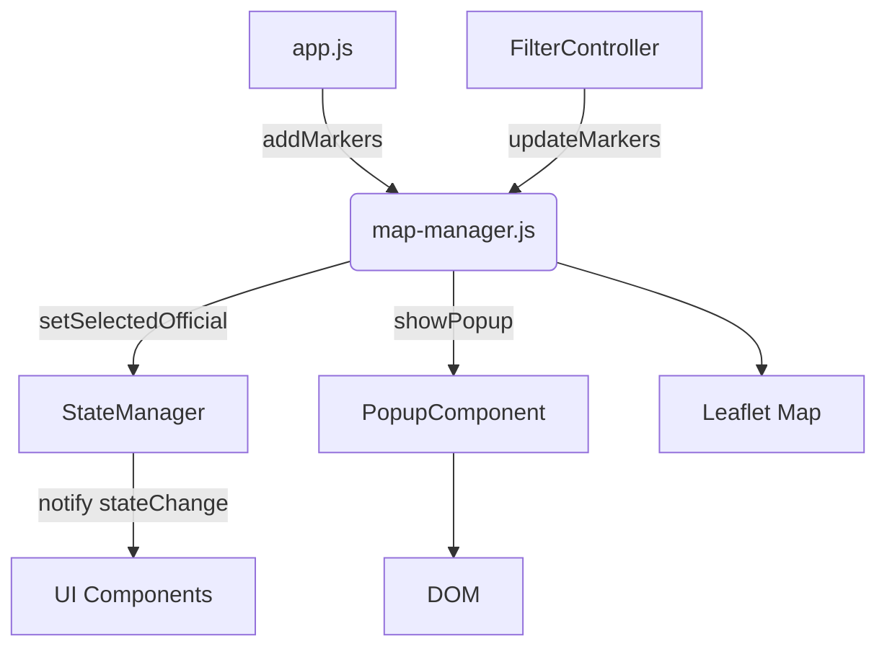

# map-manager.js

<cite>
**Referenced Files in This Document**   
- [map-manager.js](file://js/map-manager.js)
- [state-manager.js](file://js/state-manager.js)
- [popup-component.js](file://js/popup-component.js)
</cite>

## Table of Contents
1. [Introduction](#introduction)
2. [Core Functions](#core-functions)
3. [Domain Model](#domain-model)
4. [Component Relationships](#component-relationships)
5. [Usage Patterns](#usage-patterns)
6. [Configuration Options](#configuration-options)
7. [Common Issues and Solutions](#common-issues-and-solutions)

## Introduction
The map-manager.js module is responsible for managing the Leaflet map interface in the Democratic Socialist Officials Map application. It handles map initialization, marker rendering with custom styling, marker clustering, and interaction logic. The module integrates with other components through a well-defined API, enabling coordinated behavior between the map display, application state, and information popups. This documentation provides a comprehensive analysis of the module's implementation, focusing on its key functions, domain model, relationships with other components, and usage patterns.

## Core Functions

### initMap Function
The initMap function initializes the Leaflet map instance with specific configuration for the application's needs. It creates a map centered on the geographic center of the continental United States with coordinates [39.8283, -98.5795] and an initial zoom level of 4. The function configures the map with a minimum zoom of 3 and maximum zoom of 18, providing appropriate constraints for viewing officials at different geographic scales. It adds OpenStreetMap tiles as the base layer and initializes the marker cluster group with specific configuration options including a maximum cluster radius of 60 pixels, spiderfication on maximum zoom, and custom cluster icon styling based on the number of contained markers.

**Section sources**
- [map-manager.js](file://js/map-manager.js#L32-L75)

### createMarkerIcon Function
The createMarkerIcon function generates custom styled markers for officials based on their office level. It uses the OFFICE_COLORS constant to determine the appropriate color for each office level (federal, state, county, city, town), creating visually distinct markers that help users quickly identify the level of government an official serves in. The function creates a Leaflet div icon containing the official's first initial, styled with the appropriate background and border color. The marker has a fixed size of 30x30 pixels with the icon anchor positioned at the center (15,15) to ensure proper placement on the map.

**Section sources**
- [map-manager.js](file://js/map-manager.js#L82-L95)

### addMarkers Function
The addMarkers function handles the process of rendering officials as markers on the map. It first clears any existing markers to prevent duplication, then iterates through the provided officials array, creating a marker for each official with valid geographic coordinates. Each marker is configured with a custom icon from createMarkerIcon, accessibility attributes (title and alt text), and click event handling that invokes handleMarkerClick. The markers are added to the marker cluster group for efficient display when zoomed out, and references to the markers are stored in a Map object keyed by official ID for later retrieval and manipulation.

**Section sources**
- [map-manager.js](file://js/map-manager.js#L101-L132)

### handleMarkerClick Function
The handleMarkerClick function manages the interaction when a user clicks on a marker. It performs three key actions: updating the application state to reflect the selected official, zooming the map to an appropriate level based on the official's office level, and displaying a popup with detailed information about the official. The function uses the ZOOM_LEVELS constant to determine the appropriate zoom level for different office types, ensuring that users are shown a view that is contextually appropriate (e.g., more zoomed-in for city and town officials, less zoomed-in for federal and state officials).

**Section sources**
- [map-manager.js](file://js/map-manager.js#L138-L150)

## Domain Model
The map-manager.js module operates on a domain model centered around geographic representation of elected officials. The core entities include the map itself, markers representing individual officials, and clusters that group nearby markers when zoomed out. The module defines two key configuration objects: ZOOM_LEVELS and OFFICE_COLORS, which establish the application's visual and interaction semantics. The ZOOM_LEVELS object maps office levels to appropriate zoom levels (federal: 7, state: 7, county: 9, city: 11, town: 12), creating a hierarchical viewing experience that matches the geographic scope of different offices. The OFFICE_COLORS object assigns distinct colors to each office level, creating a visual taxonomy that helps users quickly understand the composition of officials on the map. The module maintains internal state including references to the map instance, marker cluster group, and a Map object that stores marker references by official ID, enabling efficient marker retrieval and management.

**Section sources**
- [map-manager.js](file://js/map-manager.js#L11-L27)

## Component Relationships
The map-manager.js module interacts with several other components in the application through well-defined interfaces. It has a direct dependency on the StateManager module, calling setSelectedOfficial when a marker is clicked to update the application's state with the selected official. This state change triggers updates in other components that subscribe to state changes. The module also depends on the PopupComponent module, invoking showPopup to display detailed information about an official when their marker is clicked. The popup is positioned at the official's geographic coordinates and contains comprehensive information formatted by the popup component. The map-manager receives data from the main application module (app.js) through the addMarkers and updateMarkers functions, which are called with filtered officials data after state changes or filter updates. The module exposes a public API that allows other components to control the map, including functions to initialize the map, add or clear markers, reset the view, and access the map instance directly.

**Diagram sources **
- [map-manager.js](file://js/map-manager.js#L206-L216)
- [state-manager.js](file://js/state-manager.js#L225-L237)
- [popup-component.js](file://js/popup-component.js#L257-L263)

## Usage Patterns
The map-manager.js module follows a module pattern implementation with a private scope for internal variables and a public API exposed through the returned object. The primary usage pattern begins with initialization via initMap, typically called early in the application lifecycle by app.js. After initialization, markers are added to the map using addMarkers, which is called with the complete set of officials during initial load and with filtered officials when filters change. The updateMarkers function provides a convenience wrapper that calls addMarkers with filtered officials, simplifying the update process for other components. Components interact with the map-manager through its public methods rather than directly manipulating the map instance, maintaining encapsulation and ensuring consistent behavior. The module handles marker click events internally, abstracting the interaction logic and ensuring consistent behavior when officials are selected. Other components can retrieve the map instance using getMap for direct manipulation when necessary, or use resetView to return the map to its initial position.

**Section sources**
- [map-manager.js](file://js/map-manager.js#L206-L216)
- [app.js](file://js/app.js#L1-L45)

## Configuration Options
The map-manager.js module includes several configuration options that control its behavior and appearance. The ZOOM_LEVELS constant defines the zoom levels used when navigating to officials of different office types, with federal and state officials using zoom level 7, county officials using zoom level 9, city officials using zoom level 11, and town officials using zoom level 12. These values balance the need to see the official's specific location while maintaining context of surrounding areas. The OFFICE_COLORS constant assigns specific colors to each office level: federal (#e63946 - red), state (#f77f00 - orange), county (#06a77d - green), city (#457b9d - blue), and town (#9b59b6 - purple). These colors create a visual hierarchy that helps users quickly identify the level of government represented by each marker. The marker cluster group is configured with a maximum cluster radius of 60 pixels, determining how close markers need to be before they are grouped. The clustering behavior is further customized with spiderfyOnMaxZoom enabled, allowing clustered markers to spread out when zoomed in fully, and zoomToBoundsOnClick enabled, which automatically zooms to show all markers in a cluster when clicked.

**Section sources**
- [map-manager.js](file://js/map-manager.js#L11-L27)
- [map-manager.js](file://js/map-manager.js#L49-L75)

## Common Issues and Solutions
One common issue that can occur with the map-manager.js module is markers not appearing on the map, which is typically caused by invalid geographic coordinates in the officials data. The module includes validation that checks for latitude and longitude values before creating markers, silently skipping officials with missing coordinates. To resolve this issue, ensure that all officials in the data/officials.json file have valid latitude and longitude values. Another potential issue is the map not initializing properly, which can occur if the container element with the specified ID does not exist in the DOM. This can be resolved by ensuring the HTML contains an element with the appropriate ID (default is "map") before calling initMap. A third issue involves popup positioning problems, which can occur if the map container size changes after initialization (e.g., due to responsive design). This can be addressed by calling the map's invalidateSize method when the container size changes, which the application already handles through the setupResponsiveBehavior function in app.js. Performance issues with a large number of markers are mitigated by the marker clustering implementation, which automatically groups nearby markers when zoomed out, maintaining smooth interaction regardless of the number of officials displayed.

**Section sources**
- [map-manager.js](file://js/map-manager.js#L109-L130)
- [app.js](file://js/app.js#L279-L315)
- [map-manager.js](file://js/map-manager.js#L49-L75)