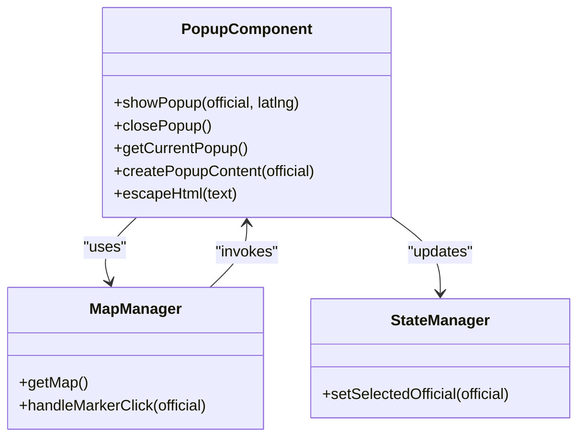
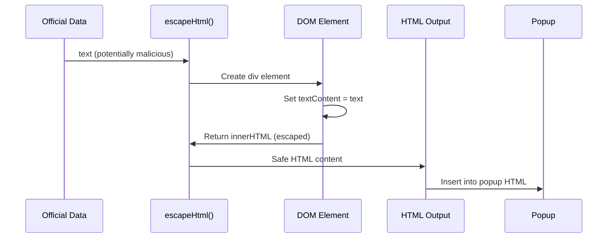
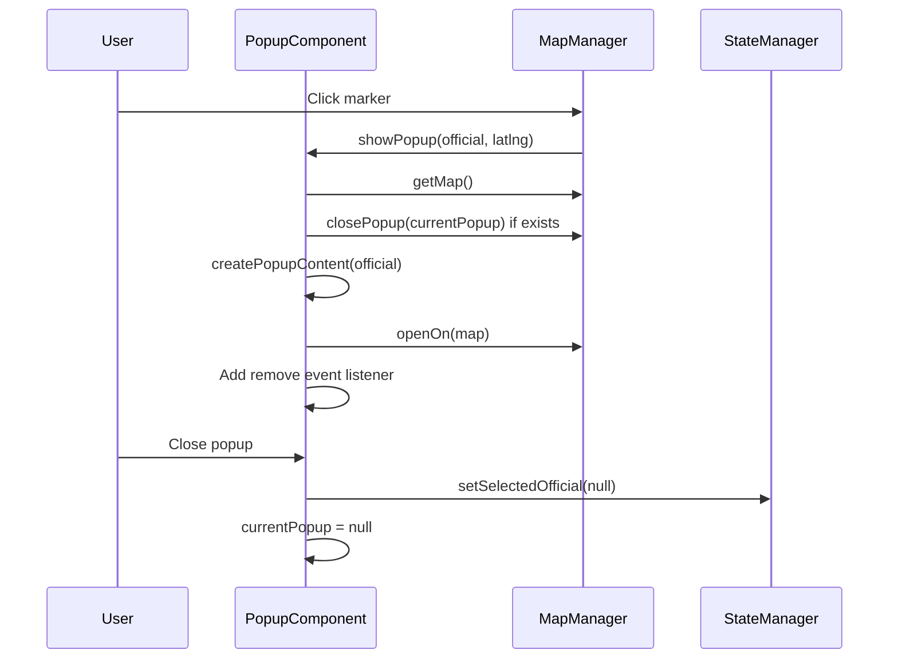

# popup-component.js

<cite>
**Referenced Files in This Document**   
- [popup-component.js](file://js/popup-component.js)
- [map-manager.js](file://js/map-manager.js)
- [state-manager.js](file://js/state-manager.js)
</cite>

## Table of Contents
1. [Introduction](#introduction)
2. [Core Functions](#core-functions)
3. [HTML Generation Process](#html-generation-process)
4. [Security Implementation](#security-implementation)
5. [Popup Display and Positioning](#popup-display-and-positioning)
6. [Event Handling and State Management](#event-handling-and-state-management)
7. [Integration with Map System](#integration-with-map-system)
8. [Usage Patterns](#usage-patterns)
9. [Common Issues and Solutions](#common-issues-and-solutions)

## Introduction
The popup-component.js module is responsible for creating and displaying detailed information popups for democratic socialist officials on the map interface. This component generates rich HTML content from official data and integrates with the Leaflet mapping system to provide an interactive user experience. The module handles both the content creation and display logic, ensuring that users can access comprehensive information about each official through a clean, accessible interface.

**Section sources**
- [popup-component.js](file://js/popup-component.js#L1-L264)

## Core Functions
The popup-component.js module exposes several key functions through its public API:

- `showPopup(official, latlng)`: Displays a popup for a specific official at the given coordinates
- `closePopup()`: Closes the currently displayed popup
- `getCurrentPopup()`: Returns the current popup instance or null
- `createPopupContent(official)`: Generates HTML content for an official's popup
- `escapeHtml(text)`: Sanitizes text content to prevent XSS attacks

These functions work together to provide a complete popup management system that handles content generation, display, and lifecycle management.

**Diagram sources**
- [popup-component.js](file://js/popup-component.js#L4-L263)
- [map-manager.js](file://js/map-manager.js#L4-L217)
- [state-manager.js](file://js/state-manager.js#L4-L238)

**Section sources**
- [popup-component.js](file://js/popup-component.js#L256-L263)

## HTML Generation Process
The `createPopupContent` function systematically builds HTML content for official information, organizing data into logical sections. The function processes the official object and generates a structured HTML string that displays biography, contact information, term dates, committee memberships, and other relevant details.

The content structure follows a consistent layout:
- Header section with photo, name, position, and office level badge
- Body section with multiple information panels
- Contact information with email, phone, website, and social media links
- Details grid showing political affiliation, term dates, and year elected
- Committee memberships list
- Voting record information
- Location footer with geographic details

```mermaid
flowchart TD
Start([createPopupContent Entry]) --> Header["Build Header Section"]
Header --> Photo{"Photo Available?"}
Photo --> |Yes| AddPhoto["Add Photo Element"]
Photo --> |No| SkipPhoto
AddPhoto --> SkipPhoto
SkipPhoto --> Name["Add Name and Position"]
Name --> Badge["Add Office Level Badge"]
Badge --> Body["Start Body Section"]
Body --> Bio{"Bio Available?"}
Bio --> |Yes| AddBio["Add Biography"]
Bio --> |No| SkipBio
AddBio --> ContactSection
SkipBio --> ContactSection
ContactSection["Add Contact Section"] --> Email{"Email Available?"}
Email --> |Yes| AddEmail["Add Email Link"]
Email --> |No| SkipEmail
AddEmail --> Phone{"Phone Available?"}
Phone --> |Yes| AddPhone["Add Phone Link"]
Phone --> |No| SkipPhone
AddPhone --> Website{"Website Available?"}
Website --> |Yes| AddWebsite["Add Website Link"]
Website --> |No| SkipWebsite
AddWebsite --> Social{"Social Media Available?"}
Social --> |Yes| AddSocial["Add Social Media Links"]
Social --> |No| SkipSocial
SkipEmail --> SkipPhone
SkipPhone --> SkipWebsite
SkipWebsite --> SkipSocial
SkipSocial --> Details["Add Details Grid"]
Details --> Affiliation["Add Political Affiliation"]
Affiliation --> TermStart["Add Term Start Date"]
TermStart --> TermEnd{"Term End Available?"}
TermEnd --> |Yes| AddTermEnd["Add Term End Date"]
TermEnd --> |No| SkipTermEnd
AddTermEnd --> YearElected["Add Year Elected"]
SkipTermEnd --> YearElected
YearElected --> Committees{"Committees Available?"}
Committees --> |Yes| AddCommittees["Add Committee Memberships"]
Committees --> |No| SkipCommittees
AddCommittees --> Voting{"Voting Record Available?"}
Voting --> |Yes| AddVoting["Add Voting Record"]
Voting --> |No| SkipVoting
SkipCommittees --> SkipVoting
SkipVoting --> Location["Add Location Footer"]
Location --> End([Return HTML Content])
```

**Diagram sources**
- [popup-component.js](file://js/popup-component.js#L29-L182)

**Section sources**
- [popup-component.js](file://js/popup-component.js#L29-L182)

## Security Implementation
The module implements robust XSS protection through the `escapeHtml` function, which sanitizes all user-provided content before inclusion in the popup HTML. This security measure prevents malicious script injection by converting potentially dangerous characters into their HTML entity equivalents.

The `escapeHtml` function uses the browser's built-in text content encoding mechanism by creating a temporary DOM element, setting its text content, and retrieving the escaped HTML. This approach ensures that special characters like `<`, `>`, `&`, and quotes are properly encoded.

All dynamic content from the official data object is passed through this function before being included in the popup, including:
- Official name and position
- Biography text
- Contact information (email, phone)
- Social media handles
- Political affiliation
- Committee membership names
- Location details

This comprehensive sanitization approach protects against XSS attacks while maintaining the integrity of the displayed information.

**Diagram sources**
- [popup-component.js](file://js/popup-component.js#L190-L193)

**Section sources**
- [popup-component.js](file://js/popup-component.js#L189-L194)

## Popup Display and Positioning
The `showPopup` function integrates with Leaflet's popup system to display information at specific geographic coordinates. The function handles the complete popup lifecycle, from creation to positioning and display.

Key configuration options for the Leaflet popup include:
- `maxWidth: 400` - Maximum width of the popup
- `minWidth: 300` - Minimum width of the popup
- `autoPan: true` - Automatically pans the map to show the popup
- `autoPanPadding: [50, 50]` - Padding around the popup when auto-panning
- `closeButton: true` - Shows a close button on the popup
- `className: 'official-popup'` - Custom CSS class for styling

The positioning logic ensures that popups are visible within the map viewport by enabling auto-pan behavior. When a popup is displayed, the map automatically adjusts its view to accommodate the popup with a 50-pixel padding on all sides, providing a smooth user experience.

**Section sources**
- [popup-component.js](file://js/popup-component.js#L201-L227)

## Event Handling and State Management
The popup system implements comprehensive event handling to manage the popup lifecycle and maintain application state consistency. When a popup is closed (either by user action or programmatically), the system updates the global application state to reflect that no official is currently selected.

The `showPopup` function first checks for an existing popup and closes it before displaying a new one, ensuring that only one popup is visible at a time. This prevents overlapping popups and maintains a clean interface.

When a popup is removed from the map, the `remove` event listener triggers the state update:
- Calls `StateManager.setSelectedOfficial(null)` to clear the selected official
- Resets the `currentPopup` reference to null

This tight integration between the popup component and state management ensures that the application's UI and data remain synchronized, providing a consistent user experience across different components.

**Diagram sources**
- [popup-component.js](file://js/popup-component.js#L201-L233)
- [map-manager.js](file://js/map-manager.js#L139-L151)
- [state-manager.js](file://js/state-manager.js#L171-L174)

**Section sources**
- [popup-component.js](file://js/popup-component.js#L229-L233)
- [state-manager.js](file://js/state-manager.js#L171-L174)

## Integration with Map System
The popup component is tightly integrated with the map system through the MapManager module. The `showPopup` function retrieves the current map instance using `MapManager.getMap()` before attempting to display a popup, ensuring that the map is properly initialized.

The integration follows a clear invocation chain:
1. MapManager handles marker clicks via `handleMarkerClick`
2. MapManager updates StateManager with the selected official
3. MapManager calls `PopupComponent.showPopup` with official data and coordinates
4. PopupComponent creates content and displays the popup on the map

This decoupled yet coordinated approach allows each component to maintain its specific responsibilities while working together to provide a seamless user experience. The map manager handles geographic interactions, the state manager maintains application state, and the popup component focuses on content presentation.

**Section sources**
- [popup-component.js](file://js/popup-component.js#L202-L207)
- [map-manager.js](file://js/map-manager.js#L139-L151)

## Usage Patterns
The popup component is typically invoked through the map marker click handler in MapManager. When a user clicks on an official's marker, the following sequence occurs:

1. The marker's click event triggers `MapManager.handleMarkerClick(official)`
2. MapManager updates the state with `StateManager.setSelectedOfficial(official)`
3. MapManager zooms to the official's location
4. MapManager calls `PopupComponent.showPopup(official, [lat, lng])`

Developers can also programmatically show popups by calling `PopupComponent.showPopup()` directly with an official object and latitude/longitude coordinates. This pattern is useful for programmatic navigation or deep linking to specific officials.

The component can be closed programmatically by calling `PopupComponent.closePopup()`, which removes the current popup from the map and clears the internal reference.

**Section sources**
- [popup-component.js](file://js/popup-component.js#L201-L233)
- [map-manager.js](file://js/map-manager.js#L139-L151)

## Common Issues and Solutions
### Map Not Initialized
If the map has not been initialized when `showPopup` is called, the function logs an error to the console and returns early without displaying a popup. This prevents runtime errors and ensures graceful degradation.

**Solution**: Ensure `MapManager.initMap()` is called during application initialization before any popup operations.

### Multiple Popups
The component automatically closes any existing popup before displaying a new one, preventing multiple popups from appearing simultaneously.

**Solution**: This behavior is built-in; no additional handling is required by calling code.

### XSS Vulnerabilities
All dynamic content is passed through the `escapeHtml` function, but custom content added outside this function could introduce vulnerabilities.

**Solution**: Always use `escapeHtml` for any user-provided or database-driven content before including it in the popup HTML.

### State Synchronization
When a popup is closed, the state manager is updated to clear the selected official, ensuring UI components that depend on the selected official are properly updated.

**Solution**: The event listener on popup removal handles this automatically; ensure all UI components subscribe to state changes to receive updates.

**Section sources**
- [popup-component.js](file://js/popup-component.js#L204-L207)
- [popup-component.js](file://js/popup-component.js#L210-L212)
- [popup-component.js](file://js/popup-component.js#L229-L233)