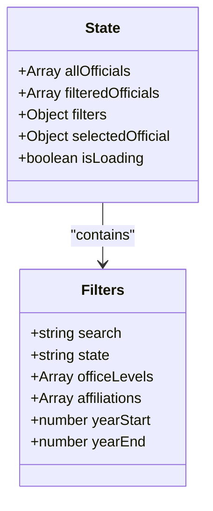
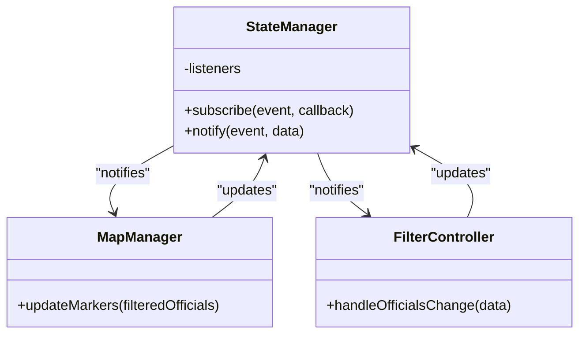
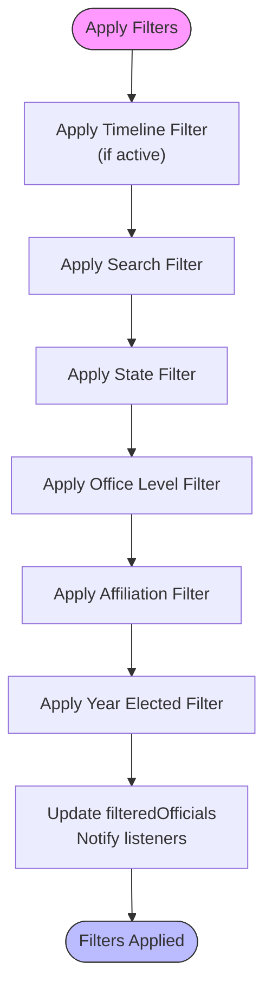
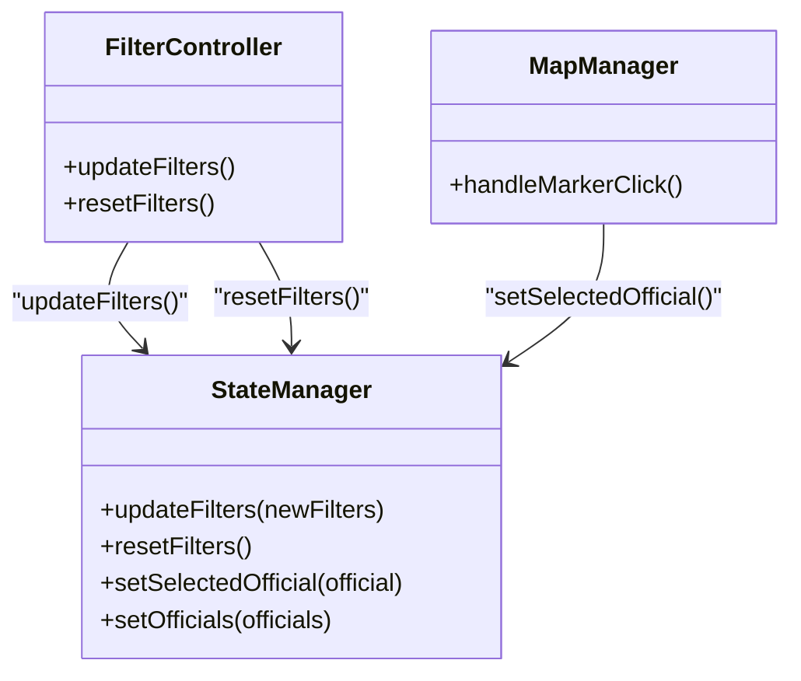
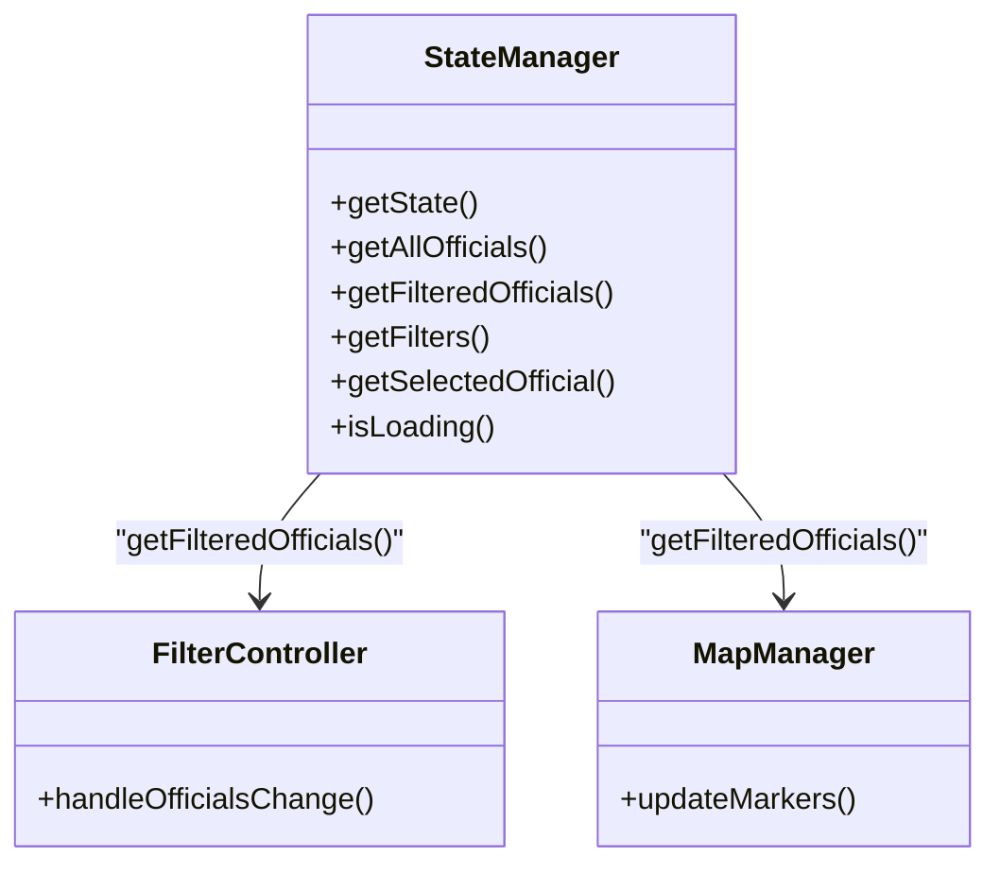
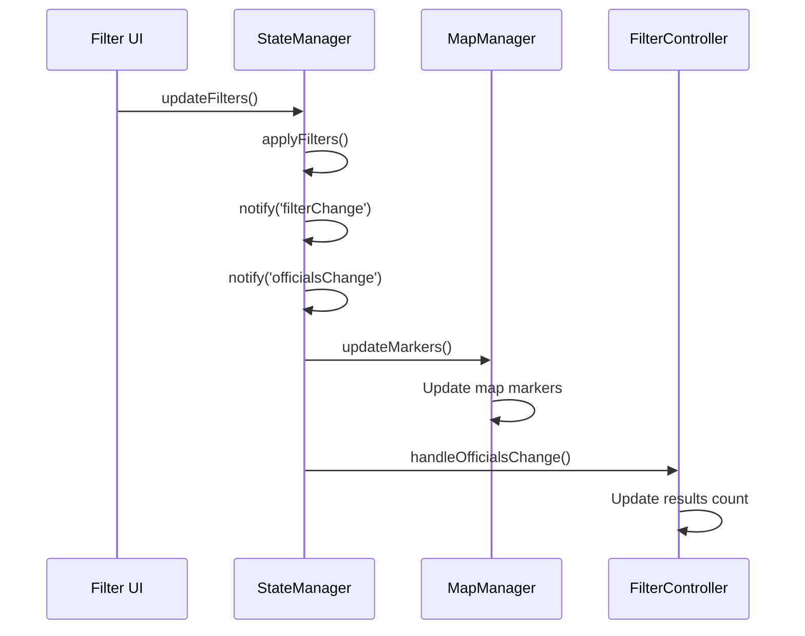

# state-manager.js

<cite>
**Referenced Files in This Document**   
- [state-manager.js](file://js/state-manager.js)
- [map-manager.js](file://js/map-manager.js)
- [filter-controller.js](file://js/filter-controller.js)
- [app.js](file://js/app.js)
- [timeline-controller.js](file://js/timeline-controller.js)
</cite>

## Table of Contents
1. [Introduction](#introduction)
2. [Core State Structure](#core-state-structure)
3. [Observer Pattern Implementation](#observer-pattern-implementation)
4. [Filtering Logic](#filtering-logic)
5. [Public API Methods](#public-api-methods)
6. [Integration with Other Components](#integration-with-other-components)
7. [Event Propagation Flow](#event-propagation-flow)
8. [Common Issues and Solutions](#common-issues-and-solutions)

## Introduction

The `state-manager.js` module serves as the central state management system for the Democratic Socialist Officials Map application. It implements the observer pattern to maintain and distribute application state across various components. The module manages key application data including all officials, filtered officials, filter criteria, and the currently selected official. It provides a comprehensive API for updating state and subscribing to state changes, ensuring that all UI components remain synchronized with the current application state.

**Section sources**
- [state-manager.js](file://js/state-manager.js#L1-L239)

## Core State Structure

The StateManager maintains a comprehensive application state object that tracks all critical data for the application. The state structure is organized into several key components:



**Diagram sources**
- [state-manager.js](file://js/state-manager.js#L8-L21)

The state object contains the following properties:
- **allOfficials**: Array containing all officials loaded from the data source
- **filteredOfficials**: Array containing officials that match the current filter criteria
- **filters**: Object containing the current filter settings for search, state, office level, political affiliation, and year elected
- **selectedOfficial**: Reference to the currently selected official (null when none selected)
- **isLoading**: Boolean flag indicating whether data is still being loaded

The filters object is initialized with default values, including all office levels and an empty array for affiliations that gets populated dynamically from the data.

## Observer Pattern Implementation

The StateManager implements the observer pattern through an event subscription system that allows components to react to state changes. This pattern enables loose coupling between components while ensuring they stay synchronized with the application state.



**Diagram sources**
- [state-manager.js](file://js/state-manager.js#L23-L50)
- [map-manager.js](file://js/map-manager.js#L105-L133)
- [filter-controller.js](file://js/filter-controller.js#L165-L187)

The implementation includes:
- **Event listeners**: A listeners object that maintains arrays of callback functions for different event types
- **subscribe()**: Method that allows components to register callback functions for specific events
- **notify()**: Method that triggers all callbacks for a specific event type, passing relevant data

The system supports three primary event types:
- **stateChange**: Notified when any state changes occur
- **filterChange**: Notified when filter criteria are updated
- **officialsChange**: Notified when the filtered officials list changes

## Filtering Logic

The `applyFilters()` method implements comprehensive filtering logic that processes officials based on multiple criteria. The filtering process is applied in a specific sequence to ensure consistent results.



**Diagram sources**
- [state-manager.js](file://js/state-manager.js#L85-L145)

### Filter Criteria

The filtering logic evaluates officials against the following criteria:

**Search Filter**: Matches officials against the search term in multiple fields:
- Official's name
- Position title
- City (if available)
- County (if available)

The search is case-insensitive and uses partial matching to find relevant officials.

**State Filter**: Filters officials by their state of service. Only officials whose location.state matches the selected state are included.

**Office Level Filter**: Filters officials by their office level (federal, state, county, city, or town). Multiple office levels can be selected simultaneously.

**Affiliation Filter**: Filters officials by their political affiliation. Multiple affiliations can be selected, and officials matching any selected affiliation are included.

**Year Elected Filter**: Filters officials based on their year of election. Two parameters are used:
- **yearStart**: Minimum year (inclusive)
- **yearEnd**: Maximum year (inclusive)

The year filter is only applied when the timeline feature is not active, as the timeline provides a more sophisticated temporal filtering mechanism.

### Timeline Integration

The filtering system integrates with the timeline feature through conditional logic:

```javascript
// Timeline filter (if active and not skipped)
if (!skipTimelineFilter && typeof TimelineController !== 'undefined') {
    filtered = TimelineController.getVisibleOfficials(filtered);
}
```

When the timeline is active, officials are filtered based on the current timeline position rather than the yearStart/yearEnd filters. This allows users to visualize the growth of democratic socialist officials over time.

## Public API Methods

The StateManager exposes a comprehensive public API that allows other components to interact with the application state.

### State Update Methods



**Diagram sources**
- [state-manager.js](file://js/state-manager.js#L76-L165)
- [filter-controller.js](file://js/filter-controller.js#L44-L77)
- [map-manager.js](file://js/map-manager.js#L141-L142)

**updateFilters(newFilters)**: Updates the current filter criteria with the provided partial filter object. The method uses object spreading to merge new filter values with existing ones, preserving unchanged filters. After updating the filters, it automatically applies the filters and notifies subscribers of the filter change.

**resetFilters()**: Resets all filters to their default values. The method repopulates the affiliations list based on the current officials data and applies the default filters. This provides a clean slate for users to start a new search.

**setSelectedOfficial(official)**: Updates the currently selected official. This method is typically called when a user clicks on an official's marker on the map. Setting a selected official triggers a stateChange notification.

**setOfficials(officials)**: Initializes the state with the complete list of officials. This method is called once during application startup after data loading. It also initializes the available affiliations list based on the loaded data.

### State Retrieval Methods



**Diagram sources**
- [state-manager.js](file://js/state-manager.js#L179-L222)
- [filter-controller.js](file://js/filter-controller.js#L167-L174)
- [map-manager.js](file://js/map-manager.js#L105-L133)

The retrieval methods provide read-only access to the current state:
- **getState()**: Returns a complete copy of the current state
- **getAllOfficials()**: Returns the complete list of officials
- **getFilteredOfficials()**: Returns the list of officials matching current filters
- **getFilters()**: Returns the current filter criteria
- **getSelectedOfficial()**: Returns the currently selected official
- **isLoading()**: Returns the loading state

## Integration with Other Components

The StateManager integrates with multiple components through the observer pattern, creating a cohesive application architecture.

### MapManager Integration

The MapManager subscribes to officialsChange events to update the map markers:

```javascript
StateManager.subscribe('officialsChange', function(data) {
    MapManager.updateMarkers(data.filteredOfficials);
});
```

When the filtered officials list changes, the MapManager updates the markers displayed on the map, ensuring the visual representation matches the current filter criteria.

### FilterController Integration

The FilterController both updates the StateManager and responds to its events:

```javascript
// Update state when filters change
StateManager.updateFilters({ search: e.target.value });

// Respond to state changes
StateManager.subscribe('officialsChange', handleOfficialsChange);
StateManager.subscribe('filterChange', handleFilterChange);
```

This bidirectional integration ensures that filter UI elements stay synchronized with the application state.

### TimelineController Integration

The timeline feature integrates with the StateManager through conditional filtering:

```javascript
// In app.js
TimelineController.subscribe('yearChange', function(data) {
    updateTimelineDisplay(data);
    StateManager.applyFilters();
});
```

When the timeline position changes, it triggers the StateManager to reapply filters, which then considers the timeline state when determining visible officials.

## Event Propagation Flow

The StateManager orchestrates a sophisticated event propagation system that ensures all components remain synchronized.



**Diagram sources**
- [state-manager.js](file://js/state-manager.js#L76-L80)
- [map-manager.js](file://js/map-manager.js#L105-L133)
- [filter-controller.js](file://js/filter-controller.js#L165-L187)

The typical event flow when a filter is updated:
1. Filter UI component calls StateManager.updateFilters()
2. StateManager applies the new filters to the officials data
3. StateManager notifies subscribers of filterChange
4. StateManager notifies subscribers of officialsChange
5. MapManager receives officialsChange and updates markers
6. FilterController receives officialsChange and updates the results count

## Common Issues and Solutions

### Issue: Filters Not Updating the Map

**Symptoms**: Changes to filter criteria do not reflect on the map.

**Causes and Solutions**:
- **Missing subscription**: Ensure MapManager has subscribed to officialsChange events
- **Filter application failure**: Verify that applyFilters() is being called after filter updates
- **Data binding issues**: Check that the filteredOfficials array is being properly updated

### Issue: Performance with Large Datasets

**Symptoms**: Application becomes slow when filtering large numbers of officials.

**Solutions**:
- Implement debouncing for search input (already implemented with 300ms delay)
- Consider pagination for results display
- Optimize filter logic by short-circuiting when possible

### Issue: Timeline and Year Filter Conflicts

**Symptoms**: Year filters don't work when timeline is active.

**Explanation**: This is intentional behavior. When the timeline is active, it takes precedence over yearStart/yearEnd filters to provide a cohesive temporal visualization experience.

**Solution**: Deactivate the timeline to use manual year filtering, or use the timeline controls to navigate to specific time periods.

### Issue: Affiliation Filters Not Populating

**Symptoms**: Affiliation checkboxes are empty on first load.

**Cause**: The affiliations list is populated dynamically from the data after loading.

**Solution**: Ensure setOfficials() is called with valid data, which initializes the affiliations list in the filters object.

**Section sources**
- [state-manager.js](file://js/state-manager.js#L61-L63)
- [filter-controller.js](file://js/filter-controller.js#L183-L186)