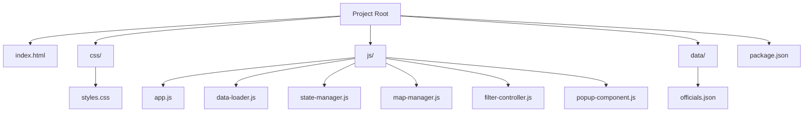
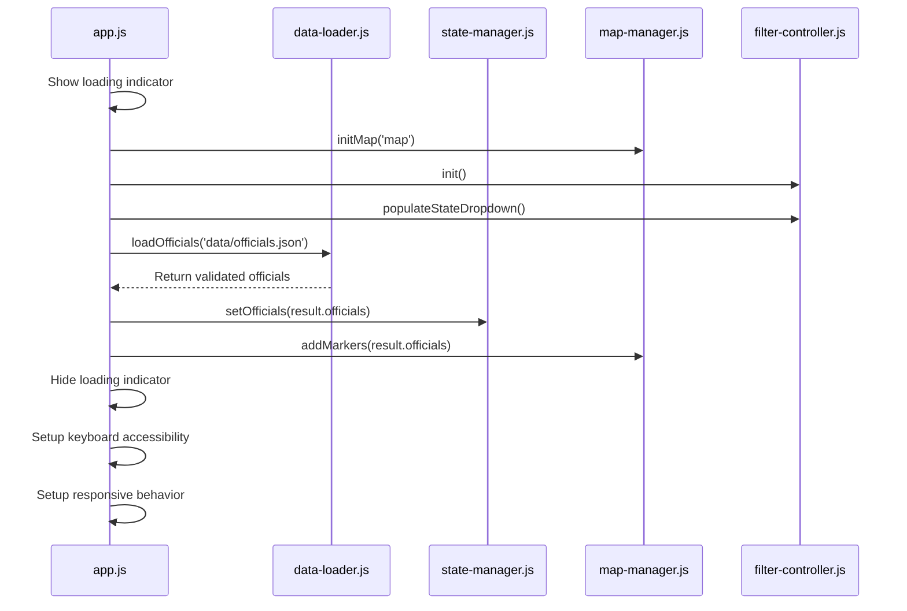
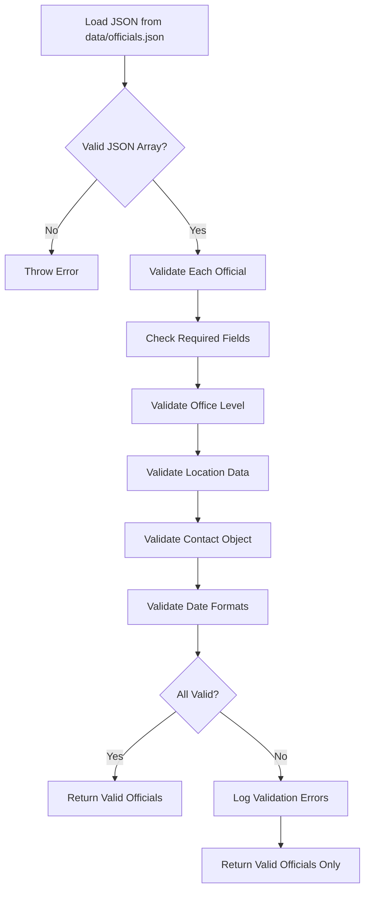
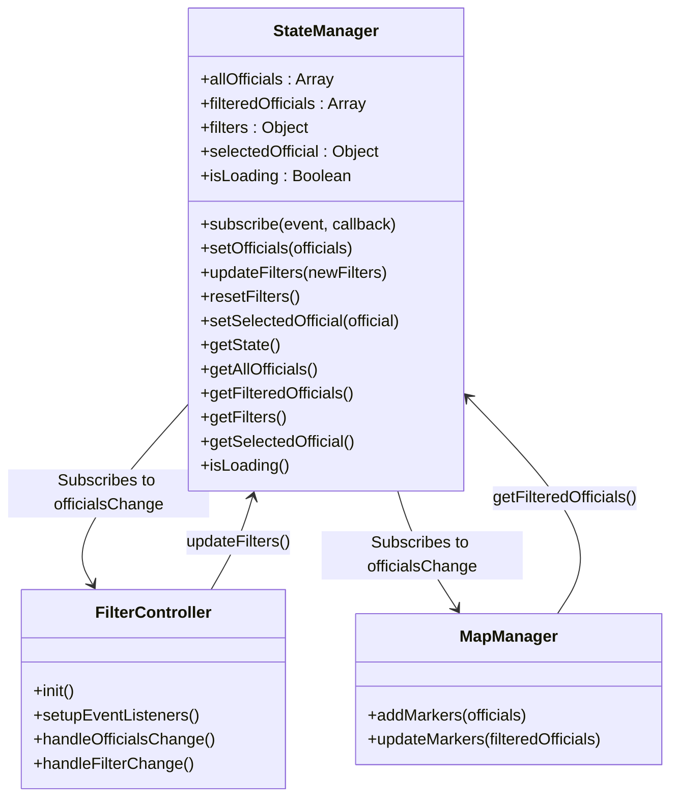
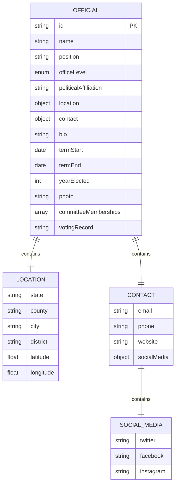

# Project Overview

<cite>
**Referenced Files in This Document**   
- [index.html](file://index.html)
- [js/app.js](file://js/app.js)
- [js/data-loader.js](file://js/data-loader.js)
- [js/state-manager.js](file://js/state-manager.js)
- [js/map-manager.js](file://js/map-manager.js)
- [js/filter-controller.js](file://js/filter-controller.js)
- [js/popup-component.js](file://js/popup-component.js)
- [data/officials.json](file://data/officials.json)
- [css/styles.css](file://css/styles.css)
</cite>

## Table of Contents
1. [Introduction](#introduction)
2. [Project Structure](#project-structure)
3. [Core Components](#core-components)
4. [Architecture Overview](#architecture-overview)
5. [Detailed Component Analysis](#detailed-component-analysis)
6. [Data Model](#data-model)
7. [Usage Patterns](#usage-patterns)
8. [Configuration Options](#configuration-options)
9. [Troubleshooting Guide](#troubleshooting-guide)

## Introduction

The Democratic Socialist Officials Map is an interactive web application that visualizes elected Democratic Socialist and Socialist officials across the United States. The application provides a comprehensive platform for exploring officials through an interactive map interface with advanced filtering capabilities, detailed information popups, and responsive design for all device types.

Built with vanilla JavaScript and the Leaflet.js mapping library, the application follows a modular architecture with clear separation of concerns between components. It features pin clustering for performance optimization, comprehensive filtering by state, office level, political affiliation, and year elected, and full accessibility support following WCAG 2.1 AA standards.

The map displays officials with color-coded markers based on office level, and clicking on any marker reveals a detailed popup with biography, contact information, term dates, committee memberships, and voting records. The application loads all data on initialization for instant filtering and responsive interaction.

**Section sources**
- [README.md](file://README.md#L1-L52)
- [index.html](file://index.html#L1-L26)

## Project Structure

The application follows a clean, organized structure with distinct directories for different types of assets:



**Diagram sources**
- [README.md](file://README.md#L53-L70)

The structure separates concerns effectively:
- **css/**: Contains all styling rules for the application
- **data/**: Stores the officials.json data file that powers the map
- **js/**: Houses all JavaScript modules that implement the application logic
- **index.html**: The main entry point that loads all resources and defines the UI structure

This organization enables maintainability and makes it easy for contributors to locate relevant files based on functionality.

**Section sources**
- [README.md](file://README.md#L53-L70)
- [index.html](file://index.html#L1-L26)

## Core Components

The application consists of six core JavaScript modules that work together to provide the complete functionality:

1. **app.js**: The main application coordinator that initializes all other components
2. **data-loader.js**: Responsible for loading and validating the officials data
3. **state-manager.js**: Maintains application state including filters and selected officials
4. **map-manager.js**: Handles map initialization, marker rendering, and clustering
5. **filter-controller.js**: Manages the filter UI and user interactions
6. **popup-component.js**: Creates and displays detailed information popups

These modules follow the module pattern with clear public APIs and encapsulated private implementation details. They communicate through well-defined interfaces and event subscriptions rather than direct dependencies, promoting loose coupling and maintainability.

The components work together through a central state management system where the StateManager holds the source of truth for officials data and filter settings, while other components subscribe to state changes and update their respective views accordingly.

**Section sources**
- [js/app.js](file://js/app.js#L1-L142)
- [README.md](file://README.md#L61-L67)

## Architecture Overview

The application follows a modular, event-driven architecture with a central state management system. The components are organized in a way that promotes separation of concerns while enabling efficient communication.

```mermaid
graph TD
A[app.js] --> B[data-loader.js]
A --> C[state-manager.js]
A --> D[map-manager.js]
A --> E[filter-controller.js]
A --> F[popup-component.js]
B --> C
C --> D
C --> E
C --> F
D --> F
E --> C
F --> C
G[data/officials.json] --> B
H[Leaflet.js] --> D
I[OpenStreetMap] --> D
style A fill:#457b9d,stroke:#333
style B fill:#e63946,stroke:#333
style C fill:#f77f00,stroke:#333
style D fill:#06a77d,stroke:#333
style E fill:#9b59b6,stroke:#333
style F fill:#1d3557,stroke:#333
```



**Diagram sources**
- [js/app.js](file://js/app.js#L1-L142)
- [js/data-loader.js](file://js/data-loader.js#L1-L183)
- [js/state-manager.js](file://js/state-manager.js#L1-L230)

The architecture flow begins with app.js initializing the application and coordinating the startup sequence. The data-loader.js module loads and validates the officials data from the JSON file, then passes it to the state-manager.js which becomes the central repository for all application state.

The map-manager.js initializes the Leaflet map and handles all map-related functionality including marker creation and clustering. The filter-controller.js manages the filter UI and responds to user interactions by updating the state-manager.js with new filter criteria. The popup-component.js handles the creation and display of detailed information popups when users click on map markers.

All components communicate primarily through the state-manager.js, which acts as the central hub for application state and uses an event subscription system to notify components of state changes.

**Section sources**
- [js/app.js](file://js/app.js#L1-L142)
- [js/state-manager.js](file://js/state-manager.js#L1-L230)

## Detailed Component Analysis

### Application Initialization (app.js)

The app.js module serves as the main entry point and coordinator for the entire application. It follows a structured initialization process that ensures all components are properly set up before the application becomes interactive.



**Diagram sources**
- [js/app.js](file://js/app.js#L10-L52)
- [js/app.js](file://js/app.js#L122-L135)

The initialization process begins by showing a loading indicator to provide user feedback. It then initializes the map, filter controller, and populates the state dropdown before loading the officials data. Once the data is loaded and validated, it's passed to the state manager, and initial markers are added to the map. Finally, the loading indicator is hidden, and additional features like keyboard accessibility and responsive behavior are set up.

**Section sources**
- [js/app.js](file://js/app.js#L1-L142)

### Data Management (data-loader.js)

The data-loader.js module is responsible for loading, parsing, and validating the officials data from the JSON file. It implements comprehensive validation rules to ensure data integrity.



**Diagram sources**
- [js/data-loader.js](file://js/data-loader.js#L98-L144)

The module validates several aspects of each official record:
- Required fields (id, name, position, officeLevel, etc.)
- Valid office levels (federal, state, county, city, town)
- Complete location data with valid state codes and geographic coordinates
- Properly formatted dates (ISO 8601)
- US geographic boundaries for coordinates

The validation process returns both the array of valid officials and an array of validation errors for invalid records, allowing the application to load what it can while logging issues for correction.

**Section sources**
- [js/data-loader.js](file://js/data-loader.js#L1-L183)
- [README.md](file://README.md#L76-L87)

### State Management (state-manager.js)

The state-manager.js module implements a centralized state management system that serves as the single source of truth for the application. It follows an observable pattern where components can subscribe to state changes.



**Diagram sources**
- [js/state-manager.js](file://js/state-manager.js#L8-L228)
- [js/filter-controller.js](file://js/filter-controller.js#L95-L96)
- [js/map-manager.js](file://js/map-manager.js#L173-L174)

The state object contains:
- **allOfficials**: The complete dataset of officials
- **filteredOfficials**: The subset of officials matching current filters
- **filters**: The current filter criteria (search, state, office levels, etc.)
- **selectedOfficial**: The currently selected official for popup display
- **isLoading**: A boolean indicating loading state

Components subscribe to specific events (officialsChange, filterChange, stateChange) and receive notifications when relevant state changes occur, allowing them to update their views accordingly.

**Section sources**
- [js/state-manager.js](file://js/state-manager.js#L1-L230)
- [js/filter-controller.js](file://js/filter-controller.js#L95-L97)

### Map Functionality (map-manager.js)

The map-manager.js module handles all aspects of the Leaflet map integration, including initialization, marker management, and user interactions.

```mermaid
classDiagram
class MapManager {
-map : L.Map
-markerClusterGroup : L.MarkerClusterGroup
-markers : Map
+initMap(containerId)
+addMarkers(officials)
+updateMarkers(filteredOfficials)
+clearMarkers()
+resetView()
+getMap()
+fitBounds()
+getMarker(officialId)
+handleMarkerClick(official)
}
class MapManager --> Leaflet : Uses L.map, L.tileLayer, L.marker
class MapManager --> StateManager : setSelectedOfficial()
class MapManager --> PopupComponent : showPopup()
style MapManager fill : #06a77d,stroke : #333
```

**Diagram sources**
- [js/map-manager.js](file://js/map-manager.js#L7-L216)
- [js/map-manager.js](file://js/map-manager.js#L141-L151)

Key features of the map manager include:
- Custom marker icons with color coding by office level
- Pin clustering to improve performance and usability
- Smooth zoom animations to official locations
- Marker click handling that updates application state and shows popups
- Responsive map sizing that adapts to window resizing

The module uses predefined zoom levels and colors for different office types, ensuring consistent user experience across different official categories.

**Section sources**
- [js/map-manager.js](file://js/map-manager.js#L1-L218)
- [README.md](file://README.md#L8-L9)

### Filtering System (filter-controller.js)

The filter-controller.js module manages the filter UI and implements the filtering logic in coordination with the state manager.

```mermaid
flowchart TD
A[User Interaction] --> B{Type of Interaction?}
B --> |Search Input| C[Debounce 300ms]
C --> D[StateManager.updateFilters({search})]
B --> |State Selection| E[StateManager.updateFilters({state})]
B --> |Office Level Change| F[StateManager.updateFilters({officeLevels})]
B --> |Affiliation Change| G[StateManager.updateFilters({affiliations})]
B --> |Year Change| H[StateManager.updateFilters({yearStart/yearEnd})]
B --> |Clear Filters| I[StateManager.resetFilters()]
J[StateManager] --> |officialsChange| K[FilterController.handleOfficialsChange]
K --> L[Update Results Count]
K --> M[Update Map Markers]
K --> N[Show/Hide No Results]
K --> O[Populate Affiliations]
```

**Diagram sources**
- [js/filter-controller.js](file://js/filter-controller.js#L41-L77)
- [js/filter-controller.js](file://js/filter-controller.js#L166-L186)

The filter controller implements several important features:
- Debounced search input to prevent excessive filtering during typing
- Event listeners for all filter controls that update the state manager
- Subscription to state changes to update the UI accordingly
- Dynamic population of affiliation checkboxes based on data
- Mobile-friendly filter panel toggling
- Results count display that updates with filtering

The module uses event delegation and proper event handling to ensure good performance and accessibility.

**Section sources**
- [js/filter-controller.js](file://js/filter-controller.js#L1-L271)
- [index.html](file://index.html#L31-L140)

### Information Display (popup-component.js)

The popup-component.js module handles the creation and display of detailed information popups when users click on map markers.

```mermaid
flowchart TD
A[Marker Click] --> B[MapManager.handleMarkerClick]
B --> C[PopupComponent.showPopup]
C --> D[Create HTML Content]
D --> E[Format Dates]
E --> F[Escape HTML for Security]
F --> G[Create Leaflet Popup]
G --> H[Open on Map]
H --> I[Set Up Close Event]
I --> J[Update State to Null]
class PopupComponent {
+showPopup(official, latlng)
+closePopup()
+createPopupContent(official)
+formatDate(dateString)
+escapeHtml(text)
}
```

**Diagram sources**
- [js/popup-component.js](file://js/popup-component.js#L201-L227)
- [js/popup-component.js](file://js/popup-component.js#L29-L182)

The popup displays comprehensive information about each official, including:
- Name, position, and office level badge
- Biography
- Contact information with clickable links (email, phone, website)
- Social media links
- Political affiliation and term dates
- Committee memberships
- Voting record (with link if available)
- Location details

The component implements XSS protection by properly escaping HTML content and uses lazy loading for images to improve performance.

**Section sources**
- [js/popup-component.js](file://js/popup-component.js#L1-L264)
- [index.html](file://index.html#L145)

## Data Model

The application's data model is defined by the structure of officials in the data/officials.json file. Each official record follows a consistent schema with required and optional fields.



**Diagram sources**
- [data/officials.json](file://data/officials.json#L1-L493)
- [README.md](file://README.md#L76-L95)

The data model includes several key components:

### Required Fields
- **id**: Unique identifier for the official
- **name**: Full name of the official
- **position**: Official title or position
- **officeLevel**: Categorical level of office (federal, state, county, city, town)
- **politicalAffiliation**: Party or organization affiliation
- **location**: Object containing state, latitude, and longitude
- **contact**: Object for contact information (can be empty)
- **bio**: Biography or descriptive text
- **termStart**: ISO 8601 date when term began
- **yearElected**: Year the official was first elected

### Optional Fields
- **photo**: URL to a photo of the official
- **termEnd**: ISO 8601 date when term ends (null for ongoing)
- **location.county, city, district**: Additional location details
- **contact.email, phone, website**: Specific contact methods
- **contact.socialMedia**: Object with social media handles
- **committeeMemberships**: Array of committee names
- **votingRecord**: URL or description of voting record

The data model is designed to be both comprehensive and flexible, allowing for rich information display while maintaining consistency across records.

**Section sources**
- [data/officials.json](file://data/officials.json#L1-L493)
- [README.md](file://README.md#L76-L95)

## Usage Patterns

The application supports several common usage patterns that reflect typical user interactions with the map.

### Initial Load and Display
When the application loads, it follows a specific sequence:
1. Initialize the map centered on the continental US
2. Set up the filter panel with default values
3. Load and validate officials data from the JSON file
4. Populate the state dropdown with all valid state codes
5. Add all valid officials as markers on the map
6. Display the total count of officials

This pattern ensures that users see a complete map immediately upon loading, with all officials visible by default.

### Filtering Officials
Users can filter officials through several methods:
- **Search**: Type a name or location to find matching officials
- **State**: Select a specific state from the dropdown
- **Office Level**: Check or uncheck office level categories
- **Political Affiliation**: Filter by specific affiliations
- **Year Elected**: Specify a range of years

The filtering is applied in real-time with a 300ms debounce on search input to prevent excessive processing during typing. Filters are combined using AND logic, so officials must match all active filter criteria.

### Exploring Official Information
To learn more about a specific official:
1. Click on their marker on the map
2. The map automatically zooms to an appropriate level
3. A detailed popup appears with comprehensive information
4. Users can close the popup by clicking the X button or pressing Escape

The popup includes all available information about the official, with clickable links for contact methods and social media.

### Mobile Usage
The application includes specific features for mobile devices:
- Tap the filter header to expand/collapse the filter panel
- Responsive layout that adapts to smaller screens
- Touch-friendly controls and adequate tap targets
- Optimized performance for mobile networks

These patterns ensure that users can effectively interact with the map regardless of their device or interaction method.

**Section sources**
- [js/app.js](file://js/app.js#L10-L52)
- [js/filter-controller.js](file://js/filter-controller.js#L41-L77)
- [js/map-manager.js](file://js/map-manager.js#L139-L151)
- [js/popup-component.js](file://js/popup-component.js#L201-L227)

## Configuration Options

The application provides several configuration options that can be modified to customize its behavior.

### Data Configuration
The primary configuration is the data/officials.json file, which contains all official records. To add or update officials:
1. Edit the JSON file directly
2. Ensure all required fields are present
3. Validate the JSON structure
4. Save the file

Each official record must include the required fields as specified in the data model. The application will validate all records on load and log any validation errors to the console.

### Styling Customization
The application's appearance can be customized through the css/styles.css file. Key customizable elements include:
- Map marker colors and sizes
- Filter panel layout and colors
- Popup dimensions and styling
- Responsive breakpoints
- Accessibility features like high contrast mode

The CSS uses modern techniques including Flexbox and Grid for layout, ensuring responsive design across devices.

### Functional Configuration
Several aspects of the application's functionality can be configured through the JavaScript modules:

#### Map Settings (map-manager.js)
- Initial map center coordinates
- Default zoom level
- Minimum and maximum zoom levels
- Marker clustering radius
- Zoom levels for different office types
- Marker colors by office level

#### Filtering Behavior (filter-controller.js)
- Search debounce delay
- Default filter values
- Mobile breakpoint for filter panel toggling

#### Data Validation (data-loader.js)
- Valid office levels
- Valid state codes
- Required fields
- Date format validation

These configuration options allow administrators to tailor the application to their specific needs without modifying the core functionality.

**Section sources**
- [data/officials.json](file://data/officials.json#L1-L493)
- [css/styles.css](file://css/styles.css)
- [js/map-manager.js](file://js/map-manager.js#L12-L27)
- [js/filter-controller.js](file://js/filter-controller.js#L40-L45)
- [js/data-loader.js](file://js/data-loader.js#L8-L15)

## Troubleshooting Guide

This section addresses common issues that may occur when using or maintaining the Democratic Socialist Officials Map.

### Data Loading Issues
If the map fails to load or displays no officials:

**Check the console for error messages**
- Look for JavaScript errors that might prevent initialization
- Verify that all required files are loading properly

**Validate the JSON data**
- Ensure data/officials.json is valid JSON format
- Check for syntax errors like missing commas or brackets
- Verify that the file contains an array of objects

**Verify file paths**
- Confirm that data/officials.json is in the correct location
- Ensure the path in DataLoader.loadOfficials() matches the actual file location
- Check that the server has proper permissions to access the file

**Section sources**
- [js/data-loader.js](file://js/data-loader.js#L98-L148)
- [README.md](file://README.md#L147-L153)

### Display and Rendering Problems
If markers are not appearing or the map displays incorrectly:

**Check browser compatibility**
- Ensure you're using a supported modern browser
- Try clearing the browser cache and reloading
- Disable browser extensions that might interfere

**Verify map container**
- Confirm that the #map element exists in index.html
- Check that the container has sufficient height (set in CSS)
- Ensure no other elements are overlapping the map

**Inspect network requests**
- Use browser developer tools to verify all resources load
- Check for failed requests to Leaflet CSS/JS files
- Verify the officials.json file loads successfully

**Section sources**
- [index.html](file://index.html#L145)
- [js/map-manager.js](file://js/map-manager.js#L33-L47)
- [css/styles.css](file://css/styles.css)

### Filtering and Interaction Issues
If filters don't work or interactions are unresponsive:

**Verify event listeners**
- Check that FilterController.init() is called
- Ensure all DOM elements exist with correct IDs
- Verify event listeners are properly attached

**Check state management**
- Confirm StateManager is properly updating and notifying subscribers
- Verify that filter changes trigger the expected state updates
- Check that filtered officials are being passed to MapManager

**Test individual components**
- Verify data-loader.js returns valid officials
- Check that state-manager.js contains the expected data
- Test map-manager.js with hardcoded data to isolate issues

**Section sources**
- [js/filter-controller.js](file://js/filter-controller.js#L13-L32)
- [js/state-manager.js](file://js/state-manager.js#L35-L50)
- [js/app.js](file://js/app.js#L21-L23)