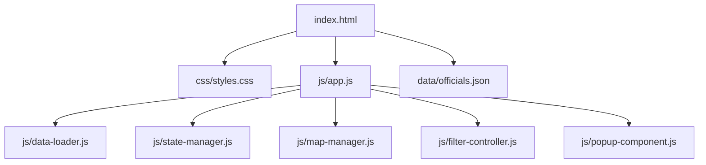

# Project Structure

<cite>
**Referenced Files in This Document**   
- [index.html](file://index.html)
- [css/styles.css](file://css/styles.css)
- [js/app.js](file://js/app.js)
- [js/data-loader.js](file://js/data-loader.js)
- [js/state-manager.js](file://js/state-manager.js)
- [js/map-manager.js](file://js/map-manager.js)
- [js/filter-controller.js](file://js/filter-controller.js)
- [js/popup-component.js](file://js/popup-component.js)
- [data/officials.json](file://data/officials.json)
- [package.json](file://package.json)
- [README.md](file://README.md)
</cite>

## Table of Contents
1. [Project Structure Overview](#project-structure-overview)
2. [Directory Organization](#directory-organization)
3. [Core Files and Their Roles](#core-files-and-their-roles)
4. [Architectural Reasoning](#architectural-reasoning)
5. [Developer Interaction Patterns](#developer-interaction-patterns)

## Project Structure Overview

The Democratic Socialist Officials Map project follows a clean, modular structure designed for maintainability and scalability. The architecture separates concerns into distinct directories for styles, scripts, and data, with a clear entry point and configuration files. This organization supports the application's core functionality: displaying elected Democratic Socialist and Socialist officials across the United States on an interactive map with advanced filtering capabilities.

The project structure reflects a single-page application (SPA) design with client-side rendering, where all components work together to create an interactive experience without requiring page reloads. The separation of concerns allows developers to work on specific aspects of the application independently while maintaining a cohesive user experience.

**Diagram sources**
- [index.html](file://index.html#L1-L178)
- [package.json](file://package.json#L1-L15)

## Directory Organization

The project is organized into three main directories (css, js, data) along with root-level configuration and documentation files. This structure follows conventional web development patterns, making it intuitive for developers to locate resources.

The **css/** directory contains all styling information for the application. Currently, it houses a single styles.css file that implements a comprehensive design system with CSS variables for colors, spacing, shadows, and transitions. This approach ensures visual consistency across the application and makes theme adjustments straightforward by modifying variables in one location.

The **js/** directory contains all JavaScript functionality, organized into specialized modules that follow the Single Responsibility Principle. Each JavaScript file handles a specific aspect of the application's behavior, from data loading to UI interactions. This modular approach enables code reuse and makes testing and debugging more manageable.

The **data/** directory stores the application's data source in JSON format. This separation of data from code allows for easy updates to the officials list without modifying the application logic. The JSON structure is designed to be both human-readable and machine-parsable, facilitating contributions from non-developers who can add or update official information.

**Section sources**
- [README.md](file://README.md#L53-L70)

## Core Files and Their Roles

The application's functionality is distributed across several key files, each with a well-defined responsibility. The **index.html** file serves as the entry point and structural foundation of the application, defining the DOM elements that the JavaScript components interact with, including the filter panel, map container, and interactive controls.

The **js/app.js** file acts as the application coordinator, initializing all modules and managing the startup sequence. It handles error conditions gracefully and ensures that the application loads in the correct order: first initializing the map, then setting up filters, and finally loading and validating the officials data. This orchestration pattern prevents race conditions and ensures a reliable user experience.

The **js/data-loader.js** module is responsible for retrieving and validating the officials data from the JSON file. It implements comprehensive validation rules to ensure data integrity, checking required fields, office levels, state codes, and geographical coordinates. This validation layer protects the application from rendering with incomplete or incorrect data.

The **js/state-manager.js** file implements a centralized state management system that coordinates the application's data flow. It maintains the complete list of officials, the currently filtered subset, active filters, and the selected official. This state object is updated through well-defined methods, and changes are broadcast to interested components via an event subscription system.

The **js/map-manager.js** module handles all interactions with the Leaflet.js mapping library, including map initialization, marker creation, and clustering. It defines custom marker styles based on office level and manages the visual representation of officials on the map. The module also handles navigation, zooming to appropriate levels based on office type when a marker is clicked.

The **js/filter-controller.js** file manages the filter UI and user interactions, connecting the visual filter controls to the state management system. It implements event listeners for all filter inputs and updates the application state accordingly. The controller also handles responsive behavior, adapting the filter panel's presentation for mobile devices.

The **js/popup-component.js** module creates and displays detailed information popups when users click on official markers. It formats the official's information with proper HTML escaping for security and organizes the data into a visually appealing layout with contact information, biography, and other details.

The **data/officials.json** file contains the complete dataset of elected officials, with each record including comprehensive information such as name, position, contact details, biography, and term information. The JSON structure is designed to be extensible, allowing for additional fields to be added as needed.

**Section sources**
- [js/app.js](file://js/app.js#L1-L142)
- [js/data-loader.js](file://js/data-loader.js#L1-L185)
- [js/state-manager.js](file://js/state-manager.js#L1-L230)
- [js/map-manager.js](file://js/map-manager.js#L1-L218)
- [js/filter-controller.js](file://js/filter-controller.js#L1-L271)
- [js/popup-component.js](file://js/popup-component.js#L1-L264)
- [data/officials.json](file://data/officials.json#L1-L493)

## Architectural Reasoning

The project's architecture follows a modular, component-based design that promotes separation of concerns and maintainability. Each JavaScript file represents a distinct module with a specific responsibility, communicating through well-defined interfaces rather than direct dependencies. This loose coupling allows for easier testing, debugging, and future enhancements.

The application implements a unidirectional data flow pattern, where user interactions trigger state changes that propagate through the system to update the UI. This predictable flow makes the application's behavior easier to understand and debug. The state-manager.js module serves as the single source of truth for application data, preventing inconsistencies that could arise from multiple data sources.

The styling architecture uses CSS custom properties (variables) defined in the :root selector, creating a design system that ensures visual consistency across the application. This approach allows for easy theme modifications by changing variable values in one location. The CSS also implements responsive design principles, adapting the layout for different screen sizes with media queries.

The data architecture separates content from presentation, with the officials.json file serving as a pure data source that can be updated independently of the application code. This separation facilitates content updates and makes the application more maintainable over time. The data validation in data-loader.js ensures data integrity before it enters the application state.

The application's error handling strategy includes both client-side validation and graceful degradation. When data fails validation, the application continues to function with the valid records while logging the issues for developer review. This approach provides a better user experience than failing completely when encountering minor data issues.

**Section sources**
- [css/styles.css](file://css/styles.css#L1-L800)
- [js/state-manager.js](file://js/state-manager.js#L1-L230)

## Developer Interaction Patterns

Developers interact with the project structure through well-defined patterns that support efficient development and maintenance. To add or update officials, developers edit the data/officials.json file following the specified schema, ensuring all required fields are present and properly formatted. The validation system in data-loader.js will identify any issues during application startup.

To modify the application's visual appearance, developers work within the css/styles.css file, leveraging the defined CSS variables to maintain design consistency. The comprehensive commenting structure helps developers understand the purpose of different style sections and make targeted changes without unintended side effects.

When extending functionality, developers can add new JavaScript modules following the existing pattern of self-contained, immediately-invoked function expressions (IIFEs) that expose a public API. This pattern prevents global namespace pollution and makes dependencies explicit. New modules can subscribe to state changes or trigger state updates through the state-manager's event system.

The build and development workflow is configured in package.json, with a simple npm start command that launches a Python HTTP server for local development. This minimal setup reduces configuration overhead and makes it easy for new contributors to get started with the project.

For debugging, developers can leverage the comprehensive console logging implemented throughout the application, which provides visibility into the initialization sequence, data loading process, and state changes. The modular structure also makes it easier to isolate issues to specific components.

**Section sources**
- [README.md](file://README.md#L72-L131)
- [package.json](file://package.json#L1-L15)