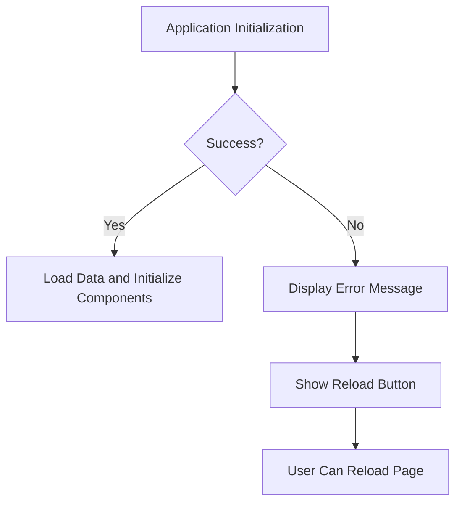
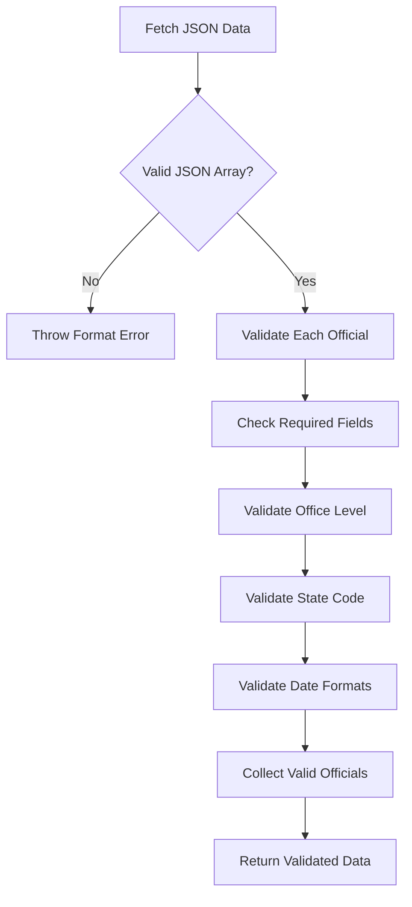
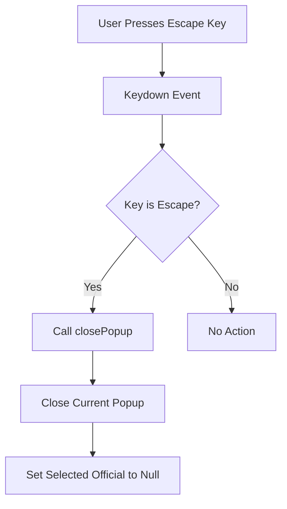

# Support

<cite>
**Referenced Files in This Document**   
- [app.js](file://js/app.js)
- [data-loader.js](file://js/data-loader.js)
- [popup-component.js](file://js/popup-component.js)
</cite>

## Table of Contents
1. [Introduction](#introduction)
2. [Error Handling and User Feedback](#error-handling-and-user-feedback)
3. [Data Validation and Loading](#data-validation-and-loading)
4. [Popup and Accessibility Features](#popup-and-accessibility-features)
5. [Troubleshooting Common Issues](#troubleshooting-common-issues)

## Introduction
This document provides comprehensive support information for the Democratic Socialist Officials Map application. It covers error handling mechanisms, data validation processes, user interface feedback systems, and accessibility features. The content is designed to help users and developers understand how the application handles various scenarios and to provide solutions for common issues.

## Error Handling and User Feedback

The application implements robust error handling to ensure users are informed of issues and can take appropriate actions. When initialization fails, a user-friendly error message is displayed with a reload option.

**Diagram sources**
- [app.js](file://js/app.js#L48-L64)

The error display mechanism creates a modal dialog with an error message and a reload button, ensuring users can easily recover from initialization failures. The loading indicator is also managed to provide visual feedback during data loading.

**Section sources**
- [app.js](file://js/app.js#L59-L64)
- [app.js](file://js/app.js#L15-L18)

## Data Validation and Loading

The data loading process includes comprehensive validation to ensure data integrity. The DataLoader module validates each official record against predefined rules, checking required fields, office levels, state codes, and date formats.

**Diagram sources**
- [data-loader.js](file://js/data-loader.js#L98-L143)

The validation process checks for required fields such as ID, name, position, office level, political affiliation, location, contact, bio, term start, and year elected. It also validates that office levels are one of the permitted values and that state codes are valid US state abbreviations.

**Section sources**
- [data-loader.js](file://js/data-loader.js#L22-L80)
- [data-loader.js](file://js/data-loader.js#L64-L75)

## Popup and Accessibility Features

The application includes accessibility features to enhance usability for all users. The popup component handles the display of official information with proper formatting and includes an escape key handler to close popups.

**Diagram sources**
- [app.js](file://js/app.js#L95-L97)
- [popup-component.js](file://js/popup-component.js#L239-L245)

The popup component formats dates for display and creates HTML content for official information, including contact details, biography, and committee memberships. It also handles image loading with error fallbacks.

**Section sources**
- [popup-component.js](file://js/popup-component.js#L14-L22)
- [popup-component.js](file://js/popup-component.js#L29-L182)

## Troubleshooting Common Issues

When encountering issues with the application, users should first check the following:

1. **File Upload**: Ensure all files are properly uploaded to the server
2. **JSON Validity**: Verify that the officials.json file contains valid JSON format
3. **Network Connection**: Check for stable network connectivity
4. **JavaScript**: Ensure browser JavaScript is enabled

Common error messages and their solutions:
- **"Failed to load the map"**: Refresh the page to retry loading
- **"HTTP error"**: Check network connection and file paths
- **"Invalid data format"**: Validate JSON structure and ensure it's an array
- **"No valid officials data loaded"**: Verify required fields in official records

The application logs detailed information to the browser console, which can be accessed for debugging purposes. Validation errors are logged with specific details about which fields failed validation.

**Section sources**
- [app.js](file://js/app.js#L48-L52)
- [data-loader.js](file://js/data-loader.js#L134-L136)
- [README.md](file://README.md#L303-L309)