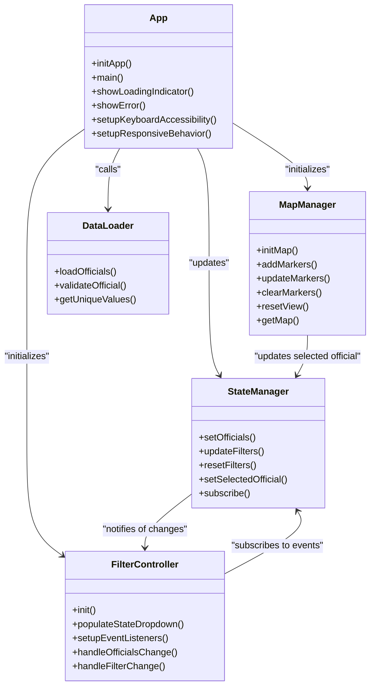
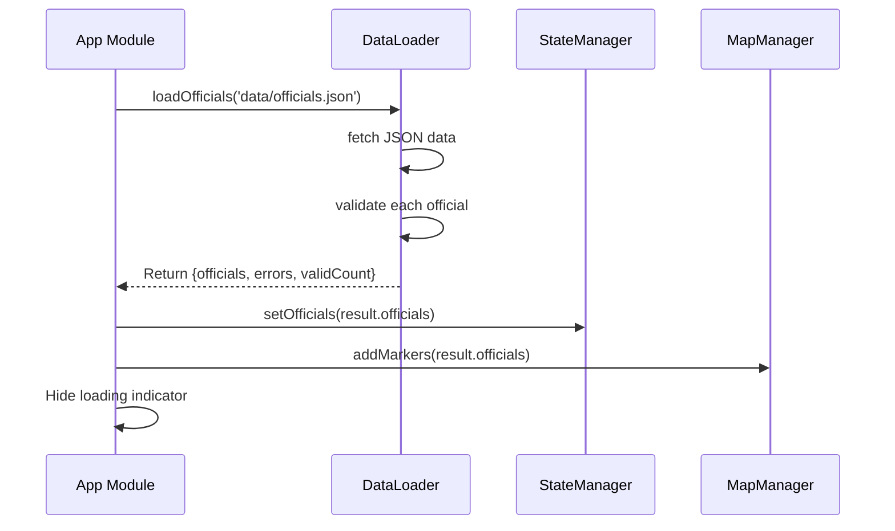

# Application Initialization

<cite>
**Referenced Files in This Document**   
- [app.js](file://js/app.js)
- [map-manager.js](file://js/map-manager.js)
- [filter-controller.js](file://js/filter-controller.js)
- [data-loader.js](file://js/data-loader.js)
- [state-manager.js](file://js/state-manager.js)
</cite>

## Table of Contents
1. [Introduction](#introduction)
2. [Initialization Sequence](#initialization-sequence)
3. [Core Component Interaction](#core-component-interaction)
4. [Asynchronous Data Loading](#asynchronous-data-loading)
5. [Error Handling and Recovery](#error-handling-and-recovery)
6. [Global Event Setup](#global-event-setup)
7. [Performance Considerations](#performance-considerations)
8. [Troubleshooting Guide](#troubleshooting-guide)

## Introduction

The application initialization process is orchestrated by the app module, which coordinates the startup sequence for the Democratic Socialist Officials Map. This document details how the application bootstraps itself, manages the loading state, handles errors, and establishes communication between core modules. The initialization follows a well-defined sequence that ensures proper setup of the map interface, data loading, filtering capabilities, and state management before the application becomes fully interactive.

The initialization process begins with DOM readiness checks and progresses through a series of coordinated steps involving multiple core modules. This architecture ensures that components are initialized in the correct order and that dependencies are properly resolved before use.

**Section sources**
- [app.js](file://js/app.js#L1-L142)

## Initialization Sequence

The application initialization follows a strict sequence to ensure proper setup of all components. The process begins with the `main` function, which checks the document's ready state and either waits for the `DOMContentLoaded` event or proceeds immediately if the DOM is already loaded.

```mermaid
flowchart TD
Start([Application Start]) --> DOMReady{"DOM Ready?"}
DOMReady --> |Yes| InitApp[Call initApp()]
DOMReady --> |No| WaitForDOM[Wait for DOMContentLoaded]
WaitForDOM --> InitApp
InitApp --> ShowLoading[Show Loading Indicator]
ShowLoading --> InitMap[Initialize MapManager]
InitMap --> InitFilter[Initialize FilterController]
InitFilter --> LoadData[Load Officials Data]
LoadData --> SetState[Set Officials in StateManager]
SetState --> AddMarkers[Add Markers to Map]
AddMarkers --> HideLoading[Hide Loading Indicator]
HideLoading --> SetupKeyboard[Setup Keyboard Accessibility]
SetupKeyboard --> SetupResponsive[Setup Responsive Behavior]
SetupResponsive --> Complete([Initialization Complete])
```

**Diagram sources**
- [app.js](file://js/app.js#L122-L139)

The `initApp` function serves as the primary entry point for application initialization and follows this sequence:

1. Display the loading indicator to provide user feedback
2. Initialize the MapManager to create the map interface
3. Initialize the FilterController and populate the state dropdown
4. Asynchronously load officials data from the JSON file
5. Validate that data was successfully loaded
6. Set the officials data in the StateManager
7. Add markers for all officials to the map
8. Hide the loading indicator
9. Set up global event listeners for keyboard and responsive behavior

This sequential approach ensures that each component is properly initialized before the next step begins, preventing race conditions and ensuring a reliable startup process.

**Section sources**
- [app.js](file://js/app.js#L10-L52)

## Core Component Interaction

The application initialization involves coordinated interaction between four core modules: MapManager, FilterController, DataLoader, and StateManager. The app module acts as the orchestrator, calling methods on these modules in a specific order to establish the application's initial state.



**Diagram sources**
- [app.js](file://js/app.js#L10-L52)
- [map-manager.js](file://js/map-manager.js#L3-L216)
- [filter-controller.js](file://js/filter-controller.js#L3-L269)
- [data-loader.js](file://js/data-loader.js#L3-L183)
- [state-manager.js](file://js/state-manager.js#L3-L228)

The interaction pattern follows a clear dependency hierarchy:

- **MapManager**: Responsible for initializing the Leaflet map instance and rendering officials as markers. It's initialized first to ensure the map interface is ready before data is loaded.
  
- **FilterController**: Manages the filter UI components and event listeners. It's initialized after the map to coordinate filter interactions with the map display.

- **DataLoader**: Handles asynchronous loading and validation of officials data from the JSON file. It's called by the app module but doesn't require initialization.

- **StateManager**: Maintains the application state including all officials, filtered officials, and current filters. Other components subscribe to state changes to update their behavior accordingly.

This modular architecture allows each component to focus on its specific responsibility while the app module coordinates their interaction during initialization.

**Section sources**
- [app.js](file://js/app.js#L10-L52)
- [map-manager.js](file://js/map-manager.js#L3-L216)
- [filter-controller.js](file://js/filter-controller.js#L3-L269)
- [data-loader.js](file://js/data-loader.js#L3-L183)
- [state-manager.js](file://js/state-manager.js#L3-L228)

## Asynchronous Data Loading

The application employs an asynchronous data loading workflow to fetch officials data without blocking the user interface. The `initApp` function uses the `await` keyword to handle the promise returned by `DataLoader.loadOfficials`, ensuring that subsequent initialization steps only proceed after data has been loaded.



**Diagram sources**
- [app.js](file://js/app.js#L25-L35)
- [data-loader.js](file://js/data-loader.js#L98-L144)

The data loading process includes several important steps:

1. **Fetching**: The DataLoader uses the Fetch API to retrieve the JSON file containing officials data.

2. **Validation**: Each official record is validated against predefined rules including required fields, valid office levels, state codes, and geographical coordinates.

3. **Error Handling**: Invalid records are collected in an errors array while valid records are added to the officials array. This allows the application to load as much valid data as possible even if some records are malformed.

4. **Result Processing**: The DataLoader returns an object containing the valid officials array, validation errors, and count information.

The app module then uses this result to:
- Set the officials data in the StateManager
- Add markers for all officials to the MapManager
- Log validation warnings for any invalid records
- Provide feedback on the number of officials successfully loaded

This approach ensures that the application can handle imperfect data gracefully while still providing a functional interface with the available valid data.

**Section sources**
- [app.js](file://js/app.js#L25-L35)
- [data-loader.js](file://js/data-loader.js#L98-L144)

## Error Handling and Recovery

The application initialization includes comprehensive error handling to ensure a robust user experience even when initialization fails. The `initApp` function is wrapped in a try-catch block that handles both data loading errors and other initialization issues.

```mermaid
flowchart TD
InitApp[initApp()] --> Try[Try Block]
Try --> ShowLoading[Show Loading Indicator]
ShowLoading --> InitializeComponents[Initialize Components]
InitializeComponents --> LoadData[Load Officials Data]
LoadData --> ValidateData[Validate Data]
ValidateData --> Success{Success?}
Success --> |Yes| Complete[Complete Initialization]
Success --> |No| Catch[Catch Error]
Catch --> LogError[Log Error to Console]
Catch --> ShowError[Show User-Friendly Error]
Catch --> HideLoading[Hide Loading Indicator]
ShowError --> ReloadButton[Display Reload Button]
```

**Diagram sources**
- [app.js](file://js/app.js#L48-L52)
- [app.js](file://js/app.js#L69-L87)

The error handling strategy includes multiple layers:

1. **Console Logging**: All errors are logged to the console with descriptive messages, aiding in debugging and issue diagnosis.

2. **User-Friendly Error Display**: When initialization fails, a modal error message is displayed to the user with a clear explanation and a reload button.

3. **Loading State Management**: The loading indicator is hidden even when errors occur, preventing the application from appearing stuck.

4. **Graceful Degradation**: For non-critical issues like validation warnings, the application continues initialization while logging the issues for developer review.

The `showError` function creates a modal dialog with:
- A clear error message explaining the issue
- A reload button that allows users to retry initialization
- Proper accessibility attributes including role="alert"
- Styling that ensures visibility regardless of the current page state

This comprehensive error handling ensures that users are never left wondering what went wrong and always have a clear path to recovery.

**Section sources**
- [app.js](file://js/app.js#L48-L52)
- [app.js](file://js/app.js#L69-L87)

## Global Event Setup

After successful initialization, the application sets up global event listeners to enhance accessibility and responsive behavior. These listeners are established in the `main` function and ensure consistent behavior throughout the application's lifecycle.

```mermaid
flowchart TD
SetupKeyboard[setupKeyboardAccessibility] --> AddListener[Add keydown Listener]
AddListener --> CheckEscape{Key is Escape?}
CheckEscape --> |Yes| ClosePopup[Call PopupComponent.closePopup()]
CheckEscape --> |No| Ignore[Ignore Event]
SetupResponsive[setupResponsiveBehavior] --> AddResizeListener[Add resize Listener]
AddResizeListener --> Debounce[Debounce with 250ms]
Debounce --> GetMap[Get Map Instance]
GetMap --> InvalidateSize[Call map.invalidateSize()]
```

**Diagram sources**
- [app.js](file://js/app.js#L92-L99)
- [app.js](file://js/app.js#L104-L116)

Two key global behaviors are established:

1. **Keyboard Accessibility**: The `setupKeyboardAccessibility` function adds a keydown event listener that closes any open popup when the Escape key is pressed. This enhances accessibility by providing keyboard navigation for modal content.

2. **Responsive Behavior**: The `setupResponsiveBehavior` function adds a resize event listener that updates the map size when the window dimensions change. This uses a debounce pattern with a 250ms delay to prevent excessive map updates during rapid resizing.

The responsive behavior is particularly important for the Leaflet map, which requires explicit size updates when its container dimensions change. Without this handler, the map would not properly resize on window changes, leading to display issues.

These global event listeners are set up once during initialization and remain active for the duration of the application, providing consistent behavior across all application states.

**Section sources**
- [app.js](file://js/app.js#L92-L116)

## Performance Considerations

The initialization process incorporates several performance optimizations to ensure a responsive user experience:

1. **Loading Indicator**: The immediate display of a loading indicator provides instant feedback, reducing perceived load time.

2. **Sequential Initialization**: Components are initialized in a logical order that minimizes blocking and ensures dependencies are ready when needed.

3. **Debounced Resize Handling**: The responsive behavior uses debouncing to limit map resize updates, preventing performance issues during window resizing.

4. **Efficient Data Processing**: The DataLoader processes data in a single pass, validating and filtering records efficiently.

5. **Lazy Event Setup**: Global event listeners are only established after successful initialization, avoiding unnecessary event handling during the critical startup phase.

The initialization sequence is designed to be as fast as possible while ensuring reliability. By showing the loading indicator immediately and only hiding it after all critical components are ready, the application provides clear feedback about its state.

For future optimization, consider implementing:
- Code splitting to reduce initial bundle size
- Data pagination for large datasets
- Web Workers for intensive data processing
- Service workers for offline caching of data

These enhancements could further improve initialization performance, especially for users with slower connections or devices.

## Troubleshooting Guide

Common initialization issues and their solutions:

1. **Blank Screen After Load**
   - Check browser console for JavaScript errors
   - Verify that the map container element exists in the DOM
   - Ensure the Leaflet CSS and JS files are properly loaded

2. **Loading Indicator Never Disappears**
   - Check network tab for failed data requests
   - Verify the data/officials.json file exists and is accessible
   - Confirm the JSON structure matches expected format

3. **Map Not Displaying Properly**
   - Ensure the map container has defined dimensions
   - Check for CSS conflicts that might affect positioning
   - Verify the map initialization code is executing

4. **Filter Dropdowns Not Populating**
   - Confirm that DataLoader.VALID_STATE_CODES is available
   - Check that the state select element has the correct ID
   - Verify that FilterController.init() is being called

5. **Markers Not Appearing on Map**
   - Check that officials data contains valid latitude and longitude
   - Verify that the location objects are properly structured
   - Ensure the MapManager.addMarkers() function is being called

When troubleshooting, always check the browser's developer console first, as it will typically provide the most specific information about what went wrong during initialization.

**Section sources**
- [app.js](file://js/app.js#L48-L52)
- [app.js](file://js/app.js#L69-L87)