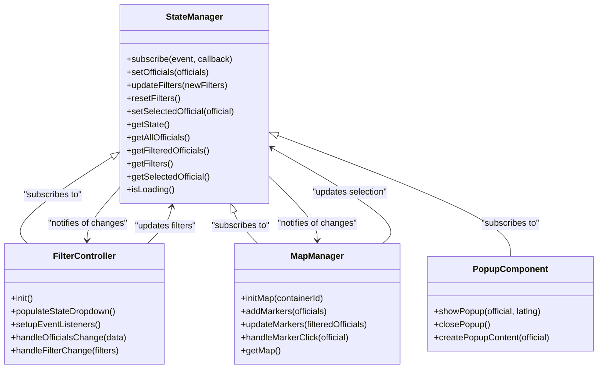
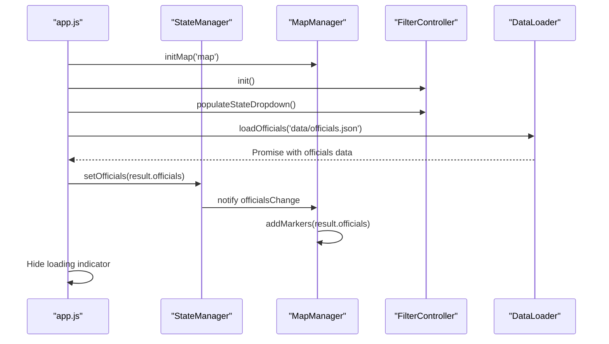
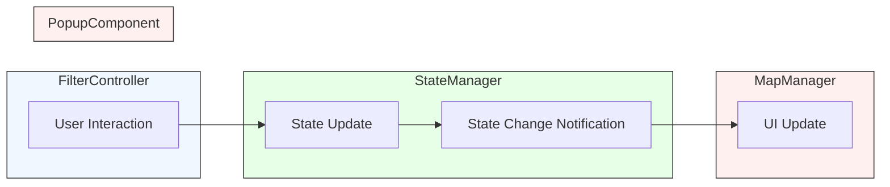
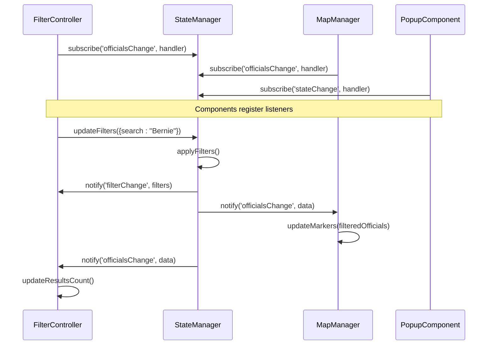
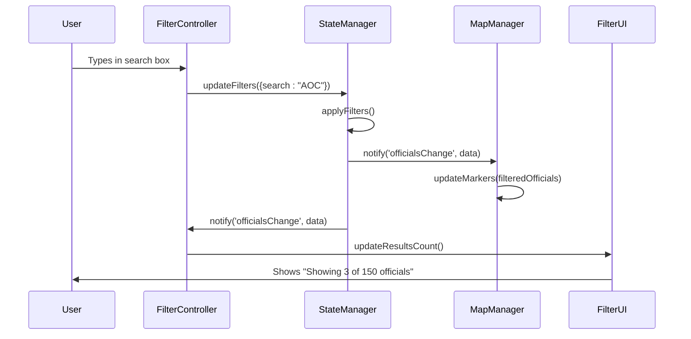
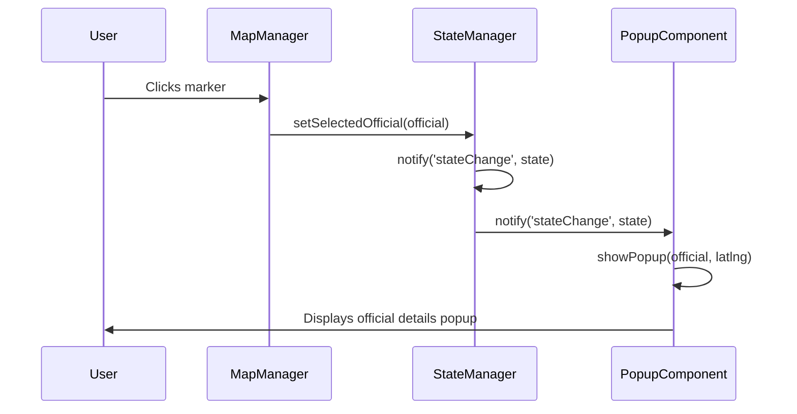

# Component Communication Patterns

<cite>
**Referenced Files in This Document**   
- [app.js](file://js/app.js)
- [state-manager.js](file://js/state-manager.js)
- [map-manager.js](file://js/map-manager.js)
- [filter-controller.js](file://js/filter-controller.js)
- [popup-component.js](file://js/popup-component.js)
</cite>

## Table of Contents
1. [Introduction](#introduction)
2. [Mediator Pattern Implementation](#mediator-pattern-implementation)
3. [Application Initialization and Orchestration](#application-initialization-and-orchestration)
4. [Unidirectional Data Flow](#unidirectional-data-flow)
5. [Event-Driven Communication](#event-driven-communication)
6. [Component Interaction Examples](#component-interaction-examples)
7. [Architecture Benefits](#architecture-benefits)
8. [Conclusion](#conclusion)

## Introduction
This document details the component communication patterns in the Democratic Socialist Officials Map application. The architecture employs a mediator pattern through the StateManager module to enable loose coupling between independent components. The app.js module acts as the orchestrator during initialization, connecting modules like MapManager, FilterController, and PopupComponent through a shared state. The system implements unidirectional data flow and event-driven communication, ensuring maintainable and extensible code.

## Mediator Pattern Implementation

The application implements the mediator pattern through the StateManager module, which serves as a central hub for application state and communication between components. This pattern enables loose coupling by preventing direct dependencies between modules while providing a consistent interface for state management.

The StateManager maintains the complete application state including officials data, filters, and the currently selected official. Components interact with the state through a well-defined API that includes methods for updating state and subscribing to state changes.

**Diagram sources**
- [state-manager.js](file://js/state-manager.js#L4-L228)
- [filter-controller.js](file://js/filter-controller.js#L4-L269)
- [map-manager.js](file://js/map-manager.js#L4-L216)
- [popup-component.js](file://js/popup-component.js#L4-L262)

**Section sources**
- [state-manager.js](file://js/state-manager.js#L4-L228)

## Application Initialization and Orchestration

The app.js module serves as the orchestrator during application initialization, coordinating the setup of all independent modules through the shared state. This centralized initialization ensures proper sequencing and dependency management without creating tight coupling between components.

During initialization, app.js follows a specific sequence:
1. Initializes the map through MapManager
2. Initializes the filter controller through FilterController
3. Loads officials data through DataLoader
4. Sets the officials data in StateManager
5. Adds initial markers to the map based on the loaded data

**Diagram sources**
- [app.js](file://js/app.js#L10-L140)
- [state-manager.js](file://js/state-manager.js#L56-L70)
- [map-manager.js](file://js/map-manager.js#L102-L132)

**Section sources**
- [app.js](file://js/app.js#L10-L140)

## Unidirectional Data Flow

The application implements a strict unidirectional data flow pattern, ensuring predictable state changes and simplifying debugging. Data flows in one direction: from user interactions to state updates, and then to UI updates.

The flow follows this pattern:
1. User interacts with UI (e.g., changes filter)
2. Component updates state through StateManager
3. StateManager notifies subscribers of state changes
4. Subscribers update their UI based on new state

**Diagram sources**
- [filter-controller.js](file://js/filter-controller.js#L40-L60)
- [state-manager.js](file://js/state-manager.js#L76-L80)
- [filter-controller.js](file://js/filter-controller.js#L166-L187)

**Section sources**
- [filter-controller.js](file://js/filter-controller.js#L40-L60)
- [state-manager.js](file://js/state-manager.js#L76-L80)

## Event-Driven Communication

Components communicate through an event-driven subscribe/notify pattern implemented by the StateManager. This approach enables reactive updates without direct dependencies between modules.

The pattern works as follows:
- Components subscribe to specific state change events
- When state changes, StateManager notifies all subscribers
- Subscribers react to the state change by updating their UI or behavior

**Diagram sources**
- [state-manager.js](file://js/state-manager.js#L35-L50)
- [filter-controller.js](file://js/filter-controller.js#L95-L96)
- [filter-controller.js](file://js/filter-controller.js#L166-L187)
- [map-manager.js](file://js/map-manager.js#L103-L105)

**Section sources**
- [state-manager.js](file://js/state-manager.js#L35-L50)
- [filter-controller.js](file://js/filter-controller.js#L95-L96)

## Component Interaction Examples

### Filter Changes Propagation
When a user changes filters, the changes propagate through the system in a predictable flow:

**Diagram sources**
- [filter-controller.js](file://js/filter-controller.js#L40-L46)
- [state-manager.js](file://js/state-manager.js#L76-L80)
- [filter-controller.js](file://js/filter-controller.js#L166-L187)
- [map-manager.js](file://js/map-manager.js#L165-L167)

### Marker Click Updates
When a user clicks on a map marker, the selected official state is updated, triggering UI updates:

**Diagram sources**
- [map-manager.js](file://js/map-manager.js#L141-L142)
- [state-manager.js](file://js/state-manager.js#L162-L165)
- [popup-component.js](file://js/popup-component.js#L215-L227)

**Section sources**
- [map-manager.js](file://js/map-manager.js#L141-L142)
- [popup-component.js](file://js/popup-component.js#L215-L227)

## Architecture Benefits

The implemented architecture provides several key benefits for maintainability and extensibility:

### Maintainability Advantages
- **Loose Coupling**: Components have no direct dependencies on each other, making changes to one component less likely to affect others
- **Predictable State Changes**: The unidirectional data flow makes it easier to trace state changes and debug issues
- **Centralized State Management**: All state is managed in one place, reducing the risk of inconsistent state across the application
- **Clear Separation of Concerns**: Each component has a well-defined responsibility and interface

### Extensibility Opportunities
- **Easy Component Addition**: New components can be added by subscribing to existing state events without modifying other components
- **Flexible UI Updates**: Multiple UI components can react to the same state changes, enabling rich, synchronized interfaces
- **State Persistence**: The centralized state management makes it easier to implement features like state saving and restoration
- **Testing Simplicity**: Components can be tested in isolation by mocking the StateManager interface

The architecture also supports future enhancements such as:
- Adding new filter types without modifying the core state management
- Implementing different visualization modes (e.g., list view, timeline view) that respond to the same state
- Integrating with external services by extending the state management pattern
- Adding undo/redo functionality through state history

**Section sources**
- [state-manager.js](file://js/state-manager.js#L4-L228)
- [app.js](file://js/app.js#L10-L140)

## Conclusion
The Democratic Socialist Officials Map application implements a robust component communication architecture based on the mediator pattern. By using StateManager as a central hub for state management and event notification, the application achieves loose coupling between components while maintaining a predictable unidirectional data flow.

The app.js module effectively orchestrates the initialization process, connecting independent modules through the shared state. This approach enables components like MapManager, FilterController, and PopupComponent to communicate through well-defined interfaces without direct dependencies.

The event-driven subscribe/notify pattern allows components to react to state changes reactively, creating a responsive user interface. This architecture provides significant benefits for maintainability and extensibility, making it easier to add new features and modify existing functionality without introducing bugs or creating tight coupling between components.

Overall, this architectural approach creates a scalable foundation that can accommodate future enhancements while maintaining code quality and developer productivity.