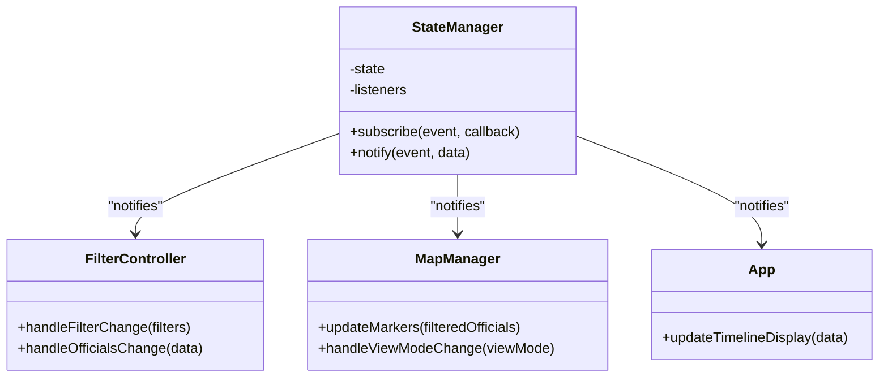
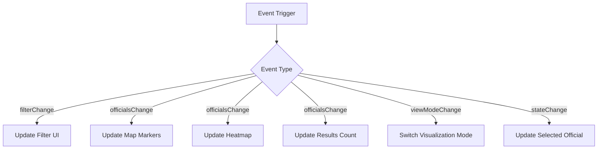
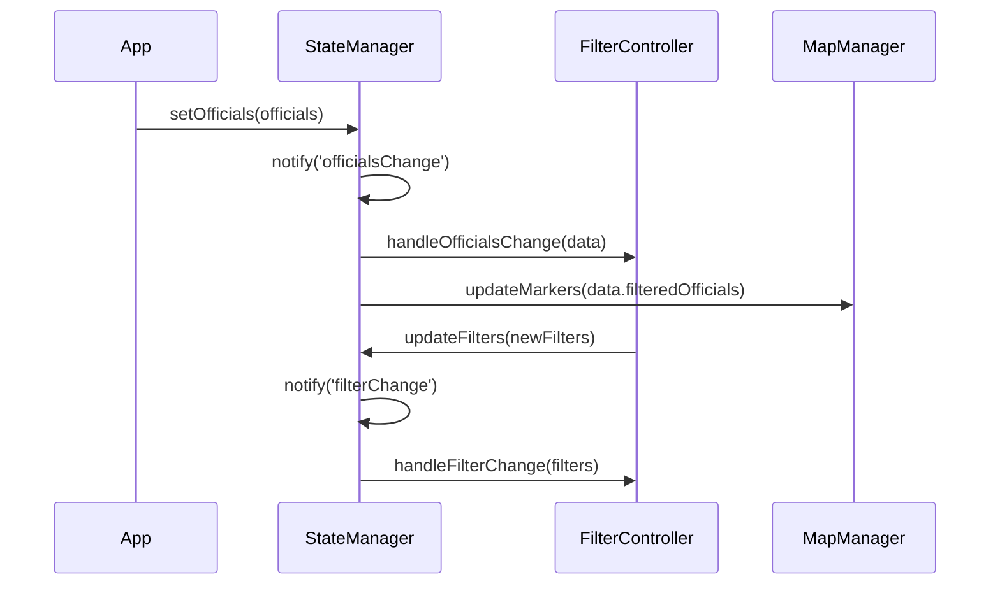

# Event Notification System

<cite>
**Referenced Files in This Document**   
- [state-manager.js](file://js/state-manager.js)
- [filter-controller.js](file://js/filter-controller.js)
- [map-manager.js](file://js/map-manager.js)
- [app.js](file://js/app.js)
- [popup-component.js](file://js/popup-component.js)
</cite>

## Table of Contents
1. [Introduction](#introduction)
2. [Observer Pattern Implementation](#observer-pattern-implementation)
3. [Event Types and Notification Flow](#event-types-and-notification-flow)
4. [Subscription Management](#subscription-management)
5. [Event Flow Examples](#event-flow-examples)
6. [Common Issues and Best Practices](#common-issues-and-best-practices)
7. [Debugging and Monitoring](#debugging-and-monitoring)

## Introduction
The StateManager module implements a robust event notification system using the Observer pattern to manage state changes across the application. This system enables decoupled communication between components by allowing subscribers to register for specific events and receive notifications when state changes occur. The event-driven architecture ensures that UI components stay synchronized with the application state without direct dependencies.

**Section sources**
- [state-manager.js](file://js/state-manager.js#L1-L258)

## Observer Pattern Implementation
The event notification system is built around the Observer pattern, with the `listeners` object serving as the central registry for event subscriptions. The pattern is implemented through two core methods: `subscribe` and `notify`. Components register interest in specific events by subscribing with a callback function, and the StateManager notifies all registered listeners when events occur.

The `listeners` object maintains separate arrays for each event type, including `stateChange`, `filterChange`, `officialsChange`, and `viewModeChange`. This design allows for targeted event distribution and prevents unnecessary callback executions. The implementation ensures loose coupling between components, as subscribers only need to know about the StateManager API rather than direct references to other components.

**Diagram sources**
- [state-manager.js](file://js/state-manager.js#L24-L30)
- [filter-controller.js](file://js/filter-controller.js#L96-L98)
- [map-manager.js](file://js/map-manager.js#L78-L79)

**Section sources**
- [state-manager.js](file://js/state-manager.js#L37-L51)

## Event Types and Notification Flow
The system supports four primary event types, each serving a specific purpose in the application's state management:

- **stateChange**: Notifies subscribers when any state property changes, passing the complete state object
- **filterChange**: Triggers when filters are updated, providing the current filter configuration
- **officialsChange**: Fires when the officials collection or filtered results change, including both all and filtered officials
- **viewModeChange**: Signals changes in the visualization mode (markers or heatmap)

The `notify` method broadcasts events to all registered listeners for a specific event type, passing relevant data. This ensures that components receive timely updates with the necessary context to update their state or UI. The event flow is synchronous, guaranteeing that all listeners are notified in the order they subscribed.

**Diagram sources**
- [state-manager.js](file://js/state-manager.js#L48-L51)
- [filter-controller.js](file://js/filter-controller.js#L178-L203)
- [map-manager.js](file://js/map-manager.js#L179-L193)

**Section sources**
- [state-manager.js](file://js/state-manager.js#L25-L30)

## Subscription Management
Components register for events using the `subscribe` method, which takes an event type and callback function. The subscription process validates the event type against the available listeners and adds the callback to the appropriate array. This design allows multiple components to subscribe to the same event type, enabling broadcast-style communication.

Proper subscription timing is critical for application stability. Subscriptions should occur after the StateManager is initialized but before state changes begin. The app.js file demonstrates correct subscription sequencing, where components subscribe during initialization. The FilterController subscribes to `officialsChange` and `filterChange` events to update the UI, while MapManager listens for `viewModeChange` to switch visualization modes.

**Diagram sources**
- [state-manager.js](file://js/state-manager.js#L37-L40)
- [filter-controller.js](file://js/filter-controller.js#L96-L98)
- [app.js](file://js/app.js#L187-L189)

**Section sources**
- [state-manager.js](file://js/state-manager.js#L37-L40)
- [filter-controller.js](file://js/filter-controller.js#L96-L100)

## Event Flow Examples
When filters are applied, a coordinated event flow ensures all components update appropriately. The FilterController calls `StateManager.updateFilters()`, which updates the state and triggers `applyFilters()` to recalculate the filtered officials collection. This process generates both `filterChange` and `officialsChange` events, notifying all subscribers.

For filter updates, the sequence begins with UI interaction (e.g., typing in the search field), which triggers a debounced call to `updateFilters()`. The StateManager updates the filter state, applies the filters, and notifies subscribers. The FilterController updates the results count and UI, while MapManager updates the markers or heatmap based on the new filtered data.

When an official is selected, clicking a marker calls `StateManager.setSelectedOfficial()`, which updates the selected official in the state and triggers a `stateChange` event. This causes the PopupComponent to display the official's details and updates any UI elements that depend on the selected official state.

**Section sources**
- [state-manager.js](file://js/state-manager.js#L78-L82)
- [filter-controller.js](file://js/filter-controller.js#L42-L47)
- [map-manager.js](file://js/map-manager.js#L147-L156)

## Common Issues and Best Practices
Memory leaks can occur when components fail to clean up event listeners, though the current implementation doesn't provide an unsubscribe mechanism. To prevent this, ensure components are designed to maintain their subscriptions for their entire lifecycle, or implement a cleanup strategy when components are destroyed.

Race conditions may occur during initialization if subscriptions happen after state changes begin. To avoid this, follow the pattern in app.js where all subscriptions are established before loading data with `setOfficials()`. This ensures no events are missed during the critical initialization phase.

Best practices include:
- Subscribe during component initialization, before any state changes
- Keep event handlers lightweight and focused on their primary responsibility
- Use appropriate event types to minimize unnecessary updates
- Ensure data consistency by completing state updates before notification
- Avoid circular dependencies where components both subscribe to and trigger the same events

**Section sources**
- [state-manager.js](file://js/state-manager.js#L58-L72)
- [app.js](file://js/app.js#L31-L32)
- [popup-component.js](file://js/popup-component.js#L210-L212)

## Debugging and Monitoring
The event system includes built-in logging to aid debugging. The `handleFilterChange` and `handleViewModeChange` functions in FilterController include console.log statements that display filter updates and view mode changes. These logs help trace event propagation and verify that notifications are working correctly.

To monitor listener counts, developers can inspect the `listeners` object in StateManager, which maintains arrays for each event type. The length of these arrays indicates the number of active subscribers. During development, this can help identify potential memory leaks or missing subscriptions.

Effective debugging strategies include:
- Checking console logs for event notifications
- Verifying subscription order in component initialization
- Using browser developer tools to set breakpoints in event handlers
- Monitoring the state object before and after events to ensure consistency
- Testing edge cases like rapid filter changes or concurrent state updates

**Section sources**
- [filter-controller.js](file://js/filter-controller.js#L212-L213)
- [state-manager.js](file://js/state-manager.js#L230-L231)
- [app.js](file://js/app.js#L173-L189)