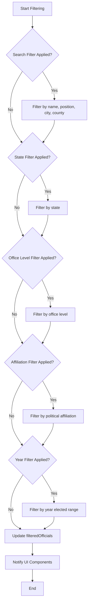
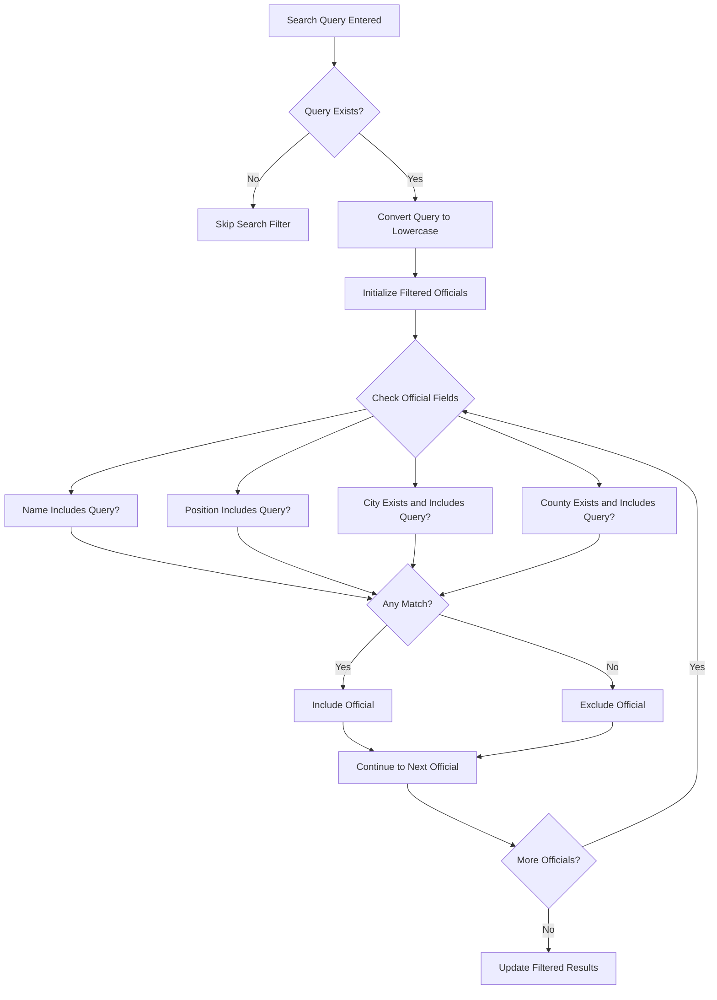
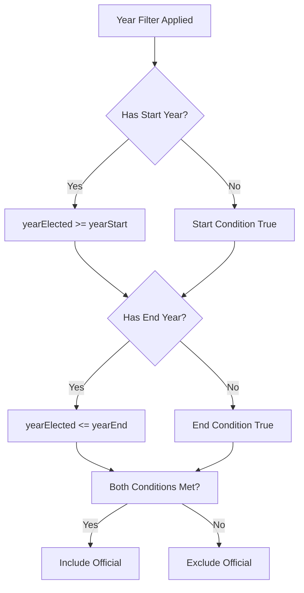
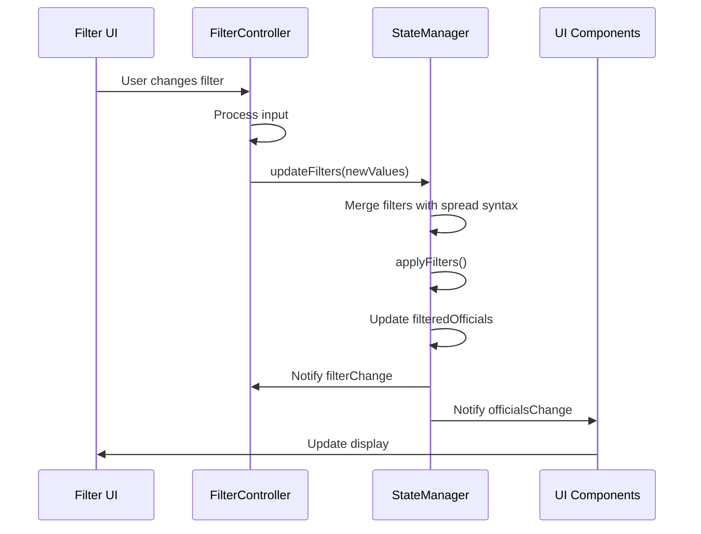

# Filtering Logic Implementation

<cite>
**Referenced Files in This Document**   
- [state-manager.js](file://js/state-manager.js)
- [filter-controller.js](file://js/filter-controller.js)
- [data-loader.js](file://js/data-loader.js)
</cite>

## Table of Contents
1. [Introduction](#introduction)
2. [Filtering Process Overview](#filtering-process-overview)
3. [applyFilters Method Implementation](#applyfilters-method-implementation)
4. [Search Filter Logic](#search-filter-logic)
5. [State Filter Logic](#state-filter-logic)
6. [Office Level Filter Logic](#office-level-filter-logic)
7. [Political Affiliation Filter Logic](#political-affiliation-filter-logic)
8. [Year Elected Filter Logic](#year-elected-filter-logic)
9. [updateFilters Method Interaction](#updatefilters-method-interaction)
10. [Filter Persistence and Data Reload](#filter-persistence-and-data-reload)
11. [Performance Considerations](#performance-considerations)
12. [Common Issues and Troubleshooting](#common-issues-and-troubleshooting)

## Introduction
The filtering system in the Democratic Socialist Officials Map application is centered around the StateManager module, which maintains application state and provides filtering capabilities for officials data. This document details the implementation of the filtering logic, focusing on the applyFilters method that processes multiple filter criteria including search queries, state selection, office level, political affiliation, and year elected ranges. The system is designed to provide responsive filtering while maintaining state integrity and efficient performance.

**Section sources**
- [state-manager.js](file://js/state-manager.js#L3-L256)

## Filtering Process Overview
The filtering process follows a sequential approach where each filter condition is applied to the dataset in a specific order. The StateManager maintains both the complete dataset (allOfficials) and the filtered results (filteredOfficials). When filters are updated, the system applies each filter condition to the dataset, progressively narrowing down the results. The filtering process is event-driven, with changes to filters triggering notifications to UI components that need to update their display.

**Diagram sources**
- [state-manager.js](file://js/state-manager.js#L86-L138)

**Section sources**
- [state-manager.js](file://js/state-manager.js#L86-L138)

## applyFilters Method Implementation
The applyFilters method implements a sequential filtering approach that processes each filter condition in a specific order. The method starts with the complete dataset (allOfficials) and applies each filter condition using JavaScript's array filter() method. Each filter condition is evaluated independently, and only active filters (those with non-empty values) are applied. This approach ensures that the filtering process is efficient by short-circuiting empty filters and only processing relevant conditions.

The method follows a pattern of initializing the filtered dataset with all officials and then progressively narrowing it down through each filter condition. After all filters are applied, the filteredOfficials state is updated, and an officialsChange event is notified to inform subscribers of the updated results.

**Section sources**
- [state-manager.js](file://js/state-manager.js#L86-L138)

## Search Filter Logic
The search filter implements case-insensitive string matching across multiple fields of the official objects. When a search query is provided, the method converts the search term to lowercase and checks for inclusion in the name, position, city, and county fields of each official. The search uses the includes() method to find partial matches, allowing users to find officials by typing any part of their name, position, or location.

The implementation handles potential null values for city and county fields by using conditional checks before attempting string operations. This prevents runtime errors when accessing properties of undefined location objects. The search filter combines multiple field checks with logical OR operations, ensuring that an official is included in results if any of the searched fields contain the query string.

**Diagram sources**
- [state-manager.js](file://js/state-manager.js#L90-L101)

**Section sources**
- [state-manager.js](file://js/state-manager.js#L90-L101)

## State Filter Logic
The state filter implements exact matching of the official's state code against the selected filter value. The filter is applied only when a state value is present in the filters object. It uses strict equality (===) to compare the official.location.state property with the filter value, ensuring precise matching without type coercion.

This filter operates on the two-letter state codes (e.g., 'CA' for California) and is designed to work with the standardized state codes defined in the DataLoader module. The implementation assumes that both the official data and filter values use the same state code format, which is validated during data loading to maintain consistency.

**Section sources**
- [state-manager.js](file://js/state-manager.js#L103-L108)

## Office Level Filter Logic
The office level filter checks whether an official's officeLevel property is included in the array of selected office levels. The filter is applied only when the officeLevels array contains one or more values. It uses the includes() method to determine if the official's officeLevel (e.g., 'federal', 'state', 'county') matches any of the selected levels.

By default, all office levels are included in the filter, allowing users to see officials across all government levels. Users can refine their search by deselecting specific office levels, which removes those values from the officeLevels array and excludes officials with those office levels from the results.

**Section sources**
- [state-manager.js](file://js/state-manager.js#L110-L115)

## Political Affiliation Filter Logic
The political affiliation filter operates similarly to the office level filter, checking if an official's politicalAffiliation property is included in the array of selected affiliations. The filter is applied only when the affiliations array contains one or more values. Initially, the affiliations filter is populated with all unique political affiliations found in the dataset using the DataLoader.getUniqueValues method.

The implementation allows for multiple affiliations to be selected simultaneously, with officials being included in results if their affiliation matches any of the selected options. This enables users to view officials from multiple political affiliations at once, supporting comparative analysis across different political groups.

**Section sources**
- [state-manager.js](file://js/state-manager.js#L117-L122)

## Year Elected Filter Logic
The year elected filter implements range-based filtering using logical operators to handle start and end year conditions. The filter is applied when either yearStart or yearEnd has a value. For each official, the method checks if their yearElected value satisfies both the start and end conditions.

The implementation uses logical OR with negation to handle optional range boundaries: if yearStart is null, the start condition is automatically satisfied; if yearEnd is null, the end condition is automatically satisfied. This allows users to specify only a minimum year, only a maximum year, or both to create a complete range. The conditions are combined with a logical AND, requiring both conditions to be met for an official to be included in results.

**Diagram sources**
- [state-manager.js](file://js/state-manager.js#L124-L132)

**Section sources**
- [state-manager.js](file://js/state-manager.js#L124-L132)

## updateFilters Method Interaction
The updateFilters method serves as the primary interface for modifying filter values and triggering the filtering process. It uses the spread syntax ({...state.filters, ...newFilters}) to merge new filter values with existing ones, preserving unchanged filter values while updating only the specified properties.

When updateFilters is called, it immediately invokes applyFilters to recalculate the filtered results based on the updated filter state. After filtering is complete, it notifies subscribers of the filterChange event with the updated filter object. This design ensures that filter updates are atomic and that the UI remains synchronized with the current filter state.

The method is typically called by the FilterController in response to user interactions with filter controls, creating a clean separation between UI events and state management.

**Diagram sources**
- [state-manager.js](file://js/state-manager.js#L75-L82)
- [filter-controller.js](file://js/filter-controller.js#L42-L74)

**Section sources**
- [state-manager.js](file://js/state-manager.js#L75-L82)
- [filter-controller.js](file://js/filter-controller.js#L42-L74)

## Filter Persistence and Data Reload
Filter persistence is maintained through the StateManager's state object, which retains filter values even when new data is loaded. When officials data is reloaded (e.g., from a refreshed JSON file), the setOfficials method preserves existing filter values while updating the allOfficials and filteredOfficials arrays.

The resetFilters method provides a way to return all filters to their default values, including repopulating the affiliations filter with the unique values from the current dataset. This ensures that the filter options remain relevant to the loaded data while providing a consistent reset mechanism.

**Section sources**
- [state-manager.js](file://js/state-manager.js#L58-L72)
- [state-manager.js](file://js/state-manager.js#L144-L158)

## Performance Considerations
The filtering implementation includes several performance optimizations to handle potentially large datasets efficiently. Empty filters are short-circuited using conditional checks, preventing unnecessary array iterations when a filter is not active. The sequential application of filters means that each subsequent filter operates on a progressively smaller dataset, reducing the number of elements that need to be processed.

For the search filter, the implementation minimizes string operations by converting the search term to lowercase once before the filtering loop, rather than performing the conversion for each official. The use of native array methods like filter() leverages optimized JavaScript engine implementations.

To minimize re-renders, the system uses event notification to batch updates, ensuring that UI components are notified only after all filtering is complete rather than during the filtering process. This prevents multiple re-renders when multiple filters are applied simultaneously.

**Section sources**
- [state-manager.js](file://js/state-manager.js#L86-L138)

## Common Issues and Troubleshooting
Common issues with the filtering system include unexpected filter behavior due to case sensitivity, empty results from overly restrictive filter combinations, and performance degradation with very large datasets. The case normalization in the search filter prevents case sensitivity issues, but developers should ensure that data consistency is maintained.

When debugging filter issues, it's important to check the filter state object to verify that expected values are present and correctly formatted. The event notification system provides visibility into filter changes, with console logs in the handleFilterChange method helping to trace filter updates.

For performance issues, implementing debouncing on rapid filter changes (as done in the search input with a 300ms delay) can prevent excessive filtering operations during user input. Monitoring the size of the officials dataset and optimizing data loading can also improve filtering performance.

**Section sources**
- [filter-controller.js](file://js/filter-controller.js#L42-L48)
- [state-manager.js](file://js/state-manager.js#L209-L215)