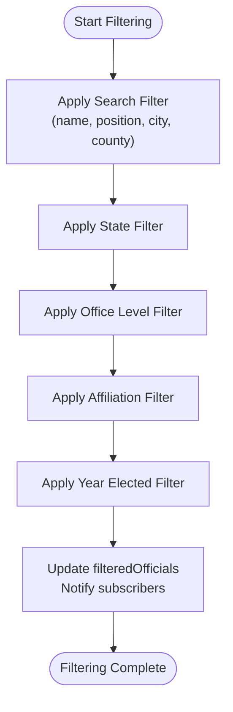

# State Management Architecture

<cite>
**Referenced Files in This Document**   
- [state-manager.js](file://js/state-manager.js)
- [filter-controller.js](file://js/filter-controller.js)
- [app.js](file://js/app.js)
- [data-loader.js](file://js/data-loader.js)
- [map-manager.js](file://js/map-manager.js)
</cite>

## Table of Contents
1. [Introduction](#introduction)
2. [Architecture Overview](#architecture-overview)
3. [State Object Structure](#state-object-structure)
4. [Event Subscription System](#event-subscription-system)
5. [Data Flow and Filtering Logic](#data-flow-and-filtering-logic)
6. [Component Integration Examples](#component-integration-examples)
7. [Performance Considerations](#performance-considerations)
8. [Conclusion](#conclusion)

## Introduction
The StateManager module implements a centralized state management pattern using the Singleton and Observer patterns through an Immediately Invoked Function Expression (IIFE). This architectural approach provides a single source of truth for application state, enabling consistent data flow and synchronization across components. The module manages officials data, filtering criteria, selection state, and loading status, while exposing a controlled API for state updates and change notifications.

**Section sources**
- [state-manager.js](file://js/state-manager.js#L3-L228)

## Architecture Overview

**Diagram sources**
- [state-manager.js](file://js/state-manager.js#L3-L228)
- [filter-controller.js](file://js/filter-controller.js#L4-L270)
- [map-manager.js](file://js/map-manager.js#L4-L216)
- [data-loader.js](file://js/data-loader.js#L4-L183)

**Section sources**
- [state-manager.js](file://js/state-manager.js#L3-L228)

## State Object Structure
The StateManager maintains a comprehensive state object with the following properties:

- **allOfficials**: Array containing all officials data loaded from the JSON source
- **filteredOfficials**: Array containing officials that match current filter criteria
- **filters**: Object containing current filtering parameters:
  - *search*: Text string for name, position, city, or county search
  - *state*: State code filter (e.g., "CA" for California)
  - *officeLevels*: Array of office levels to include (federal, state, county, city, town)
  - *affiliations*: Array of political affiliations to include
  - *yearStart*: Minimum year elected filter
  - *yearEnd*: Maximum year elected filter
- **selectedOfficial**: Reference to the currently selected official object or null
- **isLoading**: Boolean indicating whether data is being loaded

The state is encapsulated within the IIFE, ensuring data privacy and controlled access through the public API methods.

**Section sources**
- [state-manager.js](file://js/state-manager.js#L8-L21)

## Event Subscription System
The StateManager implements an Observer pattern for event-driven state management with three primary events:

- **stateChange**: Notified when any state property changes, passing the complete state object
- **filterChange**: Notified when filter criteria are updated, passing the filters object
- **officialsChange**: Notified when officials data or filtered results change, passing both allOfficials and filteredOfficials arrays

Components subscribe to these events using the `subscribe` method, which registers callback functions in the listeners collection. The `notify` method iterates through registered callbacks for a specific event type, ensuring all subscribers receive updates when state changes occur.

**Diagram sources**
- [state-manager.js](file://js/state-manager.js#L23-L50)
- [state-manager.js](file://js/state-manager.js#L34-L38)
- [state-manager.js](file://js/state-manager.js#L45-L49)

**Section sources**
- [state-manager.js](file://js/state-manager.js#L23-L50)

## Data Flow and Filtering Logic
The data flow begins with data loading and progresses through filtering to UI updates. When filters are updated via `updateFilters`, the system follows a specific sequence:

1. Merge new filter values with existing filters using spread syntax
2. Execute `applyFilters` to recalculate filtered officials
3. Notify subscribers of filter and officials changes

The `applyFilters` method implements comprehensive filtering logic in sequence:

Each filter type uses array methods to progressively narrow the dataset:
- Search filter performs case-insensitive substring matching across multiple fields
- State filter matches exact state codes
- Office level filter uses array inclusion checks
- Affiliation filter uses array inclusion checks
- Year elected filter applies range-based filtering

The filtering process maintains immutability by creating new filtered arrays rather than modifying the original data.

**Diagram sources**
- [state-manager.js](file://js/state-manager.js#L75-L79)
- [state-manager.js](file://js/state-manager.js#L84-L136)

**Section sources**
- [state-manager.js](file://js/state-manager.js#L75-L136)

## Component Integration Examples
Components integrate with the StateManager through subscription and state update patterns. The FilterController subscribes to officials and filter changes to update the UI:

The MapManager responds to officials changes by updating map markers:

The application initialization in app.js demonstrates the complete integration flow:

**Diagram sources**
- [filter-controller.js](file://js/filter-controller.js#L94-L97)
- [map-manager.js](file://js/map-manager.js#L165-L167)
- [app.js](file://js/app.js#L31-L35)

**Section sources**
- [filter-controller.js](file://js/filter-controller.js#L94-L97)
- [map-manager.js](file://js/map-manager.js#L165-L167)
- [app.js](file://js/app.js#L31-L35)

## Performance Considerations
The StateManager addresses performance challenges in several ways:

1. **Debounced Filtering**: The FilterController implements a 300ms debounce on search input to prevent excessive filtering operations during typing.

2. **Efficient Filtering**: The filtering logic processes conditions sequentially, with early returns when possible, minimizing unnecessary computations.

3. **Immutability Patterns**: State updates use spread syntax to create new objects rather than mutating existing ones, preventing unintended side effects and enabling reliable change detection.

4. **Batched Notifications**: When multiple state properties change simultaneously, the system batches notifications to prevent redundant UI updates.

5. **Selective Filtering**: The applyFilters method only applies filter conditions when they have meaningful values, skipping unnecessary operations.

For large datasets, the architecture could be enhanced with:
- Web Workers for off-main-thread filtering
- Pagination or virtual scrolling
- Indexed data structures for faster lookups
- Memoization of expensive computations

The current implementation balances performance with simplicity, providing responsive filtering for typical dataset sizes.

**Section sources**
- [state-manager.js](file://js/state-manager.js#L77-L78)
- [filter-controller.js](file://js/filter-controller.js#L40-L45)

## Conclusion
The StateManager module provides a robust centralized state management solution using the Singleton and Observer patterns. By encapsulating application state within an IIFE and exposing a controlled API, it ensures data consistency and predictable state transitions. The event subscription system enables reactive updates across components, while the comprehensive filtering logic supports complex data manipulation requirements. The architecture demonstrates effective JavaScript patterns for state management without requiring external libraries, providing a maintainable foundation for the application's data flow and user interactions.