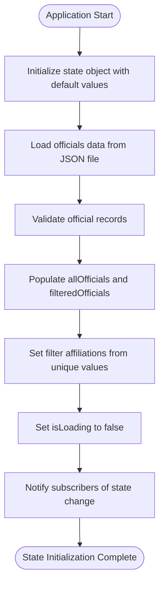
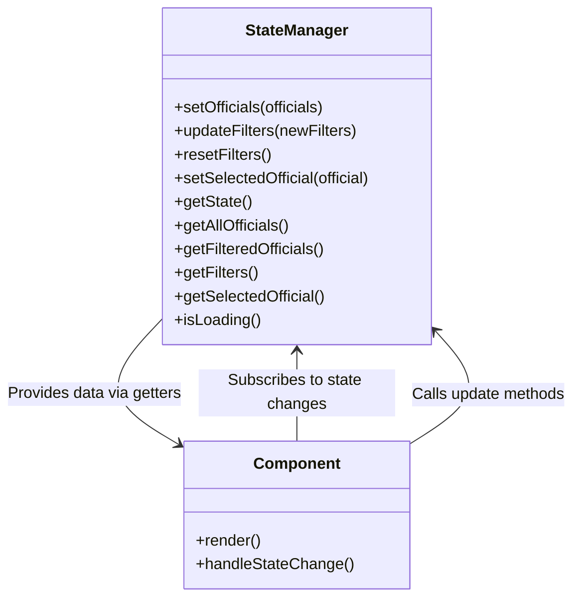

# State Object Structure

<cite>
**Referenced Files in This Document**   
- [state-manager.js](file://js/state-manager.js)
- [data-loader.js](file://js/data-loader.js)
- [app.js](file://js/app.js)
- [filter-controller.js](file://js/filter-controller.js)
- [officials.json](file://data/officials.json)
</cite>

## Table of Contents
1. [Introduction](#introduction)
2. [State Object Properties](#state-object-properties)
3. [State Initialization](#state-initialization)
4. [State Updates and Immutability](#state-updates-and-immutability)
5. [Data Filtering Mechanism](#data-filtering-mechanism)
6. [Performance Considerations](#performance-considerations)
7. [State Access Methods](#state-access-methods)
8. [Event Notification System](#event-notification-system)

## Introduction
The StateManager module serves as the central state management system for the Democratic Socialist Officials Map application. It maintains a single source of truth for all application data, including officials information, user filters, selection state, and loading status. The state object is designed to be immutable, with updates performed through spread operators to create new object references, ensuring predictable state changes and efficient component re-renders. This documentation details the structure, behavior, and usage patterns of the state object.

**Section sources**
- [state-manager.js](file://js/state-manager.js#L8-L21)

## State Object Properties
The state object contains several key properties that track the application's current condition:

- **allOfficials**: Array containing all official objects loaded from the data source. This serves as the complete dataset that filters are applied against.
- **filteredOfficials**: Array containing the subset of officials that match the current filter criteria. This is derived from allOfficials through the filtering process.
- **filters**: Object containing the current filter parameters:
  - *search*: String for text-based searching across name, position, city, and county fields
  - *state*: String representing the selected state abbreviation for filtering
  - *officeLevels*: Array of strings representing selected office levels (federal, state, county, city, town)
  - *affiliations*: Array of strings representing selected political affiliations
  - *yearStart* and *yearEnd*: Numbers representing the elected year range filter
- **selectedOfficial**: Object representing the currently selected official, or null if no official is selected
- **isLoading**: Boolean flag indicating whether data is currently being loaded

**Section sources**
- [state-manager.js](file://js/state-manager.js#L8-L21)

## State Initialization
The state object is initialized with default values when the StateManager module is loaded. The allOfficials and filteredOfficials arrays start empty, while filters are set to default values including all office levels and an empty affiliations array. The selectedOfficial is initialized to null, and isLoading is set to true to indicate the application is in a loading state until data is successfully loaded.

When officials data is loaded from the JSON file via the DataLoader module, the setOfficials method initializes the state by populating both allOfficials and filteredOfficials with the complete dataset. The affiliations filter is automatically populated with unique political affiliations found in the dataset, and isLoading is set to false to indicate loading completion.

**Diagram sources**
- [state-manager.js](file://js/state-manager.js#L57-L71)
- [data-loader.js](file://js/data-loader.js#L98-L144)
- [app.js](file://js/app.js#L25-L32)

## State Updates and Immutability
The StateManager enforces immutability through the use of spread operators when updating state properties. This ensures that components can efficiently detect changes by comparing object references rather than performing deep equality checks. When filters are updated via the updateFilters method, a new filters object is created using the spread operator to copy existing properties, then overriding with new values from the provided update object.

This immutability pattern prevents accidental direct mutations of the state and enables predictable change detection. The state object itself is never modified directly; instead, new object instances are created for any changes, maintaining referential integrity and supporting potential future features like time-travel debugging or state persistence.

**Section sources**
- [state-manager.js](file://js/state-manager.js#L77-L79)

## Data Filtering Mechanism
The filtering system applies the current filter criteria to the allOfficials dataset to generate the filteredOfficials array. The applyFilters method processes each filter type sequentially:

1. Search filter: Matches text against name, position, city, and county fields (case-insensitive)
2. State filter: Matches officials by state abbreviation
3. Office level filter: Includes only officials whose office level is in the selected array
4. Affiliation filter: Includes only officials with political affiliations in the selected array
5. Year elected filter: Filters by elected year range when specified

The filtering process creates a new filteredOfficials array rather than modifying the original dataset, preserving the complete dataset for future filtering operations. After filtering, the system notifies subscribers of the updated officials data.

**Section sources**
- [state-manager.js](file://js/state-manager.js#L86-L145)
- [filter-controller.js](file://js/filter-controller.js#L46-L62)

## Performance Considerations
Maintaining both full and filtered datasets presents specific performance implications. The allOfficials array serves as a cache of the complete dataset, eliminating the need to reload data when filters change. However, filtering operations on large datasets can impact performance, particularly when multiple filters are applied simultaneously.

The current implementation processes filters sequentially, which can be optimized by ordering filters from most to least restrictive to minimize the dataset size early in the process. For very large datasets, additional optimizations could include debouncing filter updates, implementing pagination, or using web workers for filtering operations to prevent UI blocking.

**Section sources**
- [state-manager.js](file://js/state-manager.js#L86-L145)

## State Access Methods
Components access the state safely through getter methods that return copies of state properties rather than direct references. The getState method returns a shallow copy of the entire state object using the spread operator, while specialized getters like getAllOfficials, getFilteredOfficials, and getSelectedOfficial provide access to specific state properties.

This pattern prevents components from accidentally modifying the state directly and ensures that any state changes go through the proper update mechanisms. The getter methods provide a clean API for components to access the data they need without exposing the internal state structure.

**Diagram sources**
- [state-manager.js](file://js/state-manager.js#L180-L222)
- [filter-controller.js](file://js/filter-controller.js#L97-L99)

## Event Notification System
The StateManager implements an event-driven architecture using a subscription/notification pattern. Components can subscribe to specific events (stateChange, filterChange, officialsChange) by providing callback functions. When state changes occur, the notify method calls all registered callbacks for the relevant event type.

This decoupled approach allows components to react to state changes without tight coupling to the StateManager implementation. The event system enables multiple components to respond to the same state change independently, supporting a flexible and scalable architecture. Events are granular, allowing components to subscribe only to the specific changes they need to respond to, reducing unnecessary re-renders.

**Section sources**
- [state-manager.js](file://js/state-manager.js#L24-L50)
- [filter-controller.js](file://js/filter-controller.js#L97-L99)
- [app.js](file://js/app.js#L187-L189)