# Technical Architecture

<cite>
**Referenced Files in This Document**   
- [index.html](file://index.html)
- [app.js](file://js/app.js)
- [data-loader.js](file://js/data-loader.js)
- [state-manager.js](file://js/state-manager.js)
- [map-manager.js](file://js/map-manager.js)
- [filter-controller.js](file://js/filter-controller.js)
- [popup-component.js](file://js/popup-component.js)
- [styles.css](file://css/styles.css)
- [officials.json](file://data/officials.json)
- [package.json](file://package.json)
- [README.md](file://README.md)
</cite>

## Table of Contents
1. [Introduction](#introduction)
2. [System Context](#system-context)
3. [Architecture Overview](#architecture-overview)
4. [Component Breakdown](#component-breakdown)
5. [Data Flow](#data-flow)
6. [Technology Stack](#technology-stack)
7. [Cross-Cutting Concerns](#cross-cutting-concerns)
8. [Deployment Topology](#deployment-topology)
9. [Performance Considerations](#performance-considerations)
10. [Scalability and Constraints](#scalability-and-constraints)

## Introduction

The Democratic Socialist Officials Map is a client-side web application that displays elected Democratic Socialist and Socialist officials across the United States on an interactive map. The application provides advanced filtering capabilities, detailed official information through popups, and responsive design for various device sizes. Built with vanilla JavaScript and Leaflet.js, the application follows a modular architecture with clear separation of concerns between components.

The application's primary purpose is to make information about socialist elected officials easily accessible and discoverable through an intuitive geographic interface. It loads official data from a JSON file, validates the data upon loading, and provides a rich interactive experience for exploring the data through both map visualization and filtering controls.

**Section sources**
- [README.md](file://README.md#L1-L153)
- [index.html](file://index.html#L1-L178)

## System Context

The Democratic Socialist Officials Map operates as a standalone client-side web application with no server-side components. The system context diagram below illustrates the application's boundaries and its interactions with external systems and users.

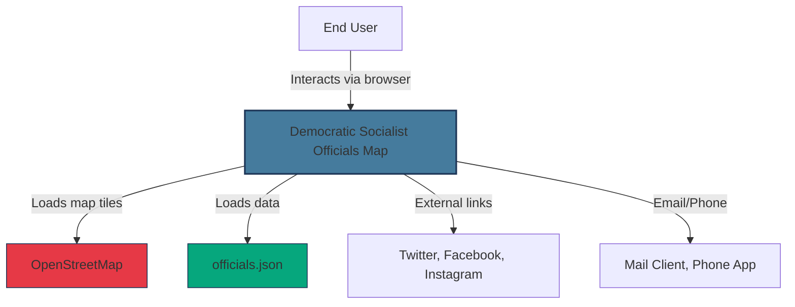

**Diagram sources**
- [index.html](file://index.html#L10-L17)
- [map-manager.js](file://js/map-manager.js#L43-L46)
- [data-loader.js](file://js/data-loader.js#L98-L106)
- [popup-component.js](file://js/popup-component.js#L82-L94)

The application's main external dependencies are:
- **OpenStreetMap**: Provides the base map tiles for the geographic visualization
- **officials.json**: The data source containing information about elected officials
- **Social Media Platforms**: External links to Twitter, Facebook, and Instagram profiles
- **User's Device**: Browser, email client, and phone application for communication

The application runs entirely in the user's web browser, making HTTP requests only to load the map tiles and the officials data file. All processing, filtering, and rendering occurs client-side, which simplifies deployment and reduces infrastructure requirements.

## Architecture Overview

The application follows a modular, client-side architecture with a clear separation of concerns between different functional components. The architecture is based on the Module pattern, with each major functionality encapsulated in its own self-contained module.

```mermaid
graph TD
App[Main Application] --> DataLoader[Data Loader]
App --> StateManager[State Manager]
App --> MapManager[Map Manager]
App --> FilterController[Filter Controller]
App --> PopupComponent[Popup Component]
DataLoader --> |Validated Data| StateManager
StateManager --> |Filtered Officials| MapManager
StateManager --> |Filtered Officials| FilterController
FilterController --> |Filter Updates| StateManager
MapManager --> |Marker Click| PopupComponent
MapManager --> |Map Instance| PopupComponent
PopupComponent --> |Selected Official| StateManager
style App fill:#1d3557,stroke:#e63946,stroke-width:2px
style DataLoader fill:#457b9d,stroke:#1d3557,stroke-width:1px
style StateManager fill:#457b9d,stroke:#1d3557,stroke-width:1px
style MapManager fill:#457b9d,stroke:#1d3557,stroke-width:1px
style FilterController fill:#457b9d,stroke:#1d3557,stroke-width:1px
style PopupComponent fill:#457b9d,stroke:#1d3557,stroke-width:1px
```

**Diagram sources**
- [app.js](file://js/app.js#L10-L52)
- [state-manager.js](file://js/state-manager.js#L56-L70)
- [map-manager.js](file://js/map-manager.js#L102-L104)
- [filter-controller.js](file://js/filter-controller.js#L44-L45)
- [popup-component.js](file://js/popup-component.js#L201-L202)

The application's architecture consists of the following key components:
- **Main Application (app.js)**: Coordinates the initialization of all modules and serves as the entry point
- **Data Loader (data-loader.js)**: Responsible for loading and validating the officials data from JSON
- **State Manager (state-manager.js)**: Maintains the application state including officials data, filters, and selected official
- **Map Manager (map-manager.js)**: Handles map initialization, pin rendering, clustering, and map interactions
- **Filter Controller (filter-controller.js)**: Manages the filter UI and user interactions with filtering controls
- **Popup Component (popup-component.js)**: Handles the creation and display of information popups for officials

The architecture follows a unidirectional data flow pattern where data moves from the Data Loader to the State Manager, and then to the UI components (Map Manager, Filter Controller, and Popup Component). User interactions with the UI components update the state through the State Manager, which then notifies the UI components of state changes.

## Component Breakdown

### Main Application (app.js)

The main application module serves as the orchestrator for the entire application. It is responsible for initializing all other modules in the correct order and handling the application lifecycle.

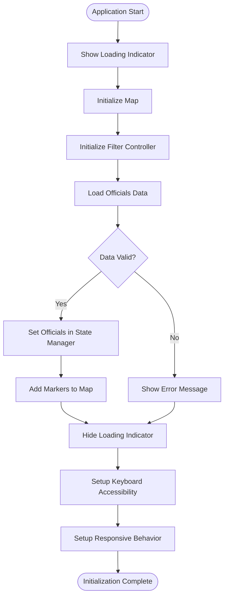

**Diagram sources**
- [app.js](file://js/app.js#L10-L52)
- [app.js](file://js/app.js#L59-L63)
- [app.js](file://js/app.js#L93-L98)
- [app.js](file://js/app.js#L108-L115)

The main application follows a sequential initialization process that ensures all dependencies are properly set up before proceeding to the next step. It handles error conditions gracefully by displaying user-friendly error messages and ensuring the loading indicator is hidden even when errors occur.

**Section sources**
- [app.js](file://js/app.js#L1-L142)

### Data Loader (data-loader.js)

The Data Loader module is responsible for loading the officials data from the JSON file and validating its structure and content. It ensures data integrity before the application uses the data.

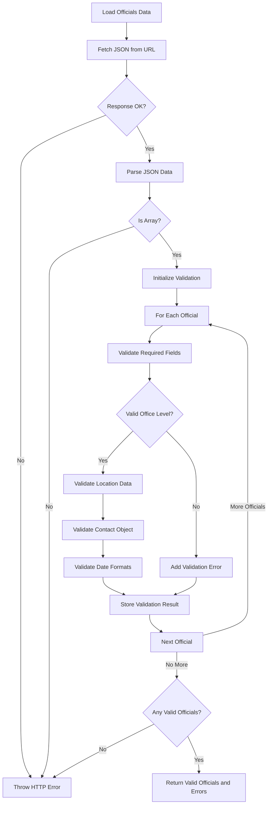

**Diagram sources**
- [data-loader.js](file://js/data-loader.js#L98-L143)
- [data-loader.js](file://js/data-loader.js#L22-L80)

The Data Loader performs comprehensive validation of each official record, checking for:
- Required fields (id, name, position, officeLevel, politicalAffiliation, bio, termStart, yearElected)
- Valid office levels (federal, state, county, city, town)
- Complete and valid location data (state, latitude, longitude) within US boundaries
- Presence of contact object
- Valid ISO 8601 date formats for term dates

The module returns both the valid officials and any validation errors, allowing the application to proceed with available data while logging issues for correction.

**Section sources**
- [data-loader.js](file://js/data-loader.js#L1-L185)
- [README.md](file://README.md#L74-L95)

### State Manager (state-manager.js)

The State Manager module maintains the application's state, including the officials data, current filters, and selected official. It implements an event-driven architecture to notify other components of state changes.

```mermaid
classDiagram
class StateManager {
-allOfficials[Official]
-filteredOfficials[Official]
-filters[Filter]
-selectedOfficial Official
-isLoading boolean
-listeners[EventListeners]
+setOfficials(officials)
+updateFilters(newFilters)
+resetFilters()
+setSelectedOfficial(official)
+subscribe(event, callback)
+getState()
+getAllOfficials()
+getFilteredOfficials()
+getFilters()
+getSelectedOfficial()
+isLoading()
-applyFilters()
-notify(event, data)
}
class Filter {
+search string
+state string
+officeLevels[OfficeLevel]
+affiliations[PoliticalAffiliation]
+yearStart number
+yearEnd number
}
class Official {
+id string
+name string
+position string
+officeLevel OfficeLevel
+politicalAffiliation PoliticalAffiliation
+location Location
+contact Contact
+bio string
+termStart string
+termEnd string
+yearElected number
}
class Location {
+state StateCode
+latitude number
+longitude number
+county string
+city string
+district string
}
class Contact {
+email string
+phone string
+website string
+socialMedia SocialMedia
}
class SocialMedia {
+twitter string
+facebook string
+instagram string
}
enum OfficeLevel {
federal
state
county
city
town
}
StateManager --> Filter : "contains"
StateManager --> Official : "manages"
Official --> Location : "has"
Official --> Contact : "has"
Contact --> SocialMedia : "has"
```

**Diagram sources**
- [state-manager.js](file://js/state-manager.js#L8-L20)
- [state-manager.js](file://js/state-manager.js#L56-L70)
- [state-manager.js](file://js/state-manager.js#L76-L78)
- [state-manager.js](file://js/state-manager.js#L162-L164)

The State Manager maintains several key pieces of state:
- **allOfficials**: The complete dataset of valid officials loaded from the JSON file
- **filteredOfficials**: The subset of officials that match the current filter criteria
- **filters**: The current filter settings for search, state, office levels, affiliations, and year elected
- **selectedOfficial**: The currently selected official, if any
- **isLoading**: A boolean indicating whether data is still being loaded

The module provides a pub/sub mechanism that allows other components to subscribe to state changes, ensuring that the UI remains synchronized with the application state.

**Section sources**
- [state-manager.js](file://js/state-manager.js#L1-L230)

### Map Manager (map-manager.js)

The Map Manager module handles all aspects of the map visualization, including initialization, marker rendering, clustering, and user interactions with the map.

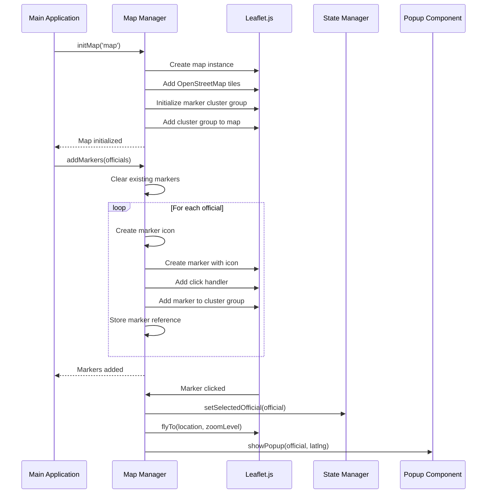

**Diagram sources**
- [map-manager.js](file://js/map-manager.js#L33-L47)
- [map-manager.js](file://js/map-manager.js#L102-L132)
- [map-manager.js](file://js/map-manager.js#L139-L150)
- [popup-component.js](file://js/popup-component.js#L201-L227)

The Map Manager uses Leaflet.js to create an interactive map with the following features:
- **Pin Clustering**: Groups nearby officials when zoomed out using Leaflet.markercluster
- **Custom Markers**: Color-coded markers based on office level (federal, state, county, city, town)
- **Zoom Levels**: Different default zoom levels based on office level
- **Marker Click Handling**: Updates application state, zooms to location, and shows popup
- **Responsive Behavior**: Handles window resizing to ensure proper map display

The module maintains references to all markers to enable efficient updates when filtering occurs.

**Section sources**
- [map-manager.js](file://js/map-manager.js#L1-L218)
- [README.md](file://README.md#L8-L9)

### Filter Controller (filter-controller.js)

The Filter Controller module manages the filter UI and handles user interactions with the filtering controls. It provides a responsive interface for narrowing down the displayed officials.

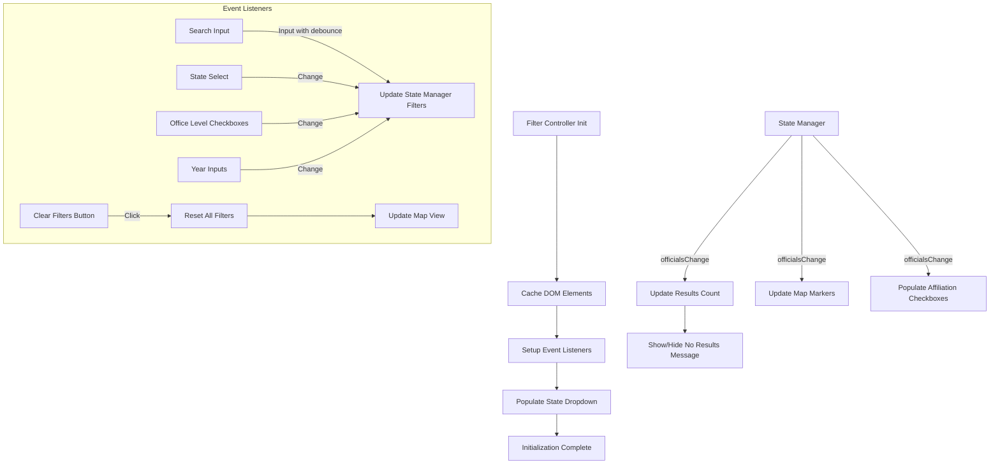

**Diagram sources**
- [filter-controller.js](file://js/filter-controller.js#L13-L32)
- [filter-controller.js](file://js/filter-controller.js#L38-L85)
- [filter-controller.js](file://js/filter-controller.js#L166-L187)
- [filter-controller.js](file://js/filter-controller.js#L216-L237)

The Filter Controller implements the following filtering capabilities:
- **Search**: Text search by name, position, city, or county
- **State**: Filter by US state
- **Office Level**: Filter by federal, state, county, city, or town
- **Political Affiliation**: Filter by party or organization
- **Year Elected**: Filter by range of years

The module uses event listeners with appropriate debouncing (for search) to provide a responsive user experience while minimizing unnecessary processing. It also handles the dynamic population of filter options based on the loaded data.

**Section sources**
- [filter-controller.js](file://js/filter-controller.js#L1-L271)
- [index.html](file://index.html#L41-L140)

### Popup Component (popup-component.js)

The Popup Component module handles the creation and display of information popups when users click on official markers. It provides detailed information about each official in a structured format.

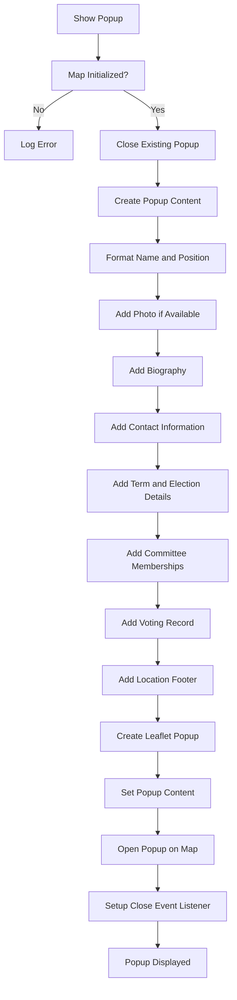

**Diagram sources**
- [popup-component.js](file://js/popup-component.js#L201-L227)
- [popup-component.js](file://js/popup-component.js#L29-L182)
- [popup-component.js](file://js/popup-component.js#L230-L233)

The Popup Component displays the following information about each official:
- **Header**: Name, position, office level badge, and photo (if available)
- **Biography**: Official's biography or description
- **Contact Information**: Email, phone, website, and social media links
- **Details**: Political affiliation, term dates, and year elected
- **Committee Memberships**: List of committees the official belongs to
- **Voting Record**: Link to or description of voting record
- **Location**: Geographic location with city, county, state, and district

The component ensures accessibility by using appropriate ARIA labels and handles XSS protection by escaping HTML content.

**Section sources**
- [popup-component.js](file://js/popup-component.js#L1-L264)
- [index.html](file://index.html#L145-L146)

## Data Flow

The application follows a unidirectional data flow pattern where data moves from external sources through processing modules to the user interface. The data flow diagram below illustrates how data moves through the system.

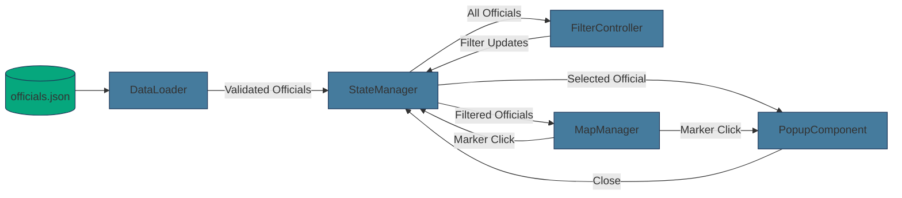

**Diagram sources**
- [data-loader.js](file://js/data-loader.js#L98-L143)
- [state-manager.js](file://js/state-manager.js#L56-L70)
- [filter-controller.js](file://js/filter-controller.js#L166-L187)
- [map-manager.js](file://js/map-manager.js#L102-L104)
- [popup-component.js](file://js/popup-component.js#L201-L202)

The data flow begins with the `officials.json` file, which is loaded by the Data Loader module. After validation, the data is passed to the State Manager, which becomes the single source of truth for the application. The State Manager then distributes the data to the UI components:

1. **Filter Controller**: Receives the complete dataset to populate filter options and display results count
2. **Map Manager**: Receives the filtered dataset to render markers on the map
3. **Popup Component**: Receives the selected official data to display in the popup

User interactions create a feedback loop where the UI components update the State Manager, which then notifies other components of the state change. For example:
- When a user applies filters, the Filter Controller updates the State Manager
- When a user clicks a marker, the Map Manager updates the State Manager with the selected official
- When a user closes a popup, the Popup Component updates the State Manager to clear the selection

This unidirectional data flow ensures that the application state remains consistent and predictable.

**Section sources**
- [app.js](file://js/app.js#L25-L35)
- [state-manager.js](file://js/state-manager.js#L56-L70)
- [filter-controller.js](file://js/filter-controller.js#L166-L187)

## Technology Stack

The application uses a carefully selected technology stack that balances functionality, performance, and maintainability. The stack consists of client-side technologies with no server-side components.

```mermaid
graph TD
App[Democratic Socialist Officials Map] --> HTML
App --> CSS
App --> JavaScript
HTML --> |Structure| Index[index.html]
CSS --> |Styling| Styles[styles.css]
CSS --> |Variables| CSSVars[CSS Custom Properties]
CSS --> |Layout| Flexbox[CSS Flexbox]
CSS --> |Layout| Grid[CSS Grid]
CSS --> |Responsive| MediaQueries[Media Queries]
JavaScript --> |Core Logic| Vanilla[Vanilla JavaScript]
JavaScript --> |Modularity| IIFE[Immediately Invoked Function Expressions]
JavaScript --> |Map Library| Leaflet[Leaflet.js]
JavaScript --> |Clustering| MarkerCluster[Leaflet.markercluster]
JavaScript --> |Map Tiles| OSM[OpenStreetMap]
style App fill:#1d3557,stroke:#e63946,stroke-width:2px
style HTML fill:#457b9d,stroke:#1d3557,stroke-width:1px
style CSS fill:#457b9d,stroke:#1d3557,stroke-width:1px
style JavaScript fill:#457b9d,stroke:#1d3557,stroke-width:1px
style Index fill:#06a77d,stroke:#1d3557,stroke-width:1px
style Styles fill:#06a77d,stroke:#1d3557,stroke-width:1px
style Leaflet fill:#e63946,stroke:#1d3557,stroke-width:1px
style MarkerCluster fill:#e63946,stroke:#1d3557,stroke-width:1px
style OSM fill:#f77f00,stroke:#1d3557,stroke-width:1px
```

**Diagram sources**
- [index.html](file://index.html#L10-L17)
- [package.json](file://package.json#L2-L14)
- [README.md](file://README.md#L97-L102)
- [styles.css](file://css/styles.css#L1-L52)
- [app.js](file://js/app.js#L1-L142)

The technology stack includes:

### Core Technologies
- **HTML5**: Provides the document structure and semantic elements
- **CSS3**: Handles styling with modern features like Flexbox, Grid, and custom properties
- **Vanilla JavaScript**: Implements all application logic without framework dependencies

### JavaScript Libraries
- **Leaflet.js**: Lightweight library for interactive maps
- **Leaflet.markercluster**: Extension for clustering markers
- **OpenStreetMap**: Open-source map tiles

### CSS Features
- **CSS Custom Properties**: Variables for consistent theming and easy updates
- **Flexbox and Grid**: Modern layout techniques for responsive design
- **Media Queries**: Responsive behavior for different screen sizes
- **Accessibility Features**: Focus styles, high contrast mode, and reduced motion support

### Development Tools
- **npm**: Package manager for development scripts
- **Python HTTP Server**: Simple server for local development

The choice of vanilla JavaScript without frameworks was likely made to keep the application lightweight and minimize dependencies. The use of IIFE (Immediately Invoked Function Expressions) provides module-like encapsulation without requiring a module bundler.

**Section sources**
- [README.md](file://README.md#L97-L102)
- [package.json](file://package.json#L2-L14)
- [index.html](file://index.html#L10-L17)

## Cross-Cutting Concerns

The application addresses several cross-cutting concerns that affect multiple components and the overall user experience.

### Security

The application implements several security measures to protect against common web vulnerabilities:

```mermaid
flowchart TD
XSS[XSS Protection] --> |HTML Escaping| PopupComponent
XSS --> |Input Validation| DataLoader
XSS --> |Sanitized Links| PopupComponent
DataValidation[Data Validation] --> |Schema Validation| DataLoader
DataValidation --> |Boundary Checks| DataLoader
DataValidation --> |Type Checking| DataLoader
ContentSecurity[CSP Considerations] --> |External Resources| Index
ContentSecurity --> |Integrity Attributes| Index
ContentSecurity --> |Secure Links| PopupComponent
PopupComponent --> |escapeHtml()| XSS
DataLoader --> |validateOfficial()| DataValidation
Index --> |integrity attributes| ContentSecurity
PopupComponent --> |target="_blank" rel="noopener noreferrer"| ContentSecurity
style XSS fill:#e63946,stroke:#1d3557,stroke-width:1px
style DataValidation fill:#e63946,stroke:#1d3557,stroke-width:1px
style ContentSecurity fill:#e63946,stroke:#1d3557,stroke-width:1px
style PopupComponent fill:#457b9d,stroke:#1d3557,stroke-width:1px
style DataLoader fill:#457b9d,stroke:#1d3557,stroke-width:1px
style Index fill:#06a77d,stroke:#1d3557,stroke-width:1px
```

**Diagram sources**
- [popup-component.js](file://js/popup-component.js#L190-L194)
- [data-loader.js](file://js/data-loader.js#L22-L80)
- [index.html](file://index.html#L10-L17)
- [popup-component.js](file://js/popup-component.js#L73-L74)

Key security measures include:
- **XSS Protection**: The Popup Component uses an `escapeHtml()` function to prevent cross-site scripting attacks when displaying user-provided content
- **Data Validation**: The Data Loader validates all official records against a strict schema, including field presence, data types, and value ranges
- **Secure External Links**: Links to external resources use `target="_blank" rel="noopener noreferrer"` to prevent reverse tabnabbing attacks
- **Content Security**: The HTML includes integrity attributes for external scripts to ensure they haven't been tampered with

### Accessibility

The application follows WCAG 2.1 AA standards to ensure accessibility for all users:

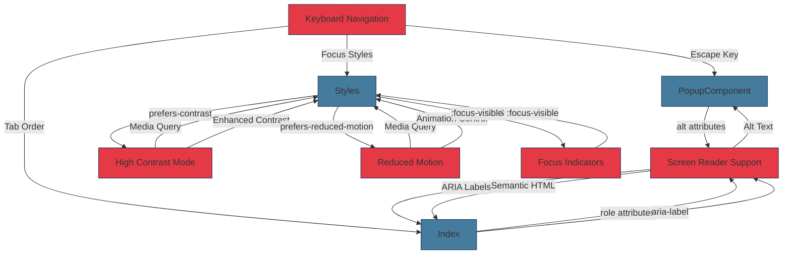

**Diagram sources**
- [app.js](file://js/app.js#L95-L98)
- [index.html](file://index.html#L23-L158)
- [styles.css](file://css/styles.css#L615-L645)
- [styles.css](file://css/styles.css#L647-L697)

Accessibility features include:
- **Keyboard Navigation**: Full keyboard support with Escape key to close popups
- **Screen Reader Compatibility**: ARIA labels, semantic HTML, and proper alt text
- **High Contrast Mode**: Enhanced contrast for users with visual impairments
- **Reduced Motion**: Respects user preferences for reduced animations
- **Focus Indicators**: Visible focus styles for keyboard navigation

### Error Handling

The application implements comprehensive error handling to provide a robust user experience:

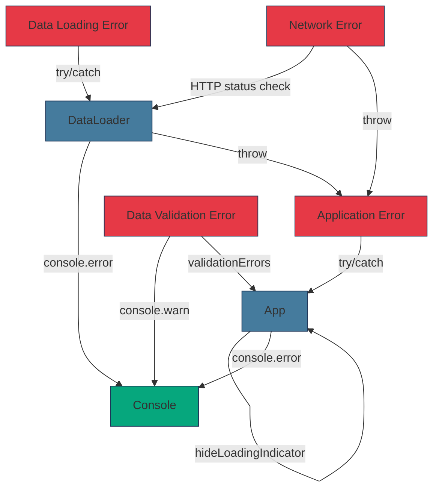

**Diagram sources**
- [app.js](file://js/app.js#L48-L52)
- [app.js](file://js/app.js#L59-L63)
- [data-loader.js](file://js/data-loader.js#L146-L148)
- [data-loader.js](file://js/data-loader.js#L135-L136)

Error handling strategies include:
- **Application-Level Errors**: The main application uses try/catch to handle initialization errors and display user-friendly error messages
- **Data Loading Errors**: The Data Loader handles HTTP errors and JSON parsing errors
- **Data Validation Errors**: Invalid official records are logged as warnings but don't prevent the application from loading valid data
- **Loading State Management**: The loading indicator is properly shown and hidden in both success and error cases

**Section sources**
- [popup-component.js](file://js/popup-component.js#L190-L194)
- [data-loader.js](file://js/data-loader.js#L22-L80)
- [app.js](file://js/app.js#L48-L52)
- [styles.css](file://css/styles.css#L615-L697)

## Deployment Topology

The application has a simple deployment topology as a static website with no server-side components. The deployment diagram below illustrates the production environment.

```mermaid
graph TD
User[End User] --> |HTTPS| CDN[Content Delivery Network]
CDN --> |Static Files| S3[Static Web Hosting]
subgraph Development
Developer[Developer]
Developer --> |git push| Repository[Git Repository]
Repository --> |CI/CD| S3
end
S3 --> |index.html| User
S3 --> |styles.css| User
S3 --> |app.js| User
S3 --> |data/officials.json| User
S3 --> |Leaflet.js| User
S3 --> |MarkerCluster.js| User
style User fill:#1d3557,stroke:#e63946,stroke-width:1px
style CDN fill:#457b9d,stroke:#1d3557,stroke-width:1px
style S3 fill:#06a77d,stroke:#1d3557,stroke-width:1px
style Developer fill:#457b9d,stroke:#1d3557,stroke-width:1px
style Repository fill:#457b9d,stroke:#1d3557,stroke-width:1px
```

**Diagram sources**
- [README.md](file://README.md#L132-L138)
- [index.html](file://index.html#L10-L17)
- [package.json](file://package.json#L7-L8)

The deployment topology consists of:
- **Static Web Hosting**: The application files are hosted on a static web server (such as AWS S3, GitHub Pages, or Netlify)
- **Content Delivery Network**: A CDN can be used to improve performance by caching files closer to users
- **Git Repository**: The source code is stored in a version control system
- **CI/CD Pipeline**: Automated deployment from the repository to the hosting environment

The application's static nature makes it easy to deploy and scale, as there are no server-side dependencies or databases to manage. All files can be served directly from the hosting provider.

For local development, the application can be run using Python's built-in HTTP server or npm scripts, as documented in the README.

**Section sources**
- [README.md](file://README.md#L31-L51)
- [package.json](file://package.json#L7-L8)

## Performance Considerations

The application implements several performance optimizations to ensure a smooth user experience, especially when dealing with a large number of officials.

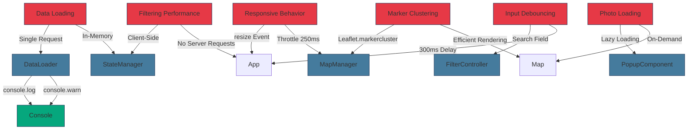

**Diagram sources**
- [data-loader.js](file://js/data-loader.js#L98-L106)
- [state-manager.js](file://js/state-manager.js#L88-L98)
- [map-manager.js](file://js/map-manager.js#L50-L54)
- [popup-component.js](file://js/popup-component.js#L36)
- [filter-controller.js](file://js/filter-controller.js#L40-L45)
- [app.js](file://js/app.js#L108-L115)

Key performance optimizations include:
- **Single Data Request**: The officials data is loaded once on page load, eliminating the need for additional server requests during filtering
- **Client-Side Filtering**: All filtering operations are performed in the browser, providing instant feedback to users
- **Marker Clustering**: Nearby officials are grouped into clusters when zoomed out, improving performance and readability
- **Lazy Photo Loading**: Official photos are loaded only when their popup is opened, reducing initial page load time
- **Input Debouncing**: The search input is debounced with a 300ms delay to prevent excessive filtering operations during typing
- **Responsive Throttling**: Window resize events are throttled to prevent excessive map invalidation calls

The application is optimized for files under 5MB, as noted in the README, ensuring fast loading times even on slower connections.

**Section sources**
- [README.md](file://README.md#L141-L145)
- [filter-controller.js](file://js/filter-controller.js#L40-L45)
- [popup-component.js](file://js/popup-component.js#L36)

## Scalability and Constraints

The application architecture has both strengths and limitations in terms of scalability and constraints.

### Scalability Analysis

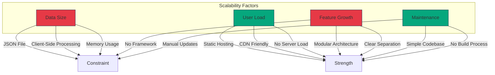

**Diagram sources**
- [data-loader.js](file://js/data-loader.js#L98-L143)
- [README.md](file://README.md#L132-L138)
- [app.js](file://js/app.js#L1-L142)

### Strengths
- **High User Scalability**: As a static website, the application can handle a large number of concurrent users without server-side bottlenecks
- **CDN Compatibility**: All assets can be served through a CDN, improving global performance
- **Simple Maintenance**: The lack of a build process and server-side components makes deployment and updates straightforward
- **Modular Architecture**: The component-based design allows for relatively easy feature additions

### Constraints
- **Data Size Limitations**: The entire dataset must fit in browser memory, limiting the number of officials that can be effectively displayed
- **Client-Side Processing**: All filtering and rendering occurs in the browser, which may impact performance on lower-end devices
- **Manual Data Updates**: Adding or updating officials requires direct editing of the JSON file, which may not scale well for frequent updates
- **Limited Framework Benefits**: The use of vanilla JavaScript means missing out on framework benefits like virtual DOM, state management tools, and component lifecycle management

The application is well-suited for its current scope but may require architectural changes if the dataset grows significantly or if more complex features are added. Potential improvements could include pagination, server-side filtering, or migration to a framework with better state management capabilities.

**Section sources**
- [README.md](file://README.md#L72-L95)
- [data-loader.js](file://js/data-loader.js#L98-L143)
- [app.js](file://js/app.js#L1-L142)